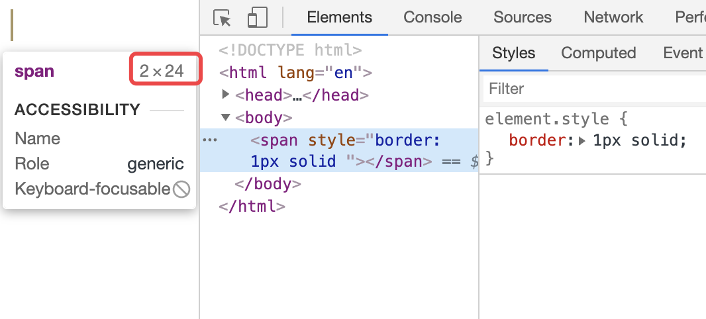

1. 盒模型
- 外边距合并
    - 条件：同一块格式化上下文 + 垂直方向 + 相邻 +  流内 + 块级盒；相邻: 没有行框/空隙/padding/border等隔开
    - 常见case: 父子（上边距/下边距） / 兄弟 / 自身（上下外边距）
    - float/inline-block/绝对定位的盒都不会发生margin合并，注意：根元素的盒margin不合并
    
    
2. 视觉格式化模型
- 视口、包含块 
- 控制盒
    - 块级元素 & 块盒
        - 除了表格盒和替换元素外，块级盒也是块容器盒，不是所有的块容器盒都是块级盒（非替换的表格单元和非替换的行内块是块容器盒，不是块级盒）；块级盒和块容器盒对应着内外盒子
    
    - 行内级元素 & 行内盒
        - display:inline的非替换元素会生成一个行内盒
        - 原子行内块级盒: 不属于行内盒的行内块级盒（行内级替换元素,inline-block,inline-table）;
        - 行内盒&原子行内级盒的区别，我理解是盒内容是如何参与行内格式化上下文的。行内盒的内容直接参与IFC，原子行内块级盒内容被当做一个整体（原子）被内在盒子限制住了，不直接参与IFC
        
- 定位方案                
    - 常规流：BFC & IFC & 块级盒与行内级盒的相对定位
        - BFC：1. 哪些特性使得元素建立新的格式化上下文 2. 元素排列的特性（垂直排列，垂直距离有margin决定 + 合并
        - IFC 元素排列特性
            - 水平方向挨着放置
            - 垂直对齐的方式:vertical-align
            - 行框的高度（总是足够高可以容纳包含的所有盒）
            - 浮动盒可能在包含块与行框边界之前(行框和浮动元素的不可重叠性)
            - 行内级盒总宽度小于行框宽度时，text-align决定水平分布
    - 浮动
        - 在浮动盒之前或者之后创建的非定位（non-positioned）块盒会垂直排列，就像浮动不存在一样
        - 会根据需要缩短挨着浮动盒创建的当前行及后续行框，以便给浮动盒的外边距框让出空间
        - 当前行里浮动盒之前的所有行内级盒都会在浮动方向另一侧的相同行重新排列
    - 绝对定位
    >流外元素: 浮动的、绝对定位的、根元素，反之称为流内元素    

- z-index
    - 含义 1. 当前堆叠上下文的堆叠层级 2. 是否建立一个新的堆叠上下文
    - 配合定位才会生效，css3中配合flex也会生效
    - 规则
        - 元素的background和border生成的堆叠上下文
        - 堆叠层级为负数的子级堆叠上下文（最负的优先）
        - 流内的，非行内级，非定位后代: 【块级元素】通常承担结构/布局的能力
        - 非定位浮动（元素）
        - 流内的，行内级，非定位后代，包括inline table和inline block:【内联元素】负责内容的呈现，内容的优先级高于结构/布局 
        - 堆叠层级为0的子级堆叠上下文，以及堆叠层级为0的【定位】的后代
        - 堆叠层级为正数的子级堆叠上下文（最小的优先）
        >定位元素的z-index自动生效，auto -> 0，所有上面提到非定位后代，这个限制条件很重要
    
       
3. 视觉格式化模型细节
- 行框高度由哪些因素决定呢？
    - 计算每个行内级盒高度：替换元素 & inline-block/inline-table 就是外边距框高度，对于行内盒由line-height决定
    - 行内级盒根据vertical-align属性垂直对齐的，top/bottom对齐是的行高最小化，可能存在多个解，该规范没有定义行框基线位置（即strut的位置
    - 行框高度(行高): 最高的盒的顶端与最低的盒的底端之间的距离

- strut，假想盒：每个行框以一个具有该元素的字体和行高属性的0宽行内盒

- 行距 & 半行距
    - 基线，字体分为两部分，基线上方的高度A & 基线下方的深度D，字体的高度 = A + D；非替换行内盒中的字体需要按照基线对齐，然后对每个字形确定A & D
    - 行距 = line-height - (A + D) 
    - 尽管非替换元素的外边距，边框和内边距不会算入行框的计算，它们仍然渲染在行内盒周围。这意味着如果用'line-height'指定的高度小于包含的盒的内容高度，背景与内边距和外边距的颜色可能会“流”进相邻的行框

- vertical-align
    - 有哪些值？分别什么含义
    - inline-block inlien-table基线如何确定？
        - 'inline-table'（盒）的基线是表格第一行的基线
        - 'inline-block'（盒）的基线是它的最后一个常规流中的行框的基线，除非它没有流内行框或者其'overflow'属性的计算值不为'visible'，此时基线是下外边距边界    
4. 可视化
- clip 配置绝对定位才会生效
