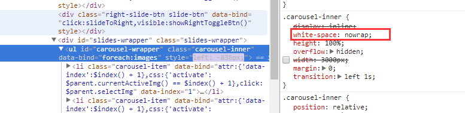

<!-- START doctoc generated TOC please keep comment here to allow auto update -->
<!-- DON'T EDIT THIS SECTION, INSTEAD RE-RUN doctoc TO UPDATE -->
**Table of Contents**  *generated with [DocToc](https://github.com/thlorenz/doctoc)*

- [块级元素](#%E5%9D%97%E7%BA%A7%E5%85%83%E7%B4%A0)
- [width与height的作用细节](#width%E4%B8%8Eheight%E7%9A%84%E4%BD%9C%E7%94%A8%E7%BB%86%E8%8A%82)
  - [深藏不露的 width:auto](#%E6%B7%B1%E8%97%8F%E4%B8%8D%E9%9C%B2%E7%9A%84-widthauto)
  - [width值作用的细节](#width%E5%80%BC%E4%BD%9C%E7%94%A8%E7%9A%84%E7%BB%86%E8%8A%82)
  - [CSS流体布局下的宽度分离原则](#css%E6%B5%81%E4%BD%93%E5%B8%83%E5%B1%80%E4%B8%8B%E7%9A%84%E5%AE%BD%E5%BA%A6%E5%88%86%E7%A6%BB%E5%8E%9F%E5%88%99)
  - [box-sizing：改变width/height作用的细节](#box-sizing%E6%94%B9%E5%8F%98widthheight%E4%BD%9C%E7%94%A8%E7%9A%84%E7%BB%86%E8%8A%82)
  - [height:auto](#heightauto)
  - [height:100%](#height100%25)
- [min/max-width/height](#minmax-widthheight)
- [内联元素](#%E5%86%85%E8%81%94%E5%85%83%E7%B4%A0)

<!-- END doctoc generated TOC please keep comment here to allow auto update -->

# 块级元素
1. 块级元素 不等价于 display:block；display:table/list-item均是。
2. 块级元素具有换行特性，可用配合clear清除浮动
3. IE不支持在before/after等伪元素中设置display:list-item。
4. 为什么IE伪元素不支持list-item？
=> 为什么list-item元素会出现项目符号？（附加盒子） => IE无法渲染这个附加盒子（学名：marker box）
5. display的值可用看成由外在盒子和内在盒子构成，外在盒子负责是否换行，内在盒子负责宽高/内容等。
6. width/height作用在哪个盒子上？内在盒子

# width与height的作用细节
## 深藏不露的 width:auto
- 充分利用可用空间
- 收缩与包裹(position:absolute/float:left/inline-block元素或table元素)
- 收缩到最小
- [+ whilespace:nowrap 超出容器限制](https://demo.cssworld.cn/3/2-2.php) <br/>
小结: 上述四种情况是外部尺寸/内部尺寸？只有上述的第一个是外部尺寸，其余皆为内部尺寸

1. 外部尺寸与流体特性，两种表现形式
- 正常流宽度
    - 表现为‘外部尺寸’的块级元素设置宽度后流动性将丢失
    - 流动性不是宽度100%那么简单，而是margin/padding/border/conent自动分配水平空间的机制；
    - 无宽度准则

- 格式化宽度 
    - 仅出现在position:absolute/fixed的元素中
    - 默认情况下，这样的元素表现为"包裹性"，宽度由"内部尺寸"决定
    - 下面情况由外部尺寸决定：对于非替换元素，当left/right 或者 top/bottom同时出现时，元素宽度表现为"格式化宽度"；
    - "格式化宽度"具有完全的"流"动性

2. 内部尺寸与流体特性 ，三种表现形式
- 包裹性
    - 包裹性：除"包裹"，还有"自适应性"，"自适应性"是指元素尺寸有内部元素决定但永远小于"包含块"容器的尺寸，感觉好像有max-width:100%的效果
    - 绝对定位/float/inline-block具有包裹性。
    - 包裹性的重要体现：按钮
    - [按钮名称自动换行](https://demo.cssworld.cn/3/2-4.php)（只有button会，而input[typpe='button']不会,因为后者的white-space:pre,如果重置为normal则会） 
    - [包裹性的实际应用（字少居中，字多左对齐）]( https://demo.cssworld.cn/3/2-5.php)

- 首选最小宽度
    - 什么时候会表现为首选最小宽度？
    ```html
    <div style='width:0'>
        <div style='display:inline-block'>
        123、中文、替换元素
        </div>
    </div>
    ```
    - 如果外部容器的width:0 时，那么里面的inline-block元素的宽度是多少？
    - 图片和文字（图文）的权重远大于布局，因此是不会让图文在width:auto时宽度变为0的，此时表现的宽度就是"首选最小宽度"
    - [首选最小宽度的例子](https://demo.cssworld.cn/3/2-6.php)  

- 最大宽度
    - 是最大的连续内联盒子的宽度，什么是连续内联盒子？
    - 最大宽度与很大宽度是不一样的
    - 自定义滚动的两种原理
        1.借助原生滚动：scrollLeft,scrollTop
        2.借助内部元素的尺寸和容器的关系，通过修改内部元素的位置实现滚动效果(iScoll就是使用这种方式)
     作用：iScroll.js案例，[使用iScoll模拟水平滚动只能是"最大宽度"](https://demo.cssworld.cn/3/2-7.php) <br/>
     案例：最大宽度案例：城管登录页
     
          
     
## width值作用的细节
- margin的背景永远是透明的，不可能作为background-clip & background-origin的属性值；margin一旦设定了具体的宽度和高度不会影响元素自身的尺寸，因此box-sizing不包含：margin box.
- width是作用在"内在盒子"上的
- 有时候当设置了宽度的值后（即不是auto），那么会有以下表现（默认情况下规范指出，width是作用于content-box的）
    - 1.流动性丢失：对于块状元素width：auto，元素会如水流充满整个容器，一旦设定了width具体数值，则其流动性被阻断；即：丢失了padding，border，content水平空间自动分配的能力
    - 2.与我们的认知相违背，设置宽度是希望最终的宽度是指定值，但是再加上padding/border最终会大于给定值，因此结果不是预期的
    - 3.不过通常情况下会全局重置border-sizing为border-box，所以上面第二点也就不会出现，因为设置的width是面向border-box的     

## CSS流体布局下的宽度分离原则
为何要宽度分离？
- 优点：当子元素width会根据border/padding自动变化，并且最终宽度是父容器的宽度  
- 缺点：多层标签嵌套，增加页面渲染和维护的成本
- 取代方案：改变box-sizing：border-box  => 无需计算，无需多层标签
```html
<div class="father">
    <div class="son"></div>
</div>
.father{
    width: 100px;
}

.son{
   border: 20px;
   padding: 20px;
}
```

## box-sizing：改变width/height作用的细节
- css3属性，IE8支持(-ms-box-sizing)。
- 对于非替换元素，如果display:block则会有流动性，宽度由外部尺寸决定
- 对于替换元素的宽度却不受display水平影响，尺寸依然由内部尺寸决定，即设置为block也不会占满一整行。
- box-sizing发明的初衷？作者认为：应该是解决替换元素的宽度自适应问题
- css世界中唯一离不开的box-sizing:border-box的就是原生普通文本框`<input>`和文本域`<textarea>` 100%自适应父容器宽度
- 假宽度分离实现替换元素宽度自适应（这里不是真正的宽度分离，因为子元素设置了width:100%，上面说到对于替换元素即使设置display:block也不会占据正行，尺寸由内部元素决定）
    - 上面的例子虽然实现了`<textarea>`元素宽度自适应的情况，但是无法使用:focus高亮父级边框，解决方案是使用box-sizing:border-box
- 针对替换元素做重置<br/>
```css
input,img,textarea,video,object{
    box-sizing:border-box
}
```

## height:auto
height:auto的外部尺寸特性，仅存在与绝对定位模型中，也即是"格式化高度"，类似"格式化宽度"。

## height:100% 
- height和width存在区别：对于百分单位的支持
    - 对于width，即使父元素宽度为auto，其百分比值也支持
    - 对于height，如果父元素height:auto，只要子元素在文档流中（条件），其百分比值就被完全忽略
    - 结论：对于普通文档流中的元素（条件），百分比值要想起作用，其父元素必须要有一个可以生效的高度值（设置了height属性并且不是auto
- 为何height:100%无效？
    - 规范指出：如果包含块的高度没有显示指定，并且该元素不是绝对定位，则计算值为auto，auto * 100/100 = NaN    
    - 宽度的解释：如果包含块的宽度取决于该元素的宽度，那么产生的布局在CSS2.1中是未定义的
    - 未定义行为就在于浏览器厂商的理解了，经作者测试各浏览器表现一致：按照包含块真实的计算值作为百分比计算的基数
- 如何让元素支持height:100%的效果：
    - 父级元素显示设定高度
    - 子元素使用绝对定位
    - 注意：绝对定位元素和非绝对定位元素的百分比计算的区别：例子
        - 绝对定位元素的百分比计算相对于padding-box，也就是把padding大小值计算在内的
        - 非绝对定位元素则是相对于content-box

# min/max-width/height
1. 为流体而生：min/max-width出现的场景一定是自适应布局或者流体布局中

2. 与众不同的初始值
- max-width/height : none，不支持auto
- min-width/height: MDN和W3C显示为0，经张鑫旭验证为auto。 

3. 超越!important，超越最大
    - max-* 和 min-* 以及 width/height 之间有一套互相嵌套的规则
    - 规则1. 超越!important，max-*覆盖!important
    - 规则2. min-*覆盖max-* 

4. 任意高度元素的展开收起动画技术
- 下面height动画效果无效，只是生硬地展开和收起
```css
.element{
    height:0;
   overflow: hidden;
   transition:height 2s;
}

.element.active{
    height:auto;
}
```
- 使用max-height(应该使用足够安全的最小值，否则会出现动画延迟

# 内联元素
1. 哪些元素是内联元素？    
    - 定义看：内联元素的"内联"是指"外在盒子"和 display:inline不是一个概念，inline-block，inline-table，inline：前面的inline代表‘外在盒子'是'内联'的。
    - 表现看：可以和文字一行显示，那么浮动元素也是可以和文字在一行显示的，那么浮动元素是内联的吗？不是，float元素脱离文档流了，其实和文字并不是在一行。真相是：浮动元素会生成"块盒子"

2. 内联盒模型
- 内容区域：
    - 作者认为可以理解为，文本选中的背景色区域作为内容区域
    - IE和火狐浏览器总能正确反映
    - Chrome下::selection并不总是准确，例如和图片混排 或 有垂直padding的时候会明显过大
- 内联盒子：这里的内联盒子指的是"外在盒子"是内联的还是块级，可以分为"内联盒子"和"匿名内联盒子"
    - 前者的内联盒子:指内联元素
    - 匿名内联盒子:光秃秃的文字，（根据前后的标签是内联还是块级分为:匿名内联盒子和匿名块级盒子）
- 行框盒子：每一行就是一个行框盒子，每个行框盒子又是由一个一个内联盒子组成的。
- 包含盒子：p标签就是包含盒子，由一行一行的"行框盒子"组成，css规范中对应"包含块
```html
<p>普通文字<em>em</em>标签</p>
```


3. 幽灵空白节点（H5）
- HTML5文档声明中，内联元素的所有解析和渲染表现就如同每个行框盒子的前面有一个"空白节点"的一样，
- 该"空白节点"永远透明，不占据任何宽度，看不见也无法通过脚本获取
- 规范中也有提及：是一个存在于每个'行框盒子'前面，同时具有该元素的字体和行高的0宽度的内联盒
