<!-- START doctoc generated TOC please keep comment here to allow auto update -->
<!-- DON'T EDIT THIS SECTION, INSTEAD RE-RUN doctoc TO UPDATE -->
**Table of Contents**  *generated with [DocToc](https://github.com/thlorenz/doctoc)*

- [1. 深入理解content](#1-%E6%B7%B1%E5%85%A5%E7%90%86%E8%A7%A3content)
  - [1. content与替换元素](#1-content%E4%B8%8E%E6%9B%BF%E6%8D%A2%E5%85%83%E7%B4%A0)
    - [1.1 什么是替换元素](#11-%E4%BB%80%E4%B9%88%E6%98%AF%E6%9B%BF%E6%8D%A2%E5%85%83%E7%B4%A0)
    - [1.2 替换元素的默认display值(inline/inline-block)](#12-%E6%9B%BF%E6%8D%A2%E5%85%83%E7%B4%A0%E7%9A%84%E9%BB%98%E8%AE%A4display%E5%80%BCinlineinline-block)
    - [1.3 替换元素的尺寸计算规则](#13-%E6%9B%BF%E6%8D%A2%E5%85%83%E7%B4%A0%E7%9A%84%E5%B0%BA%E5%AF%B8%E8%AE%A1%E7%AE%97%E8%A7%84%E5%88%99)
    - [1.4 替换元素与非替换元素的距离有多远（以img标签为例）](#14-%E6%9B%BF%E6%8D%A2%E5%85%83%E7%B4%A0%E4%B8%8E%E9%9D%9E%E6%9B%BF%E6%8D%A2%E5%85%83%E7%B4%A0%E7%9A%84%E8%B7%9D%E7%A6%BB%E6%9C%89%E5%A4%9A%E8%BF%9C%E4%BB%A5img%E6%A0%87%E7%AD%BE%E4%B8%BA%E4%BE%8B)
    - [1.5 content与替换元素的关系](#15-content%E4%B8%8E%E6%9B%BF%E6%8D%A2%E5%85%83%E7%B4%A0%E7%9A%84%E5%85%B3%E7%B3%BB)
  - [2. content内容生成技术](#2-content%E5%86%85%E5%AE%B9%E7%94%9F%E6%88%90%E6%8A%80%E6%9C%AF)
    - [2.1 content辅助元素生成](#21-content%E8%BE%85%E5%8A%A9%E5%85%83%E7%B4%A0%E7%94%9F%E6%88%90)
    - [2.2 content字符内容生成](#22-content%E5%AD%97%E7%AC%A6%E5%86%85%E5%AE%B9%E7%94%9F%E6%88%90)
    - [2.3. content图片生成](#23-content%E5%9B%BE%E7%89%87%E7%94%9F%E6%88%90)
    - [2.4. content开启闭合符合生成](#24-content%E5%BC%80%E5%90%AF%E9%97%AD%E5%90%88%E7%AC%A6%E5%90%88%E7%94%9F%E6%88%90)
    - [2.5. content attr属性值内容生成](#25-content-attr%E5%B1%9E%E6%80%A7%E5%80%BC%E5%86%85%E5%AE%B9%E7%94%9F%E6%88%90)
    - [2.6. 深入理解content计数器](#26-%E6%B7%B1%E5%85%A5%E7%90%86%E8%A7%A3content%E8%AE%A1%E6%95%B0%E5%99%A8)
    - [2.7. 内容生成的混合特性](#27-%E5%86%85%E5%AE%B9%E7%94%9F%E6%88%90%E7%9A%84%E6%B7%B7%E5%90%88%E7%89%B9%E6%80%A7)
- [2. 温和的padding属性](#2-%E6%B8%A9%E5%92%8C%E7%9A%84padding%E5%B1%9E%E6%80%A7)
  - [1. padding与元素尺寸](#1-padding%E4%B8%8E%E5%85%83%E7%B4%A0%E5%B0%BA%E5%AF%B8)
  - [2. padding的百分比值](#2-padding%E7%9A%84%E7%99%BE%E5%88%86%E6%AF%94%E5%80%BC)
  - [3. 标签元素内置的padding](#3-%E6%A0%87%E7%AD%BE%E5%85%83%E7%B4%A0%E5%86%85%E7%BD%AE%E7%9A%84padding)
  - [4. padding与图形绘制](#4-padding%E4%B8%8E%E5%9B%BE%E5%BD%A2%E7%BB%98%E5%88%B6)
- [3. 激进的margin](#3-%E6%BF%80%E8%BF%9B%E7%9A%84margin)
  - [1. margin与元素尺寸以及相关布局](#1-margin%E4%B8%8E%E5%85%83%E7%B4%A0%E5%B0%BA%E5%AF%B8%E4%BB%A5%E5%8F%8A%E7%9B%B8%E5%85%B3%E5%B8%83%E5%B1%80)
  - [2. margin的百分比值](#2-margin%E7%9A%84%E7%99%BE%E5%88%86%E6%AF%94%E5%80%BC)
  - [3. 正确看待margin合并](#3-%E6%AD%A3%E7%A1%AE%E7%9C%8B%E5%BE%85margin%E5%90%88%E5%B9%B6)
  - [4. 深入理解：margin:auto](#4-%E6%B7%B1%E5%85%A5%E7%90%86%E8%A7%A3marginauto)
  - [5. margin无效情形分析](#5-margin%E6%97%A0%E6%95%88%E6%83%85%E5%BD%A2%E5%88%86%E6%9E%90)
- [4. 功勋卓越的border属性](#4-%E5%8A%9F%E5%8B%8B%E5%8D%93%E8%B6%8A%E7%9A%84border%E5%B1%9E%E6%80%A7)
  - [1. 为什么border-width不支持百分比值](#1-%E4%B8%BA%E4%BB%80%E4%B9%88border-width%E4%B8%8D%E6%94%AF%E6%8C%81%E7%99%BE%E5%88%86%E6%AF%94%E5%80%BC)
  - [2. 了解border-style类型](#2-%E4%BA%86%E8%A7%A3border-style%E7%B1%BB%E5%9E%8B)
  - [3. border-color和color](#3-border-color%E5%92%8Ccolor)
  - [4. border和透明边框技巧](#4-border%E5%92%8C%E9%80%8F%E6%98%8E%E8%BE%B9%E6%A1%86%E6%8A%80%E5%B7%A7)
  - [5. border与图形构建](#5-border%E4%B8%8E%E5%9B%BE%E5%BD%A2%E6%9E%84%E5%BB%BA)
  - [6. border等高布局技术](#6-border%E7%AD%89%E9%AB%98%E5%B8%83%E5%B1%80%E6%8A%80%E6%9C%AF)

<!-- END doctoc generated TOC please keep comment here to allow auto update -->

 
# 1. 深入理解content
## 1. content与替换元素
### 1.1 什么是替换元素
- 根据'外在盒子'是内联还是块级将元素分为内联元素和块级元素，根据是否具有可替换内容将元素分为替换元素和非替换元素。
- 替换元素：通过修改某个属性值所呈现的内容就可以被替换：<`img>,<object>,<video>,<iframe>,<input>,<textarea>,<select>`
- 替换元素的特性：
1. 内容的外观不受页面上css的影响
2. 有自己的尺寸
3. 在很多css属性上有自己的一套表现规则，如vertical-alig :baseline
4. CSS渲染模型不考虑替换元素内容的渲染。替换元素的展现独立于CSS

- 替换元素和非替换元素对于vertical-align:baseline有区别：
1.非替换元素解释为字符x的下边缘
2. 而对于替换元素由于不可能含有字符，于是在这里就被定义成了元素的下边缘
3. 例：下面示例可以看出单选框和字体没有对齐；解释：input[type=radio]是替换元素，其基线是元素底部，对于div容器内部文本基线是字母x的底线，因此 input[type=radio] 和 字母x 的底线对齐。可以对input[type=radio]设置vertical-align:middle，在radio元素和x的的中间的交叉点的位置对齐，因为vertical-align只对内联元素有作用
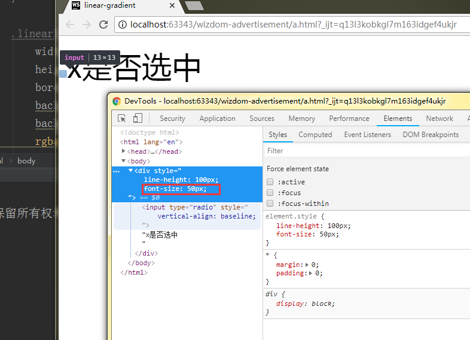

### 1.2 替换元素的默认display值(inline/inline-block)
- 所有的替换元素都是内联水平元素(display:inline/inline-block) ，(补充：iframe:display:inline)
- `<input>`和`<button>`的区别？white-space:前者是pre，后者是normal
- 替换元素和非替换元素的表现存在很多不同之处，其中之一：宽高的尺寸计算

### 1.3 替换元素的尺寸计算规则
- 对于替换元素的display为inline,inline-block计算规均一致：内联替换元素和块级替换元素使用同一套尺寸计算规则，即手动改变内联替换元素的display:block为块级替换元素，效果一样
- 作者将替换元素尺寸由内而外分为三类：固有尺寸、HTML尺寸、css尺寸
- `` 第一个width是HTML尺寸，后者是css尺寸；如果固有尺寸（如图片本身的尺寸），HTML尺寸和CSS尺寸同时存在，则权重一次增高，即css尺寸会覆盖html尺寸，html尺寸会覆盖固有尺寸。
- `` 与 `` 后者有请求，请求当前页面数据，前者则不会有请求更加高效
1. 但是火狐在这里有区别，没有src属性的 ``不是替换元素，等效于<span>等普通内联元素，
2. 因此在火狐下``宽高无效,通过设置display:inline-block使得宽高生效
3. css重置可以加上：img {display:inline-block}
无法通过css改变替换元素的固有尺寸（即图片原始是300*200，设置img为200*100，其实图片还是300*300并没有被改变），伪元素模拟验证；注：下图图看到伪元素中width和heigth仅仅是设定了content-box的尺寸，对content生成的图片资源没有任何影响
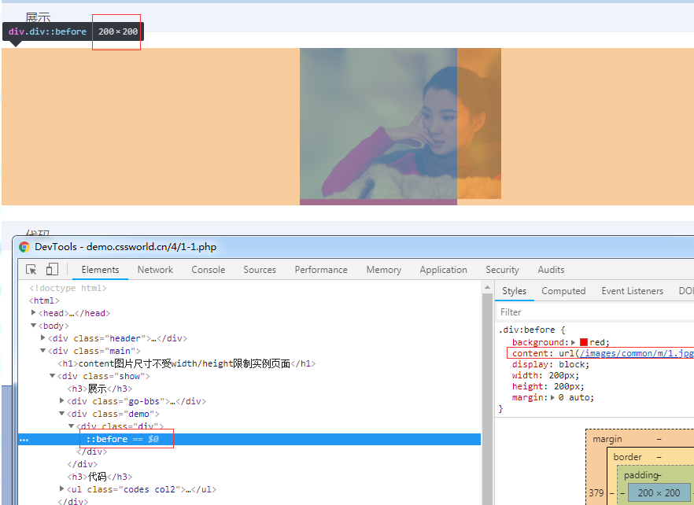
4. 对于img标签既然图片的宽高不受css控制，那么img标签的width和height是如何影响图片尺寸的？
    - 图片中的替换内容默认的适配方式是填充(fill)，即外部尺寸设定多大，我就填充跟着一样大；换句话说，尺寸变化的本质并不是改变固有尺寸，而是采用了填充作为适配HTML尺寸和CSS尺寸的方式
    - css3之前是不能修改的，css3提供了object-fit属性对img和其他替换元素的替换内容的适配 方式进行修改
    - 如果设置img {object-fit:contain}，那么会有垂直居中的效果

### 1.4 替换元素与非替换元素的距离有多远（以img标签为例）
- 只隔了一个src属性 
1. 火狐浏览器下，去掉src属性的是非替换元素
2. chorme下需要设置alt属性触发：
3. IE下没有src属性，img仍然是完全的替换元素，原因在于IE下img有默认的占位替换内容
4. 基于伪元素的图片内容生成技术（作者小技巧），存在兼容性问题，IE不支持；要想让chrome和火狐等浏览器支持，需要注意以下技术点：1. 不能有src属性；2. 不能使用content属性生成图片(针对chrome)；3. 需要有alt属性支持(针对chrome)；4. 火狐浏览器下::before中的content值会被无视（可能与火狐自己占用了::before的content属性有关）， ::after无此问题
    
- 只隔了一个CSS content属性
1. chrome下所有元素都支持content属性，而其他浏览器仅在::before/after伪元素中才支持
2. 前面已经证明了没有src属性的img标签是非替换元素，那么使用content属性给它生成一张图片呢？[demo](https://demo.cssworld.cn/4/1-3.php)
3. 各种表现（尺寸计算规则，不支持:before/:after 等伪元素）都符合替换元素特性；
4. 当存在src属性的时候也可以使用content属性替换图片内容；例子；
5. content只是改变了视觉呈现，当使用鼠标右键去保存图片的时候保存的还是src指向的图片；
6. 使用cotent还可以使得普通元素变为替换元素；例子：优点：由于字体内容还在不影响SEO；缺点：只能使用一倍图（不能更改替换元素固有尺寸并且移动端retina屏幕往往真实图片是显示图片尺寸的两倍）所以会有点儿模糊，建议使用svg

### 1.5 content与替换元素的关系
>把content属性生成的对象叫做"匿名替换元素"，就是替换元素
- 使用content生成的文本的特性
1. 无法选中和复制的，好像设置了user-select:none；
2. 无法被屏幕阅读器读取也无法被搜索引擎抓起，不利于SEO，因此重要的文本信息不要放在content中
3. 并且替换的仅仅是视觉层
4. ::fister-letter是替换元素
- 不能左右:empty伪类
- content动态生成值无法获取，如：计数器
  
## 2. content内容生成技术 
content几乎都是用在 ::before/after伪元素中，IE8仅支持单冒号的伪元素即 :before/after
 
### 2.1 content辅助元素生成
- 清除浮动
- 实现两端对齐，垂直居中/上边缘/下边缘对齐，例子(***), text-align:justify + display:inline-block实现列表两端对齐
    - before伪元素用于辅助实现底对齐，通过对:before元素添加border,width可以看到该元素。其实实现底对齐的关键在于高度100%高度上撑满了父容器， 结论是：div内部的多个inline-block元素的底端对齐是以高度最高的柱子的底部为基准的，因此这里使用伪元素生成一个没有宽度但高度是父元素高度的柱子，那么底部基准就是该伪元素的底部，看起来就像是底部对齐一样。
    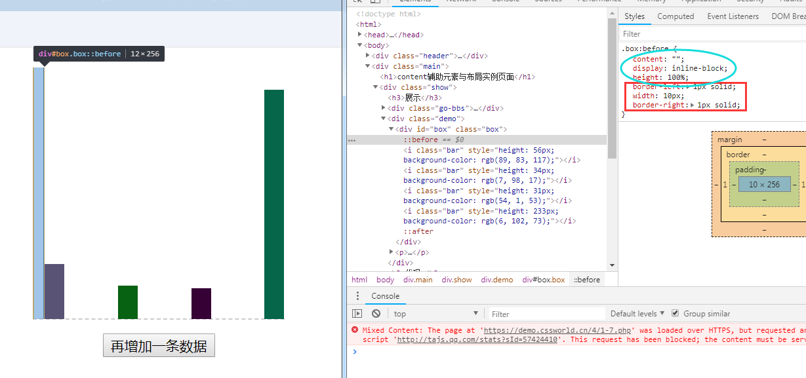
    - after伪元素用于辅助实现两端对齐，原理是因为父元素使用text-align:justify对最后一行元素不起作用，因此需要生成一个另起一行的元素，这里使用after伪元素生成一个宽度100%的元素。
    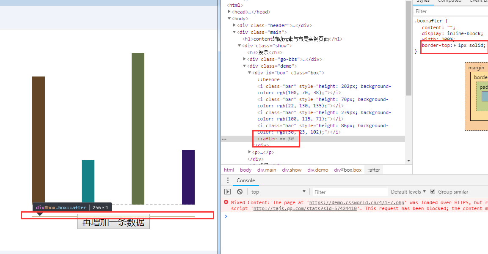

同样是使用after伪元素生成了另起一行的元素，但是并没有起作用，why?难道是因为text-align:justify对display:block不起作用。
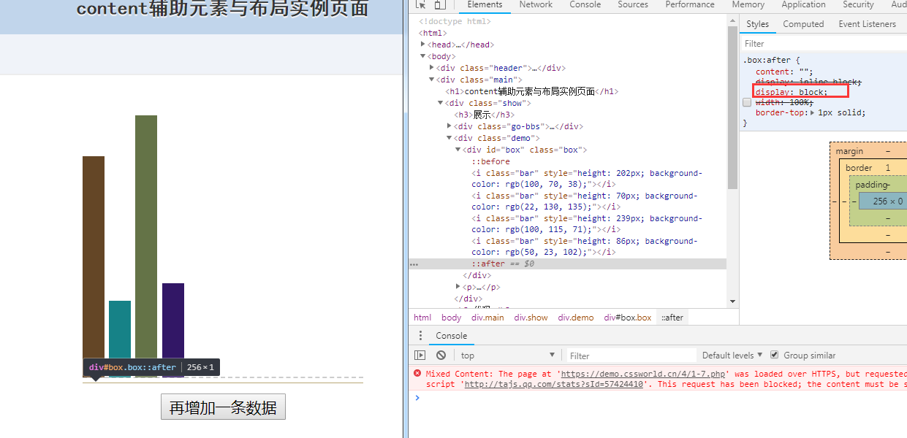
注：text-align其诞生的意义是控制文字的对齐与显示的，从其属性名上就可以看出来。从其渲染与解析上来看，其主要是用来控制inline水平元素或inline-block元素的对齐与显示的，例如嵌套行内标签的文字、图片、input表单控件等；而对block水平的元素是没有作用的。
[参考](https://www.zhangxinxu.com/wordpress/2011/03/displayinline-blocktext-alignjustify%E4%B8%8B%E5%88%97%E8%A1%A8%E7%9A%84%E4%B8%A4%E7%AB%AF%E5%AF%B9%E9%BD%90%E5%B8%83%E5%B1%80/)

### 2.2 content字符内容生成
- Unicode
- [动态loading](https://demo.cssworld.cn/4/1-9.php)；疑点：伪元素before的display的值设置为inline,或者不进行设置，transform不起作用。transform适用于transformable element(display计算值：block,inline-block,table相关的值)

### 2.3. content图片生成
- url功能符中的图片地址可以是各种形式包括base64URL
- 实际项目中用的不多，因为图片尺寸不好控制，伪元素中的图片更多使用background-image模拟
- base64URL由于内联在CSS文件中，因此直接出现，没有尺寸为0的状态

### 2.4. content开启闭合符合生成
- quotes属性，open-quote/close-quote
- cotent可以模拟上述开闭符合效果

### 2.5. content attr属性值内容生成
- 获取HTML属性和自定义的HTML属性

### 2.6. 深入理解content计数器
- [计数器效果(***)](https://www.zhangxinxu.com/wordpress/2014/08/css-counters-automatic-number-content/)
- counter-reset 、counter-increment 、counter()/counters()

### 2.7. 内容生成的混合特性

# 2. 温和的padding属性
## 1. padding与元素尺寸
- 错误认知：内联元素的padding只影响水平方向不影响垂直方向。
- 内联元素的padding在垂直方向上不仅会影响布局，也会影响视觉表现，只是因为内联元素没有可视宽度和可视高度（clientWidth,clientHeight永远是0）垂直方向的表现完全受line-height和vertical-align的影响，视觉上并没有改变上下行的间距，感觉上好像垂直padding没有作用。如果给内联元素增加背景色或者边框可以看到其尺寸确实受padding影响。（视觉上对上下元素的原本布局没有任何影响，仅仅是垂直方向上发生了层叠）
- css中，会出现不影响其他布局而是出现层叠效果的现象，作者总结为两类
    1. 纯视觉层叠，不影响外部尺寸：box-shadow / outline
    2. 会影响外部尺寸：inline元素的padding层叠
    3. 如何区分：父容器overflow:auto，层叠区超出容器时是否会有滚动条出现
- 用处：1. 增加点击区域不影响视觉效果，2. 实现高度可控的分割线 3. 锚点定位距离顶部一段距离
- 对于非替换元素的内联元素，不仅padding不会加入行盒高度计算，margin,border也是如此，都是不计算高度，但实际上在内联盒周围发生了渲染。
        
下面看下内联非替换元素设置padding和margin的情况：
1. 下面两张图作为对比看到对于inline元素的padding-top和padding-bottom
    - 内联元素的padding在垂直方向同样会影响布局，影响视觉表现
    - 内联元素没有可视宽度和可视高度：即clientHeight和clientWidth永远为0
    - 内联元素垂直方向的行为完全受line-height和vertical-align的影响，视觉上并没有改变和上下行内容的间距（因此感觉垂直padding好像没有起作用）
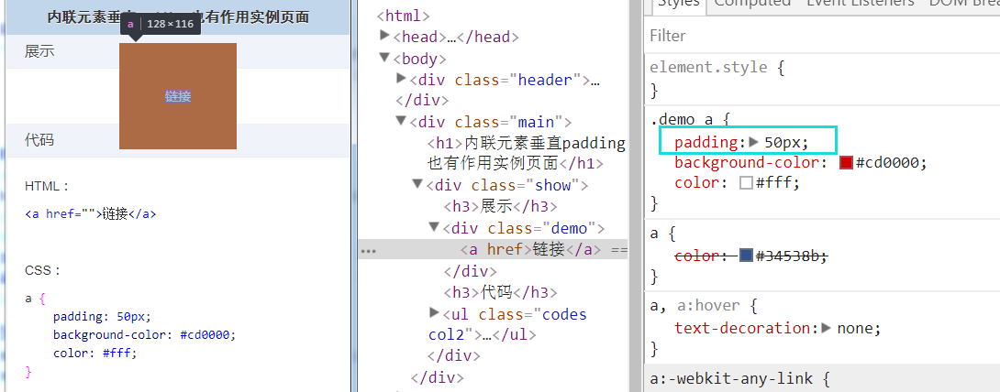
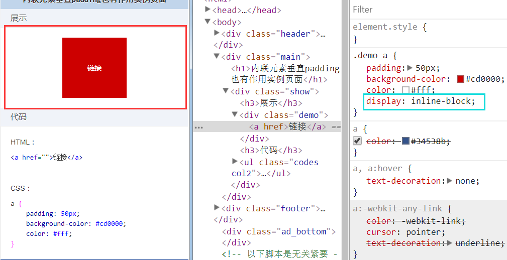 

2. 下面图看到对于(非替换元素的)inline元素设置的margin-top和margin-bottom无效果    
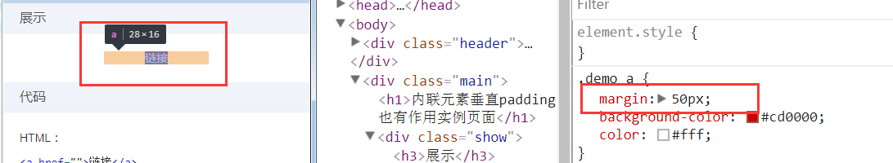
   
## 2. padding的百分比值
- 同margin不同，不支持负值，margin是支持的
- 支持百分比值，但是水平和垂直方向都是相对于宽度计算的。
    - 内联非替换元素内有文字，其padding会"断行"
    ```html
    <div style="width: 300px;height: 300px;background-color: grey">
      <span style="padding: 50%;background-color: red">内有文字若干</span>
    </div>
    ```
    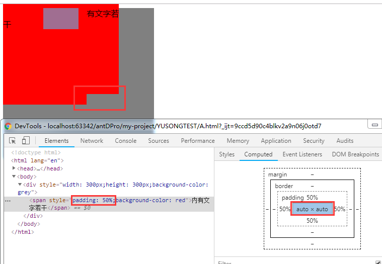
    注：上面的“内”是受掉下来的“干”影响的，对于内联元素，其padding区域是跟着内联盒模型中的行框盒子走的
   
    - 实现 一个正方形：div{padding 50%} ，注意如果是内联元素，因为内联元素设置垂直padding会让"幽灵空白节点"显现"，虽然幽灵空白节点宽度为0，但是高度会和设置的font-size有关。下面例子可以说明（设置display:inline），设置font-size:0即可消除这种情况。
    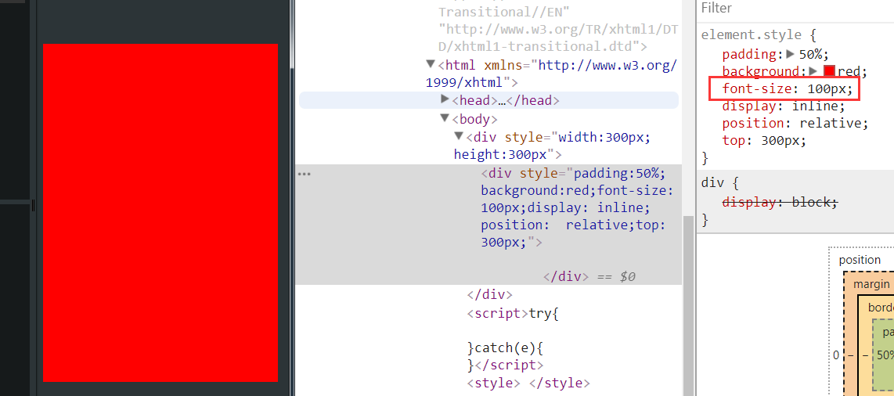
    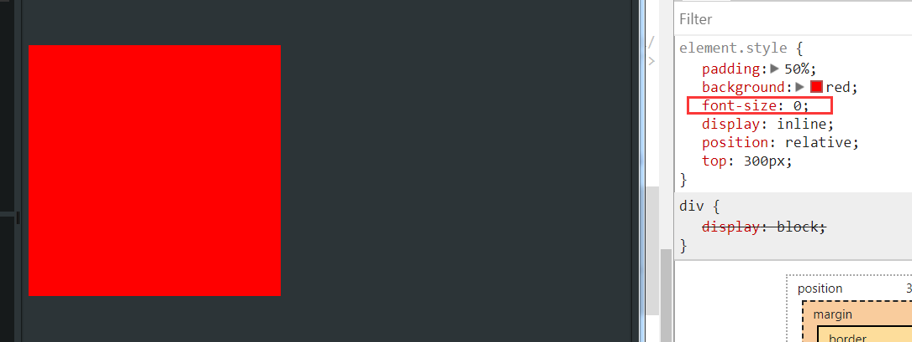
    - 实现一个[5:1的固定比例的头图效果](https://demo.cssworld.cn/4/2-3.php)（注意：position:absolute元素的宽高相对于padding-box）
    - 应用在内联元素上时：padding可能会存在断行

## 3. 标签元素内置的padding
- ol/ul列表内置padding-left，chrome下是40px，根据作者经验：字体在12-14px时，设置padding-left:22px较合适
- 表单元素：
    - input/textarea/button：所有浏览器均内置了padding
    - select：部分浏览器内置了padding
    - radio/checkbox:所有浏览器无内置了padding
    - button的padding最难控制，通常使用a标签模拟

## 4. padding与图形绘制
- [三道杠，双层圈点](https://demo.cssworld.cn/4/2-4.php)（padding + background-clip，如果直接在浏览器上修改background-clip貌似没有效果，去掉border属性，再勾选上就生效了，需要‘重新渲染’）
- background-clip：规定背景的绘制区域；属性值：content-box，padding-box，border-box。在上例中，设置为content-box，那么background-color仅作用在content-box区域，默认backgroud-color的作用范围是包含padding区域的即padding-box

# 3. 激进的margin
## 1. margin与元素尺寸以及相关布局
- 元素尺寸相关概念(参照jquery
1. 元素尺寸:$.widht()/height() , 包含padding ＋　border <=> 元素DOM：offsetWidth/offsetHeight
2. 元素内部尺寸:$.innerWidht()/innerHeight() , 包含padding <=> 元素DOM：clientWidth/clientHeight
3. 元素外部尺寸:$.outerWidht(true)/outerHeight(true) , 包含padding + border + margin

- margin与元素内部尺寸
1. padding是在设定width和"包裹性"的时候，可以改变可视尺寸
2. 当设定了width 或者 此时元素表现为"包裹性"的时候，margin就无法改变元素尺寸
3. 只要元素的尺寸表现符合“充分利用可用空间”，无论是垂直还是水平方向，都可以通过margin改变尺寸
4. 由于css中的流方向默认是水平方向，对于普通流体元素只能改变水平方向尺寸
5. 但是，对于具有拉伸特性的绝对定位元素，两个方向都是可以充分利用的，因此两个方向都可以改变：
6. 例子：利用margin实现两端对齐的效果：只有当父容器的宽度刚好是子元素所需宽才可以实现两端对齐（内部子元素是float），通过margin负值扩大父容器的宽度

- margin与元素的外部尺寸
1. padding不兼容案情况：如果容器可以滚动，IE和火狐会忽略padding-bottom的值，chrome不会。
    - 本质区别在于出发滚动的条件不一样：Chrome是子元素超多content-box触发滚动条，而IE和火狐则是超过padding-box触发
    - 因此不推荐使用padding实现滚动容器的底部留白，可以借助子元素的margin-bottom的实现底部留白（借助margin的外部尺寸特性）

2. 实现等高布局：方式1. diplay:table-cell（天然等高，不兼容ie6/7时，推荐使用），左右两栏作为单元格处理 方式2. 使用border边框模拟 方式3. 借助margin负值实现 
    - 注：最简单的是使用height:100%，但是这要求父级要设定高度值不能为auto，如果没有这一约定就只能通过其他方式实现
    - margin负值实现[等高布局](https://demo.cssworld.cn/4/3-2.php)（margin-bottom负边距 + padding补偿）：首先，给子容器设置padding-bottom值，一个足够大的值，然后，再设置其margin-bottom等于负的padding-bottom的值，相互抵消，父容器设置overflow:hidden，这样，任意一个子容器的高度增加，会把父容器撑开到最高那列的高度，其它比这列矮的子容器会通过padding-bottom来补偿这部分的高度差，因为背景和边框都是随着padding变化的，所以该方案可以实现一个障眼法
    - [css等高布局七种方式](https://www.cnblogs.com/xiaohuochai/p/5457127.html)

3. margin对尺寸的影响针对具有块状特性的元素适用，纯内联元素不适用
    - 内联元素垂直方向的margin是没有任何影响的：内外尺寸都不会影响
    - 对于水平方向，由于内联元素宽度表现为包裹性，因此不会影响内部尺寸		
    - 因此对于内联元素，只会影响水平方向的外部尺寸

## 2. margin的百分比值
和padding一样，水平和垂直方向都是相对宽度计算的，margin的百分比值应用价值相对padding就低些，原因在于：
1. margin在垂直方向上无法改变元素自身的内部尺寸，通常需要父元素作为载体；
2. 并且由于margin合并的存在，垂直方向往往需要双倍尺寸才能和padding表现一致；

## 3. 正确看待margin合并
1. 定义：块级元素的margin-top和margin-bottom有时会合并为单个外边距：块级元素【不包含float和position:absolute元素（尽管这两种情况都会使得元素块状化）】；只发生在垂直方向
2. margin合并的三种场景
    - 相邻兄弟元素
    - 父级和第一个/最后一个子元素:[例子](https://demo.cssworld.cn/4/3-4.php)
        避免margin合并的思路：1. 父元素BFC , 2. 父元素设置border-top/border-bottom , 3. 父元素设置padding-top/padding-bottom , 4. 父元素和第一个子元素通过内联元素进行阻隔
        - 图一：看出当子元素设置了margin-top，并且父元素没有设置overflow:hidden的情况下，最终的“表现效果”如同父元素设置了margin-top一样;
        - 图二：通过对父元素设置overflow:hidden将父元素变为块状格式化上下文元素即BFC，解决了父子元素margin合并的问题
        - 注：在使用jQuery.slideUp/slideDown做动画效果时，有的时候在动画开始或结束的时候会出现跳动的情况。在执行这两方法的时候会对元素添加overflow:hidden，这会阻止margin合并，当动画结束后会取消overflow:hidden即此时又发生了合并，于是一瞬间间距变大，产生了跳动
        图一：
        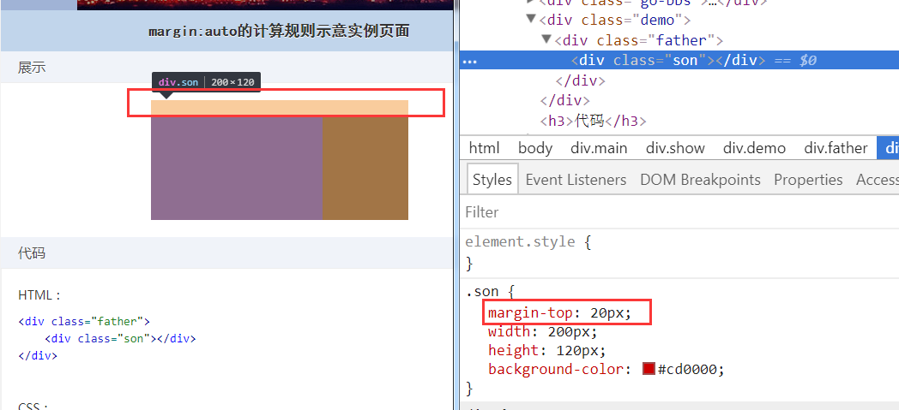
        图二：
        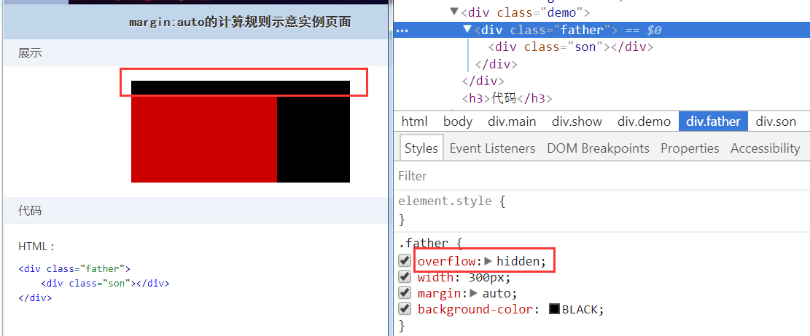

    - 空块级元素的margin合并

3. margin合并计算规则：1. 正正取大值；2. 正负值相加；3. 负负最负值
4. margin合并的意义


## 4. 深入理解：margin:auto
用于填充闲置的尺寸：`<div style="width:300px"><div style="width:200px"></div></div>` 还剩余的100px由margin:auto填充
    - margin:auto的填充规则
        - 如果一侧定值，一侧auto，则auto为剩余空间大小
        - 如果均为auto，则平分剩余空间
注：1. margin的初始值：0，因此如果设置margin-left:auto，margin-right缺失即默认值，则元素右对齐

注：<br/>
1. margin:auto的计算是为块级元素左中右对齐设计的，和内联元素使用text-alin控制左中右对齐想呼应
2. 触发margin:auto计算的前提条件：width或height为auto时，元素具有对应方向的填充特性。
3. 通常情况下垂直方向没有自动填充的特性，但是当给元素进行绝对定位，并且设置top/bottom - left/right，那么元素表现为“格式化高度”，“格式化宽度”，此时在width、heght尺寸都会自动填充父元素的可以用尺寸，如果此时元素定高，那么多余的空间就是margin-top,margin-bottom计算的空间。
4. 对于替换元素，修改display:block，上述描述同样适用。
5. 块级元素垂直居中：绝对定位元素的“格式化高度” + margin:auto

## 5. margin无效情形分析
1. display计算值为inline的非替换元素的垂直margin是无效的，对于内联替换元素，垂直margin有效并且没有margin合并的问题，所以图片不会发生margin合并
2. 表格中的tr/td元素或者display计算值是table-cell、table-row元素的margin都是无效的，如果计算值是table、table-caption、inline-table则没有此问题即可以通过margin控制外间距
3. margin合并的时候，更改margin值可能是没有效果的
4. 绝对定位元素非定位方位的margin值是无效的，因为绝对定位元素独立渲染不和兄弟元素插科打诨，因此margin无法影响兄弟元素，看似无效。实则有效：比如
    - `<div style="position:relative"></div>`
    - 上面代码父元素会出现滚动条：70%+30%+30px>100%  （右侧无right定位，看似无效）
5. 定高元素的子元素margin-bottom 或者 宽度定死的子元素的margin-right的定位失效
6. 鞭长莫及导致margin无效（margin合并，小的一方无效)
7. 内联特性导致margin无效


# 4. 功勋卓越的border属性
## 1. 为什么border-width不支持百分比值
1. border-width的值：数值，thin:1px ,medium:3px ,thick:4px
2. border-style:doule至少3px才有效，因此border-width默认值：medium
3. 边框宽度没有半像素概念

## 2. 了解border-style类型
1. border-style:double的表现规则：双线宽度永远相等，中间间隔+1 、 -1
2. 实现等宽的图形效果
    方式1：border-style:double
    ```css
    .icon-menu{
    width:120px;
    height:20px;
    border-top:60px double;
    border-bottom:20px solid;
    }
    ```
    
    方式2：padding + background-clip
    ```css
    .icon-menu {
        display: inline-block;
        width: 140px; height: 10px;
        padding: 35px 0;
        border-top: 10px solid;
        border-bottom: 10px solid;
        background-color: currentColor;
        background-clip: content-box;
    }
    ```

## 3. border-color和color
1. border-color的默认值就是color值
2. outline,box-shadow,text-shadow等也是如此

## 4. border和透明边框技巧
1. color:transparent  => IE9开始支持
2. border-color:transparent  => IE7开始支持
3. 默认background图片是相对padding-box定位的
4. 优雅增加点击区域：padding或者border。推荐透明border，通常css sprites后background-position是定死的，那么如果使用padding的话会影响background-position的值

## 5. border与图形构建
- 只要是与三角形或者梯形相关的图形，都可以使用border实现

## 6. border等高布局技术
[demo](https://demo.cssworld.cn/4/4-4.php)
1. 注意：因为溢出隐藏是基于padding-box的，父元素如果使用overflow:hidden会剪裁掉border部分。
2. 优点：不会出现锚点定位带来的问题
3. 缺点：实现的等高布局的栏目有限，如果栏目过多，则使用talbe-cell 、 margin + padding
