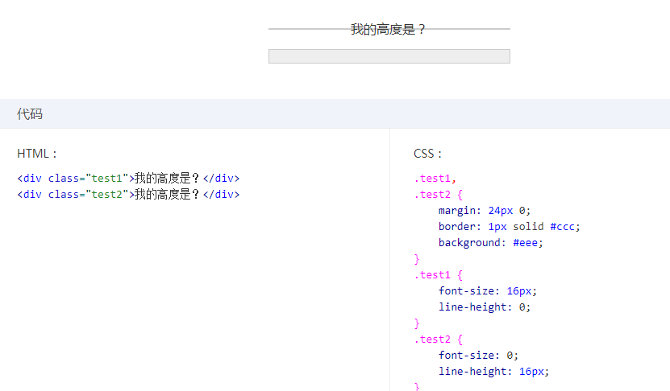
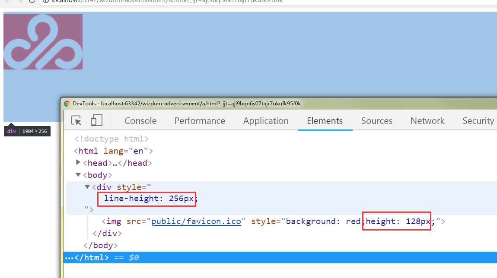
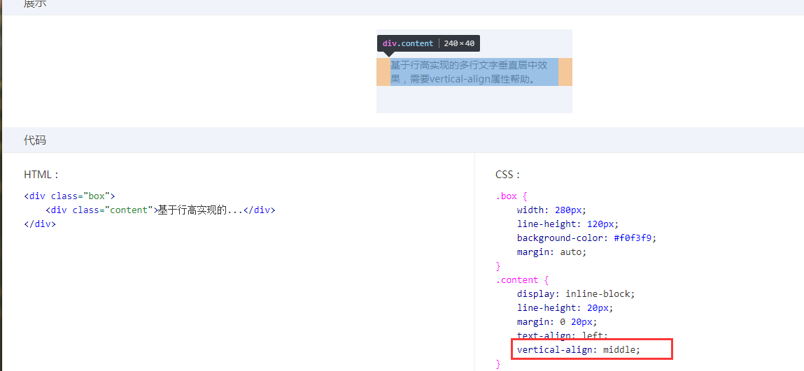
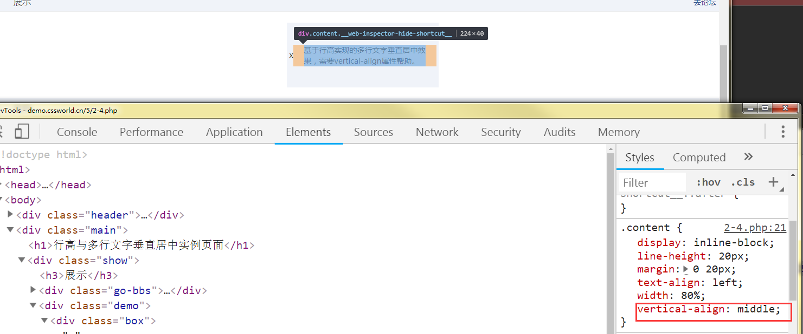
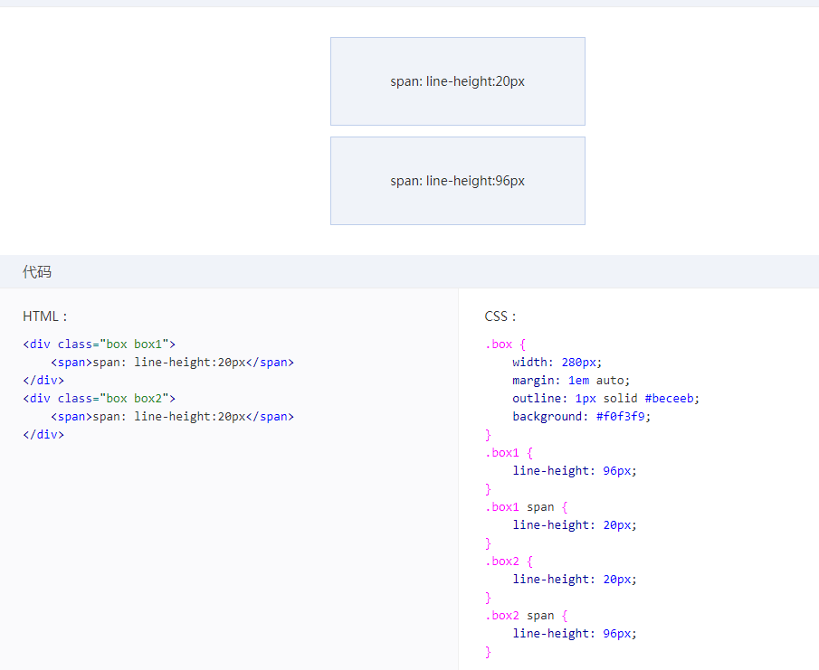
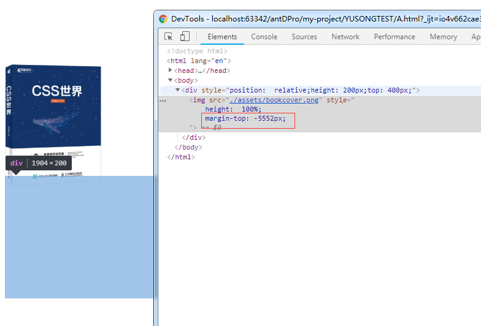

<!-- START doctoc generated TOC please keep comment here to allow auto update -->
<!-- DON'T EDIT THIS SECTION, INSTEAD RE-RUN doctoc TO UPDATE -->
**Table of Contents**  *generated with [DocToc](https://github.com/thlorenz/doctoc)*

- [1. 字母x - 举足轻重](#1-%E5%AD%97%E6%AF%8Dx---%E4%B8%BE%E8%B6%B3%E8%BD%BB%E9%87%8D)
  - [1. x与css中的baseline(vertical-align)](#1-x%E4%B8%8Ecss%E4%B8%AD%E7%9A%84baselinevertical-align)
  - [2. x与x-height](#2-x%E4%B8%8Ex-height)
  - [3. x与ex](#3-x%E4%B8%8Eex)
- [2. 内联元素基石line-height](#2-%E5%86%85%E8%81%94%E5%85%83%E7%B4%A0%E5%9F%BA%E7%9F%B3line-height)
  - [1. 内联元素的高度根本：line-height](#1-%E5%86%85%E8%81%94%E5%85%83%E7%B4%A0%E7%9A%84%E9%AB%98%E5%BA%A6%E6%A0%B9%E6%9C%ACline-height)
  - [2. 为什么line-height可以让内联元素垂直居中](#2-%E4%B8%BA%E4%BB%80%E4%B9%88line-height%E5%8F%AF%E4%BB%A5%E8%AE%A9%E5%86%85%E8%81%94%E5%85%83%E7%B4%A0%E5%9E%82%E7%9B%B4%E5%B1%85%E4%B8%AD)
  - [3. line-height各类属性值](#3-line-height%E5%90%84%E7%B1%BB%E5%B1%9E%E6%80%A7%E5%80%BC)
  - [4. 内联元素line-height的“大值特性”](#4-%E5%86%85%E8%81%94%E5%85%83%E7%B4%A0line-height%E7%9A%84%E5%A4%A7%E5%80%BC%E7%89%B9%E6%80%A7)
- [3. vertical-align](#3-vertical-align)
  - [1. 属性值分类](#1-%E5%B1%9E%E6%80%A7%E5%80%BC%E5%88%86%E7%B1%BB)
  - [2. 作用的前提](#2-%E4%BD%9C%E7%94%A8%E7%9A%84%E5%89%8D%E6%8F%90)
  - [3. 与line-height之间的关系](#3-%E4%B8%8Eline-height%E4%B9%8B%E9%97%B4%E7%9A%84%E5%85%B3%E7%B3%BB)
  - [4. 线类属性值](#4-%E7%BA%BF%E7%B1%BB%E5%B1%9E%E6%80%A7%E5%80%BC)
  - [5. 文本类属性值](#5-%E6%96%87%E6%9C%AC%E7%B1%BB%E5%B1%9E%E6%80%A7%E5%80%BC)
  - [6. 上标/小标属性值](#6-%E4%B8%8A%E6%A0%87%E5%B0%8F%E6%A0%87%E5%B1%9E%E6%80%A7%E5%80%BC)
  - [7. 无处不在的vertical-align](#7-%E6%97%A0%E5%A4%84%E4%B8%8D%E5%9C%A8%E7%9A%84vertical-align)
  - [8. 基于vertical-align属性的水平垂直居中弹框](#8-%E5%9F%BA%E4%BA%8Evertical-align%E5%B1%9E%E6%80%A7%E7%9A%84%E6%B0%B4%E5%B9%B3%E5%9E%82%E7%9B%B4%E5%B1%85%E4%B8%AD%E5%BC%B9%E6%A1%86)

<!-- END doctoc generated TOC please keep comment here to allow auto update -->

 
块级元素负责结构，内联元素负责内容

# 1. 字母x - 举足轻重
## 1. x与css中的baseline(vertical-align)
## 2. x与x-height
## 3. x与ex

# 2. 内联元素基石line-height
下面的行高：line-height，涉及到内联盒模型
## 1. 内联元素的高度根本：line-height
1. 下面例子，看出如果div内中含有文字，则div的高度有line-height决定而不是font-size

2. 对于非替换元素的纯内联元素，可视高度完全由line-height决定，padding，border属性对这样的元素的可视宽度没有任何影响，因此，平常口中的“盒模型”是指块级元素
对于文本这样的纯内联元素，line-height指定了计算“行框盒子”高度的基础高度。例如：line-height设为16px,一行文本就是16px,二行文本就是32px,...

3. 对于替换元素，块级元素，line-height扮演什么角色呢？
- line-height会影响替换元素的高度吗？ 不会，规范中有提到计算行框高度时
    - 下图div高度为什么会受到line-height的影响？是幽灵空白节点（strut）把高度变高了。 
    - 原因1：图片为内联元素，会构成一个行框盒子，在HTML5文档模式下，每一个行框盒子的前面都会有一个幽灵空白节点（宽度为0），该strut的内联特性和普通的字符一模一样。
    - 原因2：图文和文字混在一起是很常见的，当内联替换元素和内联非替换元素在一起的时候高度又是怎样的呢？ 由于都是内联元素，会共同形成一个行框盒子，line-height在这个混合元素的"行框盒子"只能决定这个行框盒子的最小高度。
    - 总结：对于纯文本元素，line-height直接决定最终的高度，但是如果同时有内联替换元素，则line-height只能决定最小高度。
    
    - 在img标签上设置line-height看出并没有起作用（img是内联替换元素，line-height没有起作用），
    
- 对于块级元素，line-height对其本身是没有任何作用的，改变块级元素的line-height，块级元素高度跟着变化实际上是通过改变块级元素内的内联级别元素占据的高度实现的。
- line-height无处不在的继承特性

4. line-height作用于内联元素的细节
- 细节：“行距”  或者  “半行距”
- css中，“行距”分散在当前文字的上方和下方，对于第一行文字来说，行距的高度就只有一半，称为“半行距”
- 行距 = 行高 - em-box ; em-box的高度时1em，em是相对于font-size大小的单位，所以 1em 等于当前一个font-size的大小  => 行距 = line-height - font-size
- 内容区域可以近似理解为火狐和IE浏览器下文本选中带背景色的区域
- 内容区域：受font-family和font-size双重影响 ， em-box仅受font-size影响 ，通常情况下内容区域高一些，当我们的字体是宋体时，内容区域和em-box是等同的。
- 文字上边距：向下取整 ， 下边距：向上取整，因此文字在内容区域中偏下

5. line-height是如何通过改变行距实现文字排版？（看下line-height:1 , 2, 0.5 时的情况就清楚了）

## 2. 为什么line-height可以让内联元素垂直居中
1. 我之前认为：height和line-height值一致的话，可以让单行文字垂直居中，这是错误的。
    - 不需要height，只要line-height即可
    - 不仅适用于单行，多行也可
    - 结论：line-height可以让单行或多行元素近似垂直居中，近似的原因：文字的垂直中线位置普遍要比真正的“行框盒子”的垂直中线位置低。

2. 如何实现多行文本或者图片等替换元素的（近似）垂直居中效果？ 
    - line-height + vertical-align
    - 内容外层包裹一个inline-block元素，作用是在inline-block元素前面生成幽灵空白节点，该幽灵空白节点会在line-heigth区域中居中，之后使用vertical-align控制内联元素使得其和幽灵空白节点居中对齐
    [参考](http://demo.cssworld.cn/5/2-4.php)
    
    上面代码中的display:inline-block使得.content具有内联特性的元素，从而形成行框盒子，则就会产生一个'幽灵空白节点'（行框盒子前才会有strut??）。 这里的幽灵空白节点很抽象，下面我改造了下这里的代码。

实验：
将幽灵空白节点使用字母“x”替换，去除vertical-align（默认值是基线，内联元素默认基线对齐），发现x和.content元素基线对齐。

设置vertical-align的值为middle，发现二者垂直对齐，其实字母"x"的位置并未发生变化.

## 3. line-height各类属性值
1. 支持：数值(1.5)，百分比(150%)，长度值(21px)。
2. 默认值：normal，这里的normal是受font-family影响的，不同的font-family对应的normal值是不一样的，不同系统不同浏览器的默认line-height的值都是有差异的。因此需要重置。
3. line-height支持的三种类型的区别？http://demo.cssworld.cn/5/2-5.php
    - 继承细节有所区别：a)  数值型时，所有子元素继承该数值，b) 后两者情况，所有子元素继承最终的计算值
    - 很多替换元素，尤其表单类的替换元素：button,input等，很多具有继承特性的css属性也有自己的一套，如font-family , font-size , line-height
    - 继承的属性权重最弱，全局重置也会覆盖继承的属性
4. 重置的值为多少合适？
    - 对于重图文的网站（博客，论坛等），使用数值：1.6 ~ 1.8
    - 重布局结构精致的网站，各大网站基本上都使用数值作为全局line-height值  （font-size:14px ,line-height:20px ， 则设置line-height:20 /14 = 1.42858
    - css中计算行高的时候，行高值一定不要向下舍入，要向上舍入

## 4. 内联元素line-height的“大值特性”
[参考](http://demo.cssworld.cn/5/2-6.php)

这里的span是一个内联元素，自身是一个内联盒子，只要有内联盒子，就一定会有行框盒子（每一行内联元素外面包裹的一层看不见的盒子），每个行框盒子前面都有一个宽度为0的幽灵空白节点。
1. 无论内联元素line-height如何设置，最终父级元素的高度都是由数值大的那个line-height决定的。
2. 行框盒子的高度是由高度最高的那个”内联盒子“决定的
3. 要避免“幽灵空白节点”的干扰，例如，设置元素：display:inline-block，创建一个独立的"行框盒子"（ 测试无效）

# 3. vertical-align
[参考](https://www.cnblogs.com/shireyhu/p/7832335.html)

## 1. 属性值分类
1. 线类：baseline / top /middle / bottom
2. 文本类：text-top / text-bottom
3. 上标下标:sub / super
4. 数值百分比:20px / 2em / 20%  ：
    - 根据计算值的不同，相对于基线向上/下偏移  （所以：vertical-align:baseline <=> vertical-align:0）
    - 兼容性好
    - 可以精确控制内联元素的垂直对齐位置（像素级）
    - margin和padding的百分比值计算都是相对于宽度计算的。line-height是相对于font-size计算的，vertical-align属性的百分比值是相对于line-heigth计算的
    - 如今的网页布局中，line-height的计算值都是相对固定并且已知的，因此，vertical-align直接使用数值相较于百分比值更加方便

## 2. 作用的前提
1. 只能应用于内联元素（display计算值：inline,inline-block,inline-table） 和 display:table-cell的元素
2. 对于table-cell元素而言，vertical-align起作用的时table-cell元素自身 http://demo.cssworld.cn/5/3-4.php

## 3. 与line-height之间的关系
只要出现内联元素，line-height和vertical-align一定会同时出现.
1. 容器高度不等于行高：http://demo.cssworld.cn/5/3-1.php 
2. 图片底部留有空隙：http://demo.cssworld.cn/5/3-2.php（任意一个块级元素，里面若有图片，则块级元素高度基本都要比图片的高度高（http://demo.cssworld.cn/5/3-5.php
    - reason：幽灵空白节点、line-height、vertical-align
    - 图片块状化 
    - 容器line-height足够小 
    - font-size足够小（需要容器的line-height的值与font-size相关 
    - 图片设置vertical-align属性值（基线对齐 改为 top/middle/bottom
3. 内联特性导致margin无效(下面例子，margin-top超出一定范围则无效，被幽灵空白节点限制住了

解释：非主动触发位移的内联元素是不可能跑到计算容器外面的

4. text-align：justify（css3）实现两端对齐效果
    - [参考1](https://blog.csdn.net/d_hongran/article/details/66969271) & [参考2](https://www.cnblogs.com/jyybeam/p/6074619.html)
    - text-align:justify 不处理块内的最后一行文本（包括块内仅有一行文本的情况，这时既是第一行也是最后一行）：使用after伪类生成一个空行

## 4. 线类属性值
1. inline-block与base-line
- vertical-align:baseline在文本之类的内联元素里是字符x的下边缘，对于替换元素则是替换元素的下边缘。
- 但是如果元素是inine-block元素：
    - 如果该inline-block元素内部没有内联元素，或者overflow不是visible则该元素的基线就是margin底边缘
    - 否则其基线就是元素里面最后一行内联元素的基线
- text-align:justify案例：http://demo.cssworld.cn/5/3-6.php
2. vertical-align:top/bottom
3. vertical-align与近似垂直居中
[demo1](http://demo.cssworld.cn/5/3-5.php)
[demo2](http://demo.cssworld.cn/5/3-6.php)

## 5. 文本类属性值
## 6. 上标/小标属性值
## 7. 无处不在的vertical-align
1. top/bottom：对齐看边缘看行框盒子
2. baseline/middle：对齐和字符x打交道
## 8. 基于vertical-align属性的水平垂直居中弹框
