<!-- START doctoc generated TOC please keep comment here to allow auto update -->
<!-- DON'T EDIT THIS SECTION, INSTEAD RE-RUN doctoc TO UPDATE -->
**Table of Contents**  *generated with [DocToc](https://github.com/thlorenz/doctoc)*

- [1. 魔鬼属性float](#1-%E9%AD%94%E9%AC%BC%E5%B1%9E%E6%80%A7float)
  - [1. float的本质与特性](#1-float%E7%9A%84%E6%9C%AC%E8%B4%A8%E4%B8%8E%E7%89%B9%E6%80%A7)
  - [2. float作用机制](#2-float%E4%BD%9C%E7%94%A8%E6%9C%BA%E5%88%B6)
  - [3. float更深入的作用机制](#3-float%E6%9B%B4%E6%B7%B1%E5%85%A5%E7%9A%84%E4%BD%9C%E7%94%A8%E6%9C%BA%E5%88%B6)
  - [4. float与流体布局](#4-float%E4%B8%8E%E6%B5%81%E4%BD%93%E5%B8%83%E5%B1%80)
- [2. float克星：clear](#2-float%E5%85%8B%E6%98%9Fclear)
  - [1. 什么是clear](#1-%E4%BB%80%E4%B9%88%E6%98%AFclear)
  - [2. 成事不足败事有余的clear](#2-%E6%88%90%E4%BA%8B%E4%B8%8D%E8%B6%B3%E8%B4%A5%E4%BA%8B%E6%9C%89%E4%BD%99%E7%9A%84clear)
- [3. BFC:块级格式化上下文](#3-bfc%E5%9D%97%E7%BA%A7%E6%A0%BC%E5%BC%8F%E5%8C%96%E4%B8%8A%E4%B8%8B%E6%96%87)
  - [1. 定义](#1-%E5%AE%9A%E4%B9%89)
  - [2. BFC与流体布局](#2-bfc%E4%B8%8E%E6%B5%81%E4%BD%93%E5%B8%83%E5%B1%80)
- [4. 最佳结界overflow](#4-%E6%9C%80%E4%BD%B3%E7%BB%93%E7%95%8Coverflow)
  - [4.1 剪裁界线border-box](#41-%E5%89%AA%E8%A3%81%E7%95%8C%E7%BA%BFborder-box)
  - [4.2 overflow-x 和 overflow-y](#42-overflow-x-%E5%92%8C-overflow-y)
  - [4.3 overflow与滚动条](#43-overflow%E4%B8%8E%E6%BB%9A%E5%8A%A8%E6%9D%A1)
  - [4.4 依赖overflow的样式表现](#44-%E4%BE%9D%E8%B5%96overflow%E7%9A%84%E6%A0%B7%E5%BC%8F%E8%A1%A8%E7%8E%B0)
  - [4.5 overflow和锚点定位](#45-overflow%E5%92%8C%E9%94%9A%E7%82%B9%E5%AE%9A%E4%BD%8D)
- [5. absolute](#5-absolute)
  - [5.1 包含块](#51-%E5%8C%85%E5%90%AB%E5%9D%97)
  - [5.2 具有相对特性的无依赖absolute绝对定位](#52-%E5%85%B7%E6%9C%89%E7%9B%B8%E5%AF%B9%E7%89%B9%E6%80%A7%E7%9A%84%E6%97%A0%E4%BE%9D%E8%B5%96absolute%E7%BB%9D%E5%AF%B9%E5%AE%9A%E4%BD%8D)
  - [5.3 absolute与text-align](#53-absolute%E4%B8%8Etext-align)
- [6. absolute 与 overflow](#6-absolute-%E4%B8%8E-overflow)
- [7. absolute 和 clip](#7-absolute-%E5%92%8C-clip)
  - [重新认识clip](#%E9%87%8D%E6%96%B0%E8%AE%A4%E8%AF%86clip)
  - [深入clip的渲染](#%E6%B7%B1%E5%85%A5clip%E7%9A%84%E6%B8%B2%E6%9F%93)
- [8. absolute的流体特性](#8-absolute%E7%9A%84%E6%B5%81%E4%BD%93%E7%89%B9%E6%80%A7)
- [9. relative](#9-relative)
  - [relative对absolute的限制](#relative%E5%AF%B9absolute%E7%9A%84%E9%99%90%E5%88%B6)
  - [relative与定位](#relative%E4%B8%8E%E5%AE%9A%E4%BD%8D)
  - [relative最小化影响原则](#relative%E6%9C%80%E5%B0%8F%E5%8C%96%E5%BD%B1%E5%93%8D%E5%8E%9F%E5%88%99)
- [10. fixed固定定位](#10-fixed%E5%9B%BA%E5%AE%9A%E5%AE%9A%E4%BD%8D)
  - [fixed背景锁定](#fixed%E8%83%8C%E6%99%AF%E9%94%81%E5%AE%9A)

<!-- END doctoc generated TOC please keep comment here to allow auto update -->


# 1. 魔鬼属性float
## 1. float的本质与特性
1. 本质：为了实现文字环绕效果
2. 浮动的原理：使当前元素脱离普通流，相当于浮动起来一样，浮动的框可以左右移动，直至它的外边缘遇到包含框或者另一个浮动框的边缘

特性：
- 包裹性：包裹（收缩到内容最小宽度） + 自适应性 （ 随着内容变化而变化）
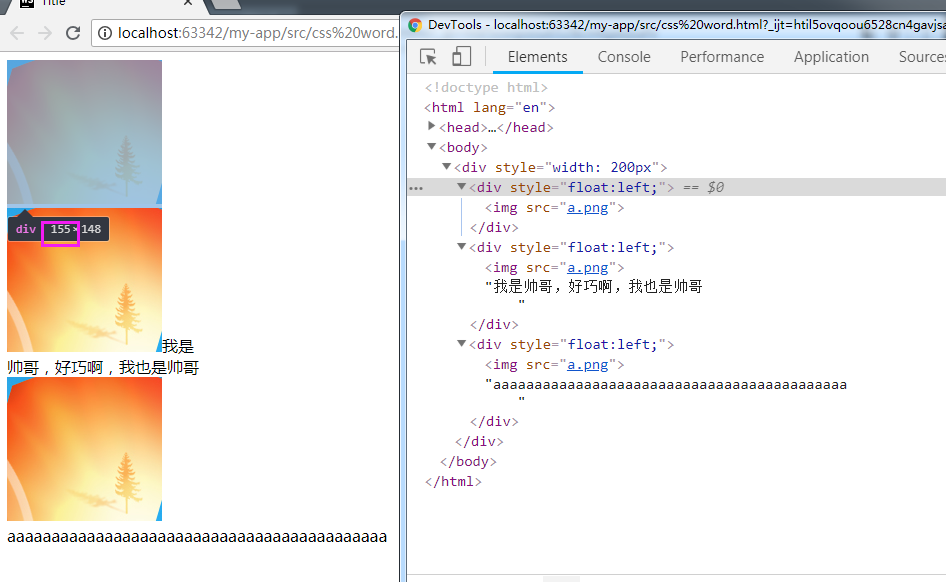

- 不会发生任何的margin合并 （下图中看出第一个和第二个div.float没有发生margin合并，原因是因为形成了bfc）margin合并条件之一：合并双方元素均为流内块级元素（应用float属性的元素已经脱离文档流，已不是流内元素）
- 块状化并格式化上下文（如果display设置的值不是none，那么当display设置为inline-table时计算值为table，其余情况的计算值均是：block），
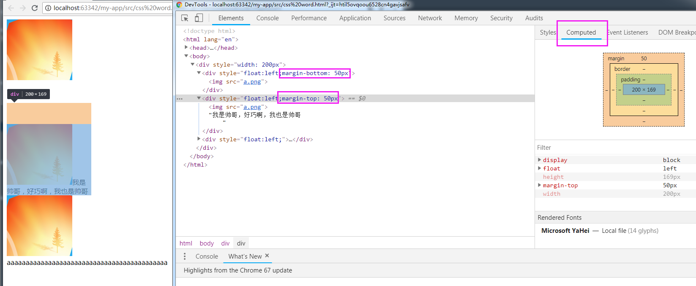
- 虽然设置了float的元素display计算值为block，但是其表现更像是inline-block，如果真是block元素应该是占满父元素水平空间的（这里应该是body的水平空间），这个现象应该和float元素的包裹性是关联的，包裹性会让其收缩到最小
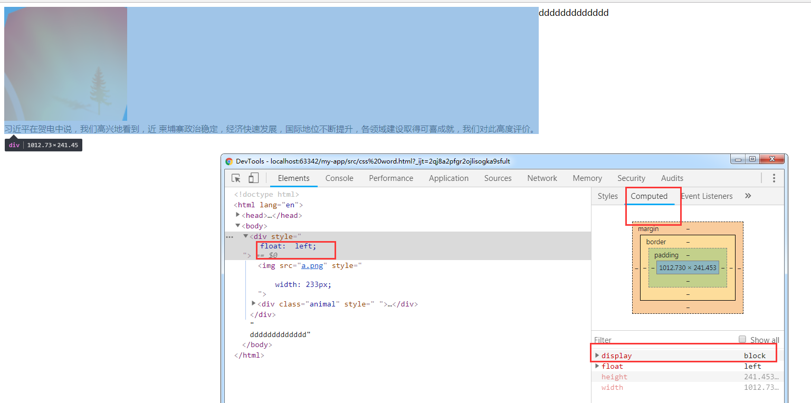

当我把float属性去掉后，发生了margin在上下方向上的合并
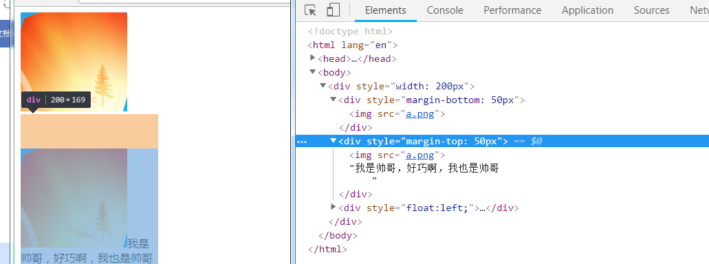

- 破坏文档流


鑫三无准则：
- 无浮动：
    - 纯浮动布局容错性差，容易出现比较严重的布局问题
    - 容易出现意料之外的情况：父元素高度塌陷，兼容性问题（IE6,7不支持，6.5节）


## 2. float作用机制
css初期实现图文效果需要破坏文档流实现文字环绕的效果（父元素高度塌陷就可以和外层的世界接触了）;“高度塌陷”只是让跟随的内容可以和浮动元素在一个水平线上，
- 行框盒子和浮动元素的不可重叠性：行框盒子如果和浮动元素的垂直高度有重叠，则行框盒子在“正常定位”状态下只会跟随浮动元素，而不会发生重叠
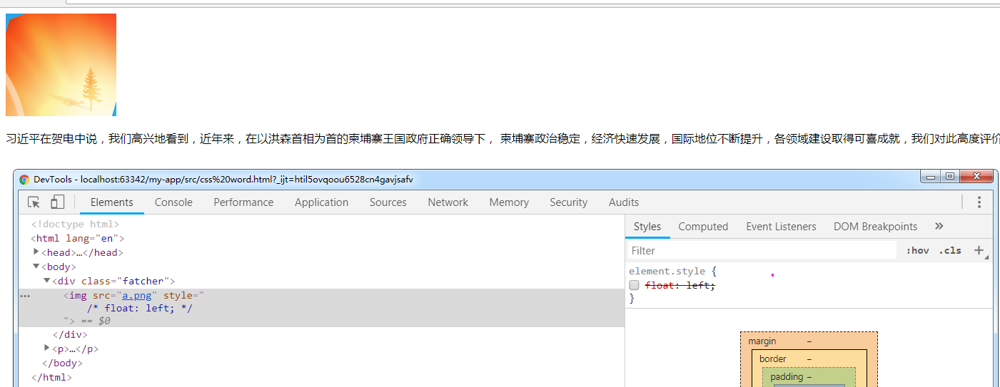
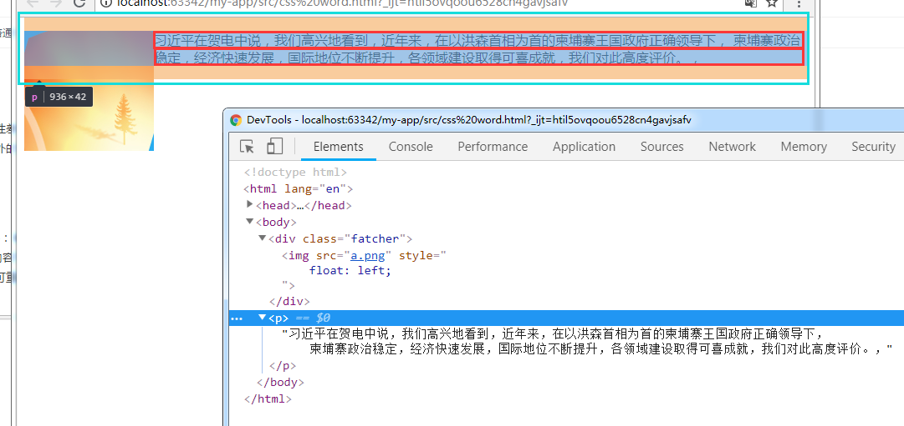

- 上图中蓝色部分框线表"块状盒子"是和图片完全重叠的，而两个红色框表示的“行框盒子”却被浮动元素限制，没有任何重叠。
- 浮动元素后面使用margin负无穷大无效，就是因为浮动元素对于行框盒子的“限制”。下图中对p使用margin左移，看到块状盒子确实左移了，但是内部的行框盒子并没有发生变化（因为浮动元素的限制）
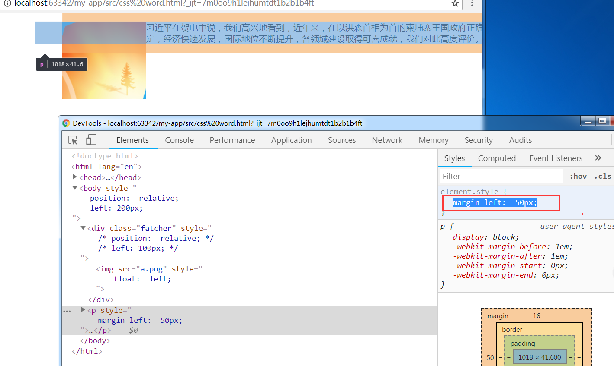

总结：文字环绕效果有两个特性组成
1. 父级高度塌陷
2. 行框盒子区域限制 => 虽然定高可以解决高度塌陷的问题，但是如果内部的浮动元素超出高度范围或者下面元素由于margin负值向上偏移 仍然会因为行框盒子受到浮动元素的区域限制这个因素而出现文字环绕效果
3. [现象](https://demo.cssworld.cn/6/1-1.php)（为什么仍会受浮动影响？）

## 3. float更深入的作用机制
1. 浮动元素和内联元素在一行显示
2. 浮动锚点 、 浮动参考
    - 浮动锚点：float元素所在的'流'中的一个点，该点本身 不浮动，表现上看像是无margin,无padding,无border的空内联元素
    - 浮动参考：浮动元素对齐参考的实体
3. float元素的浮动参考是"行框盒子"，也就是浮动元素在当前"行框盒子"内进行定位，而不是外面的包含块。
4. 如果float元素前后都是块级元素，那么没有了"行框盒子"，该如何对齐呢？浮动锚点会产生"行框盒子"，浮动锚点表现为一个空的内联元素，那么也会产生一个"行框盒子"，此时float元素的定位就有参考实体了。

## 4. float与流体布局
实现两栏或者多栏自适应布局，margin-left/margin-right


# 2. float克星：clear
## 1. 什么是clear
- 使用clear清除浮动。定义：clear元素让自身不和前面的浮动元素相邻，对后面的元素不闻不问。
- 方式1：after伪元素设置clear:both。 clear:left/right作用等同于both，因此没啥价值。
- 方式2：如果box1是浮动元素，则在内部末尾添加一个清除浮动的空元素。原理：因为clear的作用是不和浮动元素在一行显示，那么该新增的clear元素就必然换行
```html
<div class="box1">
    <div class="child-1">child-1</div>
    <div class="child-2">child-2</div>
    <div style="clear: both;"></div>
</div>
<div class="box2"></div>
```


## 2. 成事不足败事有余的clear
- clear属性只有块级元素才有效，而after等伪元素默认都是内联元素，因此使用该伪元素清楚浮动时需要设置display:block.
- clear的本质：让自己不和float元素在一行显示，并不是真正意义上的清除浮动
    - 如果clear:both元素前面的元素就是float元素，则margin-top负值及时设置成margin-top:-9999px也无效（因为不想在一行，导致碰到前面的float元素就移不上去了）
    - clear:both后面的元素依旧可能会发生文字环绕效果
    - clear:both只能从一定程度上消除浮动的影响

例1：
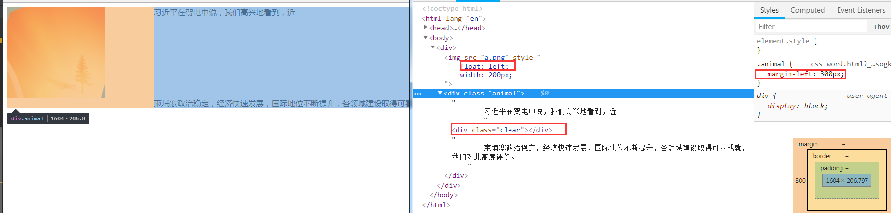

例2
```html
<style>
    .fathcer:after {
        content: ' ';
        display: table;
        clear: both;
    }

    .fathcer img {
        float: left;
        width: 60px;
        height: 60px;
    }

    .fathcer + div {
        margin-top: -2px;
    }
</style>
</head>
<body>
<div class="fathcer">
    
    我是帅哥，我是帅哥，我是帅哥，我是帅哥，我是帅哥
</div>
<div>虽然你很帅，不过我不感兴趣</div>
</body>
```
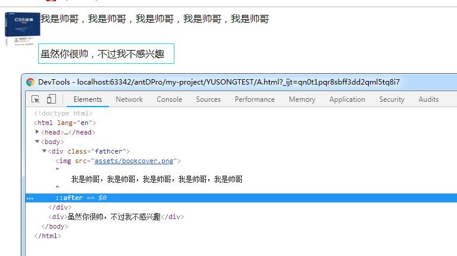

# 3. BFC:块级格式化上下文
## 1. 定义
- 形成结界
- 表现原则
    - 内部元素不可能影响外部元素
    - 不可能发生margin重叠（规范：margin合并的前提之一：处于同一块级格式化上下文）
    - 清除浮动的影响，如果不清除，父元素高度塌陷就会影响外面元素的布局
- 触发BFC的情况
    - html根元素，
    - float不为none，
    - overflow的值为auto,scroll,hidden
    - display:inline-block,table-cell,table-caption
    - position的值不为static,relative

## 2. BFC与流体布局
- BFC最重要的用途并不是为了去除margin重叠，或者清除浮动，而是为了实现自适应布局.
例：
```html
<div class="fathcer">
    
    <div>我是帅哥，我是帅哥，我是帅哥，我是帅哥，我是帅哥，我是帅哥，我是帅哥，我是帅哥，我是帅哥，我是帅哥，我是帅哥</div>
</div>
```

- 没有使用bfc
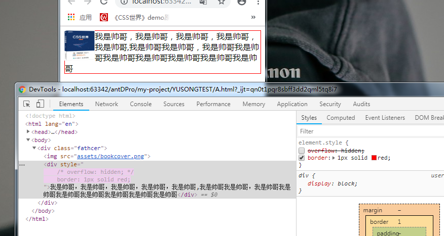

- 使用bfc
    - 普通流体（块级）元素在设置了overflow:hidden(作者示例)/auto（感觉很好用啊，不会出现剪裁）/scroll（样式问题）后，会自动填满容器中除了浮动以外的剩余空间，形成自适应布局效果。
    - 文字和图片的距离：浮动元素设置margin-right，透明border-right,padding-right；或者形成bfc的元素设置padding-left,border-left，但不能是margin-left,因为如果是margin-left其值就是浮动元素的宽度 + 间隙大小，这样就变成动态不可控了。
    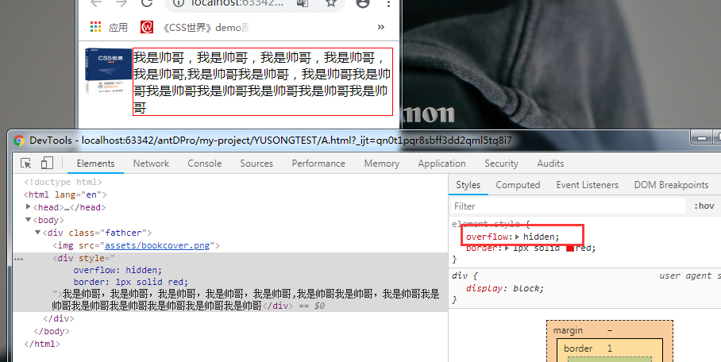

- 基于BFC特性的自适应布局的优点
    - 自适应内容由于封闭而健壮，容错性更强
    - 自适应内容自动填满浮动以外区域

- 整站使用
```css
.left-float{  float:left  }
.right-float{  float: right;  }
.bfc{  overflow: hidden;  }.left-float{  float:left  }
.right-float{  float: right;  }
.bfc{  overflow: hidden;  }
```

- 实际操作中能够兼顾流体特性和bfc特性实现自适应布局的属性并不多
    - flot:left:破坏性，包裹性（失去元素的流体自适应性）
    - overflow:hidden（作者在这里提到该属性实现自适应布局唯一问题在于“剪裁”），overflow:auto/scroll也可实现bfc
    - display:inline-block:包裹性（失去流体特性），但是在IE6/7下block元素这只为inline-block后元素仍然为block元素，即保留了流体特性。因此在IE6/7下,display:inline-block很强大，即保留了流体特性又有BFC特性
    - display:table-cell（单元格）：IE8开始支持，包裹性。但是单元格有一个特性：就是宽度设置的再大，实际宽度也不会超过表格容器的宽度。两点制约:IE8才支持，但是应对连续英文字符换行有压力
        - 针对连续英文换行的解决方案
        ```html
        .word-break {
            display: table;
            width: 100%;
            table-layout: fixed;
            word-break: break-all;
        }
      
         // 总结：两套兼容IE7的自适应方案
         .adapt {
              display: table-cell;
              width: 99999px;
              
              *display: inline-block;
              *width: auto
          }
          
          .adapt {
              overflow: hidden
          }
        ```


# 4. 最佳结界overflow
div使用overflow构成BFC后，其流体特性仍然保存

## 4.1 剪裁界线border-box
- 下图看出剪裁边界是border-box内边缘而不是padding-box内边缘
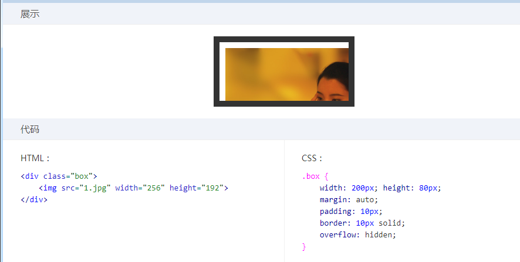

- 浏览器兼容问题：尽量避免滚动容器设置padding-bottom值，除了样式表现不一致，还会导致scrollHeight不一样。
    - chrome下，padding-bottom还在，底部留白<br/>
    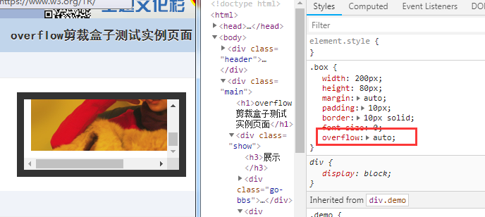
   
    - ie下，底部没留白<br/>
    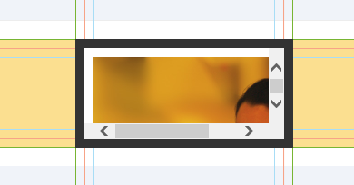   

## 4.2 overflow-x 和 overflow-y
除非overflow-x，overflow-y的属性值都是visible，否则visible会当成auto来解析。也就是不能实现一个方向溢出滚动，另一方向溢出显示的效果。

## 4.3 overflow与滚动条
- IE7下：html和textarea的样式表现像是设置了overflow:scroll，IE8起默认值为auto
    - 结论：1. PC端，默认滚动条来自html，而不是body。因此去除页面默认滚动条仅设置html{overflow:hidden}。但是对于手机端不一定适用。
- 获取窗体滚动高度
    - pc端：document.documentElement.scrollTop
    - 手机端：document.body.scrollTop
- 滚动条会占用可用宽度和高度，17px
- 滚动栏占据宽度的特性带来的问题是：页面加载的时候水平居中的布局可能会产生晃动。页面自上而下加载，从没有滚动条到出现滚动条可用宽度发生变化，水平居中重新计算，导致页面发生晃动。
- 滚动条的样式可用自定义，IE下自定义样式丑，-wekit-内核的的自定义滚动条效果还是 不错的。
- 如何让页面出现滚动条是不发生晃动？？[参考](https://www.zhangxinxu.com/wordpress/2015/01/css-page-scrollbar-toggle-center-no-jumping/)
```css
html {
    overflow-y: scroll;
}
:root {
    overflow-y: auto;
    overflow-x: hidden;
}
:root body {
    position: absolute;
}
body {
    width: 100vw;
    overflow: hidden;
}
```

## 4.4 依赖overflow的样式表现
...效果，text-overflow:ellipsis 的效果以来与overflow:hidden
```css
.omit-point{
    overflow: hidden;
    text-overflow:ellipsis;
    white-space: nowrap;
}
```


## 4.5 overflow和锚点定位
基于url地址的锚链：a[name]  / a[id]

- 锚点定位触发条件
1. URL地址中的锚链与锚点元素对应并有交互行为
2. focus的锚点元素出于focus状态，下面是foucs锚点定位的例子
    - 按下tab键，滚动条会自动滚动到下一个focus元素上	
    - 平常接触的锚点定位都是浏览器窗体滚动条级别的，这个例子看出锚点定位也可以发生在普通的容器中
    - 并且如果div.father在浏览器窗口外，则先发生该dom的锚点定位，而后会发生浏览器滚动条滚动，显示该容器元素（由内而外的

上面的两种定位方式是由区别：前者会让元素定位到浏览器窗体的上边缘，而后者近视让元素在窗口范围内显示，则不一定是在上边缘

- 锚点定位作用本质
1. 可以发生在普通元素上
2. 由内而外的（发生在普通元素和窗体同时滚动的时候，或者多个容器嵌套的情况
3. 如果容器的overflow为hidden也是可以滚动的（***），和overflow:auto/scroll的区别仅仅是是滚动条是否存在（没有滚动条但是如果发生锚点定位，内部元素仍然会滚动）
4. 锚点定位的本质：改变了scrollTop或scrollLeft <=> dom.scrollTop = 200
    - [实现选项卡](http://demo.cssworld.cn/6/4-2.php#three)（Url地址锚链实现）
    - 这种方式的缺点：1. 定高/定宽，2. Url的这种方式会导致窗体的重定位，如果页面可滚动则点击选项卡后，页面会发生跳动。但是focus定位只要容器在浏览器窗体中（应该是视窗）则不会发生页面的跳转  => 基于focus锚点定位实现选项卡切换
 
# 5. absolute
1. 特性：同float一样具有：包裹性，破坏性，自适应性，块状化 
2. 特点：
    - 当float和absolute同时存在的时候，float属性是无任何效果的；
    - flaot和absolute的自适应性的最大宽度的区别在于二者的包含快不一样，absolute默认的最大宽度是其包含快的宽度。

## 5.1 包含块
- 包含块的“种类”
1. “初始包含块”
2. 普通元素的（position:relative/static）包含块
3. 固定定位的包含块（position:fixed）
4. 绝对定位的包含块(position:absolute)由最近的position不为static的祖先元素建立：具体如下
    - 如果该祖先元素是纯inline元素，规则如下
        - 假设给内联元素前后各生成一个宽度为0的内联盒子(inline box),则这两个内联盒子的padding box外面的包围盒就是包含快
        - 如果该内联元素被跨行分割了，那么"包含块"是未定义的
    - 否则"包含块"由该祖先的padding box边界构成

- 绝对定位包含块与普通元素相比，有哪些区别？
1. 内联元素也可以作为"包含块"所在的元素（规范未定义跨行时该如何处理，会有兼容性问题
2. 父元素：最近的position不为static
3. 计算和定位是相对于祖先元素的padding-box 而不是 content-box，类似overflow剪裁的边界也是padding box
4. height:100% 与 height:inherit的区别？
    - 对于普通元素二者没有啥区别；但是对于绝对定位元素就不一样了：height:100%是相对于包含块元素的，但是inherit是单纯的父元素的高度继承。
5. white-space:nowrap让绝对定位元素的宽度表现从"包裹性"变为"最大可用宽度"。
    - 由父元素宽度的限制等因素导致子元素出现一柱擎天的情况，借用white-space处理

## 5.2 具有相对特性的无依赖absolute绝对定位
- absolute是非常独立的css属性值，其样式和行为表现不依赖其他任何css属性就可以完成

- 案例
    - 图标定位
    - 表单填写信息提示的布局：地址 (星号，提示信息均是)
    - 下拉列表的定位
        - 输入框高度发生变化，不需要去调整下拉列表进行对齐
        - 没有父元素的relative定位，z-index管理更简单
        - 无需担心父元素设置的overflow:hidden会剪裁下拉列表
        - 注：作者建议只使用在静态交互效果上如导航二级菜单的显示和定位，如果是动态呈现的列表，建议使用js动态计算和定位
    - 占位符效果模拟(placeHolder)
        - IE9及其以下的浏览器不支持
        - 通过label和input关联并覆盖在输入框上面，设置label为绝对定位，让lable和input使用同一套样式，由于"无依赖绝对定位"本质上就是不占据任何空间的相对定位元素,因为二者可以很好的重叠。

- 深入无依赖绝对定位
    - 虽说绝对定位后的display计算值都是块状的，但是其定位的位置和没有设置position:absolute时候的位置是相关联的（一致的）。
        - 理解：如当前的绝对定位元素是内联元素会和其前面的元素一行显示，那么使用了绝对定位之后仍然是一行显示并不会因为块状化而换行；又如当前元素是块状元素，本身就会换行占据一整行，那么绝对定位块状化后也还是这个位置。
    - 两个问题：1. IE7下，默认位置都会作为内联元素表现；2. 浮动和无依赖绝对定位相遇存在兼容性问题

## 5.3 absolute与text-align
注：只有原本是内联水平的元素绝对定位后可以受text-align影响

1. 解释案例现象 （幽灵空白节点，无依赖绝对定位）
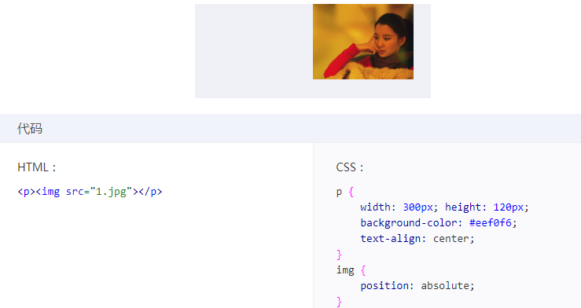

2. 该案例的兼容解决方案
3. 该案例的使用场景？？

# 6. absolute 与 overflow
1. overflow对absolute元素的剪裁规则：绝对定位元素不总是被父级overflow属性剪裁，尤其当overflow在绝对定位及其包含块之间的时候。
2. 简单点就是说：absolute包含块和absolute元素之间有overflow：hidden元素，则不剪裁。
3. 我的理解是：想限制absolute，得包含块v1有这个能力，如果包含快v1自身没有，那么包含快v1的包含块v2具有相应的能力，然后就会限制包含块1，从而会限制包含快1。

- 下面会剪裁
```html
<div style="relative,hidden">
    <div style="absolute"></div>
</div>
```

- 不剪裁，overflow在包含块和absolute之间
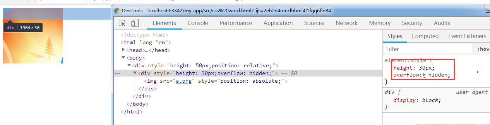

- 如果父元素overflow: auto , 即使absolute元素高度超过父元素，则父元素也不会出现滚动条，注意如果这里的父元素是相对定位元素就具有了限制绝对定位元素的能力，是会出现滚动条。
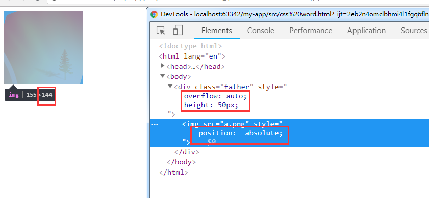

这些特性的应用：
1. 返回顶部案例，高度为0，并且定位内容不会被剪裁
2. 在局部容器中模拟position:fixed效果
 
规则发生变化：css3中的transform属性会影响overflow对absolute定位元素的剪裁规则
1. 不剪裁
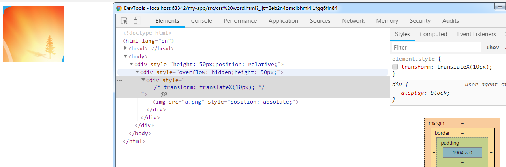

2. 仅仅是在overflow的子元素增加了transform属性，规则发生变化，剪裁绝对定位元素
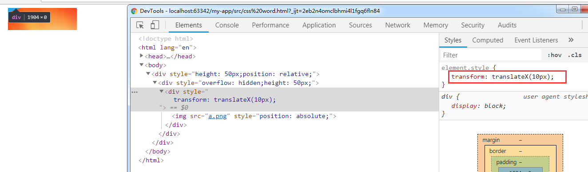
注：transform对层叠上下文和positionL:fixed的渲染都有影响

# 7. absolute 和 clip
1. clip属性起作用的前提：元素必须是绝对定位或者固定定位，即position:absolute/fixed
2. 语法：clip( top right bottom  left)

## 重新认识clip
- fiexd固定定位剪裁
- 可访问性隐藏
```css
.clip-hide{
position:absolute
clip(0 0 0 0)
}
```
- form表单input提交按钮，IE7下有黑框，很难所有浏览器ui完全一致
    - 使用label代替input
    - 优势：
        - display:none/visibility:hidden隐藏有两个问题，按钮无法被focus了，并且在IE8下提交行为丢失
        - 移动端透明度0是不错的实践。但是在桌面端，每一个场景都需要根据环境重新定位，成本高。
        - 屏幕外隐藏{position:absolute;left:-999px;top:-999px}，可能会存在页面跳动的问题

## 深入clip的渲染
1. clip仅仅决定那部分是可见的，非可见部分无法响应点击事件
2. 虽然视觉上隐藏，但是元素的尺寸依然是原本的尺寸（clientWidth clientHeight并没有发生变化），存在一个兼容性问题在IE/Firefox下浏览器抹掉了不可见区域尺寸对布局的影响。

# 8. absolute的流体特性
1. absolute + left/right/top/bottom
- 此时才变成真正的绝对定位元素，失去了原先的相对特性
- 如果只是设置了left/right + absolute，那么垂直方向仍然保持相对特性

2. absolute的流体特性
- 触发条件：只有对立方向同时发生定位的时候(left - right / top - bottom)
- 普通的块级元素的流体特性只是水平方向上的，但是absolute可以让元素在水平方向和垂直方向同时保持流动性
- 子元素height百分比值可以使用：通常情况下，height要想起作用，父元素必须要有heght属性，但是在这里，（原因）父元素在垂直方向上由于保持流体特性(格式化高度)，子元素的heigth也同样生效  => 这样 高度自适应，等高等比例布局都可以从容实现
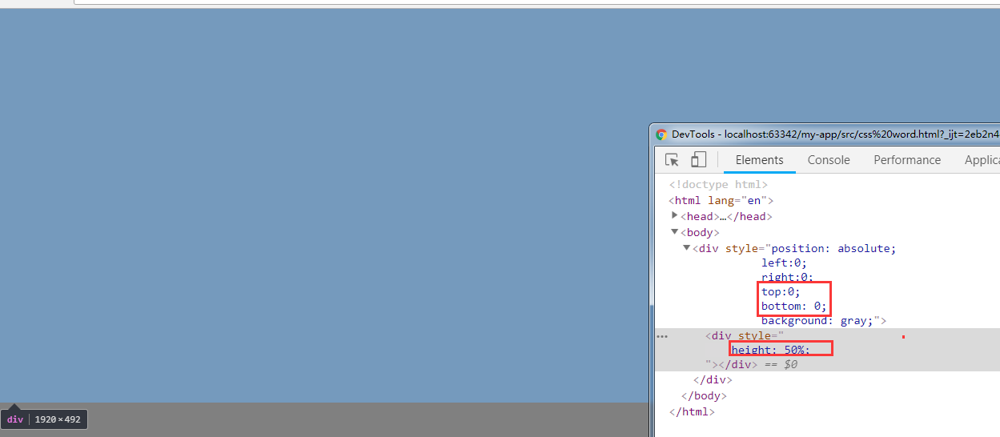

3. margin:auto + absolute 居中
当绝对定位元素出于流体状态时，各个盒模型相关属性的解析和普通流体元素是一样的，margin负值可以让元素尺寸更大，并且可以使用margin让绝对定位元素保持居中（绝对定位元素的尺寸是已知的）

# 9. relative
## relative对absolute的限制
## relative与定位
1. 相对自身，无侵入
2. margin移动元素和相对定位移动元素的区别？[demo](https://demo.cssworld.cn/6/6-1.php)
3. 相对定位的left/right/top/bottom的百分比值是相对于包含块计算的
4. top/bottom的百分比计算值和height的百分比计算值是一样的，都是相对高度计算的，如果包含块的高度是auto，那么计算值是0，偏移无效。

## relative最小化影响原则
1. 尽量不使用relative, 能否使用"无依赖的绝对定位"
2. relative最小化

一个普通元素变成相对定位元素，看上去没啥变化，其实其层叠顺序提高了；甚至在IE6.7下无需设置z-index直接创建了新的层叠上下文会导致一些绝对定位浮层怎么设置z-index都会被其他元素覆盖。见下面案例：
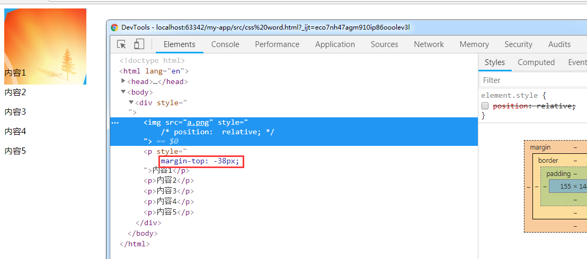
内容1被覆盖了，就是因为img标签变为了relative定位元素提高了层叠顺序
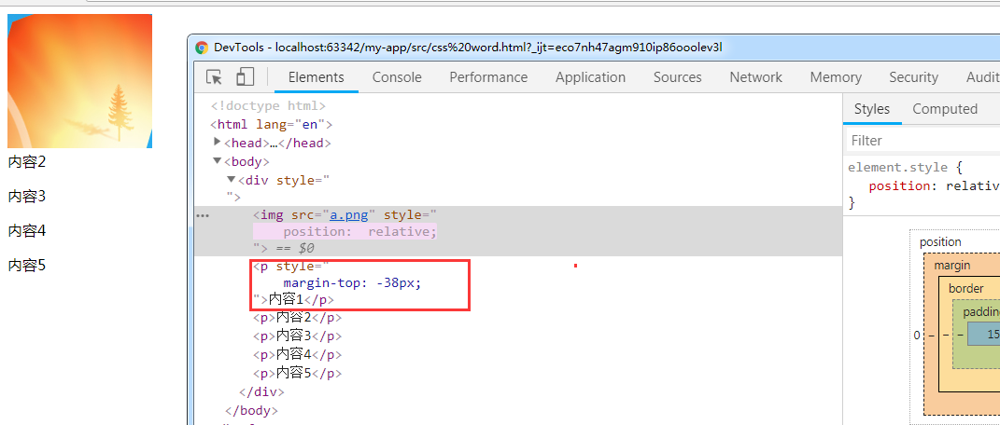

# 10. fixed固定定位 
##不一样的包含块
1. html元素
2. 和“无依赖的绝对定位类似的“无依赖的固定定位”，
3. absolute模拟fixed定位

## fixed背景锁定
这里的背景锁定是指弹出蒙层后，页面的滚动条不会发生滚动，被锁定住了一样。作者提供的思路：
    - 由于页面的滚动条来自html根元素，切换根元素的overflow属性，隐藏/显示滚动条
    - 但是切换的过程中会导致根元素可用宽度发生变化，可能会导致页面发生晃动；因此这里使用border填充小时的滚动条(宽度:17px)


