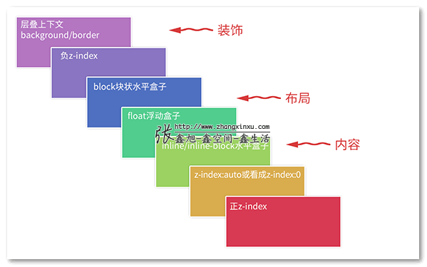
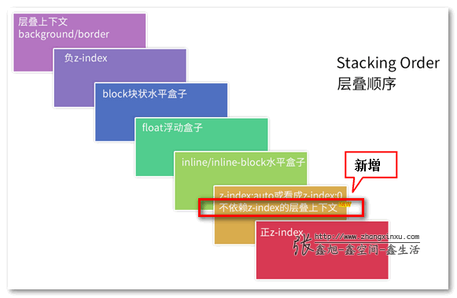

 
[参考](https://www.zhangxinxu.com/wordpress/2016/01/understand-css-stacking-context-order-z-index/)
1. z-index
    - css世界中，z-index只有和定位元素（position:static）在一起的时候才起作用
    - 在css3世界中，z-index并非只对定位元素有效，flex盒子的子元素也可以设置z-index值
2. 层叠上下文：层叠结界，z轴
3. 层叠水平：决定了同一个层叠上下文中元素在z轴上的显示顺序，所有的的元素都有层叠水平包括层叠上下文和普通元素。
    - 对普通元素的层叠水平只局限在当前层叠上下文元素中比较
    - 层叠水平和z-index不能混为一谈。某些情况下，z-index确实可以影响层叠水平，但是只限于定位元素和flex盒子的孩子元素。但是层叠水平所有的元素都存在

# 层叠顺序

补充说明：
1. 位于最低水平的border/background指的是层叠上下文元素的边框和背景色。每一个层叠顺序规则适用于一个完整的层叠上下文元素。
2. 原图没有呈现inline-block的层叠顺序，实际上，inline-block和inline水平元素是同等level级别。
3. z-index:0实际上和z-index:auto单纯从层叠水平上看，是可以看成是一样的。注意这里的措辞——“单纯从层叠水平上看”，实际上，两者在层叠上下文领域有着根本性的差异。

为什么内联元素的层叠顺序要比浮动元素和块状元素都高？

# 层叠准则
黄金准则：当元素发生层叠的时候，其覆盖关系遵循下面2个准则：
1. 谁大谁上：当具有明显的层叠水平标示的时候，如识别的z-index值，在同一个层叠上下文领域，层叠水平值大的那一个覆盖小的那一个。通俗讲就是官大的压死官小的。
2. 后来居上：当元素的层叠水平一致、层叠顺序相同的时候，在DOM流中处于后面的元素会覆盖前面的元素。
                                                                             
# 深入理解层叠上下文
## 层叠上下文元素特性
1. 层叠上下文的层叠水平要比普通元素高；
2. 层叠上下文可以阻断元素的混合模式 
3. 层叠上下文可以嵌套，内部层叠上下文及其所有子元素均受制于外部的层叠上下文。
4. 每个层叠上下文和兄弟元素独立，也就是当进行层叠变化或渲染的时候，只需要考虑后代元素。
5. 每个层叠上下文是自成体系的，当元素发生层叠的时候，整个元素被认为是在父层叠上下文的层叠顺序中。

## 层叠上下文的创建
- 根层叠上下文
- 定位元素与传统层叠上下文
    - 对于包含有position:relative/position:absolute的定位元素，以及FireFox/IE浏览器（不包括Chrome等webkit内核浏览器）（目前，也就是2016年初是这样）下含有position:fixed声明的定位元素，当其z-index值不是auto的时候，会创建层叠上下文。 
    
    注:
    - IE6/IE7浏览器有个bug，就是z-index:auto的定位元素也会创建层叠上下文。这就是为什么在过去，IE6/IE7的z-index会搞死人的原因。
    - position:fixed, 在过去，position:fixed和relative/absolute在层叠上下文这一块是一路货色，都是需要z-index为数值才行。但是，不知道什么时候起，Chrome等webkit内核浏览器，position:fixed元素天然层叠上下文元素，无需z-index为数值。目前，IE以及FireFox仍是老套路。

- css3时代的层叠上下文
>CSS3的出现除了带来了新属性，同时还对过去的很多规则发出了挑战。例如，CSS3 transform对overflow隐藏对position:fixed定位的影响等。对层叠上下文这一块的影响要更加广泛与显著。（详情见作者博客）
1. z-index值不为auto的flex项(父元素display:flex|inline-flex).
2. 元素的opacity值不是1.
3. 元素的transform值不是none.
4. 元素mix-blend-mode值不是normal.
5. 元素的filter值不是none.
6. 元素的isolation值是isolate.
7. will-change指定的属性值为上面任意一个。
8. 元素的-webkit-overflow-scrolling设为touch.

## 层叠上下文和层叠顺序
>一旦普通元素具有了层叠上下文，其层叠顺序就会变高。那它的层叠顺序究竟在哪个位置呢？

这里需要分两种情况讨论：
- 如果层叠上下文元素不依赖z-index数值，则其层叠顺序是z-index:auto可看成z:index:0级别；
- 如果层叠上下文元素依赖z-index数值，则其层叠顺序由z-index值决定。

为什么定位元素会层叠在普通元素的上面吗？
- 根本原因就在于，元素一旦成为定位元素，其z-index就会自动生效，此时其z-index就是默认的auto，也就是0级别，根据上面的层叠顺序表，就会覆盖inline或block或float元素。
- 而不支持z-index的层叠上下文元素天然z-index:auto级别，也就意味着，层叠上下文元素和定位元素是一个层叠顺序的，于是当他们发生层叠的时候，遵循的是“后来居上”准则。

z-index负值
- z=index负值元素实在层叠上下文元素上面，block元素下面，虽然z=index名为负数层级，但是依然无法突破当前层叠上下文的小世界
- z-index负值渲染的过程就是一个寻找第一个层叠上下文元素的过程，然后层叠顺序止步于这个层叠上下文元素

z-index负值的实际应用
- 可访问性隐藏：
    - 与clip相比的优势: 1. 元素无需绝对定位，设置相对定位也可以隐藏，2. 并且对于原来的布局以及元素的行为没有任何影响，而clip隐藏会导致控件focus的焦点发生细微变化
    - 不足之处：需要其他元素配合进行隐藏
- IE8下多背景模拟
    - CSS3中，background可以写多个背景图，IE8下不支持多背景特性，但是IE8支持伪元素，理论最多可以实现最多3个背景图。但是这个伪元素生成的背景图一定是使用绝对定位以免影响内容的布局。但是呢绝对定位元素会覆盖常规的元素，因此需要借助z-index负值进行隐藏。
- 定位在元素的后面：模拟纸张效果

z-index“不犯二”准则
- z-index没必要超过2，如果超过2，试试利用"relative的最小化原则"来优化。
- 该准则不包括那些在页面上飘来飘去的元素定位，弹框，出错提示，一些下拉效果等。这类js驱动的浮层组件，可以借助"层级计数器"管理

