<!-- START doctoc generated TOC please keep comment here to allow auto update -->
<!-- DON'T EDIT THIS SECTION, INSTEAD RE-RUN doctoc TO UPDATE -->
**Table of Contents**  *generated with [DocToc](https://github.com/thlorenz/doctoc)*

- [1 案例代码](#1-%E6%A1%88%E4%BE%8B%E4%BB%A3%E7%A0%81)
- [2 路由流程](#2-%E8%B7%AF%E7%94%B1%E6%B5%81%E7%A8%8B)
  - [2.1 应用程序入口](#21-%E5%BA%94%E7%94%A8%E7%A8%8B%E5%BA%8F%E5%85%A5%E5%8F%A3)
  - [2.2 路由的初始化（shell.js）](#22-%E8%B7%AF%E7%94%B1%E7%9A%84%E5%88%9D%E5%A7%8B%E5%8C%96shelljs)
    - [2.2.1 路由配置及路由处理器准备](#221-%E8%B7%AF%E7%94%B1%E9%85%8D%E7%BD%AE%E5%8F%8A%E8%B7%AF%E7%94%B1%E5%A4%84%E7%90%86%E5%99%A8%E5%87%86%E5%A4%87)
    - [2.2.2 激活相关工作(router/histroy)](#222-%E6%BF%80%E6%B4%BB%E7%9B%B8%E5%85%B3%E5%B7%A5%E4%BD%9Crouterhistroy)
      - [1. router.activate调用栈](#1-routeractivate%E8%B0%83%E7%94%A8%E6%A0%88)
      - [2. router.activate](#2-routeractivate)
      - [3. history.activate](#3-historyactivate)
      - [4. router.loadUrl](#4-routerloadurl)
        - [路由处理器有两种类型：404、非404](#%E8%B7%AF%E7%94%B1%E5%A4%84%E7%90%86%E5%99%A8%E6%9C%89%E4%B8%A4%E7%A7%8D%E7%B1%BB%E5%9E%8B404%E9%9D%9E404)
        - [路由处理器的作用](#%E8%B7%AF%E7%94%B1%E5%A4%84%E7%90%86%E5%99%A8%E7%9A%84%E4%BD%9C%E7%94%A8)
      - [5. dequeueInstruction（异步）](#5-dequeueinstruction%E5%BC%82%E6%AD%A5)
      - [6. ensureActivation](#6-ensureactivation)
      - [7. activateRoute](#7-activateroute)
  - [2.3 路由页面渲染的时机](#23-%E8%B7%AF%E7%94%B1%E9%A1%B5%E9%9D%A2%E6%B8%B2%E6%9F%93%E7%9A%84%E6%97%B6%E6%9C%BA)
    - [2.3.1 computedObservable对象：router.activeItem](#231-computedobservable%E5%AF%B9%E8%B1%A1routeractiveitem)
    - [2.3.2 路由页面渲染（异步）](#232-%E8%B7%AF%E7%94%B1%E9%A1%B5%E9%9D%A2%E6%B8%B2%E6%9F%93%E5%BC%82%E6%AD%A5)
- [3 路由切换流程](#3-%E8%B7%AF%E7%94%B1%E5%88%87%E6%8D%A2%E6%B5%81%E7%A8%8B)
- [4 嵌套路由(子路由)处理](#4-%E5%B5%8C%E5%A5%97%E8%B7%AF%E7%94%B1%E5%AD%90%E8%B7%AF%E7%94%B1%E5%A4%84%E7%90%86)
  - [4.1 递归加载](#41-%E9%80%92%E5%BD%92%E5%8A%A0%E8%BD%BD)
  - [4.2 路径处理](#42-%E8%B7%AF%E5%BE%84%E5%A4%84%E7%90%86)
  - [4.3 嵌套路由的绑定](#43-%E5%B5%8C%E5%A5%97%E8%B7%AF%E7%94%B1%E7%9A%84%E7%BB%91%E5%AE%9A)
    - [4.3.2 ko.bindingHandlers.router.update参数中的valueAccessor是什么鬼？](#432-kobindinghandlersrouterupdate%E5%8F%82%E6%95%B0%E4%B8%AD%E7%9A%84valueaccessor%E6%98%AF%E4%BB%80%E4%B9%88%E9%AC%BC)
- [5 动态路由](#5-%E5%8A%A8%E6%80%81%E8%B7%AF%E7%94%B1)
  - [5.1 动态路由的routerPattern](#51-%E5%8A%A8%E6%80%81%E8%B7%AF%E7%94%B1%E7%9A%84routerpattern)
  - [5.2 路径匹配](#52-%E8%B7%AF%E5%BE%84%E5%8C%B9%E9%85%8D)
- [6 补充](#6-%E8%A1%A5%E5%85%85)
  - [6.1 rootRouter.install的执行](#61-rootrouterinstall%E7%9A%84%E6%89%A7%E8%A1%8C)
  - [6.2 mapUnknownRoutes](#62-mapunknownroutes)
  - [6.3 创建多级路由](#63-%E5%88%9B%E5%BB%BA%E5%A4%9A%E7%BA%A7%E8%B7%AF%E7%94%B1)
  - [6.4 控制台打印日志看路由流程](#64-%E6%8E%A7%E5%88%B6%E5%8F%B0%E6%89%93%E5%8D%B0%E6%97%A5%E5%BF%97%E7%9C%8B%E8%B7%AF%E7%94%B1%E6%B5%81%E7%A8%8B)
    - [6.4.1 初始化只有根路由的页面](#641-%E5%88%9D%E5%A7%8B%E5%8C%96%E5%8F%AA%E6%9C%89%E6%A0%B9%E8%B7%AF%E7%94%B1%E7%9A%84%E9%A1%B5%E9%9D%A2)
    - [6.4.2 点击导航切换流程（6.4.1 -> 6.4.3）](#642-%E7%82%B9%E5%87%BB%E5%AF%BC%E8%88%AA%E5%88%87%E6%8D%A2%E6%B5%81%E7%A8%8B641---643)
    - [6.4.3 初始化页面就包含嵌套路由的情况](#643-%E5%88%9D%E5%A7%8B%E5%8C%96%E9%A1%B5%E9%9D%A2%E5%B0%B1%E5%8C%85%E5%90%AB%E5%B5%8C%E5%A5%97%E8%B7%AF%E7%94%B1%E7%9A%84%E6%83%85%E5%86%B5)
  - [6.5 哈希路由](#65-%E5%93%88%E5%B8%8C%E8%B7%AF%E7%94%B1)

<!-- END doctoc generated TOC please keep comment here to allow auto update -->
# 1 案例代码
1. 在官方案例的基础上进行了部分代码的调整：[durandal-source](https://github.com/yusongjohn/durandal-source)
2. 部分代码调整：屏蔽过度动画选项（transition）以减少代码追踪难度（异步的过程），包括嵌套路由和动态路由的相关页面都需要处理<br/>

app/shell.html
```javascript
<div class="page-host" data-bind="router: { transition:'entrance', cacheViews:false }"></div>
//改为
<div class="page-host" data-bind="router"></div>
```
    
app/ko/index.html<br/>

```javascript
<!--ko router: { transition:'entrance', cacheViews:true }--><!--/ko-->
//改为
<!--ko router--><!--/ko-->
```
 
# 2 路由流程
## 2.1 应用程序入口

```javascript
//main.js
app.setRoot('app/shell');
```


1. setRoot的过程见：durandal-生命周期
2. shell‘组件’：是整个案例应用的入口，并且包含了一个根路由
3. shell'组件'中有一个生命周期回调-activate()，该回调中进行了路由的初始化工作（路由配置，初始路由页面的绑定等）

```javascript
//shell.js
activate: function () {
    var rootRooter = router.map([//...]).buildNavigationModel().mapUnknownRoutes('hello/index', 'not-found');
    return rootRooter.activate();
}
```

## 2.2 路由的初始化（shell.js）
1. 生成路由配置，路由匹配的工作一定都是基于这些配置进行的，如router.loadUrl()中需要根据当前页面的url去匹配出相应的路由页面，那么匹配的规则就是基于这里的路由配置；
2. 监听hashChange事件，durandal的路由是哈希路由的形式，因此这里通过监听hashChange事件作为路由工作的入口；
3. 首次路由页面的准备都是在这个阶段进行的
### 2.2.1 路由配置及路由处理器准备 
```javascript
var rootRooter = router.map.buildNavigationModel().mapUnknownRoutes('hello/index', 'not-found');
```

1. router.map：生成路由配置（router.routes、router.handlers)<br/>
>router.map 调 router.mapRoute 调 configureRoute

```javascript
function configureRoute(config){
    //...
    router.routes.push(config);
    router.route(config.routePattern, function(fragment, queryString) { 
        var paramInfo = createParams(config.routePattern, fragment, queryString);
        queueInstruction({
            fragment: fragment,
            queryString:queryString,
            config: config,
            params: paramInfo.params,
            queryParams:paramInfo.queryParams
        });
    });
    //...
}
```


router.route：配置路由处理器（关键）

```javascript
router.route = function(routePattern, callback) { // callback：即路由处理器，匹配到合适的路由时会被调用
    router.handlers.push({ routePattern: routePattern, callback: callback });
};
```

2. router.buildNavigationModel<br/>
>Builds an observable array designed to bind a navigation UI to. The model will exist in the `navigationModel` property.
- 对于路由的生效是无关紧要的，主要是用来构建界面导航的

3. router.navigationModel(nav);<br/>
router.mapUnknownRoutes：404路由配置

### 2.2.2 激活相关工作(router/histroy)

```javascript
rootRooter.activate(); // 路由激活入口
```

#### 1. router.activate调用栈

```javascript
1. router.activate 
2. history.activate
3. history.loadUrl
4. router.loadUrl（关键：匹配合适的路由处理器（router.handlers[i]），其实也就确定了待路由的页面）
5. 路由处理器调用 dequeueInstruction 
6. dequeueInstruction中通过requirejs加载待路由页面的[model].js （得确定该路由页面是存在的，才进行后面的路由页面的绑定）
    1. 成功：ensureActivation -> 激活（关键在于computedObservable：router.activeItem，见2.3.1） 
    2. 失败：cancelNavigation
```


#### 2. router.activate
>Activates the router and the underlying history tracking mechanism. 
```javascript
//router.js
rootRouter.activate = function(options) {
    return system.defer(function(dfd) {
        startDeferred = dfd;
        rootRouter.options = system.extend({ routeHandler: rootRouter.loadUrl }, rootRouter.options, options);
        //...
        history.activate(rootRouter.options); 
        //...
    })
}
``` 

#### 3. history.activate
1. 监听hashChange事件
2. 初始路由准备的入口

```javascript
//history.js
history.activate = function(options) {
    //...
    var fragment = history.getFragment(); 
    history.root = ('/' + history.root + '/').replace(rootStripper, '/');
    $(window).on('hashchange', history.checkUrl); // 监听hashChange事件
    history.fragment = fragment;
    
    // $& 是匹配到的字符串，匹配不以反斜杠为结尾，则在匹配的目标位置加一个 ‘/’
    var atRoot = loc.pathname.replace(/[^\/]$/, '$&/') === history.root; 
    return history.loadUrl(options.startRoute); // 这里开始为根路由（首次路由）做准备
    //...
}
```

```javascript
//history.js
history.loadUrl = function(fragmentOverride) {
    var fragment = history.fragment = history.getFragment(fragmentOverride);
    
    return history.options.routeHandler ? //关键：routeHandler：router.loadUrl
        history.options.routeHandler(fragment) :
        false;
};
```


#### 4. router.loadUrl
>通过url找到相应的路由处理器，之后路由处理器激活其对应的页面

```javascript
//router.js
router.loadUrl = function(fragment) {
    var handlers = router.handlers, // router.map的目的之一就是添加 handler
        queryString = null,
        coreFragment = fragment,
        queryIndex = fragment.indexOf('?');
    
    if (queryIndex != -1) {
        coreFragment = fragment.substring(0, queryIndex);
        queryString = fragment.substr(queryIndex + 1);
    }
    
    coreFragment = coreFragment.replace(trailingSlash, '');

    // 子路由的路径处理
    if (router.relativeToParentRouter) {
        //...
    }
    
    //匹配合适的路由模式，使用对应的路由处理器进行处理
    for (var i = 0; i < handlers.length; i++) {
        var current = handlers[i];
        if (current.routePattern.test(coreFragment)) {
            current.callback(coreFragment, queryString); // 调用路由处理器
            return true;
        }
    }
}
```

##### 路由处理器有两种类型：404、非404
1. 404：通过router.mapUnknownRoutes也会生成相应的路由处理器，在补充部分介绍（mapUnknownRoutes） 
2. 非404： 通过router.map生成的路由处理器是下面代码

```javascript
//router.js
function(fragment, queryString) {
    var paramInfo = createParams(config.routePattern, fragment, queryString);
    queueInstruction({
        fragment: fragment,
        queryString:queryString,
        config: config,
        params: paramInfo.params,
        queryParams:paramInfo.queryParams
    });
}
```


##### 路由处理器的作用
1. 处理相关的参数，以下两类参数会被匹配出来作为 paramInfo<br/>
    1. url参数（如url：...?name=yusong&age=29，后面参数则会被提取出来
    2. 动态路由相关的匹配参数
> 如：route：keyed-master-details/:id*detailsurl：#keyed-master-details/1/first则url中的 1 会被作为参数筛选出来，对于动态路由这是关键信息

2. 尝试激活路由页面，入口在：queueInstruction

queueInstruction

```javascript
//router.js
function queueInstruction(instruction) {
    queue.unshift(instruction);
    dequeueInstruction();
}
```

#### 5. dequeueInstruction（异步）
> 之所以异步：是因为system.acquire().then(success)的成功回调函数的调用是放在setTimeout中的

获取路由页面的model.js<br/>
    1. 成功：ensureActivation：尝试激活路由页面（router.activeItem:computedObservable，见2.3.1）<br/>
    2. 失败：cancelNavigation：取消此次路由切换

```javascript
//router.js
function dequeueInstruction() {
    //...
    system.acquire(instruction.config.moduleId).then(function(m) { // 获取路由页面的[model].js
        var instance = system.resolveObject(m);
    
        if(instruction.config.viewUrl) {
            instance.viewUrl = instruction.config.viewUrl;
        }
    
        ensureActivation(activeItem, instance, instruction);
    }).fail(function(err) {
        cancelNavigation(null, instruction);
        system.error('Failed to load routed module (' + instruction.config.moduleId + '). Details: ' + err.message, err);
    });
    //...
}
```


#### 6. ensureActivation

```javascript
//router.js
 function dequeueInstruction() {     
     activateRoute(activator, instance, instruction); // 激活路由
}
```


#### 7. activateRoute
1. 异步获取路由页面的model.js成功后，标志着该路由页面存在，接着判断是否可以更新路由（逻辑在activator.activateItem方法中），如果可以，则进入成功回调
2. activator.activateItem()方法的调用栈中绑定(更新)了 computedObservable:router.activeItem 的数据 

```javascript
//router.js
function activateRoute(activator, instance, instruction) {
    //...
    activator.activateItem(instance, instruction.params, options).then(function(succeeded) { // 成功回调
        //...
        if (succeeded) {
            //...
            completeNavigation(instance, instruction, mode);
            //...
            if (startDeferred) { // 关键步骤
                startDeferred.resolve(); // 这里标志着【生命周期-activate回调】的结束，继续 shell'组件'的绑定工作,回到composition.js tryActivate()
                startDeferred = null;
            }
        }    
        //...
    }).fail(function (err) {
        system.error(err);
    })
     //...
}
```

- startDeferred 就是rootRouter.activate返回给shell.js的activate生命周期回调的promise对象的‘原件’

```javascript
rootRouter.activate = function (options) { 
    return system.defer(function (dfd) {
        startDeferred = dfd;
        //...
     }).promise() // 这里返回的promise副本的含义，是不希望外部回调改变状态
}
```

- startDeferred.resolve()：标志着shell.js的 activate生命周期 的结束，继续进行页面的绑定（进入successCallback）<br/>
下面代码是调用 activate生命周期回调 执行的入口，result.then说明了一切

```javascript
// composition.js
function tryActivate(context, successCallback, skipActivation, element) {
    //...
    if (system.isArray(context.activationData)) {
        result = context.model.activate.apply(context.model, context.activationData);
    } else {
        result = context.model.activate(context.activationData);
    } 
    if (result && result.then) { // 这里的result就是startDeferred的promise副本（见rootRouter.activate()返回值）
        result.then(successCallback, function (reason) { // startDeferred.resolve()，就会走这里的成功回调
            onError(context, reason, element);
            successCallback();
        });
    } 
    //...
}
```


## 2.3 路由页面渲染的时机
上面说到router.js activateRoute中，执行了startDeferred.resolve() 操作后，继续进行shell组件的绑定(使用ko进行绑定的)
，当knockout绑定过程中遇到下面dom时，则会执行ko.bindingHandlers.router.update，在update方法中会去调用composition.compose方法渲染路由页面（异步）


```html
<div class="page-host" data-bind="router"></div>
``` 


```javascript
rootRouter.install = function(){
    ko.bindingHandlers.router = {
        init: function() {
            return { controlsDescendantBindings: true };  // 不对子节点进行绑定，详见ko源码分析
        },
        update: function(element, valueAccessor, allBindingsAccessor, viewModel, bindingContext) {
            var settings = ko.utils.unwrapObservable(valueAccessor()) || {};
            //...
            var theRouter = ko.utils.unwrapObservable(settings.router || viewModel.router) || rootRouter;
            //...
            composition.compose(element, settings, bindingContext); // 异步，具体过程参考durandal-生命周期
        }
    };
 
    ko.virtualElements.allowedBindings.router = true;  //支持注释写法
};
```


### 2.3.1 computedObservable对象：router.activeItem
>这意在说明 router.activeItem 的本质及其作用

- router.activeItem属性的实际引用是在activator.js中创建的computed对象

```javascript
//router.js
var createRouter = function (name) {
    var activeItem = activator.create();
    var router = {
        //...   
        activeItem: activeItem,
        //...
    } 
}

//activator.js
function createActivator(initialActiveItem, settings) {
    var activeItem = ko.observable(null);
    var computed = ko.computed({
               read: function () {
                   return activeItem();
               },
               write: function (newValue) {
                   computed.viaSetter = true;
                   computed.activateItem(newValue);
               }
           });
    //...
    return computed
}
```

- router.activeItem作为computedObservable对象意义非凡 
1. 在 ko.bindingHandlers.router.update 执行了 theRouter.activeItem() ，这会使得 ko.bindingHandlers.router.update 向  theRouter.activeItem添加[订阅]
2. 当theRouter.activeItem数据变化时，则会触发  ko.bindingHandlers.router.update 执行
3. 该computedObservable写入的过程发生在 router.js-activateRoute()的调用栈中，最终在activator.js-activate() 方法中进行数据更新(最新的路由配置)


```javascript
// activator.js
function activate(newItem, activeItem, callback, activationData) {
    //...
    activeItem(newItem);
    //...
}
```


### 2.3.2 路由页面渲染（异步）
1. 页面加载的具体过程：composition.compose（setRoot最终就是调用该方法实现组件绑定的，见durandal-生命周期），这个过程是异步的
2. composition.compose调用时model.js已经准备好了，但是视图(view)可能没有准备好，因此首先需要通过system.acquire()获取视图页面(.html)
3. system.acquire为了保证代码运行的一致性，将回调放在了setTimeout中（es6中的promise的polyfill多是基于setTimeout来模拟异步）


```javascript
//system.js
acquire: function() {
    //...
    return this.defer(function(dfd) {
        require(modules, function() {yiding
            var args = arguments; 
            // 关键：总是异步,及时require缓存了资源，因此会同步获取到资源，但是为了保持【代码运行的一致性】，使用setTimeout模拟异步
            setTimeout(function() {  
                if(args.length > 1 || arrayRequest){
                    dfd.resolve(slice.call(args, 0));
                }else{
                    dfd.resolve(args[0]);
                }
            }, 1);
        }, function(err){
            dfd.reject(err);
        });
    }).promise();
    //...
}
```


 
# 3 路由切换流程
1. 上面的过程是页面初始化时（第一次进入页面）的过程
2. 那么点击导航栏切换路由页面的过程是怎样的呢？
    1. 点击a标签触发会hashChange事件(history.checkUrl) -> history.loadUrl -> router.loadUrl -> ...（后面的流程和页面初始化的流程几乎一致）
    2. 当在：activator.js 更新了 router.activeItem(newItem) 之后
    3. 触发 ko.bindingHandlers.router.update 执行，则达成更新路由页面的目的 
```javascript
//histroy.js
$(window).on('hashchange', history.checkUrl);
```  

# 4 嵌套路由(子路由)处理
app\ko\index.js 创建了子路由（因为是直接使用router.js返回的router对象创建的，所以其父路由就是根路由）
```javascript
define(['plugins/router', 'knockout'], function(router, ko) { // 这里的 router 就是根路由
    var childRouter = router.createChildRouter()
        .makeRelative({
            moduleId:'ko',
            fromParent:true
        }).map([...]).buildNavigationModel();

    return {
        router: childRouter, //关键，必须返回，这一层级路由的‘管理者’
        //...
    };
});
```

1. router.createChildRouter() ：使用父路由（不一定是根路由）创建子路由 
 >每个路由都拥有创建子路由的方法，谁创建子路由，谁就是子路由的parent，也是hasChildRouter判断的重要依据，也是在补充部分创建多级路由的依据
 
 
 
 
```javascript
var createRouter = function (name) {
    var router = {};
    router.createChildRouter = function (name) {
        var childRouter = createRouter(name);
        childRouter.parent = router;
        return childRouter;
    };
    return router;
};
```


2. router.makeRelative，设置相关属性如relativeToParentRouter，事件监听等
3. router.map：生成路由处理器并存储在当前的childRouter对象中（不会交由根路由管理），每一级别的路由都是各自为政，因此后面子路由的路由处理器的匹配也是在childRouter对象中进行的

## 4.1 递归加载
为什么是递归的？
1. activateRoute 是在router.loadUrl 调用栈中的
2. activateRoute 方法中，在拥有子路由的情况下，会去调用instance.router.loadUrl 


```javascript
//router.js activateRoute()
activator.activateItem(instance, instruction.params, options).then(function(succeeded) {
    //...
    var withChild = hasChildRouter(instance, router);
    //...
    if (withChild) {// 拥有子路由
        instance.router.trigger('router:route:before-child-routes', instance, instruction, router);
    
        var fullFragment = instruction.fragment;
        if (instruction.queryString) {
            fullFragment += "?" + instruction.queryString;
        }
    
        instance.router.loadUrl(fullFragment); // 如果是子路由时，则加载子路由
    }
    //...
}


function hasChildRouter(instance, parentRouter) {
    return instance.router && instance.router.parent == parentRouter;
}
```


## 4.2 路径处理
>嵌套路由的路径处理是基于父路由的，首先通过父路由的routerPattern匹配出子路由的路径,然后再将父路由匹配的结果交给子路由处理
1. 对于ko/index.js的父路由是根路由，其配置在shell.js
嵌套路由在父路由中的配置


```javascript
{route: 'knockout-samples*details', moduleId: 'ko/index', title: 'Knockout Samples', nav: true},
```


3. 会生成如下（正则）路由模式：routerPattern属性<br/>
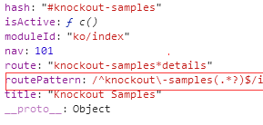
4. 上面看到routerPattern使用小括号的方式用来获取子路由信息，当前路径为：#knockout-samples/betterList，得到子路由的路径为：betterList<br/>
    这个匹配的过程在父路由的路由处理器中进行的，并将结果保存在params中
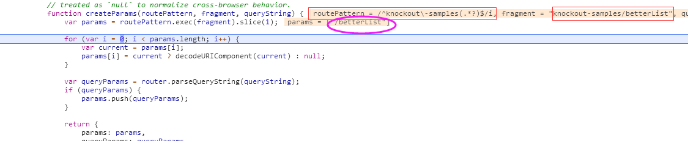
5. 子路由即ko/index.js的router对象（childRouter）会拿着父路由的匹配结果（如上例：'betterList'）进行子路由的绑定渲染工作
    router.loadUrl处理子路由url的相关代码
    
    
    
    
```javascript
router.loadUrl = function(fragment) {
    //...
    if(router.relativeToParentRouter){ // 规范子路由的形式（反斜杠的处理）
        var instruction = this.parent.activeInstruction();//获取父路由的配置（获取params）
        coreFragment = queryIndex == -1 ? instruction.params.join('/') : instruction.params.slice(0, -1).join('/');
    
        if(coreFragment && coreFragment.charAt(0) == '/'){
            coreFragment = coreFragment.substr(1);
        }
    
        if(!coreFragment){
            coreFragment = '';
        }
    
        coreFragment = coreFragment.replace('//', '/').replace('//', '/');
    }
    //...
}
```


## 4.3 嵌套路由的绑定
> 这里意在说明页面中的路由dom和哪个router实例的activeItem属性关联的
### 4.3.1 ko.bindingHandlers.router.update对谁添加订阅？
1. 首先可以可定的是，向router.activeItem添加订阅，但是真正的问题在于这里的router是哪个组件创造出来的路由实例呢？？？
2. 既然代码走到ko.bindingHandlers.router.update说明在你使用的组件页面中包含路由dom，即你这个组件具备路由功能，那么update函数中的theRouter默认是指向你组件[model].js返回的router指向的路由。
    1. 对于 shell.js 来说，就是根路由
    2. 对于 ko/index.js 就是 返回的childRouter
    3. 对于 keyedMasterDetail/master.html 就是返回的 childRouter


```javascript
ko.bindingHandlers.router = {
    init:fn,
    update:function(element, valueAccessor, allBindingsAccessor, viewModel, bindingContext){
        var settings = ko.utils.unwrapObservable(valueAccessor()) || {}; //4.3.2
         //...
        var theRouter = ko.utils.unwrapObservable(settings.router || viewModel.router) || rootRouter; // viewModel就是拥有路由的‘组件’：如shell.js、ko/index.js
        settings.model = theRouter.activeItem(); //添加订阅，订阅的过程在ko中
        //...
    }
}
```


### 4.3.2 ko.bindingHandlers.router.update参数中的valueAccessor是什么鬼？
首先这是ko使用 new Function() + with 生成的函数,生成的依据就是你的data-bind后面的内容
如果是下面形式，那么 valueAccessor()返回 undefined


```javascript
<div class="page-host" data-bind="router"></div>
```


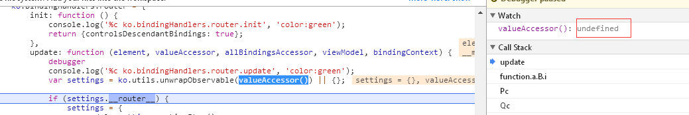

valueAccessor主要是针对下面形式，然后你会发现valueAccessor()的返回值就是定义时的值（其实，这种形式的作用是为了拿到当前绑定上下文[bindingContext]的最新数据，详情参考ko源码）


```javascript
<div class="page-host" data-bind="router: { transition:'entrance', cacheViews:false }"></div>
```


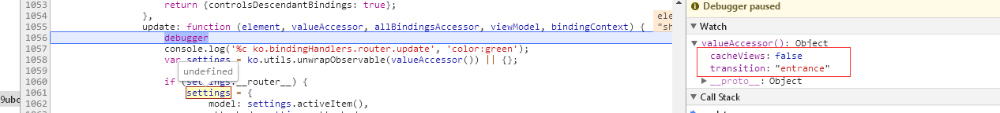

# 5 动态路由
> 动态路由可以看成是嵌套路由的特例，只是增加了在url中获取[参数]的能力

app\keyedMasterDetail\master.js是了一个动态路由页面


```javascript
var childRouter = router
    .createChildRouter()
    .makeRelative({moduleId: 'keyedMasterDetail', fromParent: true, dynamicHash: ':id'})// 关键信息：dynamicHash，fromParent
    .map([
        {route: ['first', ''], moduleId: 'first', title: 'First', nav: true, hash: '#first'},
        {route: 'second', moduleId: 'second', title: 'Second', nav: true},
        {route: 'third', moduleId: 'third', title: 'Third', nav: true}
    ]).buildNavigationModel();
```


- router.makeRelative 对动态路由的特有处理


```javascript
router.makeRelative = function(settings){
    //...
    if (settings.dynamicHash) {
        router.on('router:route:after-config').then(function (config) {
            config.routePattern = routeStringToRegExp(config.route ? settings.dynamicHash + '/' + config.route : settings.dynamicHash);
            config.dynamicHash = config.dynamicHash || ko.observable(config.hash);
        });
    
       //...
    }
    //...
}
```


'router:route:after-config'事件：用来生成动态路由特有的正则路由模式（routerPattern） ，是在配置路由时触发的


```javascript
function configureRoute(config) {
    //...
    router.trigger('router:route:after-config', config, router); // 触发事件
    router.routes.push(config);

    router.route(config.routePattern, function (fragment, queryString) {
        var paramInfo = createParams(config.routePattern, fragment, queryString);
        queueInstruction({
            fragment: fragment,
            queryString: queryString,
            config: config,
            params: paramInfo.params,
            queryParams: paramInfo.queryParams
        });
    }); 
}
```


 
## 5.1 动态路由的routerPattern
- 动态路由的routerPattern的生成区别于嵌套路由，需要单独处理生成正确的routerPatter，这里通过事件监听的方式来处理
```javascript
router.makeRelative({moduleId: 'keyedMasterDetail', fromParent: true, dynamicHash: ':id'})
``` 


- router配置项生成


```
router.map() ->mapRouter -> configurateRouter -> 触发 "router:route:after-config" 事件
```
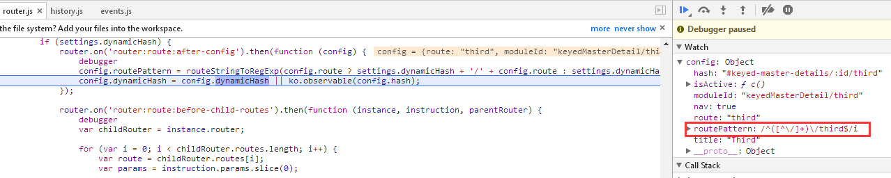
- 以动态路由中其中一个为例


```javascript
{route: 'third', moduleId: 'third', title: 'Third', nav: true}
```

生成的routerPattern如下：第一个小括号就是用来获取[动态]数据的


```javascript
routerPatter：/^([^\/]+)\/third$/i
```


## 5.2 路径匹配
>动态路由的处理和嵌套路由的情况基本一致，区别在于基于父路由的匹配结果（动态路由需要将对应的[动态数据]匹配出来）

动态路由在父路由中的配置


```javascript
//shell.js
{
    route: 'keyed-master-details/:id*details',
    moduleId: 'keyedMasterDetail/master',
    title: 'Keyed Master Detail',
    hash: '#keyed-master-details/:id'
}
```


- 生成的routerPattern
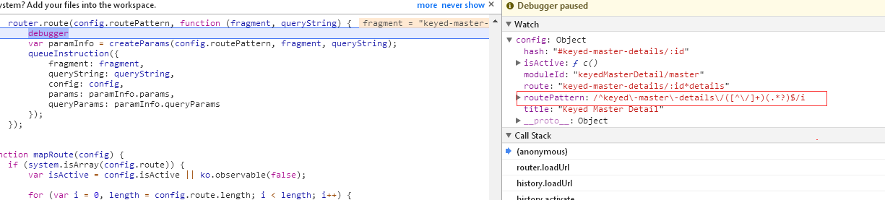
- routerPattern的两个小括号
    1. 第一个小括号是用来提取[动态]信息的，也是动态路由的本质（相同的页面，但是[参数]不同）
    2. 第二个小括号用来获取动态路由页面的[路径]，是匹配出动态路由的路由处理器的重要依（5.1生成的routerPattern

# 6 补充
## 6.1 rootRouter.install的执行
> ko.bindingHandlers.router 是包裹在rootRouter.install方法中，在router.js中并未执行该方法

app.configurePlugins：配置组件，缓存到变量allPluginIds ， allPluginConfigs中


```javascript
//main.js
app.configurePlugins({
    router: true, // 支持路由功能的关键
    dialog: true,
    widget: {
        kinds: ['expander']
    }
});
```


app.start：加载配置的插件，其实就包含了上述配置的路由功能


```javascript
//main.js
app.start().then(function () {
    viewLocator.useConvention();
    app.setRoot('shell');
});


//app.js
start: function() {
    //...
    return system.defer(function (dfd) {
        $(function() {
            loadPlugins().then(function(){
                dfd.resolve(); 
            });
        });
    }).promise();
},


function loadPlugins(){
    return system.defer(function(dfd){
        //...
        system.acquire(allPluginIds).then(function(loaded){
            for(var i = 0; i < loaded.length; i++){
                var currentModule = loaded[i];
                currentModule.install(config); // 此时则会调用 rootRouter.install 从而 使得系统具备路由功能
                //...
            }
            dfd.resolve();
        }).fail(function(err){
            //...
        });
    }).promise();
}
```


## 6.2 mapUnknownRoutes
>这里其实没太多可说的，和普通的路由配置没啥区别，只是作为一种别无选择的选择而已

router.mapUnknownRoutes：配置404情况下的路由和路由处理器
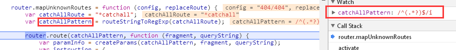
看到该routerPatten可以匹配所有


```javascript
router.mapUnknownRoutes = function (config, replaceRoute) {
    var catchAllRoute = "*catchall"; // 关键：匹配所有
    var catchAllPattern = routeStringToRegExp(catchAllRoute);

    router.route(catchAllPattern, function (fragment, queryString) {
        var paramInfo = createParams(catchAllPattern, fragment, queryString);
        var instruction = {
            fragment: fragment,
            queryString: queryString,
            config: {
                route: catchAllRoute,
                routePattern: catchAllPattern
            },
            params: paramInfo.params,
            queryParams: paramInfo.queryParams
        };
        //...
        queueInstruction(instruction);
    });

    return router;
};
```


router.loadUrl中我们看到通过遍历路由处理器去匹配路由；mapUnknownRoutes是在配置完正常路由之后再进行调用的，这样做就会使得
404路由配置作为最后一个选项去匹配


```javascript
router.loadUrl = function (fragment) {
    var handlers = router.handlers,
    //...
    for (var i = 0; i < handlers.length; i++) {
        var current = handlers[i];
        if (current.routePattern.test(coreFragment)) {
            console.log('匹配到路由处理器');
            current.callback(coreFragment, queryString);
            return true;
        }
    }
    //...
}
```


- 根路由和子路由都可以单独增加当前级别的404配置，在案例中我给创建的多级路由也配置了404
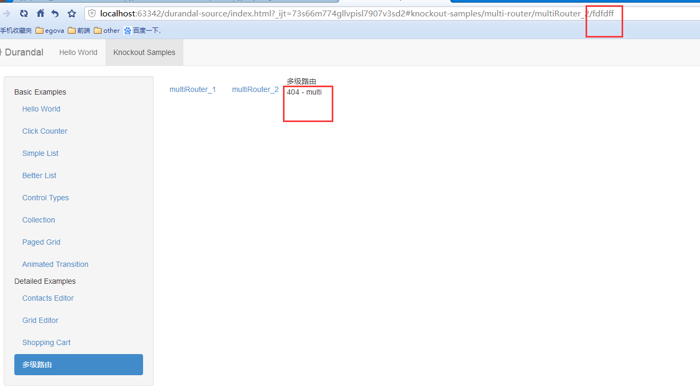
 
## 6.3 创建多级路由
>关键点在于，需要使用[父路由]创建子路由，才会达到有效的[嵌套]
- 在 ko/index.js 基础上再嵌套一个路由，如下图
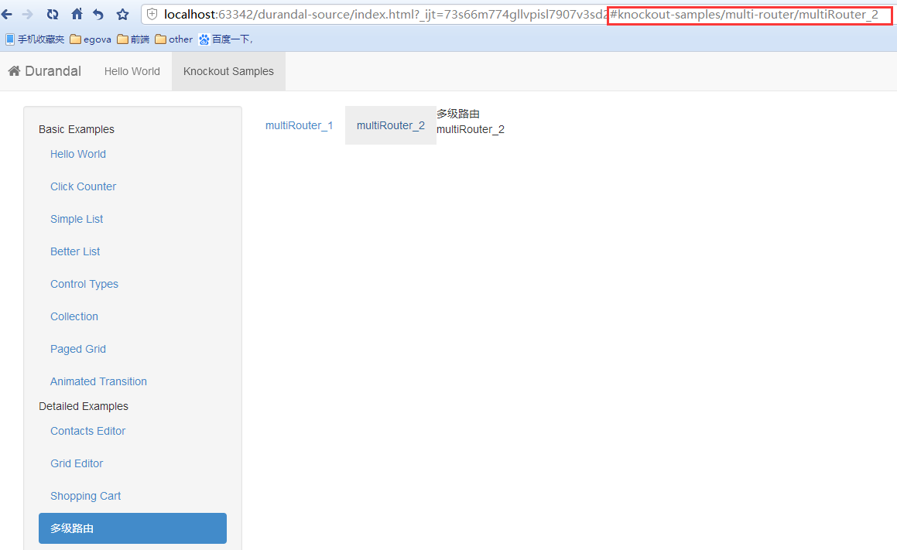

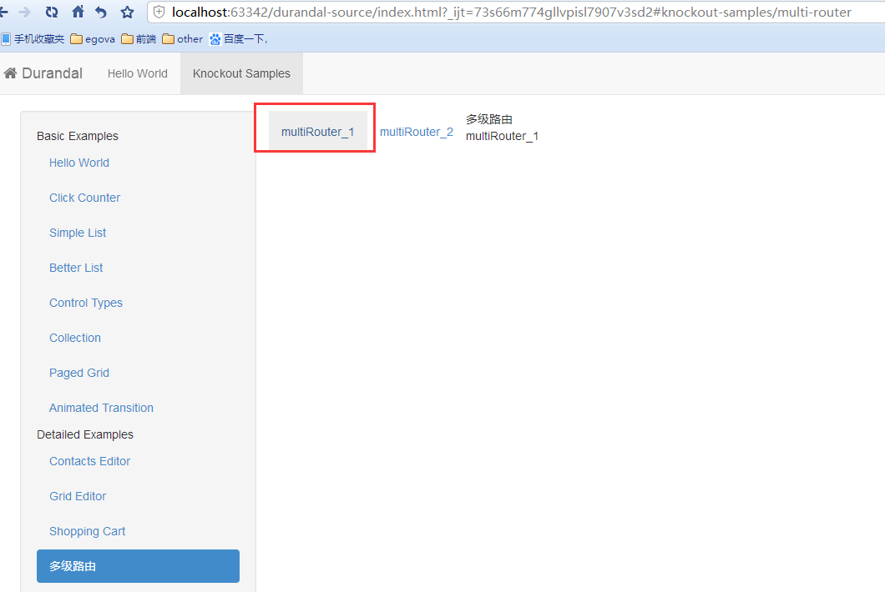

## 6.4 控制台打印日志看路由流程


```javascript
//main.js
system.debug(true); // 设置为true
```


### 6.4.1 初始化只有根路由的页面
- 初始化路由的页面
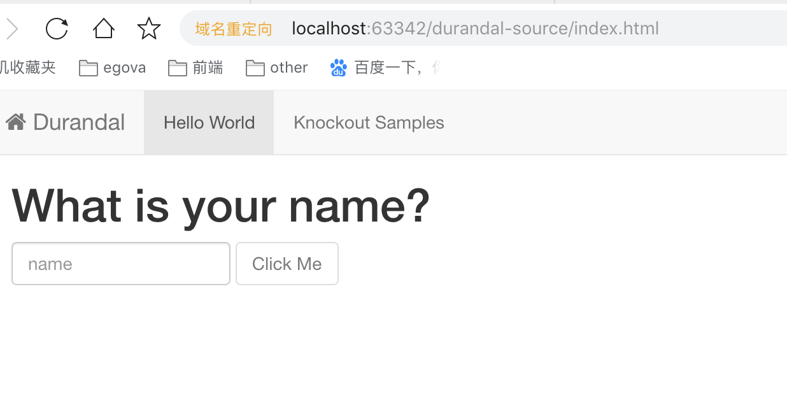
- 控制台信息
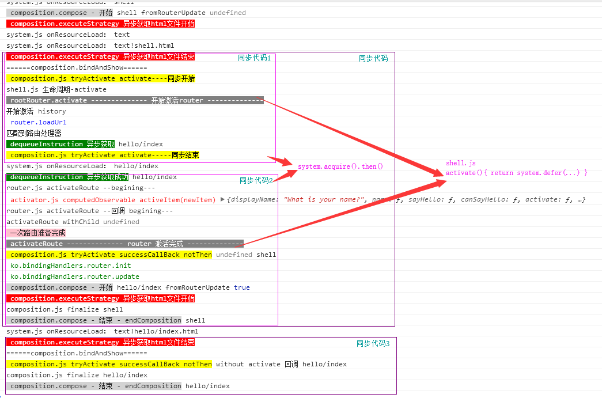

### 6.4.2 点击导航切换流程（6.4.1 -> 6.4.3）
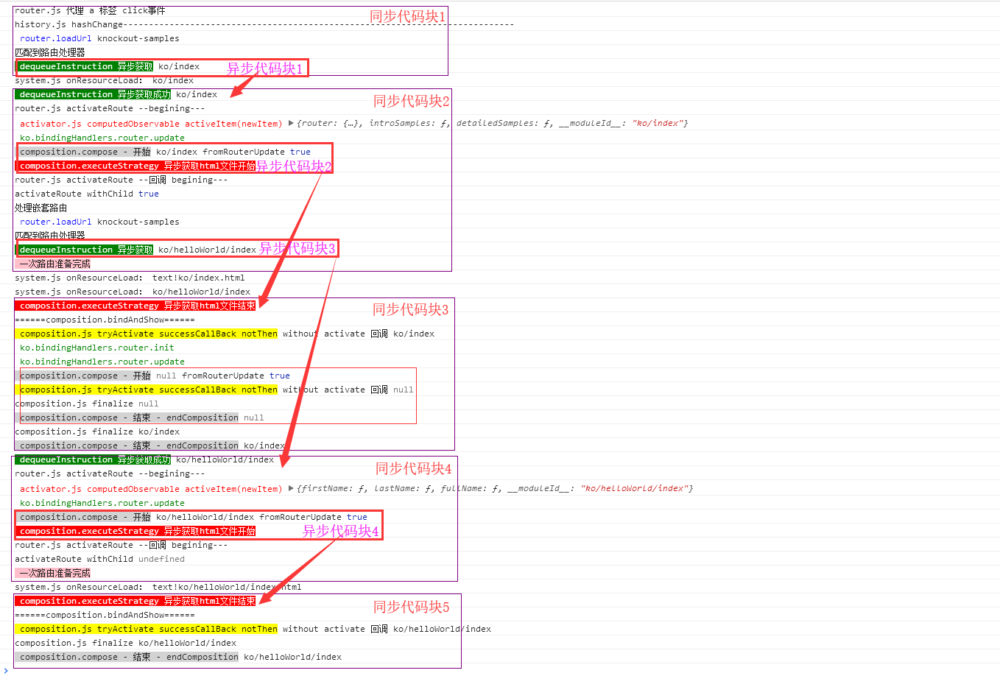

### 6.4.3 初始化页面就包含嵌套路由的情况
- 初始化路由的页面

- 控制台信息
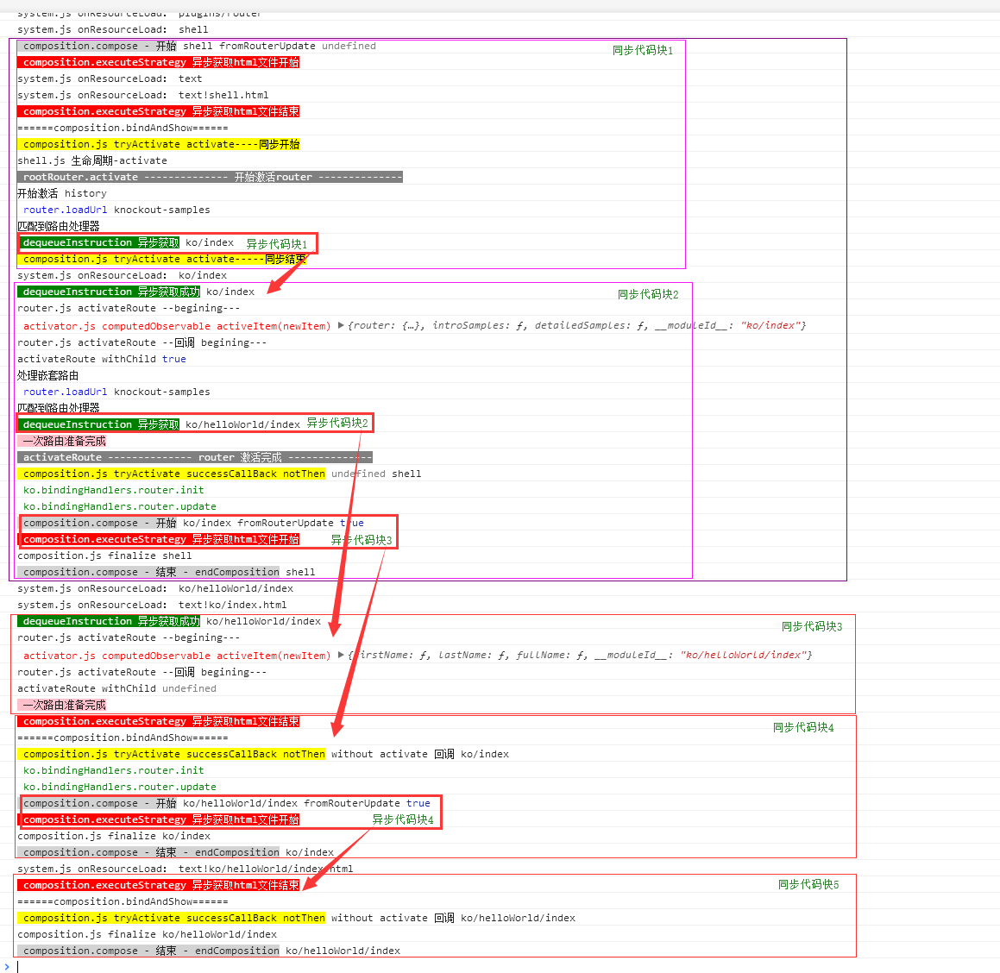

## 6.5 哈希路由
>React-Router 是建立在 history 之上的，常见的history路由方案有三种形式，分别是：hashHistory、browserHistory、createMemoryHistory。hashHistory 使用 URL 中的 hash（#）部分去创建路由

Durandal路由的表现形式和React-Router中的hashHistory是一样的
