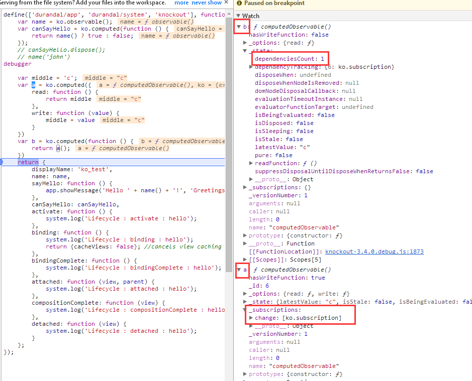
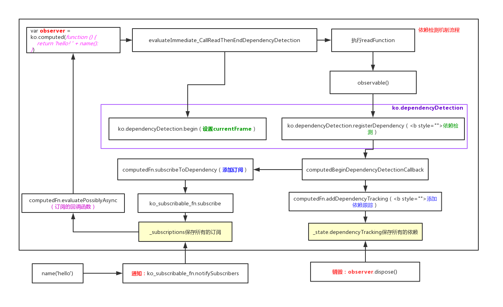

<!-- START doctoc generated TOC please keep comment here to allow auto update -->
<!-- DON'T EDIT THIS SECTION, INSTEAD RE-RUN doctoc TO UPDATE -->
**Table of Contents**  *generated with [DocToc](https://github.com/thlorenz/doctoc)*

- [1. 示例代码](#1-%E7%A4%BA%E4%BE%8B%E4%BB%A3%E7%A0%81)
- [2. 依赖检测环境的管理](#2-%E4%BE%9D%E8%B5%96%E6%A3%80%E6%B5%8B%E7%8E%AF%E5%A2%83%E7%9A%84%E7%AE%A1%E7%90%86)
  - [2.1 begin、end](#21-beginend)
- [3 ko依赖检测机制的实现](#3-ko%E4%BE%9D%E8%B5%96%E6%A3%80%E6%B5%8B%E6%9C%BA%E5%88%B6%E7%9A%84%E5%AE%9E%E7%8E%B0)
  - [3.1 依赖检测环境准备](#31-%E4%BE%9D%E8%B5%96%E6%A3%80%E6%B5%8B%E7%8E%AF%E5%A2%83%E5%87%86%E5%A4%87)
  - [3.2 执行 state.readFunction](#32-%E6%89%A7%E8%A1%8C-statereadfunction)
  - [3.3 observable对象的读](#33-observable%E5%AF%B9%E8%B1%A1%E7%9A%84%E8%AF%BB)
    - [3.3.1 ko.dependencyDetection.registerDependency](#331-kodependencydetectionregisterdependency)
    - [3.3.2 添加订阅](#332-%E6%B7%BB%E5%8A%A0%E8%AE%A2%E9%98%85)
    - [3.3.3 添加依赖](#333-%E6%B7%BB%E5%8A%A0%E4%BE%9D%E8%B5%96)
  - [3.4 observable对象的写](#34-observable%E5%AF%B9%E8%B1%A1%E7%9A%84%E5%86%99)
    - [3.4.1 发布通知](#341-%E5%8F%91%E5%B8%83%E9%80%9A%E7%9F%A5)
  - [3.5 Observer的销毁](#35-observer%E7%9A%84%E9%94%80%E6%AF%81)
  - [3.6 小结](#36-%E5%B0%8F%E7%BB%93)
- [4 补充](#4-%E8%A1%A5%E5%85%85)
- [4.1 pureComputed](#41-purecomputed)
- [4.2 computedFn.evaluatePossiblyAsync](#42-computedfnevaluatepossiblyasync)
- [5 总结](#5-%E6%80%BB%E7%BB%93)

<!-- END doctoc generated TOC please keep comment here to allow auto update -->

1. 第二章通过observable对象和computedObservable对象的继承结构说到二者分别具有的能力
2. 本章来解答上一章遗留的问题：什么时候会发生**订阅**呢？什么时候会触发**通知**呢？也就是ko的依赖检测机制

# 1. 示例代码
```
// 定义一个observable对象
var name = ko.observable();

// 定义一个computedObservable对象，作为观察者模式中的Observer
var observer = ko.computed(function () { 
    return 'hello! ' + name(); // observable对象的读，作为观察者模式中的Subject
});

//observable对象的写
name('john')
```

**结论** 
ko.computed(fn)/ko.dependentObservalbe(fn)，当fn中存在Subject（observable对象、computedObservable对象）的读取操作时，会发生依赖检测，会被observer添加订阅，并且Subject会被作为observer的依赖

# 2. 依赖检测环境的管理 
**ko.dependencyDetection通过outerFrames（栈）用来管理依赖检测的执行环境**
1. 注意：ko.dependencyDetection.begin\end总是成对出现
2. currentFrame 为当前依赖检测的执行环境
  
**ko.dependencyDetection的结构**
  ```javascript
  ko.computedContext = ko.dependencyDetection = (function () {
      var outerFrames = [],
          currentFrame,
          lastId = 0;
  
      function getId() {}
  
      function begin(options) {
          outerFrames.push(currentFrame);
          currentFrame = options;
      }
  
      function end() {
          currentFrame = outerFrames.pop();
      }
  
      return {
          begin: begin,
          end: end,
          registerDependency: function (subscribable) { },
          ignore: function (callback, callbackTarget, callbackArgs) {},
          getDependenciesCount: function () {},
          isInitial: function () {}
      };
  })();
  ```
  
  ## 2.1 begin、end
  1. 入栈上一个 currentFrame
  2. 设置最新的 currentFrame
  
  ## 2.2 ignore：抑制依赖性检测
  ```javascript 
  ignore: function (callback, callbackTarget, callbackArgs) {
      try {
          begin();
          return callback.apply(callbackTarget, callbackArgs || []);
      } finally {
          end();
      }
  },
  ```    

# 3 ko依赖检测机制的实现 
```javascript
ko.computed(fn)：fn为readFunction 
-> evaluateImmediate 
-> evaluateImmediate_CallReadWithDependencyDetection 
-> evaluateImmediate_CallReadThenEndDependencyDetection
```

## 3.1 依赖检测环境准备

```javascript 
evaluateImmediate_CallReadWithDependencyDetection: function (notifyChange) {
    //...
    dependencyDetectionContext = {
            computedObservable: computedObservable,
            disposalCandidates: state.dependencyTracking,
            disposalCount: state.dependenciesCount
        };

    ko.dependencyDetection.begin({  
        callbackTarget: dependencyDetectionContext,
        callback: computedBeginDependencyDetectionCallback, //该函数被优化到外层作用域了（作为共享函数，以避免创建不必要的函数实例）
        computed: computedObservable,
        isInitial: isInitial
    });
    var newValue = this.evaluateImmediate_CallReadThenEndDependencyDetection(state, dependencyDetectionContext);
    //...
}
```

上面方法中调用：ko.dependencyDetection.begin（见2.1）

## 3.2 执行 state.readFunction

```javascript
evaluateImmediate_CallReadThenEndDependencyDetection: function (state, dependencyDetectionContext) {
    try {
        var readFunction = state.readFunction;  
        return state.evaluatorFunctionTarget ? readFunction.call(state.evaluatorFunctionTarget) : readFunction();
    } finally {
        ko.dependencyDetection.end(); // 弹出当前的‘observable执行环境’
        //...
    }
}
```

**执行readFunction，即案例中下面函数**
```javascript 
function () { 
    return 'hello! ' + name(); // observable对象的读
}
```

## 3.3 observable对象的读
1. 上面执行readFunction，则会执行name()，name是一个observable对象，当没有传递参数时为读取操作
2. 这里除了返回最新的值以外，还多了一个步骤：尝试依赖检测（见3.3.1）

```javascript 
function observable() {
    if (arguments.length > 0) {
        // 写 
    }
    else {
        // 读
        ko.dependencyDetection.registerDependency(observable); // 尝试依赖检测
        return observable[observableLatestValue];
    }
}
```

### 3.3.1 ko.dependencyDetection.registerDependency
**registerDependency**
```javascript
registerDependency: function (subscribable) { // 参数：observable对象，即案例中的 name
    if (currentFrame) {
        if (!ko.isSubscribable(subscribable))
            throw new Error("Only subscribable things can act as dependencies");
        currentFrame.callback.call(currentFrame.callbackTarget, subscribable, subscribable._id || (subscribable._id = getId()));
    }
},
```
**computedBeginDependencyDetectionCallback**
1. 这里的 currentFrame还记得吗？3.1节中，设置了currentFrame
2. currentFrame.callback即computedBeginDependencyDetectionCallback 
```javascript 
function computedBeginDependencyDetectionCallback(subscribable, id) { // subscribable:name，computedObservable:observer
    var computedObservable = this.computedObservable, // this指向 evaluateImmediate_CallReadWithDependencyDetection 中的 dependencyDetectionContext
        state = computedObservable[computedState]; 
    if (!state.isDisposed) {
        if (this.disposalCount && this.disposalCandidates[id]) {
            //...
        } else if (!state.dependencyTracking[id]) { 
            computedObservable.addDependencyTracking(id, subscribable, state.isSleeping ? { _target: subscribable } : computedObservable.subscribeToDependency(subscribable));
        }
    }
}
```

1. state.isSleeping只有在pureComputed情况下才可能为true（见4.1）
2. 这里有两个重要的步骤
```javascript
computedObservable.addDependencyTracking(id, subscribable, state.isSleeping ? { _target: subscribable } : computedObservable.subscribeToDependency(subscribable));
// 拆分为
var subscription = computedObservable.subscribeToDependency(subscribable); // 添加订阅（见3.3.2）
computedObservable.addDependencyTracking(id, subscribable, subscription);  // 添加依赖（见3.3.3）
```

### 3.3.2 添加订阅 
**computedFn.subscribeToDependency**
1. 在第二章说到computedObservable继承了computedFn
2. subscribeToDependency：方法名说明了该方法的作用：向依赖添加订阅
```javascript 
var computedFn = {
    subscribeToDependency: function (target) { // target是observable对象（案例中的 name）
        if (target._deferUpdates && !this[computedState].disposeWhenNodeIsRemoved) {
            //...
        } else {
            return target.subscribe(this.evaluatePossiblyAsync, this); // 注意这里的回调函数：this.evaluatePossiblyAsync
        }
    },
}
```

**ko_subscribable_fn.subscribe**
1. 在第二章说到computedObservable，observable都继承了ko_subscribable_fn，因此二者都具有观察者模式中的Subject的功能即作为依赖存在，
2. 另外observable对象没有subscribeToDependency这样的方法，因此observable对象不能作为Observer存在 
```javascript 
var defaultEvent = "change";

var ko_subscribable_fn = { 
    subscribe: function (callback, callbackTarget, event) {
        var self = this;
        event = event || defaultEvent;
        var boundCallback = callbackTarget ? callback.bind(callbackTarget) : callback;
        var subscription = new ko.subscription(self, boundCallback, function () { // disposeCallback
            ko.utils.arrayRemoveItem(self._subscriptions[event], subscription);
            if (self.afterSubscriptionRemove)
                self.afterSubscriptionRemove(event);
        });
        //...
        self._subscriptions[event].push(subscription);
        return subscription; //返回了subscription
    },
}
```

**上面代码注释中的disposeCallback的作用？** 
1. 当Observer销毁（见3.5）时，那么该Observer应该从其依赖（Subject）中把添加的订阅移除

**ko.subscription** 
```javascript 
ko.subscription = function (target, callback, disposeCallback) {
    this._target = target; 
    this.callback = callback;
    this.disposeCallback = disposeCallback;
    this.isDisposed = false;
    ko.exportProperty(this, 'dispose', this.dispose);
};

ko.subscription.prototype.dispose = function () {
    this.isDisposed = true;
    this.disposeCallback();
};
```

### 3.3.3 添加依赖
1. Observer向Subject添加订阅说明Observer是依赖Subject的，Observer需要记录下所有的依赖
2. Observer跟踪所有的依赖的作用？当Observer销毁时，需要通知依赖把订阅移除（见3.5）
```javascript 
var computedFn = {
    addDependencyTracking: function (id, target, trackingObj) {
        //...
        this[computedState].dependencyTracking[id] = trackingObj;
        trackingObj._order = this[computedState].dependenciesCount++;
        trackingObj._version = target.getVersion();
    },
}
```

## 3.4 observable对象的写 
```javascript 
function observable() {
    if (arguments.length > 0) { // 写 
        if (observable.isDifferent(observable[observableLatestValue], arguments[0])) {
            observable.valueWillMutate();  // 触发 'beforeChange' 
            observable[observableLatestValue] = arguments[0];
            observable.valueHasMutated();  // 触发 'change' ，调用ko_subscribable_fn.notifySubscribers
        }
        return this;  
    }
    else {
        // 读
    }
}
```

如案例代码中
```
name('john')
```

### 3.4.1 发布通知
**ko_subscribable_fn.notifySubscribers**
1. 第二章说到observable对象继承了observableFn，并且observableFn 继承了 ko.subscribable['fn']（即ko_subscribable_fn）
2. 通知所有的Observer，调用订阅时添加的回调函数（见3.3.2）
```javascript 
var ko_subscribable_fn = {
    "notifySubscribers": function (valueToNotify, event) {
        event = event || defaultEvent;
        if (event === defaultEvent) {
            this.updateVersion();
        }
        if (this.hasSubscriptionsForEvent(event)) {
            try {
                ko.dependencyDetection.begin(); // 关键：抑制依赖性检测
                for (var a = this._subscriptions[event].slice(0), i = 0, subscription; subscription = a[i]; ++i) {  // 触发在2.1.3.6添加的订阅
                    if (!subscription.isDisposed)
                        subscription.callback(valueToNotify);
                }
            } finally {
                ko.dependencyDetection.end(); 
            }
        }
    }, 
}
```
**抑制依赖性检测的作用？**
observable的写并不会添加依赖和订阅，即下例是不会构成依赖关系的

```javascript
var name = ko.observable();
var observer = ko.computed(function () {
    name('john') ;// 因为是写操作，抑制依赖性检测
    return 1;
});
```

## 3.5 Observer的销毁
在3.3.3小节中说到computedObservable将所有的依赖订阅添加到state.dependencyTracking中
```javascript 
var computedFn = {
    dispose: function () {
        var state = this[computedState];
        if (!state.isSleeping && state.dependencyTracking) {
            ko.utils.objectForEach(state.dependencyTracking, function (id, dependency) { // 这里的 dependency 就是 ko.subscription 对象
                if (dependency.dispose)
                    dependency.dispose(); // 执行 disposeCallback（见3.3.2）
            });
        }
        if (state.disposeWhenNodeIsRemoved && state.domNodeDisposalCallback) {
            ko.utils.domNodeDisposal.removeDisposeCallback(state.disposeWhenNodeIsRemoved, state.domNodeDisposalCallback);
        }
        state.dependencyTracking = null;
        state.dependenciesCount = 0;
        state.isDisposed = true;
        state.isStale = false;
        state.isSleeping = false;
        state.disposeWhenNodeIsRemoved = null;
    } 
}
```

## 3.6 小结 
**computedObservable对象可以作为观察者模式的Subject吗？**
1. 看到computedObservable函数的结构和observable函数的结构是类似的，
2. 并且在computedObservable的读取操作中也会去执行：ko.dependencyDetection.registerDependency （见3.3，observable的读取操作）
``` 
function computedObservable() {
    if (arguments.length > 0) {
        // 写
    } else { // 读
        // Reading the value
        ko.dependencyDetection.registerDependency(computedObservable);
        if (state.isStale || (state.isSleeping && computedObservable.haveDependenciesChanged())) {
            computedObservable.evaluateImmediate();
        }
        return state.latestValue;
    }
}
```

**下例说明computedObservable作为Subject的情况**
```javascript 
var middle = 'c';
var a = ko.computed({
    read: function () {
        return middle
    },
    write: function (value) {
        middle = value
    }
})
var b = ko.computed(function () {
    return a();
})
```
   
    
**为什么观察者只能是computedObservable？**
1. 因为只有ko.computed/ko.dependentObservable才会创建新的ko.dependencyDetection中的currentFrame
 
**关于代码的优化**
1. evaluateImmediate_CallReadThenEndDependencyDetection、evaluateImmediate_CallReadWithDependencyDetection
> Factoring it out means that evaluateImmediate_CallReadWithDependencyDetection（、evaluateImmediate_CallReadThenEndDependencyDetection） 
  can be independent of try/finally blocks, which contributes to saving about 40% off the CPU 
  overhead of computed evaluation (on V8 at least).
  
2. computedBeginDependencyDetectionCallback
> This function gets called each time a dependency is detected while evaluating a computed. 
  It's factored out as a shared function to avoid creating unnecessary function instances during evaluation.
        
# 4 补充
# 4.1 pureComputed

# 4.2 computedFn.evaluatePossiblyAsync
注意3.3.2中添加订阅的回调函数并是不readFunction，而是computedFn.evaluatePossiblyAsync
```javascript
var computedFn = {
    evaluatePossiblyAsync: function () {
        var computedObservable = this,
            throttleEvaluationTimeout = computedObservable['throttleEvaluation'];
        if (throttleEvaluationTimeout && throttleEvaluationTimeout >= 0) {
            clearTimeout(this[computedState].evaluationTimeoutInstance);
            this[computedState].evaluationTimeoutInstance = ko.utils.setTimeout(function () {
                computedObservable.evaluateImmediate(true /*notifyChange*/);
            }, throttleEvaluationTimeout);
        } else if (computedObservable._evalDelayed) {
            computedObservable._evalDelayed();
        } else {
            computedObservable.evaluateImmediate(true /*notifyChange*/);
        }
    },
}
```


# 5 总结


1. 发生依赖检测的关键在于ko.computed会去设置currentFrame 
