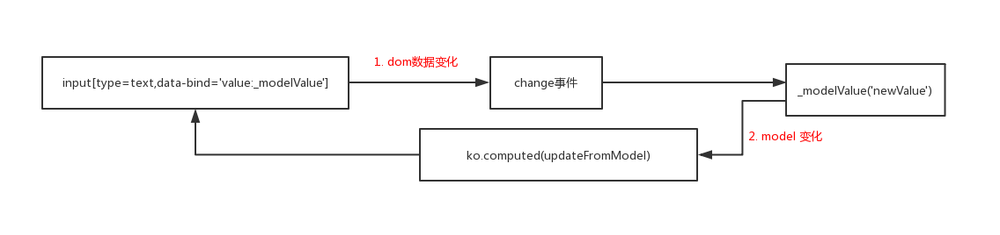

<!-- START doctoc generated TOC please keep comment here to allow auto update -->
<!-- DON'T EDIT THIS SECTION, INSTEAD RE-RUN doctoc TO UPDATE -->
**Table of Contents**  *generated with [DocToc](https://github.com/thlorenz/doctoc)*

- [1 双向绑定](#1-%E5%8F%8C%E5%90%91%E7%BB%91%E5%AE%9A)
- [2 ko.bindingHandlers['value']实现双向绑定](#2-kobindinghandlersvalue%E5%AE%9E%E7%8E%B0%E5%8F%8C%E5%90%91%E7%BB%91%E5%AE%9A)
  - [2.1 input[tyep=checkbox]、input[type=radio]](#21-inputtyepcheckboxinputtyperadio)
  - [2.2 事件名称处理](#22-%E4%BA%8B%E4%BB%B6%E5%90%8D%E7%A7%B0%E5%A4%84%E7%90%86)
  - [2.3 change事件订阅：dom -> viewModel](#23-change%E4%BA%8B%E4%BB%B6%E8%AE%A2%E9%98%85dom---viewmodel)
  - [2.4 依赖跟踪：viewModel -> dom](#24-%E4%BE%9D%E8%B5%96%E8%B7%9F%E8%B8%AAviewmodel---dom)
- [2.5 input[type='checkbox']、input[type='radio']说sourceBindings的作用](#25-inputtypecheckboxinputtyperadio%E8%AF%B4sourcebindings%E7%9A%84%E4%BD%9C%E7%94%A8)
- [3 总结](#3-%E6%80%BB%E7%BB%93)

<!-- END doctoc generated TOC please keep comment here to allow auto update -->

# 1 双向绑定
双向绑定的两个方向
1. dom -> viewModel 
2. viewModel -> dom 

# 2 ko.bindingHandlers['value']实现双向绑定 
ko.bindingHandlers['value']结构
```javascript
ko.bindingHandlers['value'] = {
    'after': ['options', 'foreach'],
    'init': function (element, valueAccessor, allBindings) {
    },
    'update': function() {} //空实现
};
```

ko.bindingHandlers['value'].init，该方法较长，分为以下几个部分
1. input[tyep=checkbox]、input[type=radio]的处理
2. 事件名称处理
3. 事件订阅 
这部分重要性在于：给input[type=text]/select元素注册change事件；完成双向绑定的一侧即dom -> viewModel
4. 注册依赖 
完成双向绑定的另一侧即 viewModel -> dom

## 2.1 input[tyep=checkbox]、input[type=radio]
```javascript
ko.bindingHandlers['value'] = { 
    'init': function (element, valueAccessor, allBindings) { 
        if (element.tagName.toLowerCase() == "input" && (element.type == "checkbox" || element.type == "radio")) {
            ko.applyBindingAccessorsToNode(element, { 'checkedValue': valueAccessor });
            return;
        } 
        //...
    }
}
```

1. ko.bindingHandlers['value']是针对input[type=text]、select两种情况的
2. input[tyep=checkbox]、input[type=radio]的处理
```javascript
ko.applyBindingAccessorsToNode(element, { 'checkedValue': valueAccessor });
```

## 2.2 事件名称处理

```javascript
ko.bindingHandlers['value'] = { 
    'init': function (element, valueAccessor, allBindings) {  
        var eventsToCatch = ["change"];
        var requestedEventsToCatch = allBindings.get("valueUpdate");
        var propertyChangedFired = false;
        var elementValueBeforeEvent = null;
    
        if (requestedEventsToCatch) {
            if (typeof requestedEventsToCatch == "string")  
                requestedEventsToCatch = [requestedEventsToCatch];
            ko.utils.arrayPushAll(eventsToCatch, requestedEventsToCatch);
            eventsToCatch = ko.utils.arrayGetDistinctValues(eventsToCatch);
        }
    }
}
```

1. 获取事件名称，change事件必须的，因为要通过该事件实现dom的更新 -> viewModel的更新
2. 保证事件名称的唯一性


## 2.3 change事件订阅：dom -> viewModel

```javascript
ko.bindingHandlers['value'] = { 
    'init': function (element, valueAccessor, allBindings) {  
        //...
         var valueUpdateHandler = function() {
            elementValueBeforeEvent = null;
            propertyChangedFired = false;
            var modelValue = valueAccessor();
            var elementValue = ko.selectExtensions.readValue(element);
            ko.expressionRewriting.writeValueToProperty(modelValue, allBindings, 'value', elementValue);
        }
 
        var ieAutoCompleteHackNeeded = ko.utils.ieVersion && element.tagName.toLowerCase() == "input" && element.type == "text"
            && element.autocomplete != "off" && (!element.form || element.form.autocomplete != "off");
        if (ieAutoCompleteHackNeeded && ko.utils.arrayIndexOf(eventsToCatch, "propertychange") == -1) {
            ko.utils.registerEventHandler(element, "propertychange", function () { propertyChangedFired = true });
            ko.utils.registerEventHandler(element, "focus", function () { propertyChangedFired = false });
            ko.utils.registerEventHandler(element, "blur", function() {
                if (propertyChangedFired) {
                    valueUpdateHandler();
                }
            });
        }

        ko.utils.arrayForEach(eventsToCatch, function(eventName) { 
            var handler = valueUpdateHandler;
            if (ko.utils.stringStartsWith(eventName, "after")) {
                handler = function() { 
                    elementValueBeforeEvent = ko.selectExtensions.readValue(element);
                    ko.utils.setTimeout(valueUpdateHandler, 0);
                };
                eventName = eventName.substring("after".length);
            }
            ko.utils.registerEventHandler(element, eventName, handler);
        });
        //...
    }
}
```


1. valueUpdateHandler 是change事件的回调函数
2. 中间部分是ie下的兼容性处理，注册propertychange、focus、blur事件（propertychange等价于input事件）
    - [兼容性问题](https://github.com/knockout/knockout/pull/122)
    >IE doesn't fire "change" events on textboxes if the user selects a value from its autocomplete list
    - propertyChangedFired:true + blur = change事件
3. 事件注册
    - 值得一提的是，对于 "after<eventname>" 事件的处理，这里其实是好意，为了引入'afterXxx'事件，但是引入这样的事件会带来一些问题见[issue](https://github.com/knockout/knockout/pull/1334)
    - 变量elementValueBeforeEvent只有在keyXxx等事件触发 到 valueUpdateHandler函数运行之间很短暂的时间（brief time）是非空值 <br/>
    - 数据的更新可能是异步的，比如deferUpdate/rateLimit等使用 会异步更新数据（那么可能会造成数据不同步） 
     对于这种情况，上面的说的（brief time）期间，可能会丢失用户输入的数据，因此我们需要记录用户输入的数据，以免丢失，然后使用用户输入的数据覆盖
     
4. 小节：
```
以input[type=text]为例，
输入框发生change事件 
-> valueUpdateHandler 
-> ko.expressionRewriting.writeValueToProperty
-> 执行 modelValue
-> updateFromModel，但是 valueHasChanged 相等，所以不更新
```
      
## 2.4 依赖跟踪：viewModel -> dom
 ```javascript
 ko.bindingHandlers['value'] = { 
     'init': function (element, valueAccessor, allBindings) {  
         //...
         var updateFromModel = function () { // 这里的触发是由于绑定的model更新了
             var newValue = ko.utils.unwrapObservable(valueAccessor()); // model的值
             var elementValue = ko.selectExtensions.readValue(element);  // dom的值
 
             if (elementValueBeforeEvent !== null && newValue === elementValueBeforeEvent) { // "after<eventname>" 事件可能出现情况的处理
                 ko.utils.setTimeout(updateFromModel, 0);
                 return;
             }
 
             var valueHasChanged = (newValue !== elementValue); // 只有当数据发生变化，才更新dom的值
 
             if (valueHasChanged) { //select 
                 if (ko.utils.tagNameLower(element) === "select") {
                     var allowUnset = allBindings.get('valueAllowUnset');
                     var applyValueAction = function () {
                         ko.selectExtensions.writeValue(element, newValue, allowUnset);
                     };
                     applyValueAction();
 
                     if (!allowUnset && newValue !== ko.selectExtensions.readValue(element)) { // 处理选项中没有设置值的情况
                         ko.dependencyDetection.ignore(ko.utils.triggerEvent, null, [element, "change"]);
                     } else {  // IE6 bug
                         ko.utils.setTimeout(applyValueAction, 0);
                     }
                 } else {  // input[type=text]
                     ko.selectExtensions.writeValue(element, newValue);
                 }
             }
         };
 
         ko.computed(updateFromModel, null, { disposeWhenNodeIsRemoved: element }); // 关键：添加订阅、依赖
         //...
     }
 }
 ```

1. "after<eventname>" 情况处理
2. select
    - 处理选项中没有设置值的情况 
        - 当前select的所有选项中没有设置的值，那么触发change事件 
    
    - IE6 关于select控件的bug
        - 即在IE6下，如果在当前‘线程’中动态添加选项（options）和设置选中选项不能同时进行，因此通过setTimeout在‘第二线程’中设置选中项
        - [参考](https://www.jb51.net/article/93033.htm)
3. input[type=text] 
 

以下面代码为例
```javascript
//html
<input type="text" data-bind="value:valueObservable"  />
//js
var valueObservable = ko.observable('--');
valueObservable("new-value"); 
``` 

valueObservable("new-value"); 
-> updateFromModel 
-> ko.selectExtensions.writeValue(element, newValue);
  
# 2.5 input[type='checkbox']、input[type='radio']说sourceBindings的作用
```javascript 
//ko.bindingHandlers['value'].init
ko.applyBindingAccessorsToNode(element, { 'checkedValue': valueAccessor });
```
这里可以看到sourceBindings的使用

# 3 总结
1. viewModel -> dom ：dom的change事件
2. dom -> viewModel ：ko的依赖跟踪

   
