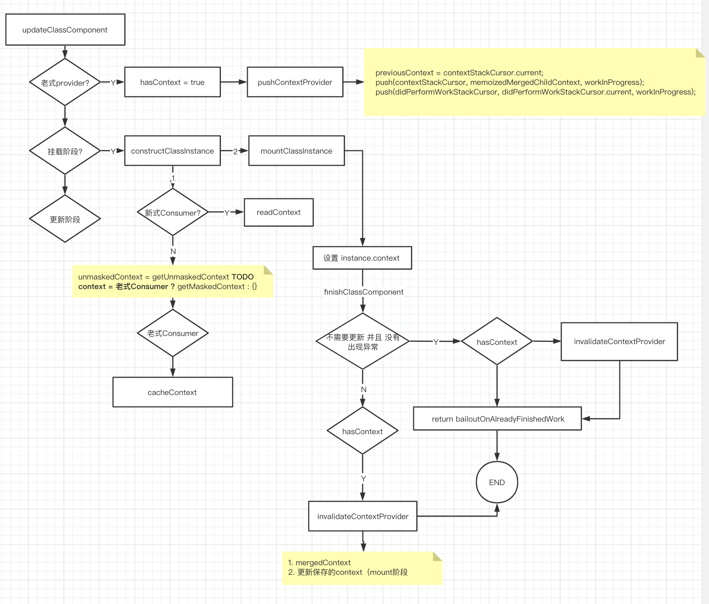

使用老的context api之类的最终会强制导致没有更新的组件重新渲染

[老式用法](https://reactjs.org/docs/legacy-context.html#how-to-use-context)
1. 老的用法 React.PropTypes 现在已经不支持，需要手动安装依赖 prop-types
    - 原理 合并父级所有context，因此在子元素中可以拿到祖先元素的context
2. ProviderClass
    - 静态方法 childContextTypes
    - 提供实例方法 getChildContext
3. ConsumerClass
    - 静态方法 contextTypes
    - 直接通过 this.context 使用

使用方式
```jsx harmony
class ContextConsumer extends React.Component {
  constructor(props){
    super(props);
  }

  static contextTypes = {
    propA1: PropTypes.string,
    propA2: PropTypes.string,
  };

  render(){
    const {
      propA1, propA2,
    } = this.context; // mountClassInstance  instance.context = xxx

    return (
      <div>{propA1} {propA2}</div>
    );
  }
}

class ContextProvider1 extends React.Component {
  constructor(props){
    super(props);
    this.state = {
      name: 'ys_1',
    };
  }

  static childContextTypes = {
    propA1: PropTypes.string,
    methodA1: PropTypes.func,
  };

  // 返回Context对象，方法名是约定好的
  getChildContext(){
    return {
      propA1: this.state.name,
      methodA1: () => 'methodA_2',
    };
  }

  // 仅仅为了触发更新
  handleClick = () => {
    this.setState({
      name: 'sq_1',
    });
  };

  render(){
    return <div onClick={this.handleClick.bind(this)}><ContextProvider2/></div>;
  }
}


class ContextProvider2 extends React.Component {
  constructor(props){
    super(props);
    this.state = {
      name: 'ys_2',
    };
  }

  static childContextTypes = {
    propA2: PropTypes.string,
    methodA2: PropTypes.func,
  };

  // 返回Context对象，方法名是约定好的
  getChildContext(){
    return {
      propA2: this.state.name,
      methodA2: () => 'methodA_1',
    };
  }

  // 仅仅为了触发更新
  handleClick = () => {
    this.setState({
      name: 'sq_2',
    });
  };

  render(){
    return <div onClick={this.handleClick.bind(this)}><ContextConsumer/></div>;
  }
}

export class ContextProviderWrapper extends React.Component {
  constructor(props){
    super(props);
  }

  render(){
    return <ContextProvider1/>;
  }
}
```

由于是老式api的实现方式，这里简单描述源码在这部分的执行过程

思想：当遇到某个老式provider组件时，该provider组件会将上一个provider的结果(合并后的context)与当前的context合并后作为该provider的context（也就是说这里provider实际关联的context是一层一层合并过来的 核心方法 invalidateContextProvider

遇到老式consumer时，将这个合并后的结果设置 给组件的context属性

```javascript
function invalidateContextProvider(workInProgress, type, didChange) {
  var instance = workInProgress.stateNode;
  !instance ? invariant(false, 'Expected to have an instance by this point. This error is likely caused by a bug in React. Please file an issue.') : void 0;

  if (didChange) { 
    var mergedContext = processChildContext(workInProgress, type, previousContext);
    ...
    push(contextStackCursor, mergedContext, workInProgress); // 保存当前provider生成的context对象，该provider的孩子组件挂载/更新时就会将context属性设置为这个对象
    ...
  } else {
    ...
  }
}

function processChildContext(fiber, type, parentContext) {
  ...
  var childContext = void 0; 
  ...
  childContext = instance.getChildContext(); 
  ...
  return _assign({}, parentContext, childContext); // context 合并
}
```




