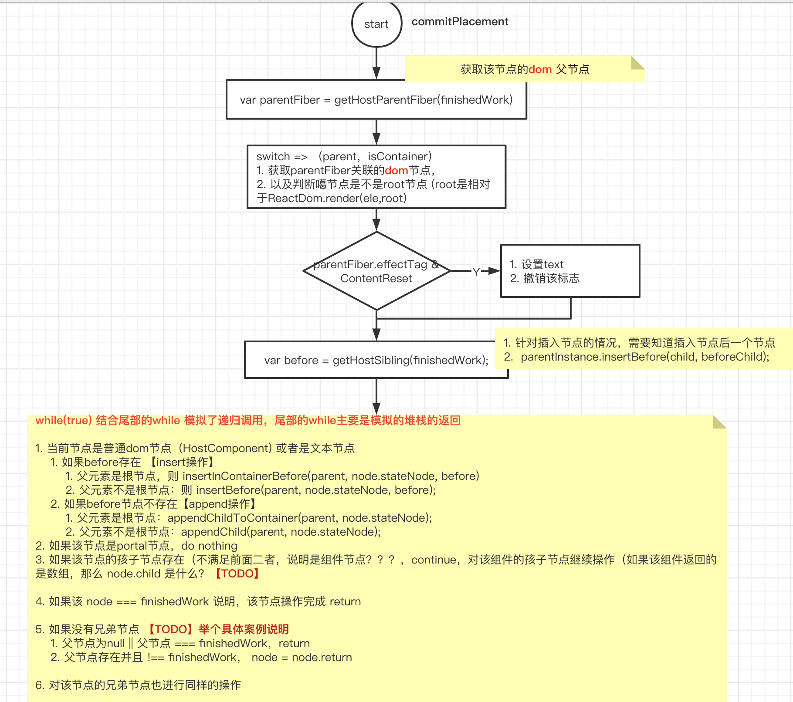

<!-- START doctoc generated TOC please keep comment here to allow auto update -->
<!-- DON'T EDIT THIS SECTION, INSTEAD RE-RUN doctoc TO UPDATE -->
**Table of Contents**  *generated with [DocToc](https://github.com/thlorenz/doctoc)*

- [commitAllHostEffects](#commitallhosteffects)
  - [主流程](#%E4%B8%BB%E6%B5%81%E7%A8%8B)
  - [代码](#%E4%BB%A3%E7%A0%81)
- [commitPlacement](#commitplacement)
  - [流程图](#%E6%B5%81%E7%A8%8B%E5%9B%BE)
  - [代码](#%E4%BB%A3%E7%A0%81-1)
  - [案例](#%E6%A1%88%E4%BE%8B)
    - [case 1](#case-1)
    - [case 2](#case-2)
- [commitWork](#commitwork)
- [commitDeletion](#commitdeletion)
  - [流程](#%E6%B5%81%E7%A8%8B)
  - [案例](#%E6%A1%88%E4%BE%8B-1)
  - [代码](#%E4%BB%A3%E7%A0%81-2)
- [附](#%E9%99%84)
  - [commitUnmount](#commitunmount)

<!-- END doctoc generated TOC please keep comment here to allow auto update -->

 
总结【补充】 方便一眼看出该节做了啥？
commitWork  useLayoutEffect

# commitAllHostEffects
## 主流程
1. ContentReset 
    - 见updateHostComponent，如果从原本是文本节点切换为空或者普通的接单，则设置为ContentReset，表示textContext需要重置，尚未测试
2. Ref (react-dom.development.js
    - ReactFiberBeginWork、ReactFiberCompleteWork 文件具有 markRef方法，该方法中用于设置该标志
    - 这里先清除refd的引用，什么时候更新呢：见commitAllLifeCycles函数中，会去调用 commitAttachRef，更新ref
3. Placement、Update、Deletion 三类操作（没类操作后，会消除该类的tag
    - Placement => commitPlacement(nextEffect);
    - Update => commitWork(_current, nextEffect);
    - PlacementAndUpdate => a + b
    - Deletion => commitDeletion(nextEffect);

## 代码
```javascript
function commitAllHostEffects() {
  while (nextEffect !== null) {  
    const effectTag = nextEffect.effectTag;

    if (effectTag & ContentReset) {
      commitResetTextContent(nextEffect);
    }

    if (effectTag & Ref) {
      const current = nextEffect.alternate;
      if (current !== null) {
        commitDetachRef(current);
      }
    }

    // The following switch statement is only concerned about placement,
    // updates, and deletions. To avoid needing to add a case for every
    // possible bitmap value, we remove the secondary effects from the
    // effect tag and switch on that value.
    let primaryEffectTag = effectTag & (Placement | Update | Deletion);
    switch (primaryEffectTag) {
      case Placement: {
        commitPlacement(nextEffect);
        // Clear the "placement" from effect tag so that we know that this is inserted, before
        // any life-cycles like componentDidMount gets called.
        // TODO: findDOMNode doesn't rely on this any more but isMounted
        // does and isMounted is deprecated anyway so we should be able
        // to kill this.
        nextEffect.effectTag &= ~Placement;
        break;
      }
      case PlacementAndUpdate: {
        // Placement
        commitPlacement(nextEffect);
        // Clear the "placement" from effect tag so that we know that this is inserted, before
        // any life-cycles like componentDidMount gets called.
        nextEffect.effectTag &= ~Placement;

        // Update
        const current = nextEffect.alternate;
        commitWork(current, nextEffect);
        break;
      }
      case Update: {
        const current = nextEffect.alternate;
        commitWork(current, nextEffect);
        break;
      }
      case Deletion: {
        commitDeletion(nextEffect);
        break;
      }
    }
    nextEffect = nextEffect.nextEffect;
  } 
}
```


# commitPlacement
## 流程图


## 代码
```javascript
function commitPlacement(finishedWork: Fiber): void {
  if (!supportsMutation) {
    return;
  }

  // Recursively insert all host nodes into the parent.
  const parentFiber = getHostParentFiber(finishedWork);

  // Note: these two variables *must* always be updated together.
  let parent;
  let isContainer;

  switch (parentFiber.tag) {
    case HostComponent:
      parent = parentFiber.stateNode;
      isContainer = false;
      break;
    case HostRoot:
      parent = parentFiber.stateNode.containerInfo;
      isContainer = true;
      break;
    case HostPortal:
      parent = parentFiber.stateNode.containerInfo;
      isContainer = true;
      break;
    default:
      invariant(
        false,
        'Invalid host parent fiber. This error is likely caused by a bug ' +
          'in React. Please file an issue.',
      );
  }
  if (parentFiber.effectTag & ContentReset) {
    // Reset the text content of the parent before doing any insertions
    resetTextContent(parent);
    // Clear ContentReset from the effect tag
    parentFiber.effectTag &= ~ContentReset;
  }

  const before = getHostSibling(finishedWork);
  // We only have the top Fiber that was inserted but we need to recurse down its
  // children to find all the terminal nodes.
  let node: Fiber = finishedWork;
  while (true) {
    if (node.tag === HostComponent || node.tag === HostText) {
      if (before) {
        if (isContainer) {
          insertInContainerBefore(parent, node.stateNode, before);
        } else {
          insertBefore(parent, node.stateNode, before);
        }
      } else {
        if (isContainer) {
          appendChildToContainer(parent, node.stateNode);
        } else {
          appendChild(parent, node.stateNode);
        }
      }
    } else if (node.tag === HostPortal) {
      // If the insertion itself is a portal, then we don't want to traverse
      // down its children. Instead, we'll get insertions from each child in
      // the portal directly.
    } else if (node.child !== null) {
      node.child.return = node;
      node = node.child;
      continue;
    }
    if (node === finishedWork) {
      return;
    }
    while (node.sibling === null) {
      if (node.return === null || node.return === finishedWork) {
        return;
      }
      node = node.return;
    }
    node.sibling.return = node.return;
    node = node.sibling;
  }
}
```


## 案例
### case 1
以下案例首先会走到 node.child !== null 这个分支，然后while循环内部的node指向 node.child ，此时node.child满足第一个条件，顺利返回到上一个循环
然后 走到尾部的while循环，满足node.return === finishedWork，结束
```html
<CompoA>
    <div></div>
</CompoA>
<CompB><div></dvi></CompoB>
```

### case 2
尾部的while相对于case1 会多走一圈（原因也是因为进入的堆栈更深
```html
<CompoA>
    <CompoC>
        <div></div>
    </CompoC>
</CompoA>
<CompB><div></dvi></CompoB>
```


个人感觉这种方式没有递归调用的方式直观，不过性能上来说，这个实现会更好些，毕竟对于上下文,VO,AO等一些堆栈信息也是占用空间的，上下文切换也是占用时间的

# commitWork
主要作用:更新

1. 函数组件<br/>
- commitHookEffectList(UnmountMutation, MountMutation, finishedWork);
    - 使用useLayoutEffect会去设置 UnmountMutation 标志位，全局搜索并未发现有任何地方添加了 MountMutation 标志位
    - 因此在这里，对于使用了useLayoutEffect 的组件，只会走第一个if，即执行useLayoutEffect返回的函数 【TODO】demo
2. HostComponent
    - 更新dom 的属性，样式，内容等信息，参考 commitUpdate 
    - 比如同一个div元素(key未改变)，待该元素的样式发生了变化，则在这里修改
    - 又比如更新input元素的value值
3. HostText ：更改文本值
4. SuspenseComponent 【TODO】

```javascript
function commitWork(current$$1, finishedWork){
  if (!supportsMutation) { // supportsMutation 默认值 true
      ...
  }

  switch (finishedWork.tag) {
    case FunctionComponent:
    case ForwardRef:
    case MemoComponent:
    case SimpleMemoComponent: {
      // Note: We currently never use MountMutation, but useLayout uses
      // UnmountMutation.
      commitHookEffectList(UnmountMutation, MountMutation, finishedWork);
      return;
    }
    case ClassComponent: {
      return;
    }
    case HostComponent: {
      var instance = finishedWork.stateNode;
      if (instance != null) {
        // Commit the work prepared earlier.
        var newProps = finishedWork.memoizedProps;
        // For hydration we reuse the update path but we treat the oldProps
        // as the newProps. The updatePayload will contain the real change in
        // this case.
        var oldProps = current$$1 !== null ? current$$1.memoizedProps : newProps;
        var type = finishedWork.type;
        // TODO: Type the updateQueue to be specific to host components.
        var updatePayload = finishedWork.updateQueue;
        finishedWork.updateQueue = null;
        if (updatePayload !== null) {
          commitUpdate(instance, updatePayload, type, oldProps, newProps, finishedWork);
        }
      }
      return;
    }
    case HostText: {
      var textInstance = finishedWork.stateNode;
      var newText = finishedWork.memoizedProps;
      // For hydration we reuse the update path but we treat the oldProps
      // as the newProps. The updatePayload will contain the real change in
      // this case.
      var oldText = current$$1 !== null ? current$$1.memoizedProps : newText;
      commitTextUpdate(textInstance, oldText, newText);
      return;
    }
    case HostRoot: {
      return;
    }
    case Profiler: {
      return;
    }
    case SuspenseComponent: {
      var newState = finishedWork.memoizedState;

      var newDidTimeout = void 0;
      var primaryChildParent = finishedWork;
      if (newState === null) {
        newDidTimeout = false;
      } else {
        newDidTimeout = true;
        primaryChildParent = finishedWork.child;
        if (newState.timedOutAt === NoWork) {
          // If the children had not already timed out, record the time.
          // This is used to compute the elapsed time during subsequent
          // attempts to render the children.
          newState.timedOutAt = requestCurrentTime();
        }
      }

      if (primaryChildParent !== null) {
        hideOrUnhideAllChildren(primaryChildParent, newDidTimeout);
      }

      // If this boundary just timed out, then it will have a set of thenables.
      // For each thenable, attach a listener so that when it resolves, React
      // attempts to re-render the boundary in the primary (pre-timeout) state.
      var thenables = finishedWork.updateQueue;
      if (thenables !== null) {
        finishedWork.updateQueue = null;
        var retryCache = finishedWork.stateNode;
        if (retryCache === null) {
          retryCache = finishedWork.stateNode = new PossiblyWeakSet$1();
        }
        thenables.forEach(function(thenable){
          // Memoize using the boundary fiber to prevent redundant listeners.
          var retry = retryTimedOutBoundary.bind(null, finishedWork, thenable);
          if (enableSchedulerTracing) {
            retry = tracing.unstable_wrap(retry);
          }
          if (!retryCache.has(thenable)) {
            retryCache.add(thenable);
            thenable.then(retry, retry);
          }
        });
      }

      return;
    }
    case IncompleteClassComponent: {
      return;
    }
    default: {
      invariant(false, 'This unit of work tag should not have side-effects. This error is likely caused by a bug in React. Please file an issue.');
    }
  }
}
```

# commitDeletion
supportsMutation 默认值 true

## 流程
为了方便理解，我把代码中的变量node改为current 表示正在执行外面while循环的节点，current则改为initialNode表示最初始传递进来的节点

1. 首先是到当前节点current的第一个是普通dom（fiber.tag : HostComponent\HostRoot\HostPortal）的节点，确定以下变量
    - currentParent 当前节点的第一个普通dom节点的父节点
    - currentParentIsContainer：这个父节点是否是容器节点（即tag是否为HostRoot/HostPortal<br/>
另外补充下 currentParentIsValid变量的作用：确定当前的父节点是不是有效的，即不是HostPortal

2. 如果节点是HostComponent 或者是 文本节点
createFiberFromTypeAndProps 中看到HostComponent类型是fiber.type是string，也就是指页面上的html标签元素如div等
```javascript
1. commitNestedUnmounts(node); // 遍历该节点的所有孩子节点 ，调用 commitUnmount 执行Unmoun的逻辑
2. currentParentIsContainer ? removeChildFromContainer(currentParent, node.stateNode) : removeChild(currentParent, node.stateNode);
```

3. 如果节点HostPortal类型，对于current.child，回到第一步，只是 current = current.child
4. 如果不满足上述两个情况，则说明是组件节点
    - commitUnmount
    - 对于该组件接的孩子节点，回到第一步再执行一次相同的逻辑（因为孩子节点也需要删除，递归的过程
5. 如果 current === initialNode 吗
    - 是：说明已经完成了该节点的Deletion操作
    - 否：说明在遍历孩子节点阶段
        - 如果孩子节点有兄弟节点，则对于其兄弟节点回到第一步继续执行
        - 如果孩子节点没有兄弟节点，则往上返回，直到其父节点为空或者父节点等于initilNode

## 案例
说下节点是组件的情况，因为对于组件节点需要删除其孩子节点，这是一个递归的过程，举个例子说明下这种情况
```html
<CompoA> // 第一次遍历，组件节点
    <div> // 第二次遍历 HostComponent节点，存在兄弟节点
        <CompoC></CompoC> 
    </div>
    <CompoB></CompoB> // 第三次遍历，无兄弟节点，向上返回，直到父节点为空或者等于initalNode， 则完成了initialNode的Deletion
</CompoA>

// 深度
```

HostPortal 【TODO】

## 代码
```javascript
function unmountHostComponents(current): void {
  // We only have the top Fiber that was deleted but we need to recurse down its
  // children to find all the terminal nodes.
  let node: Fiber = current;

  // Each iteration, currentParent is populated with node's host parent if not
  // currentParentIsValid.
  let currentParentIsValid = false;

  // Note: these two variables *must* always be updated together.
  let currentParent;
  let currentParentIsContainer;

  while (true) {
    if (!currentParentIsValid) {
      let parent = node.return;
      findParent: while (true) {
        switch (parent.tag) {
          case HostComponent:
            currentParent = parent.stateNode;
            currentParentIsContainer = false;
            break findParent;
          case HostRoot:
            currentParent = parent.stateNode.containerInfo;
            currentParentIsContainer = true;
            break findParent;
          case HostPortal:
            currentParent = parent.stateNode.containerInfo;
            currentParentIsContainer = true;
            break findParent;
        }
        parent = parent.return;
      }
      currentParentIsValid = true;
    }

    if (node.tag === HostComponent || node.tag === HostText) {
      commitNestedUnmounts(node);
      // After all the children have unmounted, it is now safe to remove the
      // node from the tree.
      if (currentParentIsContainer) {
        removeChildFromContainer(
          ((currentParent: any): Container),
          (node.stateNode: Instance | TextInstance),
        );
      } else {
        removeChild(
          ((currentParent: any): Instance),
          (node.stateNode: Instance | TextInstance),
        );
      }
      // Don't visit children because we already visited them.
    } else if (enableSuspenseServerRenderer && node.tag === DehydratedSuspenseComponent) {
    } else if (node.tag === HostPortal) {
      if (node.child !== null) {
        // When we go into a portal, it becomes the parent to remove from.
        // We will reassign it back when we pop the portal on the way up.
        currentParent = node.stateNode.containerInfo;
        currentParentIsContainer = true;
        // Visit children because portals might contain host components.
        node.child.return = node;
        node = node.child;
        continue;
      }
    } else {
      commitUnmount(node);
      // Visit children because we may find more host components below.
      if (node.child !== null) {
        node.child.return = node;
        node = node.child;
        continue;
      }
    }
    if (node === current) {
      return;
    }
    while (node.sibling === null) {
      if (node.return === null || node.return === current) {
        return;
      }
      node = node.return;
      if (node.tag === HostPortal) {
        // When we go out of the portal, we need to restore the parent.
        // Since we don't keep a stack of them, we will search for it.
        currentParentIsValid = false;
      }
    }
    node.sibling.return = node.return;
    node = node.sibling;
  }
}
```


# 附
## commitUnmount
1. 对于类组件，
    - 清除ref引用
    - 调用 instance.componentWillUnmount();
2. 对于函数组件
    - 执行useEffect返回的函数，比如清理事件监听
