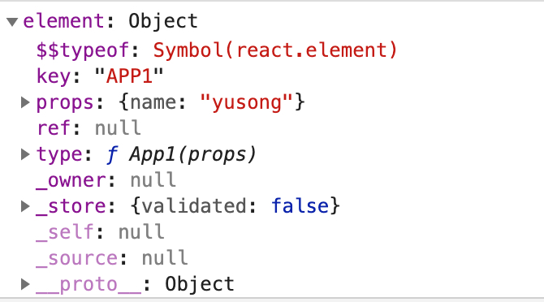
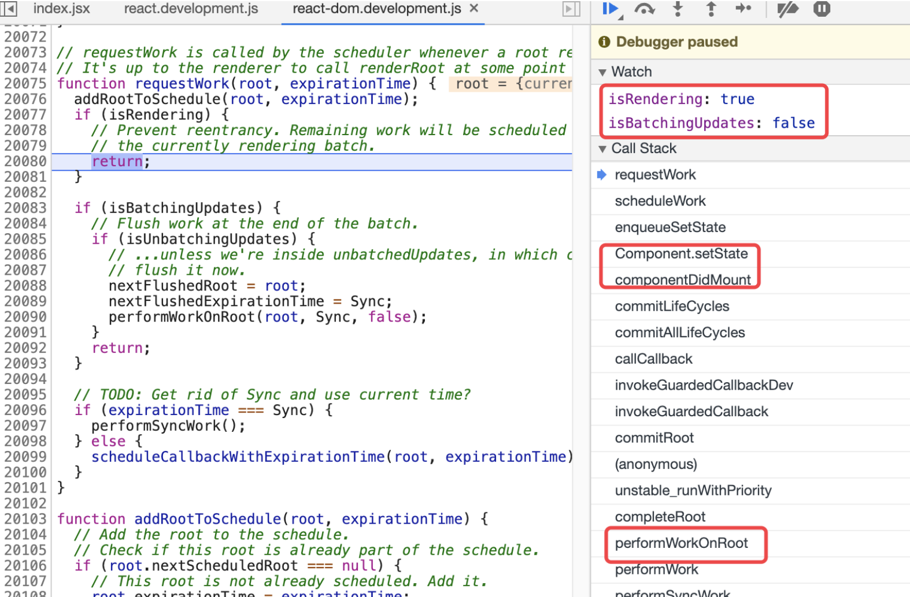

<!-- START doctoc generated TOC please keep comment here to allow auto update -->
<!-- DON'T EDIT THIS SECTION, INSTEAD RE-RUN doctoc TO UPDATE -->
**Table of Contents**  *generated with [DocToc](https://github.com/thlorenz/doctoc)*

- [示例demo & 入口](#%E7%A4%BA%E4%BE%8Bdemo--%E5%85%A5%E5%8F%A3)
- [legacyRenderSubtreeIntoContainer](#legacyrendersubtreeintocontainer)
  - [参数含义](#%E5%8F%82%E6%95%B0%E5%90%AB%E4%B9%89)
  - [主要流程](#%E4%B8%BB%E8%A6%81%E6%B5%81%E7%A8%8B)
- [scheduleRootUpdate](#schedulerootupdate)
  - [参数含义](#%E5%8F%82%E6%95%B0%E5%90%AB%E4%B9%89-1)
  - [主要流程](#%E4%B8%BB%E8%A6%81%E6%B5%81%E7%A8%8B-1)
  - [scheduleWork](#schedulework)
  - [主要流程](#%E4%B8%BB%E8%A6%81%E6%B5%81%E7%A8%8B-2)
- [requestWork](#requestwork)
  - [主要流程](#%E4%B8%BB%E8%A6%81%E6%B5%81%E7%A8%8B-3)
  - [代码](#%E4%BB%A3%E7%A0%81)

<!-- END doctoc generated TOC please keep comment here to allow auto update -->


# 示例demo & 入口
```jsx harmony
class App extends React.Component {
  constructor(props){
    super(props);
    this.state = {
      age: 20,
    };
  }

  render(){
    return <div>{this.props.name} : {this.state.age} </div>;
  }
}

ReactDOM.render(<App name={'yusong'}/>, window.document.getElementById('app'));
```
 
```javascript
ReactDom = {
    // element 经由React.createElement创建，ReactElement类型的对象
    render: function(element, container, callback){ 
        ...
        return legacyRenderSubtreeIntoContainer(null, element, container, false, callback);
    },
}   
```

ReactElement的结构如下<br/>


注意传递给 legacyRenderSubtreeIntoContainer的参数

# legacyRenderSubtreeIntoContainer
## 参数含义
- parentComponent 【TODO】
- forceHydrate：和ssr有关

## 主要流程
1. 如果是初次挂载，则需要给root节点关联一个ReactRoot对象，创建过程比较简单，堆栈如下
    - legacyCreateRootFromDOMContainer -> new ReactRoot(...) -> createContainer -> createFiberRoot -> createHostRootFiber -> createFiber
    - 有个关键信息提下：fiber.mode = NoContext（非并发模式），通过ReactDom.render启动的渲染是不支持异步的，legacyCreateRootFromDOMContainer注释中有提到
    - 看下返回的ReactRoot对象的结构
    ```javascript
    {
        _internalRoot:{
            containerInfo: root_dom, // 真实dom的root节点
            current: root_fiber, // root节点对应的fiber对象
            ...
        },
        // 原型上的一些方法
        render: function (children, callback) {...}
        ...
    }
    ```
2. 回调函数的封装，回调函数的调用时机 【TODO】
3. 调用 ReactRoot.prototype.render 启动渲染 （注意到mount阶段的启动包裹在了unbatchedUpdates 函数中，源码注释中说明了在mount阶段是不应该进行批处理的
    - 生成一个ReactWork实例对象，处理回调
    - 调用updateContainer，updateContainer最主要的工作有两点
        - 估算expirationTime，单数对于同步模式来说，该值始终是Sync(一个常量)，【TODO】并发模式：computeExpirationForFiber
        ```javascript
        function computeExpirationForFiber(currentTime, fiber){
          ...
          // 上面说过 同步模式下 root_fiber.mode = NoContext
          if ((fiber.mode & ConcurrentMode) === NoContext) {
            expirationTime = Sync;
          } else
          ...
        }
        ```
      - updateContainerAtExpirationTime -> scheduleRootUpdate(current$$1, element, expirationTime, callback)

# scheduleRootUpdate 
## 参数含义
- current$$1：root节点关联的fiber对象，
- element就是ReactDom.render的第一个参数

## 主要流程
1. 创建更新对象:update，作为fiber.updateQueue链表中的一项
2. flushPassiveEffects：对于函数式组件如果使用了useEffect，会在commitRoot阶段通过scheduler.unstable_scheduleCallback 生成一个异步任务（见hooks/useEffect），在此次更新之前应该先同步完成这些任务
3. enqueueUpdate：将更新对象添加到fiber.updateQueue链表中
    - updateQueue属性存放着fiber待更新的数据，
    > 如：在click事件中，多次setState，会为每次setState的数据创建一个update对象，并添加到updateQueue链表中，当该fiber在beiginWork的时候，会统一去处理
4. 调用 scheduleWork ，为root_fiber安排更新

## scheduleWork
## 主要流程
1. scheduleWorkToRoot：做了两件事情
    - 设置fiber.expirationTime，虽然自updateContainer函数起，就已经估算了expirationTime，但是并没有设置给fiber对象，直到 scheduleWorkToRoot 该方法，才去设置fiber.expirationTime
    - 自更节点向上直到根节点，更新这条路径上fiber的childExpirationTime ，通过fiber.childExpirationTime就可以知道该fiber是否有要更新的子孙节点
    > 比如，现在在某个子孙组件(ChlldCompo)中调用setState，实际情况是应该只会更新该组件节点，但是我们的渲染总是从root节点开始，因此经过 scheduleWorkToRoot 之后，设置了ChlldCompo.expirationTIme表明自身有更新，并且自ChlldCompo节点（不包含自身）往上至root节点这条路径中的所有fiber.expirtionTime均为NoWork表示这些节点自身没有更新，但是fiber.childExpirationTIme有值，表明存在子孙节点需要更新。这样的好处是可以很好的跳过没有更新的节点，并且不会遗漏有更新的节点。

2. 什么时候会触发第一个if条件？

```javascript
  // isWorking: 正在执行渲染，有任务正在进行当中 在后续任务正在执行 可能被中断的情况。。!isWorking 代表没任何任务正在进行（renderRoot/commitRoot的入口处会分别设置为true
  // nextRenderExpirationTime !== NoWork：任务可能是异步任务，并且执行到一半没有执行完，现在要把执行权交给浏览器去执行更高优先级的任务，
  // expirationTime > nextRenderExpirationTim：新的任务的 expirationTime 高于目前任务的 expirationTime
  // 这个判断 >> 新优先级任务打断低优先级任务的操作。
if (!isWorking && nextRenderExpirationTime !== NoWork && expirationTime > nextRenderExpirationTime) {
  interruptedBy = fiber;
  resetStack();
}
```

3. markPendingPriorityLevel 
    - earliestPendingTime - latestPendingTime 用来记录所有子树中需要进行渲染的更新的expirationTime的区间(最高和最低优先级
    - 调用findNextExpirationTimeToWorkOn 涉及的几个时间的区别和联系【TODO】
    ```javascript
    root.nextExpirationTimeToWorkOn = nextExpirationTimeToWorkOn;
    root.expirationTime = expirationTime;
    ```

4. 满足第二个if条件语句则requestWork，isWorking在renderRoot和commitRoot方法的开始都会去设置为true，另外commitRoot还会去设置isCommitting$1为true
```javascript
if ( !isWorking || isCommitting$1 || nextRoot !== root) { // 该条件取反：isWorking && !isCommitting$1 && nextRoot === root，这个条件则不需要requestWork
  var rootExpirationTime = root.expirationTime;
  requestWork(root, rootExpirationTime);
}
```
该if条件的取反更容易理解：如果当前处于render阶段了，并且是同一个root，这里不需要调用requestWork请求调度了，会在render阶段被处理掉<br/>

如：componentWillMount （该生命周期发生在render阶段）中去setState 不会进入requestWork；在mountClassInstance 调用完后 componentWilMount后，会立即调用processUpdateQueue处理期间产生的更新，因此没必要单独请求一次工作了。


# requestWork
## 主要流程
1. 调用 addRootToSchedule 添加当前的root到列表中（双端单向循环列表
    - 两个全局变量指针： firstScheduledRoot、lastScheduledRoot，指向该链表（为了方便表述 叫 schedule链表）的头尾节点
    - 更新fiber.expirationTime，该root_fiber可能应添加进来schedule列表中，但是此次的更新的优先级高于之前的，所以需要更新下expirationTime
2. isRendering为ture，返回；
```javascript
// Prevent reentrancy. Remaining work will be scheduled at the end of
// the currently rendering batch.
```
- 设置isRendering为true的只有两个地方performWorkOnRoot 和 commitPassiveEffects
- [案例](../../../../../code/react/demo.jsx)
- 解释 在16.8.6源码中调试来看，这题和批量更新是没有关系的，通常批量更新是发生在react事件机制中即触发了事件回调会设置批量更新的标志。从源码中看，该题目的解释是：当前已经处于渲染的阶段，在这个过程中，框架会主动去合并在这期间触发的更新。
     react的渲染主要包含两个阶段,render阶段和commit阶段，这两个阶段的包含在performWorkOnRoot方法中，该方法设置isRendering变量，表示当前是否处于渲染阶段。


3. 如果 isBatchingUpdates 为true，表明需要进行批处理，则不调用performWork执行更新
    - isUnbatchingUpdates 为 true的情况【TODO TEST】：事件回调中调用ReactDom.render?
>举个例子:比如当我们触发事件回调时， dispatchEvent -> batchedUpdates -> batchedUpdates$1会把 isBatchingUpdates 设为 true（参考事件章节），我们在事件回调函数内部调用 setState 不会马上触发 state 的更新及渲染，这里被return掉，会在batchedUpdates$1函数内部的finally语句中调用performSyncWork 去批处理在整个事件回调中产生的所有任务（可能调用多次setState

4. 执行任务
- 同步模式下 走 performSyncWork 
- 并发模式下生成一个异步任务【TODO】并发模式

## 代码
```javascript
function requestWork(root, expirationTime){
  addRootToSchedule(root, expirationTime);

  // performWorkOnRoot函值数的开始和尾部分别该变量true/false
  if (isRendering) {
    // 防止重入，剩余的工作将在当前渲染的被处理掉
    return;
  }
  
  if (isBatchingUpdates) {
    // 在批处理结束时冲洗工作
    if (isUnbatchingUpdates) {
      // 如果我们在unbatchedUpdates内，我们现在应该刷新它。  
      nextFlushedRoot = root;
      nextFlushedExpirationTime = Sync;
      performWorkOnRoot(root, Sync, false);
    }
    return;
  }
  // 在前面说到本文示例中使用的是同步模式，expirationTime为Sync
  if (expirationTime === Sync) {
    performSyncWork();
  } else {
    // 并发模式  
    scheduleCallbackWithExpirationTime(root, expirationTime);
  }
}
```

performWork 见下一节分析
```javascript
performSyncWork => performWork(Sync, false);
```
