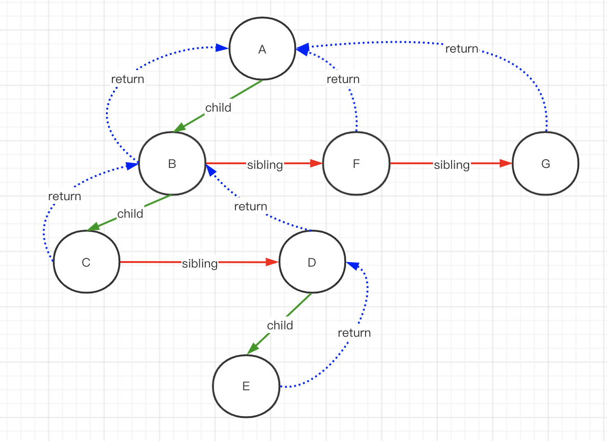
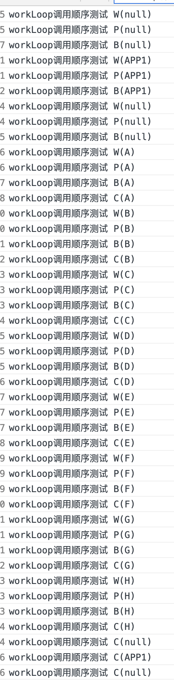

<!-- START doctoc generated TOC please keep comment here to allow auto update -->
<!-- DON'T EDIT THIS SECTION, INSTEAD RE-RUN doctoc TO UPDATE -->
**Table of Contents**  *generated with [DocToc](https://github.com/thlorenz/doctoc)*

- [performUnitOfWork](#performunitofwork)
  - [主要流程](#%E4%B8%BB%E8%A6%81%E6%B5%81%E7%A8%8B)
- [beginWork](#beginwork)
  - [主要流程](#%E4%B8%BB%E8%A6%81%E6%B5%81%E7%A8%8B-1)
  - [代码](#%E4%BB%A3%E7%A0%81)
- [completeUnitOfWork](#completeunitofwork)
  - [主要流程](#%E4%B8%BB%E8%A6%81%E6%B5%81%E7%A8%8B-2)
  - [代码](#%E4%BB%A3%E7%A0%81-1)
- [completeWork](#completework)
  - [HostComponent](#hostcomponent)
  - [HostText](#hosttext)
- [附录](#%E9%99%84%E5%BD%95)
  - [renderRoot遍历fiber树的顺序](#renderroot%E9%81%8D%E5%8E%86fiber%E6%A0%91%E7%9A%84%E9%A1%BA%E5%BA%8F)
  - [思想](#%E6%80%9D%E6%83%B3)
    - [验证](#%E9%AA%8C%E8%AF%81)

<!-- END doctoc generated TOC please keep comment here to allow auto update -->

# performUnitOfWork
## 主要流程
1. current$$1 是能够反映页面dom的fiber对象（属性等状态一致），workInProgress是生成的替换版本，后续操作要对workInProgress进行修改而不是current$$1
2. 调用beginWork，开始调和的工作，返回值是当前节点的孩子节点(深度优先遍历嘛)
3. 如果next为空，表明当前节点是叶子节点，没有孩子节点了，调用completeUnitOfWork完成自身的工作
4. 将next返回给workLoop，继续下一个循环
```javascript
// 参数 workInProgress 是一个替换版本的fiber对象
function performUnitOfWork(workInProgress){
  // 页面上当前节点的fiber对象  
  var current$$1 = workInProgress.alternate;
  var next = void 0;
  
  // 关键
  next = beginWork(current$$1, workInProgress, nextRenderExpirationTime);
  workInProgress.memoizedProps = workInProgress.pendingProps;

  if (next === null) {
      // 关键
    next = completeUnitOfWork(workInProgress);
  }

  ReactCurrentOwner$2.current = null;

  return next;
}
```

# beginWork
注意，参数是fiber的替换版本，之前说过，调和的工作都是在这个版本的fiber对象上去处理的，之所以不再current上处理是为了避免丢失更新前的数据（current保留了页面中展示dom的数据），后面的调和也需要alternate版本的fiber对象和current版本的fiebr对象进行对比，以得出差异，好在commit阶段去更新
## 主要流程
1. current$$1不为空，则说明当前处于更新阶段，那么可能会存在部分节点不需要更新的情况
    - 如果props发生了变化 又或者 context 发生了变化，设置didReceiveUpdate=true 【TODO 作用】
        - didReceiveUpdate 从该变量名可以看出这个变量用于表示来自父组件的变化导致的更新
    - 如果当前props没有变化 并且 context 也没有变化 并且 当前节点的expirationTime小于renderExpirationTime（低优先级）则跳过该节点的更新；在退出该节点的更新之前还需要有些数据的入栈操作，比如context的入栈（为什么这里要去入栈？可以参考context章节），这些入栈对应着completeUnitOfWork -> completeWork 的出栈操作；下面举两个说明进入这里的else if的案例
        - context的新式用法中，如果某个Provider的context发生了变化，则会propagateContextChange去找到订阅了该context的节点，只有订阅了context的节点才会去更新，其他节点没有更新就是在这里 bailoutOnAlreadyFinishedWork 的，这个案例在context的新式用法章节有提到
        - 另一个例子，当某个中间组件setState后，由于父组件没有更新任务，那么父组件也会进入这里的else if调用 bailoutOnAlreadyFinishedWork
    - 不满足a,b，则说明该节点有更新，但是节点更新是仅来自组件内部的即setState导致组件的更新
2. 当准备更新该节点时，设置该节点的expirationTime为NoWork
3. 当前节点有更新时，则会根据节点类型找到对应的方法实现节点的更新（调和）
    - 不同类型节点的调和工作在另外的文章中介绍

## 代码
```javascript
function beginWork(current$$1, workInProgress, renderExpirationTime){
  var updateExpirationTime = workInProgress.expirationTime;

  // 除了根节点，mount阶段时，current$$1 为null
  // 更新阶段，如果该节点之前已经渲染过，则不为null，需要判断节点是否需要接受更新？didReceiveUpdate 的作用：函数式组件【TODO】
  if (current$$1 !== null) {
    var oldProps = current$$1.memoizedProps;
    var newProps = workInProgress.pendingProps;
     
    // 只有接受的props发生变化，或者 context发生了变化 才接受更新
    if (oldProps !== newProps || hasContextChanged()) {
      didReceiveUpdate = true;
    } // 当前节点没有更新(props没有变化，context没有变化) 或者 低优先级 => 跳过：bailoutOnAlreadyFinishedWork
    else if (updateExpirationTime < renderExpirationTime) { 
      didReceiveUpdate = false;
      switch (workInProgress.tag) { 
          ...
      }
      return bailoutOnAlreadyFinishedWork(current$$1, workInProgress, renderExpirationTime);
    }
  } else {
    didReceiveUpdate = false;
  }

  workInProgress.expirationTime = NoWork;

  switch (workInProgress.tag) {
      // ... 调和的入口
  }

}
```


# completeUnitOfWork
参考：https://zhuanlan.zhihu.com/p/121717560

## 主要流程
根据当前节点执行过程中是否出现异常（通过添加Incomplete标识判断是否有异常）分别走不同的if-else分支

1. 如果当前节点performUnitOfWork过程中没有出现异常 也就是：（workInProgress.effectTag & Incomplete) === NoEffect
    - 针对不同的fiber类型，完成剩余的工作： completeWork【TODO】
    - 调用 resetChildExpirationTime，当某个fiber完成需要更新该节点的 childExpirationTime
    - 执行 completeWork 过程中产生了 新的nextUnitOfWork，如果存在，则返回给workLoop。
        - 主要SuspenseComponent类型可能会返回一个存在的nextUnitOfWork，其余类型均返回null
    - 链接effect链表，这里分为两步；当整个树遍历完成后，root_fiber的副作用链表就会包含整棵树所有的副租用
        - 将当前fiber节点的副作用链表连接到父节点的副作用链表中
        - 如果该fiber节点自身也有副租用，则将该节点也添加到父节点的副作用链表中
    - 如果fiber.sibling 存在，则返回，将sibling返回给workLoop
    - 如果fiber.returnFiber存在，则continue，即对该fiber的父节点执行completeUnitOfWork
    - 否则 返回null（整棵树遍历完成

2. 出现异常的情况【TODO】
Incomplet

## 代码
```javascript
function completeUnitOfWork(workInProgress: Fiber): Fiber | null {
  while (true) { 
    const current = workInProgress.alternate; 

    const returnFiber = workInProgress.return; // 当前节点的父节点
    const siblingFiber = workInProgress.sibling;

    if ((workInProgress.effectTag & Incomplete) === NoEffect) {  
      nextUnitOfWork = workInProgress;

      nextUnitOfWork = completeWork(
        current,
        workInProgress,
        nextRenderExpirationTime,
      );
       
      resetChildExpirationTime(workInProgress, nextRenderExpirationTime); 
      
      if (nextUnitOfWork !== null) {
        return nextUnitOfWork;
      }

      if (returnFiber !== null && (returnFiber.effectTag & Incomplete) === NoEffect) {
        
        if (returnFiber.firstEffect === null) {
          returnFiber.firstEffect = workInProgress.firstEffect;
        }
        
        if (workInProgress.lastEffect !== null) {
          if (returnFiber.lastEffect !== null) {
            returnFiber.lastEffect.nextEffect = workInProgress.firstEffect;
          }
          returnFiber.lastEffect = workInProgress.lastEffect;
        }
 
        const effectTag = workInProgress.effectTag;
        if (effectTag > PerformedWork) {
          if (returnFiber.lastEffect !== null) {
            returnFiber.lastEffect.nextEffect = workInProgress;
          } else {
            returnFiber.firstEffect = workInProgress;
          }
          returnFiber.lastEffect = workInProgress;
        }
      } 

      if (siblingFiber !== null) {
        return siblingFiber;
      } else if (returnFiber !== null) {
        workInProgress = returnFiber;
        continue;
      } else {
        // We've reached the root.
        return null;
      }
    } else { 
        // 省略异常相关的代码
    }
  }
 
  return null;
}
```

# completeWork
不同类型节点的收尾工作
其中有一点在这里先提及：会将新生成的孩子立即添加到父节元素上（因此在commit阶段，对于元素节点，它只有移动，删除，修改样式与文本这几种任务（副作用）

1. ClassComponent：如果该class组件是老式context的provider，则popContext，对应着beginWork 阶段的 pushContextProvider
    - beginWork -> [ updateClassComponent -> ] pushContextProvider
2. HostRoot：如果是根节点，则popHostContainer、popTopLevelContextObject对应着 pushHostContainer、pushTopLevelContextObject
    - beginWork -> [ updateHostRoot -> ] pushHostRootContext -> pushHostContainer + pushTopLevelContextObject
3. HostPortal：popHostContainer 对应着 pushHostContainer
    - beginWork -> [ updatePortalComponent -> ] pushHostContainer
4. ContextProvider: popProvider 对应着 pushProvider
    - beginWork -> [ updateContextProvider -> ] pushPorovider

## HostComponent
挂载阶段：包含了dom元素的创建，事件监听，样式设置等操作；更新阶段：主要包含属性对比，添加Update标识，会在commit节点去统一提交差异
1. popHostContext 对应 pushHostContext
```javascript
beginWork -> [ updateHostComponent -> ] pushHostContext
```

2. 是更新阶段还是挂载阶段（ 对于HostComponent类型的fiber节点，其stateNode关联着真实的dom，current也是真实dom关联的fiber，如果有一个不存在则任务是挂载阶段，否则为更新阶段
    - 更新阶段
    ```
    1. 调用 updateHostComponent$1
    1.1 首先对比新旧props是否发生变化，如果未变化，直接返回
    1.2 否则，调用 prepareUpdate -> 【diffProperties】 准备更新对象，该更新对象会在commit阶段被用来更新dom
        commit阶段：commitRoot -> commitAllHostEffects -> commitWork -> commitUpdate -> updateProperties -> updateDOMProperties
    -------------------【diffProperties】-start-------------------
    //主要分为三步
    1. 针对 input/select/option/textarea 等表单元素，处理下新旧props[nextProps,lastProps] 的值
    2. 遍历lastProps，针对那些只存在于lastProps的属性，做【重置】处理
    3. 遍历nextProps，处理和lastProps属性值不同的属性，将变化的属性[键值对]保存起来，
        3.1 事件较特殊，有变化时直接重新监听
    4. 将updatePayload返回 【注意updatePayload是数组，偶数是属性，奇数是属性值】
    
    -------------------【diffProperties】-end---------------------
   2. markRef$1
    ```

    - 挂载阶段（不考虑ssr的情况	
        - 调用 createInstance 创建dom对象（另外给这个dom添加两个属性用于关联fiber和props，在react事件机制中会用到
        - 调用 appendAllChildren，虽说是深度优先遍历，但深度方向只会遍历到一个是HostCompoent/HostText的节点，便不再该路径的深度方向继续，转而水平方向即sibling
        ```html
        // 对下面的情况，会将孩子节点1/2 追加到当前节点下。并不会再对孩子节点2继续遍历
        <div>
            <div></div> // 孩子节点 1
            <CompoA>
                <div> // 孩子节点 2
                    <div></div>
                </div>
             <CompoA>
        </div>
        ```

        - 调用 finalizeInitialChildren
            - setInitialProperties（事件注册，样式等的设置就是发生在这里
            - shouldAutoFocusHostComponent 如果是input这里可以focus的元素，需要判断下是否要focus【TODO】commit阶段focus？
        - 设置fiber的stateNode属性，通过该属性关联dom元素
        - markRef$1

## HostText
1. 挂载阶段：创建文本节点，workInProgress.stateNode = createTextInstance
2. 更新阶段：调用 updateHostText$1 给effectTag 设置更新标识


# 附录
## renderRoot遍历fiber树的顺序
## 思想
深度优先遍历
1. performUnitOfWork作为单个fiber阶段render的入口
    1. 调用beginWork中，返回的始终是当前fiber的child节点
    2. 如果到了fiber树的某个叶子节点，即next=null，那么执行completeUnitOfWork中，
2. completeUnitOfWork
    1. 先判断有么有兄弟节点
    2. 然后判断有没有父节点

如有一个下图结构的fiber树，遍历流程如下（renderRoot -> workLoop -> performUnitOfWork
>workLoop简称W
performUnitOfWork简称 P
beginWork简称 B 
completeWorkOfUnit简称 C

首先遍历第一个根节点 A
1. workLoop调用performUnitOfwork：W(A)  -> P(A) ，在performUnitOFwork中调用beginWork : B(A)，beginWork返回孩子节点是B，返回到workLoop中执行B 
2. W(B) -> P(B) -> B(B) ，beginWork返回孩子节点C
3. W(C) -> P(C) -> B(C)，C是叶子节点即没有孩子节点，在perfromUnitOfWork中调用completeUnitOfWork：C(C)，C有兄弟节点，返回D
```javascript
 if (next === null) { 
    next = completeUnitOfWork(workInProgress);
}
```

4. W(D) -> P(D) -> B(D)，返回孩子节点E
5. W(W) -> P(E) -> B(E)，E是叶子节点并且没有兄弟节点，-> C(E)；内部while(true) —> D -> B， B有兄弟节点则返回节点B的兄弟节点F
6. W(F) -> P(F) -> B(F)，没有孩子节点，执行C(F)，有兄弟节点，返回F的兄弟节点G
7. W(G) ->  P(G) -> B(G) ,没有孩子节点，执行C(G)，么有兄弟节点，执行父节点 C(A) 
8. 结束




### 验证
demo
```jsx harmony
export class A1 extends React.Component { 
  render(){
    return (
      <div key={'A'}>
        <div key={'B'}>
          <div key={'C'}></div>
          <div key={'D'}>
            <div key={'E'}></div>
          </div>
        </div>
        <div key={'F'}></div>
        <div key={'G'}></div>
      </div>
    );
  }
}
ReactDOM.render(<A1 key='APP1' name={'yusong'}/>, window.document.getElementById('app'));
```


代码中注释位置
```javascript
function workLoop(isYieldy){ 
  if (!isYieldy) {
    while (nextUnitOfWork !== null) {
      console.log(`workLoop调用顺序测试 W(${nextUnitOfWork.key})`);
      nextUnitOfWork = performUnitOfWork(nextUnitOfWork);
    }
  } else {
 ...
  } 
}

function performUnitOfWork(workInProgress){
  console.log(`workLoop调用顺序测试 P(${workInProgress.key})`);
  ...
  beginWokrk()
  ...
  completeUnitOfWork()
}

function beginWork(current$$1, workInProgress, renderExpirationTime){
  console.log(`workLoop调用顺序测试 B(${workInProgress.key})`);
  ...
}
  
function completeUnitOfWork(workInProgress){ 
  while (true) {
    console.log(`workLoop调用顺序测试 C(${workInProgress.key})`);
    ...
    }
}
```

结果


 

