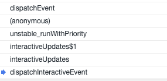

<!-- START doctoc generated TOC please keep comment here to allow auto update -->
<!-- DON'T EDIT THIS SECTION, INSTEAD RE-RUN doctoc TO UPDATE -->
**Table of Contents**  *generated with [DocToc](https://github.com/thlorenz/doctoc)*

- [dispatchEvent](#dispatchevent)
  - [主要流程](#%E4%B8%BB%E8%A6%81%E6%B5%81%E7%A8%8B)
  - [代码](#%E4%BB%A3%E7%A0%81)
- [handleTopLevel](#handletoplevel)
  - [主要流程](#%E4%B8%BB%E8%A6%81%E6%B5%81%E7%A8%8B-1)
  - [代码](#%E4%BB%A3%E7%A0%81-1)
- [runEventsInBatch 【批执行】事件回调入口](#runeventsinbatch-%E6%89%B9%E6%89%A7%E8%A1%8C%E4%BA%8B%E4%BB%B6%E5%9B%9E%E8%B0%83%E5%85%A5%E5%8F%A3)
  - [主要流程](#%E4%B8%BB%E8%A6%81%E6%B5%81%E7%A8%8B-2)
  - [executeDispatchesAndRelease](#executedispatchesandrelease)
    - [主要流程](#%E4%B8%BB%E8%A6%81%E6%B5%81%E7%A8%8B-3)
  - [executeDispatchesInOrder 按顺序处理调用事件回调函数](#executedispatchesinorder-%E6%8C%89%E9%A1%BA%E5%BA%8F%E5%A4%84%E7%90%86%E8%B0%83%E7%94%A8%E4%BA%8B%E4%BB%B6%E5%9B%9E%E8%B0%83%E5%87%BD%E6%95%B0)
    - [主要流程](#%E4%B8%BB%E8%A6%81%E6%B5%81%E7%A8%8B-4)
- [executeDispatch](#executedispatch)
  - [主要流程](#%E4%B8%BB%E8%A6%81%E6%B5%81%E7%A8%8B-5)
- [附](#%E9%99%84)
  - [invokeGuardedCallbackAndCatchFirstError & rethrowCaughtError](#invokeguardedcallbackandcatchfirsterror--rethrowcaughterror)
    - [主要流程](#%E4%B8%BB%E8%A6%81%E6%B5%81%E7%A8%8B-6)
  - [getNodeFromInstance](#getnodefrominstance)
  - [dispatchEvent前的部分逻辑](#dispatchevent%E5%89%8D%E7%9A%84%E9%83%A8%E5%88%86%E9%80%BB%E8%BE%91)
  - [_enabled 变量的作用？](#_enabled-%E5%8F%98%E9%87%8F%E7%9A%84%E4%BD%9C%E7%94%A8)

<!-- END doctoc generated TOC please keep comment here to allow auto update -->

 

# dispatchEvent
## 主要流程
参数：topLevelType 表示当前触发的事件名称如click，nativeEvent则表示浏览器传递给回调函数的event对象
1. _enabled 主要用来表示当前是否处于commIt阶段
2. getEventTarget 用于从event对象中获取触发的dom元素（并不是订阅了事件的dom，只是该dom是个start，后面会从树结构中自该节点网上去搜索到订阅事件的所有dom节点）， getClosestInstanceFromNode则用于获取其关联的Fiber对象
    - getClosestInstanceFromNode 从方法名称及实现上来看，获取自该节点向上最近的Fiber对象，通常来说每个真实dom节点都会有关联的fiber对象。什么样的情况下会存在dom关联的fiber不存在呢？【TODO】what case?
    - 另外 getClosestInstanceFromNode 方法中的 node.internalInstanceKey 属性，是在completeWork中创建真实dom时调用precacheFiberNode方法进行关联的，真实dom元素就是通过该属性来关联fiber对象的。
3. 中间的if判断表示 targetInst 可能尚未挂载到页面中，从注释中来看这种情况是暂时先不处理，等挂载到页面后，再派发事件【TODO】what case?
4. getTopLevelCallbackBookKeeping 就是返回一个包含topLevelType，nativeEvent，targetInst，ancestors属性的对象
    - 前三个属性已经很清楚了，ancestors 【TODO】
5. 调用 batchedUpdates
    - batchedUpdates$1，
        - 进入批处理流程 设置 isBatchingUpdates  为 true，执行回调：handleTopLevel
        - finally里的逻辑：如果不处于批处理阶段了，则执行 performSyncWork（如果在批处理过程中产生了新的工作如在事件回调函数中(多次)调用了setState，则会在这里统一处理这期间产生的工作，这样也是批处理的含义。
    - finally是处理什么情况的【TODO】what case?
6. 调用 releaseTopLevelCallbackBookKeeping：目的是释放  bookKeeping 对其他对象的引用，本身可以不去这件事情的，但是react通过一个callbackBookkeepingPool 这样的池子回收利用该对象，那么就有必要做这件事情了。所有用到池子思想的其实都是使用了设计模式中的享元模式

## 代码
```javascript
function dispatchEvent(topLevelType, nativeEvent) {
  if (!_enabled) {
    return;
  }

  var nativeEventTarget = getEventTarget(nativeEvent);
  var targetInst = getClosestInstanceFromNode(nativeEventTarget);
  if (targetInst !== null && typeof targetInst.tag === 'number' && !isFiberMounted(targetInst)) {
    targetInst = null;
  }

  var bookKeeping = return {(topLevelType, nativeEvent, targetInst);

  try {
    // Event queue being processed in the same cycle allows
    // `preventDefault`.
    batchedUpdates(handleTopLevel, bookKeeping);
  } finally {
    releaseTopLevelCallbackBookKeeping(bookKeeping);
  }
}
```

# handleTopLevel
## 主要流程
1. 找到所有的 ancestor，通常情况下bookKeeping.ancestors只包含一个fiber对象，就是 targetInst 
    - findRootContainerNode 是通过给定的fiber节点找到HostRoot
    - 那么什么情况下会存在多个或者零个 ancestor呢？【TODO】what case?
        - 一个React应用可能存在多次ReactDom.render，此时可能会存在多个HostRoot?
        - 当前 targetInst 所在的HostRoot被移除了？
        ```html
       <div id='app'></div>
       ReactDom.render(xxx,document.getElementById('app'))
        ```


2. 遍历 ancestors 执行 runExtractedEventsInBatch，该方法做了两件事情
```javascript
function runExtractedEventsInBatch(topLevelType, targetInst, nativeEvent, nativeEventTarget) {
  var events = extractEvents(topLevelType, targetInst, nativeEvent, nativeEventTarget);
  runEventsInBatch(events);
}
```
- 调用 extractEvents 见提取合成事件章节
- 调用 runEventsInBatch

## 代码
```javascript
function handleTopLevel(bookKeeping) {
  var targetInst = bookKeeping.targetInst; 
  var ancestor = targetInst;
  do {
    // 针对第一次进入while循环的情况，因为do-while至少会执行一次循环体
    if (!ancestor) {
      bookKeeping.ancestors.push(ancestor);
      break;
    }
    var root = findRootContainerNode(ancestor);
    if (!root) {
      break;
    }
    bookKeeping.ancestors.push(ancestor);
    ancestor = getClosestInstanceFromNode(root);
  } while (ancestor);

  for (var i = 0; i < bookKeeping.ancestors.length; i++) {
    targetInst = bookKeeping.ancestors[i];
    runExtractedEventsInBatch(bookKeeping.topLevelType, targetInst, bookKeeping.nativeEvent, getEventTarget(bookKeeping.nativeEvent));
  }
}
```

# runEventsInBatch 【批执行】事件回调入口
## 主要流程
1. 遍历事件对象，调用executeDispatchesAndReleaseTopLevel => executeDispatchesAndRelease 执行所有的事件回调函数 
2. 执行完所有的事件回调函数，调用rethrowCaughtError 将执行期间产生的异常抛出 见附录
    - 注意，在这次事件处理中，可能会存在多个事件回调函数被执行，事件回调函数如果出现异常均会被catch捕获，因此不会影响后续的后面的事件回调函数的执行
    - 整个期间产生的多次异常，只有第一次异常报错，会被抛出。是因为只在最外层调用了rethrowCaughtError。
    ```javascript
   function runEventsInBatch(events) {
     if (events !== null) {
       eventQueue = accumulateInto(eventQueue, events);
     }
   
     // Set `eventQueue` to null before processing it so that we can tell if more
     // events get enqueued while processing.
     var processingEventQueue = eventQueue;
     eventQueue = null;
   
     if (!processingEventQueue) {
       return;
     }
   
     forEachAccumulated(processingEventQueue, executeDispatchesAndReleaseTopLevel);
     !!eventQueue ? invariant(false, 'processEventQueue(): Additional events were enqueued while processing an event queue. Support for this has not yet been implemented.') : void 0;
     // This would be a good time to rethrow if any of the event handlers threw.
     rethrowCaughtError();
   }
    ```


## executeDispatchesAndRelease
### 主要流程
1. 调用事件回调函数
2. 释放事件对象 参考合成事件章节关于事件对象池子的管理
```javascript
var executeDispatchesAndReleaseTopLevel = function (e) {
  return executeDispatchesAndRelease(e);
};

var executeDispatchesAndRelease = function (event) {
  if (event) {
    executeDispatchesInOrder(event);

    if (!event.isPersistent()) {
      event.constructor.release(event); // 
    }
  }
};
```


## executeDispatchesInOrder 按顺序处理调用事件回调函数
顺序：指的是事件回调函数的执行顺序，在提取合成事件章节说过，事件的回调函数，是先按照捕获阶段从根节点执行到触发节点，然后再从触发节点按照冒泡阶段执行到根节点

### 主要流程
1. 如果当前有多个dom需要触发事件回调，即dispatchListeners 是数组，那么遍历数组，执行executeDispatch
    - 如果中间某个事件回调函数执行了 e.stopPropagation 则阻止事件继续传播，即后面的事件回调函数都不会去执行，react的合成事件改写了stopPropagation，每个事件对象实例都有一个stopPropagation函数，调用该函数会去设置事件对象上的isPropagationStopped属性，通过这个标志来进行事件传播的判断。
2. 如果只要一个事件回调函数，则直接执行事件回调函数
```javascript
function executeDispatchesInOrder(event) {
  var dispatchListeners = event._dispatchListeners;
  var dispatchInstances = event._dispatchInstances; 
  if (Array.isArray(dispatchListeners)) {
    for (var i = 0; i < dispatchListeners.length; i++) {
      if (event.isPropagationStopped()) {
        break;
      }
      // Listeners and Instances are two parallel arrays that are always in sync.
      executeDispatch(event, dispatchListeners[i], dispatchInstances[i]);
    }
  } else if (dispatchListeners) {
    executeDispatch(event, dispatchListeners, dispatchInstances);
  }
  event._dispatchListeners = null;
  event._dispatchInstances = null;
}
```


# executeDispatch
## 主要流程
1. 调用getNodeFromInstance方法，通过fiber节点获取关联真实dom
2. 在能够捕获异常的方法中去执行我们的事件回调函数
    - 见 附录中的 invokeGuardedCallbackAndCatchFirstError
```javascript
function executeDispatch(event, listener, inst) {
  var type = event.type || 'unknown-event';
  event.currentTarget = getNodeFromInstance(inst); // 见附，参数中的inst是fiber对象，这里要找到关联的真实dom
  invokeGuardedCallbackAndCatchFirstError(type, listener, undefined, event);
  event.currentTarget = null;
}
```


# 附
## invokeGuardedCallbackAndCatchFirstError & rethrowCaughtError
### 主要流程
1. 调用invokeGuardedCallback：通过在try-catch中去执行我们的事件回调函数，如果执行过程中出现异常，则设置全局变量 hasError 和 caughtError
2. 如果有异常，则调用clearCaughtError重置hasError, 并且 设置 hasRethrowError rethrowError信息，后者的错误信息是通过 rethrowCaughtError 对外抛出的

注意 hasRethrowError rethrowError 只能够在rethrowCaughtError方法中恢复为初始值，因此在第一次回调出现过异常之后，没有去调用rethrowCaughtError，则后面的异常虽然可以通过 hasError 和 caughtError去标识，但是并不能够通过rethrowCaughtError对外抛出了，因此 rethrowCaughtError 总是抛出第一次的异常
```javascript
function invokeGuardedCallbackAndCatchFirstError(name, func, context, a, b, c, d, e, f) {
  invokeGuardedCallback.apply(this, arguments);
  if (hasError) {
    var error = clearCaughtError();
    if (!hasRethrowError) {
      hasRethrowError = true;
      rethrowError = error;
    }
  }
}

function invokeGuardedCallback(name, func, context, a, b, c, d, e, f) {
  // 重置  
  hasError = false; 
  caughtError = null;
  // 在 try-catch中去执行
  invokeGuardedCallbackImpl$1.apply(reporter, arguments); // 注意这里设置了执行函数体的this 为reporter
}

var invokeGuardedCallbackImpl$1 = invokeGuardedCallbackImpl;

// production环境下走这里，devlopment环境下是另外的实现
// 见源文件 packages/shared/invokeGuardedCallbackImpl.js
var invokeGuardedCallbackImpl = function (name, func, context, a, b, c, d, e, f) {
  var funcArgs = Array.prototype.slice.call(arguments, 3);
  try {
    func.apply(context, funcArgs);
  } catch (error) {
    this.onError(error);
  }
};

var reporter = {
  onError: function (error) {
    hasError = true;
    caughtError = error;
  }
};

function rethrowCaughtError() {
  if (hasRethrowError) {
    var error = rethrowError;
    hasRethrowError = false;
    rethrowError = null;
    throw error;
  }
}
```

## getNodeFromInstance
```javascript
setComponentTree(getFiberCurrentPropsFromNode$1, getInstanceFromNode$1, getNodeFromInstance$1);
```

```javascript
function getNodeFromInstance$1(inst) {
  if (inst.tag === HostComponent || inst.tag === HostText) { 
    return inst.stateNode;
  } 
}
```

## dispatchEvent前的部分逻辑
从事件回调函数入口开始 dispatchInteractiveEvent，interactiveUpdates$1的作用是使用react提供的调度系统进行调度【为什么对于交互式的事件需要这么处理？TODO】，而实际事件派发的入口在dispatchEvent（前面的调用栈见附


```javascript
function setBatchingImplementation(batchedUpdatesImpl, interactiveUpdatesImpl, flushInteractiveUpdatesImpl) {
  _batchedUpdatesImpl = batchedUpdatesImpl;
  _interactiveUpdatesImpl = interactiveUpdatesImpl;
  _flushInteractiveUpdatesImpl = flushInteractiveUpdatesImpl;
}
// 全局执行
setBatchingImplementation(batchedUpdates$1, interactiveUpdates$1, flushInteractiveUpdates$1);
```

```javascript
function dispatchInteractiveEvent(topLevelType, nativeEvent) {
  interactiveUpdates(dispatchEvent, topLevelType, nativeEvent);
}

function interactiveUpdates(fn, a, b) {
  return _interactiveUpdatesImpl(fn, a, b); // 实际指向 interactiveUpdates$1
}
```

```javascript
function interactiveUpdates$1(fn, a, b) {
  // 【TODO】举例
  if (!isBatchingUpdates && !isRendering && lowestPriorityPendingInteractiveExpirationTime !== NoWork) {
    // Synchronously flush pending interactive updates.
    performWork(lowestPriorityPendingInteractiveExpirationTime, false);
    lowestPriorityPendingInteractiveExpirationTime = NoWork;
  }
  var previousIsBatchingUpdates = isBatchingUpdates;
  isBatchingUpdates = true;
  try {
    return scheduler.unstable_runWithPriority(scheduler.unstable_UserBlockingPriority, function () {
      return fn(a, b);
    });
  } finally {
    isBatchingUpdates = previousIsBatchingUpdates;
    if (!isBatchingUpdates && !isRendering) {
      performSyncWork();
    }
  }
}
```

```javascript
function batchedUpdates$1(fn, a) {
  var previousIsBatchingUpdates = isBatchingUpdates;
  isBatchingUpdates = true;
  try {
    return fn(a);
  } finally {
    isBatchingUpdates = previousIsBatchingUpdates;
    if (!isBatchingUpdates && !isRendering) {
      performSyncWork();
    }
  }
}
```

## _enabled 变量的作用？
```javascript
// 唯一修改该变量的地方 prepareForCommit 和 resetAfterCommit ，见 commitRoot 对这两个方法的调用
function setEnabled(enabled) {
  _enabled = !!enabled;
}

function prepareForCommit(containerInfo) {
  eventsEnabled = isEnabled();
  ...
  setEnabled(false);
}

function resetAfterCommit(containerInfo) {
    ...
    setEnabled(eventsEnabled);
    ...
    eventsEnabled = null;
}
```

