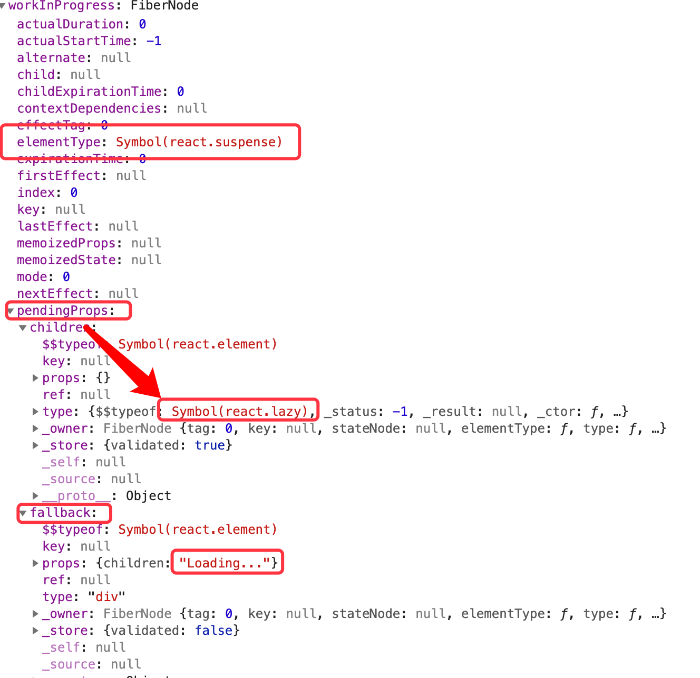
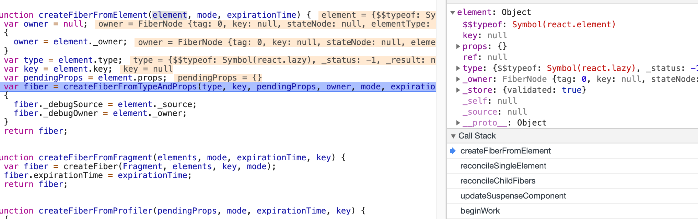
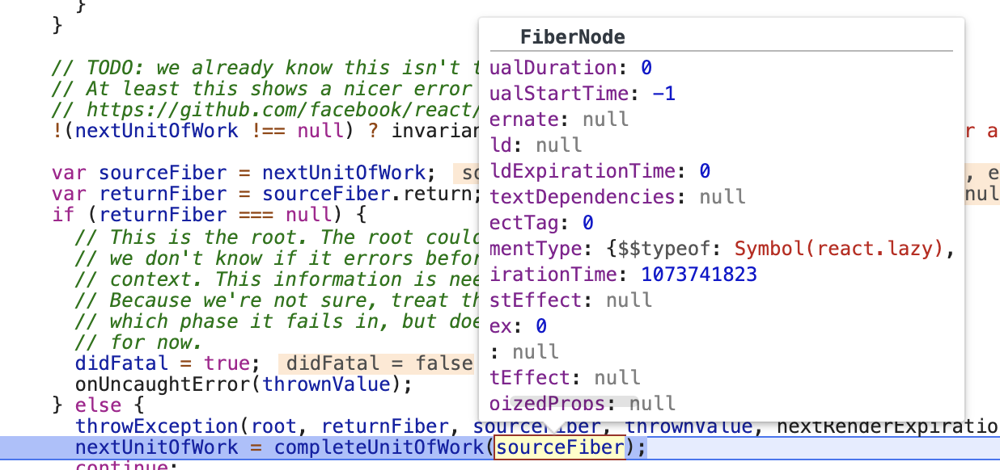
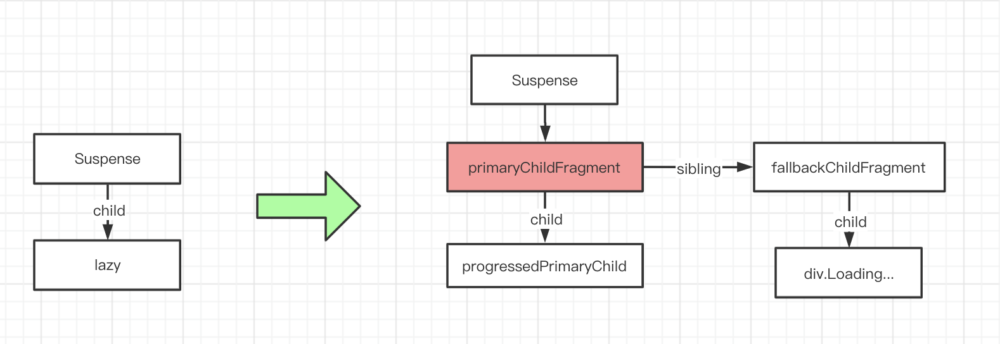
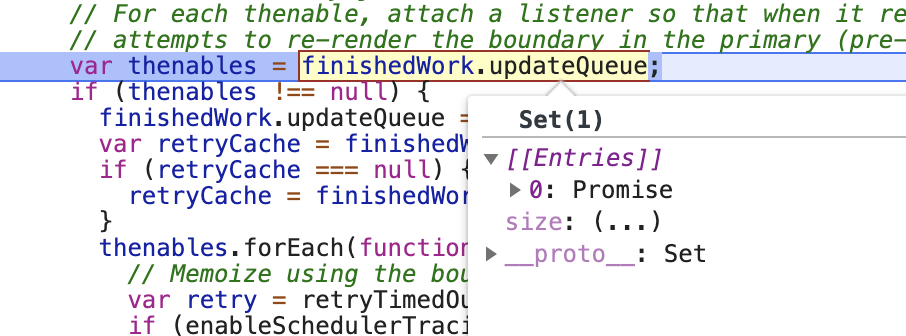
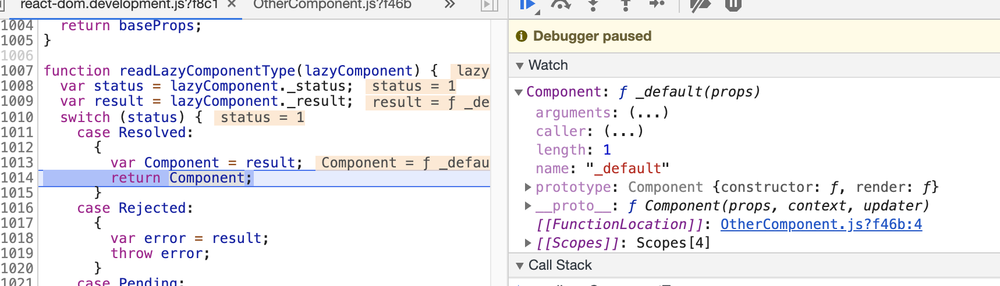
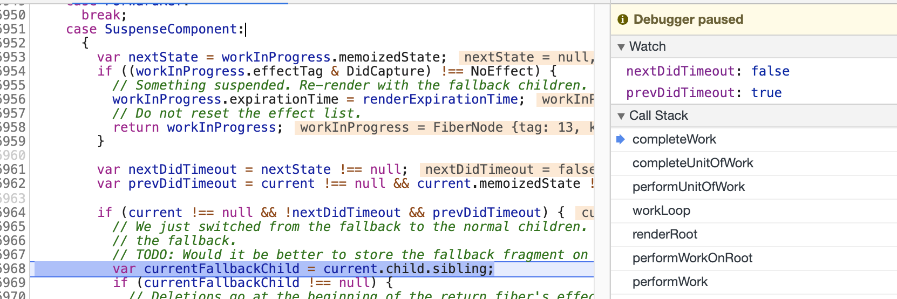
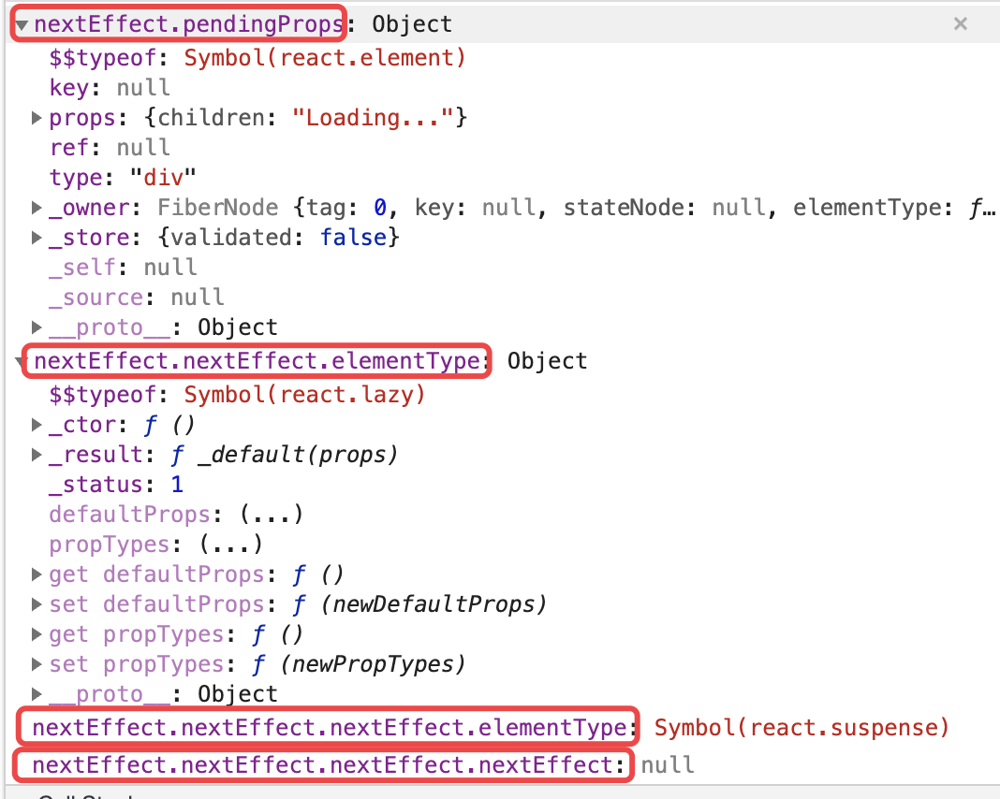
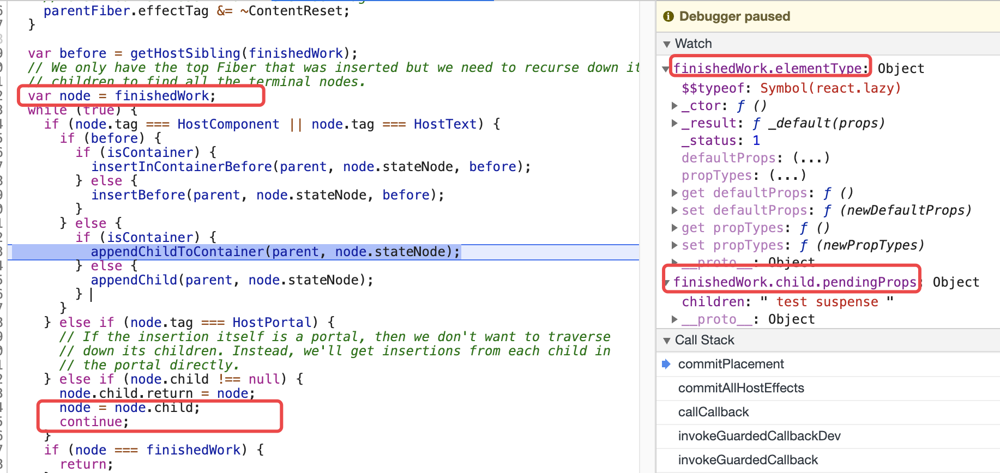
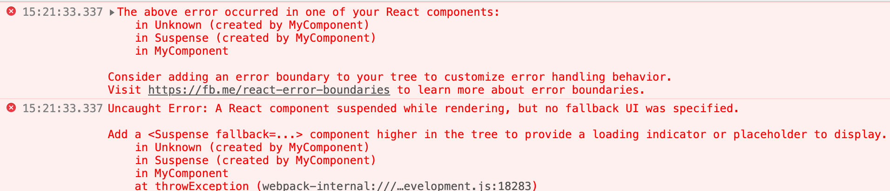

<!-- START doctoc generated TOC please keep comment here to allow auto update -->
<!-- DON'T EDIT THIS SECTION, INSTEAD RE-RUN doctoc TO UPDATE -->
**Table of Contents**  *generated with [DocToc](https://github.com/thlorenz/doctoc)*

- [示例demo](#%E7%A4%BA%E4%BE%8Bdemo)
- [代码结构](#%E4%BB%A3%E7%A0%81%E7%BB%93%E6%9E%84)
  - [React.lazy](#reactlazy)
  - [updateSuspenseComponent](#updatesuspensecomponent)
- [挂载阶段](#%E6%8C%82%E8%BD%BD%E9%98%B6%E6%AE%B5)
  - [render阶段](#render%E9%98%B6%E6%AE%B5)
  - [commit阶段 commitWork -> SuspenseComponent](#commit%E9%98%B6%E6%AE%B5-commitwork---suspensecomponent)
- [更新阶段： retryTimedOutBoundary](#%E6%9B%B4%E6%96%B0%E9%98%B6%E6%AE%B5-retrytimedoutboundary)
  - [render阶段](#render%E9%98%B6%E6%AE%B5-1)
    - [beginWork(suspense_fiber) : updateSuspenseComponent](#beginworksuspense_fiber--updatesuspensecomponent)
    - [beginWork(lazy_fiber) : mountLazyComponent](#beginworklazy_fiber--mountlazycomponent)
    - [completeUnitOfWork -> completeWork: SuspenseComponent](#completeunitofwork---completework-suspensecomponent)
  - [commit阶段 -> commitAllHostEffects](#commit%E9%98%B6%E6%AE%B5---commitallhosteffects)
- [附](#%E9%99%84)
  - [为什么suspense组件不提供fallback，就会抛异常？](#%E4%B8%BA%E4%BB%80%E4%B9%88suspense%E7%BB%84%E4%BB%B6%E4%B8%8D%E6%8F%90%E4%BE%9Bfallback%E5%B0%B1%E4%BC%9A%E6%8A%9B%E5%BC%82%E5%B8%B8)

<!-- END doctoc generated TOC please keep comment here to allow auto update -->

 
[参考](https://zhuanlan.zhihu.com/p/54042084)

# 示例demo
```jsx harmony
const OtherComponent = React.lazy(() => {
  return new Promise((resolve) => {
    setTimeout(() => {
      const res = import('./OtherComponent');
      resolve(res);
    }, 2000);
  });
});

// OtherComponent 文件
export default class extends React.Component {
  constructor(props){
    super(props);
  }


  render(){
    return <div> test suspense </div>;
  }
}


export default function MyComponent(){
  return (
    <div>
      <Suspense fallback={<div>Loading...</div>}>
        <OtherComponent/>
      </Suspense>
    </div>
  );
}

ReactDOM.render(<MyComponent/>, document.getElementById('app'));
```

# 代码结构
## React.lazy
注意初始状态 _status: -1
```javascript
export function lazy<T, R>(ctor: () => Thenable<T, R>): LazyComponent<T> {
  let lazyType = {
    $$typeof: REACT_LAZY_TYPE,
    _ctor: ctor,
    // React uses these fields to store the result.
    _status: -1,
    _result: null,
  };

  return lazyType;
}
```

## updateSuspenseComponent
```javascript
function updateSuspenseComponent(current$$1, workInProgress, renderExpirationTime) {
  var mode = workInProgress.mode;
  var nextProps = workInProgress.pendingProps;
  var nextState = workInProgress.memoizedState;

  var nextDidTimeout = void 0;
  if ((workInProgress.effectTag & DidCapture) === NoEffect) {
      //... 第一次尝试
  } else {
    // ... 后续尝试
  }

  var child = void 0;
  var next = void 0;
  
  if (current$$1 === null) { // 挂载阶段  
    if (nextDidTimeout) {
      // ... 后续尝试
    } else { 
      // 第一次尝试进入这里
    }
  } else {                  // 更新阶段
     // ...
  }

  workInProgress.memoizedState = nextState;
  workInProgress.child = child;
  return next;
}
```

# 挂载阶段
## render阶段
解析到Suspense组件时，在beginWork进入updateSuspenseComponent，对于该fiber节点是第一次进入，此时还未给fiber.effectTag添加 DidCapture 标识，因此走第一个if条件语句，所以nextDidTimeout=false；（注意 只有 DehydratedSuspenseComponent 和 SuspenseComponent 才可能被添加这个标识
```javascript
var nextPrimaryChildren = nextProps.children;
child = next = mountChildFibers(workInProgress, null, nextPrimaryChildren, renderExpirationTime);
```




进入 mountChildFibers 调和suspense的子元素即react.lazy组件，由于是挂载阶段，会调用createFiberFromElement去创建一个nextUnitOfWork节点



然后beginWork刚创建react.lazy组件，进入mountLazyComponent方法
```javascript
function mountLazyComponent(_current, workInProgress, elementType, updateExpirationTime, renderExpirationTime) {
    ...
    var Component = readLazyComponentType(elementType);
    ...
}
```

进入readLazyComponentType，由于是第一次进入该组件，初始_status :-1，进入default分支，执行我们传递给React.lazy的函数:ctor，这里应该返回一个promise（promise的任务是加载组件的js文件），这里返回的promise添加了成功与失败回调用来设置lazyComponent的状态。 然后  throw _thenable; 会进入到 renderRoot的catch语句中
```javascript
lazyComponent._status = Pending;
var ctor = lazyComponent._ctor;
var _thenable = ctor();
_thenable.then(function (moduleObject) { // 修改_status 以及保存
  if (lazyComponent._status === Pending) {
    var defaultExport = moduleObject.default; 
    lazyComponent._status = Resolved;
    lazyComponent._result = defaultExport;
  }
}, function (error) {
  if (lazyComponent._status === Pending) {
    lazyComponent._status = Rejected;
    lazyComponent._result = error;
  }
});
// Handle synchronous thenables.
switch (lazyComponent._status) {
  case Resolved:
    return lazyComponent._result;
  case Rejected:
    throw lazyComponent._result;
}
lazyComponent._result = _thenable;
throw _thenable;
```

上面抛出异常后进入下面的catch语句，调用throwException
```javascript
function renderRoot(root, isYieldy) {
    // ...
    do {
      try {
        workLoop(isYieldy);
      } catch (thrownValue) {
        // ...
        throwException(root, returnFiber, sourceFiber, thrownValue, nextRenderExpirationTime);
        nextUnitOfWork = completeUnitOfWork(sourceFiber);
       // ...
      break;
    } while (true);
    
    // ...
}    
```

throwException：（shouldDaptureSuspense返回true，即提供了fallback）在当前案例下这部分的核心逻辑如下
1. 给lazy_fiber添加Incomplete副作用标识
2. 将readLazyComponentType 抛出的_thenable对象添加到suspense_fiber.udpateQueue中
3. 添加DidCapture到suspense_fiber.effectTag
4. 设置lazy_fiber.expirationTime = Sync

```javascript
sourceFiber.effectTag |= Incomplete;
// ...
if (value !== null && typeof value === 'object' && typeof value.then === 'function') {
    // ...
    if (_workInProgress.tag === SuspenseComponent && shouldCaptureSuspense(_workInProgress)) {
        var thenable = value;
        //...
        var thenables = _workInProgress.updateQueue;
        if (thenables === null) {
            var updateQueue = new Set();
            updateQueue.add(thenable);
            _workInProgress.updateQueue = updateQueue;
        } else {
            thenables.add(thenable);
        }
        if ((_workInProgress.mode & ConcurrentMode) === NoEffect) {
          _workInProgress.effectTag |= DidCapture;
          sourceFiber.effectTag &= ~(LifecycleEffectMask | Incomplete);
          sourceFiber.expirationTime = Sync; 
          return 
        }
        //...
    }
}
```

回到catch语句中completeUnitOfWork，此时的sourceFiber是lazy_fiber



在completeUnitOfWork中，先遍历lazy_fiber，然后会去遍历其父节点即suspense_fiber，进入completeWork的SuspenseComponent分支，然后会beginWork(suspense_fiber)，再次执行updateSuspenseComponent
```javascript
if ((workInProgress.effectTag & DidCapture) !== NoEffect) {
    // Something suspended. Re-render with the fallback children.
    workInProgress.expirationTime = renderExpirationTime;
    // Do not reset the effect list.
    return workInProgress;
}
```

updateSuspenseComponent，主要流程，改变了fiber树结构，并将fallback_fiber返回给workLoop继续往下遍历



```javascript
function updateSuspenseComponent(current$$1, workInProgress, renderExpirationTime) {
    if ((workInProgress.effectTag & DidCapture) === NoEffect) {
        // ...
    }else{
        //...
        nextDidTimeout = true;
        workInProgress.effectTag &= ~DidCapture; // 移除该标识
    }
    
    // 挂载阶段
    if (current$$1 === null) {
        if (nextDidTimeout) {
            var nextFallbackChildren = nextProps.fallback;
            var primaryChildFragment = createFiberFromFragment(null, mode, NoWork, null);
            
            if ((workInProgress.mode & ConcurrentMode) === NoContext) {
              // Outside of concurrent mode, we commit the effects from the
              var progressedState = workInProgress.memoizedState;
              var progressedPrimaryChild = progressedState !== null ? workInProgress.child.child : workInProgress.child;
              primaryChildFragment.child = progressedPrimaryChild;
            }
            
            var fallbackChildFragment = createFiberFromFragment(nextFallbackChildren, mode, renderExpirationTime, null);
            primaryChildFragment.sibling = fallbackChildFragment;
            child = primaryChildFragment;
            // Skip the primary children, and continue working on the
            // fallback children.
            next = fallbackChildFragment;
            child.return = next.return = workInProgress;
        }else{
            //...
        }
    }else{ // 更新阶段
        
    }
    
    workInProgress.memoizedState = nextState;
    workInProgress.child = child;
    return next;
}
```

上面遍历直到div.Loading元素（叶子节点了）会进入completeUnitOfWork，从该元素一直往上遍历到suspense_fiber，会进入completeWork去设置Update副作用标识
```javascript
workInProgress.effectTag |= Update;
```

## commit阶段 commitWork -> SuspenseComponent
取出throwException中设置fiber.updateQueue，里面有一个元素就是我们在 mountLazyComponent -> readLazyComponentType 抛出的promise，这个promise是React.lazy(ctor)中的参数ctor的执行结果。当这个promise执行成功后会进入这里的 retryTimedOutBoundary（这里是异步的，不会await这个promise），因此不阻塞此阶段的渲染
```javascript
var thenables = finishedWork.updateQueue;

thenables.forEach(function (thenable) {
var retry = retryTimedOutBoundary.bind(null, finishedWork, thenable);
if (enableSchedulerTracing) {
  retry = tracing.unstable_wrap(retry);
}
if (!retryCache.has(thenable)) {
  retryCache.add(thenable);
  thenable.then(retry, retry);
}
});
```




# 更新阶段： retryTimedOutBoundary
挂载阶段完成后，当React.lazy返回的promise对象resolve后，则会进入retryTimedOutBoundary，可以看到这个回调的作用就是重新来一次渲染（可以想象成在suspense组件中setState了一次，注意下面代码中的boundaryFiber是suspense_fiber
```javascript
function retryTimedOutBoundary(boundaryFiber, thenable) {
  retryCache = boundaryFiber.stateNode;
  if (retryCache !== null) {
    retryCache.delete(thenable);
  }

  var currentTime = requestCurrentTime();
  var retryTime = computeExpirationForFiber(currentTime, boundaryFiber);
  var root = scheduleWorkToRoot(boundaryFiber, retryTime);
  if (root !== null) {
    markPendingPriorityLevel(root, retryTime);
    var rootExpirationTime = root.expirationTime;
    if (rootExpirationTime !== NoWork) {
      requestWork(root, rootExpirationTime);
    }
  }
}
```

## render阶段
### beginWork(suspense_fiber) : updateSuspenseComponent
主要流程(更新阶段current$$1不等于null；prevDidTimeout: true，nextDidTimeout: false)
1. 获取_nextPrimaryChildren、 currentPrimaryChild 进行调和（回忆下throwException转换后的结构
2. 返回lazy_fiber作为nextUnitOfWork
 
```javascript
function updateSuspenseComponent(current$$1, workInProgress, renderExpirationTime) {
  //...
  if ((workInProgress.effectTag & DidCapture) === NoEffect) { 
    nextState = null;
    nextDidTimeout = false;
  } else {
    //...
  } 
  var next = void 0;
  if (current$$1 === null) {
    //...
  } else { 
    var prevState = current$$1.memoizedState;
    var prevDidTimeout = prevState !== null;
    if (prevDidTimeout) { 
      var currentPrimaryChildFragment = current$$1.child; 
      if (nextDidTimeout) {
        // ...
      } else { 
        var _nextPrimaryChildren = nextProps.children;
        var currentPrimaryChild = currentPrimaryChildFragment.child;
        var primaryChild = reconcileChildFibers(workInProgress, currentPrimaryChild, _nextPrimaryChildren, renderExpirationTime); 
        child = next = primaryChild;
      }
    } else {
      //...
    }
    workInProgress.stateNode = current$$1.stateNode;
  }

  workInProgress.memoizedState = nextState;
  workInProgress.child = child;
  return next;
}
```

### beginWork(lazy_fiber) : mountLazyComponent
1. 调用 readLazyComponentType，由于promise状态已经改变为resoved，所以直接返回Component


2. 由于案例中的OtherComponent是类组件，因此时会去调用updateClassComponent

### completeUnitOfWork -> completeWork: SuspenseComponent


主要流程 删除fallback_fiber节点（添加DeletIon副作用标识
```javascript
if (current !== null && !nextDidTimeout && prevDidTimeout) {
  // We just switched from the fallback to the normal children. Delete
  // the fallback.
  // TODO: Would it be better to store the fallback fragment on
  var currentFallbackChild = current.child.sibling;
  if (currentFallbackChild !== null) {
    // Deletions go at the beginning of the return fiber's effect list
    var first = workInProgress.firstEffect;
    if (first !== null) {
      workInProgress.firstEffect = currentFallbackChild;
      currentFallbackChild.nextEffect = first;
    } else {
      workInProgress.firstEffect = workInProgress.lastEffect = currentFallbackChild;
      currentFallbackChild.nextEffect = null;
    }
    currentFallbackChild.effectTag = Deletion;
  }
}
```

## commit阶段 -> commitAllHostEffects
completeUnitOfWork 会将所有副作用节点（至于每个fiber节点的副作用标识是在哪添加的就不细述了）添加到root节点上.（‘递归’的方式



1. 删除fallback节点（包含fiber和dom） -> commitDeletion ->( unmountHostComponents + detachFiber )
2. 添加lazy节点 -> commitPlacement 
    - lazy_fiber 非HostComponent，但存在孩子节点，因此append其孩子节点（这里只是append，创建的逻辑在completeUnitOfWork -> completeWork ：HostComponent分支



# 附
## 为什么suspense组件不提供fallback，就会抛异常？



throwException 不满足这个if
```javascript
if (_workInProgress.tag === SuspenseComponent && shouldCaptureSuspense(_workInProgress)) {
 
}

function shouldCaptureSuspense(workInProgress) {
  // In order to capture, the Suspense component must have a fallback prop.
  if (workInProgress.memoizedProps.fallback === undefined) {
    return false;
  }
  // If it was the primary children that just suspended, capture and render the
  // fallback. Otherwise, don't capture and bubble to the next boundary.
  var nextState = workInProgress.memoizedState;
  return nextState === null;
}
```

throwException 细解？

总结
...
