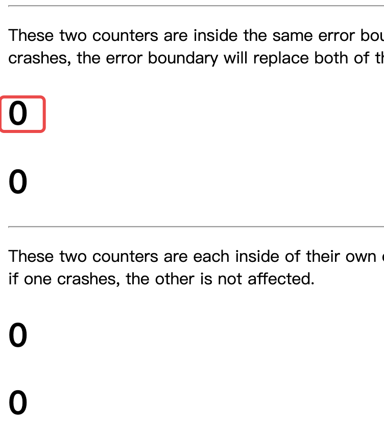
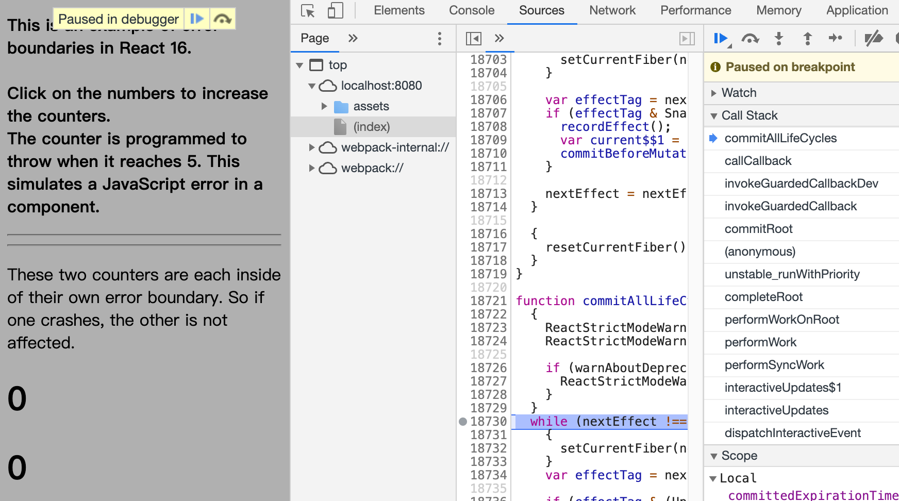

<!-- START doctoc generated TOC please keep comment here to allow auto update -->
<!-- DON'T EDIT THIS SECTION, INSTEAD RE-RUN doctoc TO UPDATE -->
**Table of Contents**  *generated with [DocToc](https://github.com/thlorenz/doctoc)*

- [如何触发](#%E5%A6%82%E4%BD%95%E8%A7%A6%E5%8F%91)
- [render阶段](#render%E9%98%B6%E6%AE%B5)
  - [前奏](#%E5%89%8D%E5%A5%8F)
  - [throwException(returnFiber: ErrorBoundary_1_fiber,sourceFiber:BuggyCounter_1_fiber)](#throwexceptionreturnfiber-errorboundary_1_fibersourcefiberbuggycounter_1_fiber)
    - [主要流程](#%E4%B8%BB%E8%A6%81%E6%B5%81%E7%A8%8B)
  - [completeUnitOfWork(BuggyCounter_1_fiber)](#completeunitofworkbuggycounter_1_fiber)
- [commit阶段](#commit%E9%98%B6%E6%AE%B5)
  - [commitAllHostEffects](#commitallhosteffects)
  - [commitLifeCycles -> commitLifeCycles(ErrorBoundary_1_fiber)](#commitlifecycles---commitlifecycleserrorboundary_1_fiber)
- [总结](#%E6%80%BB%E7%BB%93)

<!-- END doctoc generated TOC please keep comment here to allow auto update -->

 

[React高级话题之Error Boundaries](https://juejin.im/post/6844903728412114951)

ErrorBoundary组件的定义了：实现了 static getDerivedStateFromError() or componentDidCatch() 的类组件<br/>
static getDerivedStateFromError：可以用来生成falback ui<br/>
componentDidCatch：可以用来打印日志信息<br/>

[示例demo](../../../../../code/react-demo/src/demos/ErrorBoundary.jsx)

# 如何触发
示例中共四个计数器，本文以点击第一个计数器触发异常为例进行讲解整个过程


对应ErrorApp组件中的第一个BuggyCounter组件，该组件的父组件是一个ErrorBoundary
```jsx harmony
<ErrorBoundary>   // ErrorBoundary_1_fiber
  <p>These two counters are inside the same error boundary. If one crashes, the error boundary will replace both
    of them.</p>
  <BuggyCounter/> // BuggyCounter_1_fiber
  <BuggyCounter/> // BuggyCounter_2_fiber
</ErrorBoundary>
```

# render阶段
## 前奏
触发时机：点击BuggyCounter的按钮，当计数器等于5时抛出异常，可以知道入口在setState：classComponentUpdater.enqueueSetState
```javascript
handleClick(){
  this.setState(({ counter }) => ({
    counter: counter + 1,
  }));
}
```

在scheduleWork -> scheduleWorkToRoot设置了，设置了fiber.expirationTime，以及从该节点至根节点的childExpirationTime<br/>
-> requestWork ：有在事件机制中 处于批处理阶段，在这里返回了。然后在interactiveUpdates$1 -> performSyncWork（为甚么不是在batchedUpdates$1 去执行这个perfomSyncWork【TODO】

跳过没有更新的节点，直接来到setState的这个节点<br/>
beginWork(BuggyCounter_1_fiber) -> updateClassComponent -> finishClassComponent -> instance.render：抛出异常 -> 来到renderRoot的catch语句中，主要流程如下
throwException(root, returnFiber, sourceFiber, thrownValue, nextRenderExpirationTime);
nextUnitOfWork = completeUnitOfWork(sourceFiber);
continue;

## throwException(returnFiber: ErrorBoundary_1_fiber,sourceFiber:BuggyCounter_1_fiber)
执行其后半部分，前半部分（if条件语句块）是针对suspense组件的情况
### 主要流程
1. 添加副作用标识Incomplete， 在completeUnitOfWork会被用到，completeUnitOfWork的else分支，就是用来处理这种异常情况
2. 由于组件渲染出错，重置该fiber的副作用链表
3. renderDidError，全局变量 nextRenderDidError的作用 【TODO】
4. 自该节点的父节点(ErrorBoundary_1_fiber)开始遍历，直到遇到fiber.ClassComponent为ClassComponent或者HostRoot（对于该案例来说，这个节点就是ErrorBoundary
    - 然后对节点添加ShouldCapture副作用标识（如果类组件实现了getDerivedStateFromError 或者 componentDidCatch 方法
    - 调用createClassErrorUpdate创建一个更新对象
    - 调用enqueueCapturedUpdate 将更细对象添加到fiber.firstCapturedUpdate
    > 注意payload和callback的区别：对应合并对象和添加到fIber.udpateQueue的副作用链表中
```javascript
function createClassErrorUpdate(fiber, errorInfo, expirationTime) {
  var update = createUpdate(expirationTime);
  update.tag = CaptureUpdate;
  var getDerivedStateFromError = fiber.type.getDerivedStateFromError;
  if (typeof getDerivedStateFromError === 'function') {
    var error = errorInfo.value;
    
    // updateClassComponent会调用processUpdateQueue，以获取最新的state，
    // 如果类实现了该静态方法，那么该静态方法返回的数据会被合并到state中(类似getDerivedStateFromProps)
    update.payload = function () {
      return getDerivedStateFromError(error);
    };
  }

  var inst = fiber.stateNode;
  if (inst !== null && typeof inst.componentDidCatch === 'function') {
    // 在processUpdateQueue被添加到副作用链表中，
    // 在commitRoot -> commitAllLifeCycles -> commitLifeCycles -> commitUpdateQueue -> commitUpdateEffects被执行
    update.callback = function callback() {
        //...
      this.componentDidCatch(error, {
        componentStack: stack !== null ? stack : ''
      });
    };
  }
  return update;
}
```

## completeUnitOfWork(BuggyCounter_1_fiber)
1. BuggyCounter_1_fiber
    - 因为该fiber添加了Incomplete会进入else分支
        - unwindWork，
        - 如果父节点不为空，给父节点（对应案例中的ErrorBoundary_1_fiber）添加副租用标识Incomplete
        - 返回siblingFiber：即设置nextUnitOfWork: BuggyCounter_2_fiber
2. beginWork(BuggyCounter_2_fiber) -> completeUnitOfWork(BuggyCounter_2_fiber) -> completeUnitOfWork(ErrorBoundary_1_fiber)
3. ErrorBoundary_1_fiber设置了Incomplete标识，会进入else分支
    - unwindWork，由于ErrorBoundary_1_fiber在throwException中设置了ShouldCapture标识，这里会返回自身 -> beginWork(ErrorBoundary_1_fiber)
```javascript    
function unwindWork(workInProgress, renderExpirationTime) {
  switch (workInProgress.tag) {
    case ClassComponent:
      {
        var Component = workInProgress.type;
        //...
        var effectTag = workInProgress.effectTag;
        if (effectTag & ShouldCapture) {
          workInProgress.effectTag = effectTag & ~ShouldCapture | DidCapture;
          return workInProgress;
        }
        return null;
      }
      //...
    }
}
```

4. beginWork(ErrorBoundary_1_fiber)
     - -> updateClassComponent: 
        - processUpdateQueue，如果更新对象有callback则保存到副作用链表中，这里是和异常相关的更新对象，添加到fiber.firstCapturedEffect【TODO】该函数的作用
        - 返回 shouldUpdate: false

    - -> finishClassComponent，由于设置nextChildren为null，然后调用了reconcileChildren，会给ErrorBoundary_1_fiber的孩子节添加副作用标识Deletion，因此我们在commit阶段可以看到内容被删除了
```javascript
function finishClassComponent(current$$1, workInProgress, Component, shouldUpdate, hasContext, renderExpirationTime) {
    //...
     if (didCaptureError && typeof Component.getDerivedStateFromError !== 'function') { 
        nextChildren = null; 
      }else {...}
    //...
    reconcileChildren(current$$1, workInProgress, nextChildren, renderExpirationTime);
    //...
}
```

# commit阶段
## commitAllHostEffects
删除了ErrorBoundary_1_fiber节点下的元素


## commitLifeCycles -> commitLifeCycles(ErrorBoundary_1_fiber) 
-> ClassComponent -> commitUpdateEffects(finishedQueue.firstCapturedEffect, instance);  
执行在throwException在添加的更新对象中的回调，在该回调中会调用组件componentDidCatch的方法。我们示例代码中去setState了 ，提供了根据错误状图去更新页面视图的机会

# 总结
1. 本文示例中实际是通过componentDidCatch去setState去更新视图；事实上在static  getDerivedStateFromError返回状态更新视图感觉更加合理的（官方文档也提出在这里render fallback ui，在componentDidCatch去打印日志信息)；之所以这么说，从本文的分析中可以得到答案
    - 使用这种方式static  getDerivedStateFromError时，由于在更新ErrorBoundary时会合并该方法返回的状态，此时的状态时最新的，因此在这个过程中就可以直接获取最新的ui
    - 而使用componentDidCatch方式是需要发起另一个‘更新’ ，重新走一次更新流程单独为该组件更新ui。所以其实从性能上来说，这种方式耗费了更多的资源。
2. 官网中提到ErrorBoundary 有几种场景不能处理，比如在事件回调中引起的错误不会被捕获，从本文分析看到throwException是关键，只有一个组件的render阶段处理的逻辑才会被捕获。而事件回调并不在这个阶段，该阶段主要是包含了部分生命周期（参考生命周期章节，对生命周期的阶段进行了区分）的执行以及fiber树的调和
```javascript
function renderRoot(root, isYieldy) {
    do {
        try {
            workLoop(isYieldy);
        } catch (thrownValue) {
            throwException(root, returnFiber, sourceFiber, thrownValue, nextRenderExpirationTime);
            nextUnitOfWork = completeUnitOfWork(sourceFiber);
            continue;    
        }
    break;
    } while (true);
}
```


