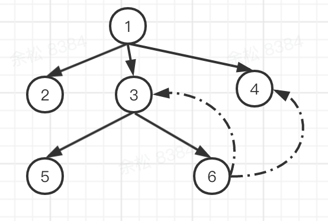

 
# Module
模块分类：
- require(xxx) 会生成一个内部模块（或者称为启动模块），该内部模块依赖xxx，称xxx为依赖模块，makeModuleMap 方法中可以看出二者的区别，启动模块的名称是内部生成的
- text!xx.json：这中形式我称为插件资源模块，仅为了方便表述

## 状态介绍
- inited：启动模块在自创建module实例时候就已经设置该属性为true，依赖模块只有等到所在脚本加载并执行完成后调用callGetModule才会设置属性为true
该属性设置为true后，表明该模块已经开始进行定义了
- enabled
- fetched：启动创建脚本并添加到doc中进行脚本的加载
- defined

## 实例方法
### init
下面有main模块的案例，就这个案例说个情况，_@r3会在其enable方法调用main_moudle.enable(此时由于此时main_moudle的deps还是空），即此时main_module.enabled为true，但其实此时的main.js尚未加载过，后面当脚本加载执行完后会走这里的init，此时还是应该要main_modudle.enable下。
```javascript
init: function (depMaps, factory, errback, options) {
    // ...
    if (options.enabled || this.enabled) { 
        this.enable(); 
    } else {
        this.check();
    }
}
```

### enable
主要流程：加载当前模块的依赖模块，并且在其依赖模块上添加defined事件，当其依赖模块完成定义后会触发defined事件，defined的回调函数中进行依赖保存，并调用this.check检查当前模块的状态是否可以完成定义
```javascript
enable: function () {
    // ...
    each(this.depMaps, bind(this, function (depMap, i) {
        var id, mod, handler;
        // ...
        if (typeof depMap === 'string') {
            // ...
            this.depCount += 1;

            on(depMap, 'defined', bind(this, function (depExports) {
                this.defineDep(i, depExports);
                this.check();
            }));
            
            // ...
        }
        // ...
        context.enable(depMap, this);
    }));

    // ...
    
    this.check();
}
```

### check
主要流程：根据模块的状态判断下一步动作，如果当前模块尚未启动加载流程（未尝试过加载所在js文件），另外就是检查当前模块是否可以结束自身的定义
```javascript
check: function () {
    // ...

    if (!this.inited) {
        this.fetch();
    } else if (this.error) {
        this.emit('error', this.error);
    } else if (!this.defining) { 
         //... 
        if (this.depCount < 1 && !this.defined) {
            if (isFunction(factory)) {
                // 省略异常相关代码...
                exports = context.execCb(id, factory, depExports, exports);
                // 省略支持commonjs规范相关代码
                // 省略异常相关代码...
            } else {
                exports = factory;
            }

            this.exports = exports;

            if (this.map.isDefine && !this.ignore) {
                defined[id] = exports;
                // ...
            } 
            cleanRegistry(id);
            this.defined = true;
        }
        // 触发该模块的defined事件
        this.emit('defined', this.exports);
    }
}
```

### fetch
对于普通的js模块，构建script标签并添加到doc中加载模块所在js文件（这里会将module.id关联到script标签中，那么则事件回调函数中就可以找到关联的module）。当js文件加载并执行完成后会进入成功回调函数
```javascript
fetch: function () {
    if (this.fetched) {
        return;
    }
    this.fetched = true;
    context.startTime = (new Date()).getTime(); // 用来计算当前模块的脚本的加载是否过期
    var map = this.map;

   // 省略shim的情况
   return map.prefix ? this.callPlugin() : this.load();// this.load 构造script标签加载资源
},
```

当js资源请求成功后，会执行js文件，如果js文件中有调用define进行模块的定义，会被放进globalDefQueue （见define方法），成功执行js文件后，则进入script的load事件回调函数中onScriptLoad
```javascript
onScriptLoad: function (evt) {
    //... 
    var data = getScriptData(evt);
    context.completeLoad(data.id);
},
```

completeLoad：取出 globalDefQueue 中的数据（即刚js文件定义的模块的信息），调用callGetModule启动当前模块的定义
```javascript
completeLoad: function (moduleName) {
    var found, args, mod,
        shim = getOwn(config.shim, moduleName) || {},
        shExports = shim.exports;

    takeGlobalQueue();

    while (defQueue.length) {
        args = defQueue.shift();
        if (args[0] === null) {
            args[0] = moduleName; 
            if (found) {
                break;
            }
            found = true;
        } else if (args[0] === moduleName) {
            found = true;
        }

        callGetModule(args);
    }

    // 对于加载完成的js文件为执行define进行模块定义的异常情况进行处理 ...
    
    // 主要检查循环依赖的问题    
    checkLoaded();
}
```

# checkLoaded：检查模块加载异常
模块异常的情况：循环依赖，加载超时，脚本执行报错等情况

## 主要流程
1. 遍历 enabledRegistry ，
    - 如果是require(entry_module)时生成的启动模块会放进 reqCalls 中
        - reqCalls 存放启动级别的模块，后续检测循环依赖，就是以该数组中的模块开始往下查找的。
    - !mod.inited && expired => 脚本尚未加载完成并且已经过期，则尝试是否有备用的url，有的话采用备用url重新加载，如果没有则从doc中删除script标签
    - 不满足b条件下，!mod.inited && mod.fetched && map.isDefine => 模块正在加载中，如果该模块不是插件资源模块即是正常的依赖模块，那么处于正在加载过程中是正常的因此无需尝试去检查循环依赖
        - isDefine:true 表示依赖模块
2. 如果有加载超时的模块，那么抛出异常：makeError + onError
3. 如果需要进行循环依赖的检查，则遍历 reqCalls ，针对每个启动模块进行循环依赖的检查：breakCycle
```javascript
each(reqCalls, function (mod) {
    var processed = {}, traced = {};
    breakCycle(mod, traced, processed);
});
```
4. 如果存在资源正在加载中并且未超时，则启动定时器调用checkLoaded（定期检查

## breakCycle：循环依赖检查（如何判断一棵树是否存在循环？
[示例代码](../../../../code/require.js/cycle-demo/index.html)

### 案例
main模块依赖A模块，A模块依赖B模块，B又依赖A模块


 
breakCycle中发现B依赖A，直接假定A完成了定义，解决B不因为依赖A而挂着

### 代码
- traced[id]用来表示节点是否被跟踪过，processed[id]表示该节点是否遍历完成；
- 思想：（递归）深度优先遍历树，如果发现子孙节点依赖父节点的情况，则说明存在循环依赖；
- 代码的主要流程：当前遍历的节点X，深度优先遍历该节点，判断是否存在孩子节点指向该节点；（以当前节点为中心）



```javascript
function breakCycle(mod, traced, processed) {
    var id = mod.map.id;

    if (mod.error) {
        mod.emit('error', mod.error);
    } else {
        traced[id] = true;
        each(mod.depMaps, function (depMap, i) {
            var depId = depMap.id, dep = getOwn(registry, depId);
            if (dep && !mod.depMatched[i] && !processed[depId]) {
                if (getOwn(traced, depId)) {  // 存在循环依赖，6依赖3的情况
                    mod.defineDep(i, defined[depId]); // 关键
                    mod.check();
                } else {  // 6依赖4的情况
                    breakCycle(dep, traced, processed);
                }
            }
        });
        processed[id] = true;
    }
}
```

# 以main模块加载为例介绍加载流程
[demo示例](../../../../code/require.js/main-demo/index.html)

主入口方法req/requirejs，还具备生成上下文和配置功能。主要根据是根据参数类型进行判断。我们这里只介绍模块的加载。

看下初始的配置信息，信息的获取是通过找到具备data-main属性的script标签进行解析得到的，script标签格式如下。
```html
<script src="../lib/require.js" data-main="main"></script>
```

本示例中的初始配置信息如下：


在requirejs的最后一行，会根据这个初始配置信息去加载main模块，由于这是个配置，在主入口中会调用context.configure(config);进行配置，context.configure中判断当前配置信息中如果存在deps则会加载模块
```javascript
configure: function (cfg) {
    // 省略配置信息处理 ...
    
    if (cfg.deps || cfg.callback) {
        context.require(cfg.deps || [], cfg.callback);
    }
}
```

context.makeRequire 实际指向localRequire，该函数是实际加载模块的入口
>1. makeModuleMap返回对象若干属性介绍
>2. url：资源加载的url路径，
>3. isDefine:false： If no name, then it means it is a require call, generate an /internal name.  ；require(xxx)，xxx是作为依赖模块存在，此时会生成一个内部模块作为启动模块
>4. prefix：text!a.json，这种形式才存在prefix
>5. unnormalized 以及 unnormalized 也都是和prefix相关
```javascript
// newContext的作用用来支持模块的多版本
function newContext(contextName) {
    ...
    makeRequire: function (relMap, options) {
        function localRequire(deps, callback, errback) {
            // 1. 如果deps是字符串，则直接返回定义好的模块
            
            // 2. 调用makeModuleMap包装(解析)模块相关的信息 比如模块的加载路径，id，name等
            // 3. getModule用于获取一个模块，如果没有则生成一个模块并注册到registery中
            requireMod = getModule(makeModuleMap(null, relMap));
            // 4. 开始加载启动模块，对于启动模块直接init，并进入enable实例方法加载其依赖模块；
            requireMod.init(deps, callback, errback, { enabled: true });
        }
        return localRequire;
     }
     ...
    context.require = context.makeRequire();
    return context;
}
```

启动模块的map信息如下


接着往下走，来到`_@r3.init()` -> `_@r3.enable()` 启动依赖模块的加载，注意 this.depCount = 1（依赖main.js） => 这里启动依赖模块main.js的加载

main.js加载执行完后 onScriptLoad -> completeLoad -> callGetModule -> main_module.init -> main_module.enable -> 启动main_module依赖模块的加载（注意此时main_moudle.depCount = 2） -> 开始A.js,B.js的加载

此时会去加载A.js，B.js文件；当A.js文件加载并执行完后，会调用A.init启动A模块的定义，由于A没有依赖在this.check中会完成自身的定义，并触发A模块的defined事件回调，通知main_moudle解除对A的依赖，main_moudle.depCount减一，当B也完成定义后一样通知main_moudle解除对B的依赖main_moudle.depCount减一，此时main_moudle可以完成

当main_moudle完成定义后触发自身的defined回调 -> _@r3完成了定义

## 小结
- 调用req方法主动发起启动模块的状态流转：inited -> enabled -> 
- 作为被依赖的模块被启动模块发起被动发起普通模块的状态流转：enabled -> fetched -> inited ->
