<!-- START doctoc generated TOC please keep comment here to allow auto update -->
<!-- DON'T EDIT THIS SECTION, INSTEAD RE-RUN doctoc TO UPDATE -->
**Table of Contents**  *generated with [DocToc](https://github.com/thlorenz/doctoc)*

- [1 相关知识预备](#1-%E7%9B%B8%E5%85%B3%E7%9F%A5%E8%AF%86%E9%A2%84%E5%A4%87)
  - [1.2 seaJs[CMD]与requireJs[AMD]](#12-seajscmd%E4%B8%8Erequirejsamd)
  - [1.3 LABjs](#13-labjs)
  - [1.4 CMD规范 \ AMD规范](#14-cmd%E8%A7%84%E8%8C%83-%5C-amd%E8%A7%84%E8%8C%83)
    - [1.4.1 CMD规范](#141-cmd%E8%A7%84%E8%8C%83)
    - [1.4.2 AMD规范](#142-amd%E8%A7%84%E8%8C%83)
  - [1.5 node 和 es6 的模块化](#15-node-%E5%92%8C-es6-%E7%9A%84%E6%A8%A1%E5%9D%97%E5%8C%96)
    - [1.5.1 es6](#151-es6)
    - [1.5.2 node](#152-node)
- [2 源码分析](#2-%E6%BA%90%E7%A0%81%E5%88%86%E6%9E%90)
  - [2.1初始化（首次加载完执行）](#21%E5%88%9D%E5%A7%8B%E5%8C%96%E9%A6%96%E6%AC%A1%E5%8A%A0%E8%BD%BD%E5%AE%8C%E6%89%A7%E8%A1%8C)
    - [2.1.1 newContext 结构](#211-newcontext-%E7%BB%93%E6%9E%84)
    - [2.1.2 define函数](#212-define%E5%87%BD%E6%95%B0)
    - [2.1.3 默认上下文的创建](#213-%E9%BB%98%E8%AE%A4%E4%B8%8A%E4%B8%8B%E6%96%87%E7%9A%84%E5%88%9B%E5%BB%BA)
    - [2.1.4 初始化启动配置项（cfg）](#214-%E5%88%9D%E5%A7%8B%E5%8C%96%E5%90%AF%E5%8A%A8%E9%85%8D%E7%BD%AE%E9%A1%B9cfg)
    - [2.1.5 main.js文件的加载](#215-mainjs%E6%96%87%E4%BB%B6%E7%9A%84%E5%8A%A0%E8%BD%BD)
  - [2.2 模块的加载过程](#22-%E6%A8%A1%E5%9D%97%E7%9A%84%E5%8A%A0%E8%BD%BD%E8%BF%87%E7%A8%8B)
    - [2.2.1 主动加载：以 req(cfg) 为例](#221-%E4%B8%BB%E5%8A%A8%E5%8A%A0%E8%BD%BD%E4%BB%A5-reqcfg-%E4%B8%BA%E4%BE%8B)
      - [2.2.1.1 intakeDefines](#2211-intakedefines)
      - [2.2.1.2 context.nextTick：启动内部模块的加载](#2212-contextnexttick%E5%90%AF%E5%8A%A8%E5%86%85%E9%83%A8%E6%A8%A1%E5%9D%97%E7%9A%84%E5%8A%A0%E8%BD%BD)
      - [2.2.1.3 加载内部模块的依赖模块](#2213-%E5%8A%A0%E8%BD%BD%E5%86%85%E9%83%A8%E6%A8%A1%E5%9D%97%E7%9A%84%E4%BE%9D%E8%B5%96%E6%A8%A1%E5%9D%97)
    - [2.2.2 被动加载](#222-%E8%A2%AB%E5%8A%A8%E5%8A%A0%E8%BD%BD)
      - [2.2.2.1  'text!./../test.json'](#2221--texttestjson)
      - [2.2.2.2  'durandal/indexTest'](#2222--durandalindextest)
      - [2.2.2.3  'bootstrap'](#2223--bootstrap)
    - [2.2.3 Module[状态流转]看加载流程](#223-module%E7%8A%B6%E6%80%81%E6%B5%81%E8%BD%AC%E7%9C%8B%E5%8A%A0%E8%BD%BD%E6%B5%81%E7%A8%8B)
- [3 补充](#3-%E8%A1%A5%E5%85%85)
  - [3.1 fetch 构造script标签加载资源](#31-fetch-%E6%9E%84%E9%80%A0script%E6%A0%87%E7%AD%BE%E5%8A%A0%E8%BD%BD%E8%B5%84%E6%BA%90)
  - [3.2 checkLoaded的作用](#32-checkloaded%E7%9A%84%E4%BD%9C%E7%94%A8)
    - [3.2.1 作用1：检查文件加载是否超时](#321-%E4%BD%9C%E7%94%A81%E6%A3%80%E6%9F%A5%E6%96%87%E4%BB%B6%E5%8A%A0%E8%BD%BD%E6%98%AF%E5%90%A6%E8%B6%85%E6%97%B6)
    - [3.2.2 作用2：可以给一个模块配置多个加载路径](#322-%E4%BD%9C%E7%94%A82%E5%8F%AF%E4%BB%A5%E7%BB%99%E4%B8%80%E4%B8%AA%E6%A8%A1%E5%9D%97%E9%85%8D%E7%BD%AE%E5%A4%9A%E4%B8%AA%E5%8A%A0%E8%BD%BD%E8%B7%AF%E5%BE%84)
    - [3.2.3 作用3：处理循环依赖](#323-%E4%BD%9C%E7%94%A83%E5%A4%84%E7%90%86%E5%BE%AA%E7%8E%AF%E4%BE%9D%E8%B5%96)
  - [3.3 部分方法介绍](#33-%E9%83%A8%E5%88%86%E6%96%B9%E6%B3%95%E4%BB%8B%E7%BB%8D)
  - [3.4 如何兼容cmd规范写法的模块？](#34-%E5%A6%82%E4%BD%95%E5%85%BC%E5%AE%B9cmd%E8%A7%84%E8%8C%83%E5%86%99%E6%B3%95%E7%9A%84%E6%A8%A1%E5%9D%97)
  - [3.5 context.nextTick:setTimeout ，为什么要异步？](#35-contextnextticksettimeout-%E4%B8%BA%E4%BB%80%E4%B9%88%E8%A6%81%E5%BC%82%E6%AD%A5)
  - [3.6 requirejs的错误处理](#36-requirejs%E7%9A%84%E9%94%99%E8%AF%AF%E5%A4%84%E7%90%86)
- [4 总结](#4-%E6%80%BB%E7%BB%93)

<!-- END doctoc generated TOC please keep comment here to allow auto update -->

# 1 相关知识预备
> 模块化的几种规范：node（commonjs规范）、es6独有的规范、cmd规范、amd规范
## 1.1 script标签:async \ defer 

> 参考：<BR/>
> https://www.cnblogs.com/jiasm/p/7683930.html<br/>
> http://es6.ruanyifeng.com/#docs/module-loader

总结：
1. 二者都是异步加载脚本。如果没有设置这两个属性，脚本是按顺序同步加载的； 
2. defer与async的区别<BR/>
    1. defer要等到整个页面在内存中正常渲染结束（DOM结构完全生成，以及其他脚本执行完成），才会执行；<BR/>
    2. async一旦下载完，渲染引擎就会中断渲染，执行这个脚本以后，再继续渲染;<BR/>
    3. 一句话，defer是“渲染完再执行”，async是“下载完就执行”。另外，如果有多个defer脚本，会按照它们在页面出现的顺序加载，而多个async脚本是不能保证加载顺序的。

## 1.2 seaJs[CMD]与requireJs[AMD]
> 参考：https://blog.csdn.net/sinat_17775997/article/details/68483565

主要差异：
1. requireJs的做法是并行加载并执行所有的依赖模块
2. seaJs一样是并行加载所有依赖的模块, 但不会立即执行模块, 等到真正需要(require)的时候才开始解析, 在执行代码的过程中去同步执行依赖模块
3. 注意：加载(脚本的加载)和执行(模块定义的执行)是两个阶段
4. 同步和异步体现在哪：
    1. 脚本的执行阶段而不是脚本的加载阶段，脚本都是异步并行加载的
    2. 下例中的执行结果看出cmd是同步执行结果，但是amd的执行结果看出是由异步执行的不确定导致的<BR/>
    
总结：加载都是并行加载的，区别在于模块【模块的真正定义是在回调中】执行的时机；requireJs:"预执行"即提前执行，seaJs:"懒执行"即用到时才执行

```javascript
//这是cmd的规范写法，require.js也支持
define(function(require, exports, module) {  
    console.log('require module: main');  
    //对于cmd来说是同步加载，代码同步执行，对于amd来说，该模块实际已经加载完成了
    var mod1 = require('./mod1');  
    mod1.hello();  
    var mod2 = require('./mod2');  
    mod2.hello();  
    return {  
        hello: function() {  
            console.log('hello main');  
        }  
    };  
});
```

```javascript
//seajs的执行结果：严格按照模块的顺序执行的，但是脚本是会被提前加载的
require module: main
require module: mod1
hello mod1
require module: mod2
hello mod2
hello main

//reuqirejs执行结果：所有的依赖模块都会被提前加载并执行
//requirejs支持cmd写法，并在代码中提取所有依赖数组（见源码中define函数）
//按照amd方式加载执行
require module: mod1
require module: mod2
require module: main
hello mod1
hello mod2
hello main
```

## 1.3 LABjs
1. Loading 指异步并行加载，Blocking 是指同步等待执行。LABjs 通过优雅的语法（script 和 wait）实现了这两大特性，核心价值是性能优化。LABjs 是一个文件加载器。
2. RequireJS 和 SeaJS 则是模块加载器，倡导的是一种模块化开发理念，核心价值是让 JavaScript 的模块化开发变得更简单自然。
备注：text + requirejs

## 1.4 CMD规范 \ AMD规范
### 1.4.1 CMD规范
> https://github.com/cmdjs/specification/blob/master/draft/module.md
#### 1.4.1.1 定义
1. Modules are singletons.
2. New free variables within the module scope should not be introduced.
3. Execution must be lazy.（懒执行）
#### 1.4.1.2 API

```javascript
// 1. define；factory的参数是固定的：require, exports, module
define(function(require, exports, module) {
  // The module code goes here
  //模块的对象添加到exports中
});

//2. require
var module = require('moduleName');
require.async(['mod1','mod2'],funcation(mod1,mod2){

})

//exports 
//module 
module = {
    uri:'',
    dependencies:[],
    exports:''
}

//moduleName 规则：
// 1. 字符串，
// 2. dash-joined string 
// 3. 没有文件名后缀 
// 4. 可以是相对路径
```


### 1.4.2 AMD规范
> https://github.com/amdjs/amdjs-api/blob/master/AMD.md

```javascript
define(id?, dependencies?, factory);
 
define.amd = {
    jQuery: true
};
```


## 1.5 node 和 es6 的模块化
### 1.5.1 es6
独立的模块化结构：export / import / import()
1. ES6 模块的设计思想是尽量的静态化(静态执行,静态分析阶段)，使得编译时就能确定模块的依赖关系，以及输入和输出的变量
2. export语句输出的接口，与其对应的值是动态绑定关系，即通过该接口，可以取到模块内部实时的值。
3. import和export命令只能在模块的顶层，不能在代码块之中（比如，在if代码块之中，或在函数之中）。这样的设计，固然有利于编译器提高效率，但也导致无法在运行时加载模块。在语法上，条件加载就不可能实现。 => import()动态加载  

```html
阮一峰 \ es6入门 \ Module 的语法
在 ES6 之前，社区制定了一些模块加载方案，最主要的有 CommonJS 和 AMD 两种。前者用于服务器，后者用于浏览器。ES6 在语言标准的层面上，实现了模块功能，而且实现得相当简单，完全可以取代 CommonJS 和 AMD 规范
```

### 1.5.2 node
采用的commonJs规范，同步方式加载模块，用于服务端，文件都在本地，即使卡住对主线程影响不大

# 2 源码分析
## 2.1初始化（首次加载完执行）

### 2.1.1 newContext 结构
```javascript
function newContext(contextName) {
    var inCheckLoaded, Module, context, handlers,
        checkLoadedTimeoutId,
        config = {
            waitSeconds: 7,
            baseUrl: './',
            paths: {},
            bundles: {},
            pkgs: {},
            shim: {},
            config: {}
        },
        registry = {},
        enabledRegistry = {},
        undefEvents = {},
        defQueue = [],
        defined = {},
        urlFetched = {},
        bundlesMap = {},
        requireCounter = 1,
        unnormalizedCounter = 1;

    //trimDots、normalize、removeScript、hasPathFallback、splitPrefix、makeModuleMap、getModule、on、 onError、takeGlobalQueue
    
    // cleanRegistry、breakCycle、 checkLoaded

    handlers = {
        // 'require'  'exports'  'module'
    };
    
    Module = function (map) {
        this.events = getOwn(undefEvents, map.id) || {};
        this.map = map;
        this.shim = getOwn(config.shim, map.id);
        this.depExports = [];
        this.depMaps = [];
        this.depMatched = [];
        this.pluginMaps = {};
        this.depCount = 0;
    };

    Module.prototype = {
        // init、defineDep、fetch、load、check、 callPlugin、enable、on、emit
    };
    // callGetModule、 removeListener、getScriptData、intakeDefines
    context = {
        config: config,
        contextName: contextName,
        registry: registry,
        defined: defined,
        urlFetched: urlFetched,
        defQueue: defQueue,
        Module: Module,
        makeModuleMap: makeModuleMap,
        nextTick: req.nextTick,
        onError: onError,

        // configure、makeShimExports、makeRequire、enable、completeLoad、nameToUrl、load、execCb、onScriptLoad、onScriptError
    };

    context.require = context.makeRequire(); // 关键 => context.require = localRequire （闭包）
    return context;
}
```

### 2.1.2 define函数 


```javascript
 define = function (name, deps, callback) {
        var node, context;

        //Allow for anonymous modules
        if (typeof name !== 'string') {
            //Adjust args appropriately
            callback = deps;
            deps = name;
            name = null;
        }

        //This module may not have dependencies
        if (!isArray(deps)) {
            callback = deps;
            deps = null;
        }
         
         // 满足下面条件则认为是cmd规范脚本，那么利用正则从脚本中匹配出所有的依赖模块，放到deps中
         // 还是以amd的方式处理
        if (!deps && isFunction(callback)) {
            deps = []; 
            if (callback.length) {
                callback
                    .toString()
                    .replace(commentRegExp, '') // 防止注释字符串中包含require等关键字，因此过滤掉
                    .replace(cjsRequireRegExp, function (match, dep) {
                        deps.push(dep);
                    });
                
                // 参考上面cmd规范，回调中可能会引用相关变量（require, exports, module）
                // 比如该js只是依赖其他模块，本身不需要导出对象，因此可能只要依赖require，所以此时参数中可能只有require （起码代码来看是这么回事）
                deps = (callback.length === 1 ? ['require'] : ['require', 'exports', 'module']).concat(deps);
            }
        }
        
        // 兼容IE6/8相关代码：useInteractive
 
        // 对于非IE6/8的浏览器，这里会push到globalDefQueue中
        // ** globalDefQueue **
        (context ? context.defQueue : globalDefQueue).push([name, deps, callback]); 
    };
```


### 2.1.3 默认上下文的创建
> 上下文是可以创建多个的，require.js支持多版本功能

> 多版本的关键在于 newContext 函数，函数作用域保证了函数内所有变量的私有特性。虽然没有使用'类'，但功能上来看几乎等价于‘类’，甚至比类更加‘简单’

```javascript
var defContextName = '_', // 顶层变量
```

```javascript
req = requirejs = function (deps, callback, errback, optional) {

    //Find the right context, use default
    var context, config,
        contextName = defContextName;

    //纠正参数，各就其位...
    
    context = getOwn(contexts, contextName);
    if (!context) { //首次执行会创建一个名为 '_' 的上下文
        // 返回了 newContext() 内部核心变量 context 
        // 可以把 newContext 看成构造函数，而返回的 context 就是该构造函数的实例
        context = contexts[contextName] = req.s.newContext(contextName); 
    }
    
   if (config) {
       context.configure(config);
   }
    return context.require(deps, callback, errback); //闭包函数：localRequire
};
```

创建默认上下文的入口 

```javascript
//Create default context.
req({});
```
 
### 2.1.4 初始化启动配置项（cfg）

>我把cfg称为启动配置项，是因为cfg配置项的目的是为了加载 main.js，而该文件是使用require进行模块化管理的应用程序的入口，所以称之为‘启动’
 
1. 启动配置项变量定义
```javascript
var cfg //顶层变量
```
2. 根据script[data-main]标签设置cfg的baseUrl,deps属性
 
```javascript
// 寻找script[data-main]元素，配置baseUrl
if (isBrowser && !cfg.skipDataMain) {
    // 遍历有所有的script标签
    eachReverse(scripts(), function (script) {
        //Set the 'head' where we can append children by
        //using the script's parent.
        if (!head) {
            head = script.parentNode;
        }

        dataMain = script.getAttribute('data-main');
        if (dataMain) {
            //Preserve dataMain in case it is a path (i.e. contains '?')
            mainScript = dataMain;
            
            if (!cfg.baseUrl) { // 如果没有之前没有配置baseUrl，则将data-main的路径作为baseUrl
                src = mainScript.split('/');
                mainScript = src.pop();
                subPath = src.length ? src.join('/')  + '/' : './';

                cfg.baseUrl = subPath;
            }

            //...
            
            
            cfg.deps = cfg.deps ? cfg.deps.concat(mainScript) : [mainScript];

            return true;
        }
    });
}
```

cfg的值见2.1.5

### 2.1.5 main.js文件的加载
>作用：启动应用程序
```javascript
//Set up with config info.
req(cfg);
```
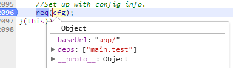

## 2.2 模块的加载过程
>[案例代码](https://github.com/yusongjohn/durandal-source)，启动文件：test.html
 
模块加载的模式可以分为两类
1. 被动加载：作为依赖的模块（比如main.test.js中的依赖模块的加载）
2. 主动加载：使用require方法加载模块，形如require([xxx],fn)
>durandal使用的system.acquire()就是直接调用require方法主动加载模块

### 2.2.1 主动加载：以 req(cfg) 为例 
>对于模块的主动加载其实际的加载入口是：localRequire（闭包）

- 入口在require.js的最后一行
```javascript
// cfg.deps = ['main.test']
req(cfg); // 调用栈：-> context.configure -> context.require （即 context.makeRequire返回的localRequire）
```

-  localRequire
```javascript
function localRequire(deps, callback, errback) {
    var id, map, requireMod;

    if (typeof deps === 'string') {}
    intakeDefines(); 
    
    context.nextTick(function () {
        intakeDefines(); // 收集异步期间定义的模块
        requireMod = getModule(makeModuleMap(null, relMap));
        requireMod.skipMap = options.skipMap;
        requireMod.init(deps, callback, errback, {enabled: true});
        checkLoaded();
    });

    return localRequire;
}
``` 

#### 2.2.1.1 intakeDefines
- takeGlobalQueue：将globalDefQueue中的配置迁移到defQueue中
还记得define方法中的globalDefQueue变量吗？ 每当define时都会将模块的基本信息[名称，依赖，回调]保存到globalDefQueue变量中（参考define函数的定义）
>globalDefQueue是requirejs脚本中的顶层变量，defQueue则是newContext函数的私有变量


```javascript
function takeGlobalQueue() { 
    if (globalDefQueue.length) { 
        apsp.apply(defQueue,  [defQueue.length, 0].concat(globalDefQueue));
        globalDefQueue = [];
    }
}
```


- intakeDefines：取出全局队列中的模块配置，启动这些模块的定义

```javascript
function intakeDefines() {
    takeGlobalQueue();
    while (defQueue.length) {
        args = defQueue.shift();
        //...
        callGetModule(args);
    }
}
```

1. 为什么在callGetModule中调用Module.prototype.init，而不是enable？
    - callGetModule被调用的两个地方：1:intakeDefines 2. completeLoad ；这两个方法在调用callGetModule之前都会先调用takeGlobalQueue
    - takeGlobalQueue中获取到的模块配置是在define方法中存储的，说明模块所在的js文件已经被加载和执行，因此在callGetModule方法中调用的是Module.prototype.init设置inited为true，表明该模块不需要去加载对应的js文件

2. 为什么在localRequire中需要调用intakeDefines？
    - 事实上，当某个js文件加载并执行完成后会走completeLoad，该方法中也会去调用takeGlobalQueue，callGetModule去完成该模块的定义；
    - 对于localRequire()中的两处 intakeDefines() 其实是用来处理某些'特殊情况'的。比如以下例  
    - 案例：nextTickTest.js（定义模块后，立即require该模块）
    ```
    define('a1', [], function () {
        return {
            a: 'yus'
        }
    });
    
    require(['a1'], function (a) {
        console.log(a, '----')
    });
    ```
    - 如果屏蔽localRequire中的两句 intakeDefines() ，执行结果如下（有报错，但是require(['a1'])仍然顺利加载完成）
        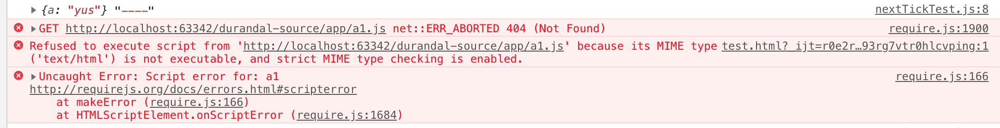
        - 之所以报错是因为首先尝试将'a1'作为js文件去加载，因此控制台有加载a1.js文件404的报错
            >require(['a1'])走context.nextTick回调中，会生成匿名模块，然后执行到该匿名模块的enable（Module.prototype.enable），然后加载其依赖即'a1'，... ，会尝试加载a.js文件
        - 之所以仍然能够顺利加载完成是因为在nextTickTest.js文件执行完成以后，走completeLoad回调，该方法中有去加载完成模块'a1'的定义，因此并不影响require(['a1'])的加载
    - 但是如果存在这两句的话，intakeDefines -> callGetModule -> getModule -> Module.prototype.init，将模块'a1' 的 inited置为true，因此后面则不会去加载a1.js

#### 2.2.1.2 context.nextTick：启动内部模块的加载
- 主动加载模块的一个`特点`就是在context.nextTick中会生成一个有内部名称(internal name: '_@r' + number) 的模块（`内部模块`），其作用是啥呢？
    - 该匿名模块会将deps作为其依赖，然后启动该模块的加载 
    - 当这些依赖的模块加载完成后，标志着生成的 '内部模块' 完成定义 
    - 因此：该内部模块的作用是用来检测主动加载模块的什么时候完成定义 
    
- 内部模块的生成
```javascript
context.nextTick(function () {
    //... 
    requireMod = getModule(makeModuleMap(null, relMap));
}
```
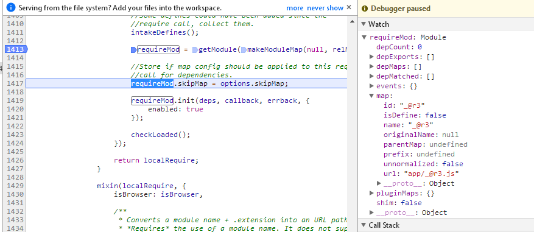

- 开始进行内部模块的定义
```
context.nextTick(function () {
    //... 
    requireMod.init(deps, callback, errback, {enabled: true});
    //...
});
```
- {enabled:true}的作用？为什么不直接enable而是要先init再enable呢？
    - {enabled:true} 的作用就是使得在init方法中直接进入enable 
    - 内部模块是requirejs框架自己生成的，因此其没有对应的js文件，所以调用init将inited标识置为true，然后通过{enable:true}选项进入enable开始其依赖模块的加载

    
#### 2.2.1.3 加载内部模块的依赖模块
> 跳过 Module.prototype.init 来到 Module.prototype.enable，enable方法的主要作用是加载其依赖模块，并添加其依赖模块的defined回调（通知该依赖模块完成了定义）

1. 依赖模块处理入口：Module.prototype.enable
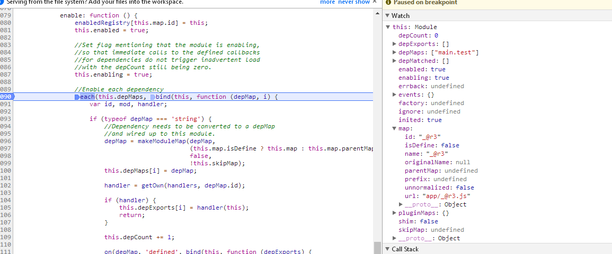
```javascript
enable: function () { // 递归 context.enable -> Module.prototype.enable
    enabledRegistry[this.map.id] = this;
    this.enabled = true;
    this.enabling = true;
    
    each(this.depMaps, bind(this, function (depMap, i) {// 循环处理所有依赖
        if (typeof depMap === 'string') {
            this.depCount += 1;
            
            on(depMap, 'defined', bind(this, function (depExports) { // 监听defined事件
                this.defineDep(i, depExports);
                this.check();
            })); 
        }
        
        if (!hasProp(handlers, id) && mod && !mod.enabled) {
            context.enable(depMap, this); //关键
        }
    }
    
    this.enabling = false;
    this.check(); 
}
``` 
- 为什么在enable方法的最后调用this.check()?<br/>
简单来说就是用来确定当前模块的下一个步骤，是加载js文件还是直接完成定义？
    
2. 依赖模块'main.test'的定义完成 到 内部模块的定义完成
- makeModuleMap
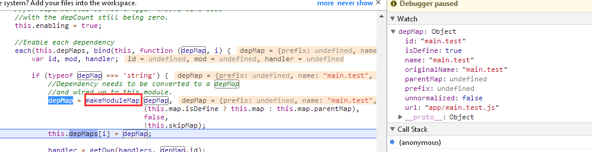

- 依赖模块'main.test' 的加载流程
    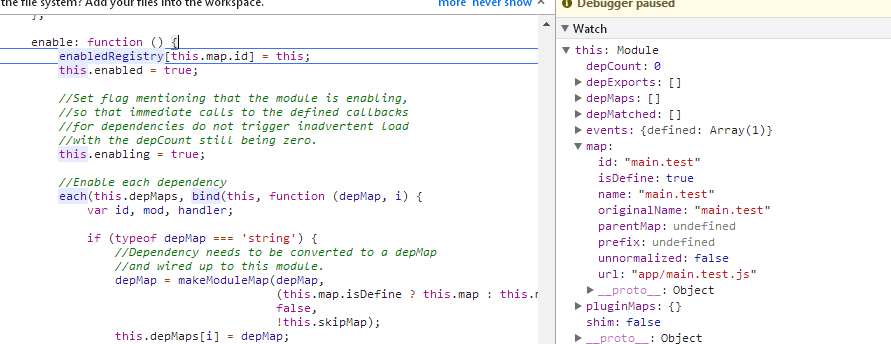
    - 调用栈：enable -> check -> fetch（构造script标签加载main.test.js），当main.test.js文件加载完成后会立即执行main.test.js文件中的代码<br/>
    - 执行main.test.js中的: requirejs.config <br/>
    - 执行main.test.js中的: define -> 添加到模块基本信息到 globalDefQueue

- 执行完js文件中的代码后来到completeLoad回调
 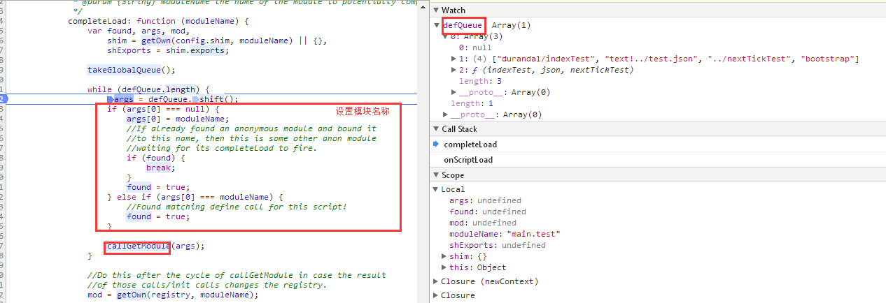
    - completeLoad的参数moduleName如何得来的？
    参数moduleName其实是从其sctipt标签上获取的，fetch()在构造script标签时就添加了一个属性[data-requiremodule]
    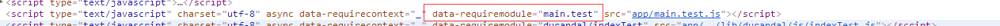

- 启动main.test模块的定义
    - 调用栈:completeLoad -> callGetModule -> Module.prototype.init (该模块已经加载完成因此调用init)
    - 当main.test模块完成定义后（main.test模块完成定义的过程见2.2.2）会触发main.test模块的defined事件（上面有提到在enable方法会去注册内部模块的依赖模块main.test的defined回调） 
    
- 内部模块完成定义    
    上面说到main.test完成定义后会触发其defined回调，在defined回调中的this就是内部模块(_@r3)，this.check()则会检查该模块是否可以结束定义（通过this.depCount判断，见this.check方法）
     

- 至此 内部模块"_@r3" 完成定义，也表示这主动加载过程的结束


### 2.2.2 被动加载
> 不是通过require()显示加载的方式；而是作为主动加载模块的依赖（链）模块被加载的，这些依赖模块的加载称为被动加载

1. 上面说到 main.test.js 加载并执行完成后的调用栈： onScriptLoad -> completeLoad -> callGetModule -> Module.prototype.init （初始化该模块）
2. 首先得说下：该模块在作为内部模块"_@r3" 的依赖模块时已经被 enabled 了，但是当时该模块的js文件尚未加载因此其depMaps = [];
3. 现在main.test.js已经执行完成即此时该模块已经执行过define方法，因此确定了该模块了依赖模块，此时便可以处理main.test的依赖模块了
    > 第二点和第三点结合在一起也解释了了下面代码块
    ```javascript
    Module.prototype = {
        init: function (depMaps, factory, errback, options) {
            //...
            if (options.enabled || this.enabled) { 
                this.enable();
            } else {
                this.check();
            }
        }}
    ```      
4. 后面的过程和加载 内部模块"_@r3" 的流程一致

`require.js支持多种形式的模块加载：见2.2.2.1（plugin!xxx.suffix）、2.2.2.2（文件夹）、2.2.2.3（shim）`

#### 2.2.2.1  'text!./../test.json'
>特殊在于该模块依赖于text.js插件，并且需要通过该模块进行解析

1 父模块[main.test]的enable方法中做了哪些？
- 1.1 调用makeModuleMap()，生成当前模块的moduleMap，其id为"text!../test.json_unnormalized2"<br/>
    
    - 关于 makeModuleMap 方法对 unnormalized 属性的处理<br/>
    > 'text!./../test.json'作为模块main.test依赖，在enable方法中调用了makeModuleMap，此时传入的 isNormalized:false， <br/>
    并且此时'test.js'模块也是第一次调用，因此pluginModule是undefined，prefix就是'text' <br/>
    => (prefix && !pluginModule && !isNormalized) 为 true<br/>
    ```javascript
    function makeModuleMap(name, parentModuleMap, isNormalized, applyMap) {
        //...
        if (prefix) {
            prefix = normalize(prefix, parentName, applyMap);
            pluginModule = getOwn(defined, prefix);
        }
        suffix = prefix && !pluginModule && !isNormalized ? '_unnormalized' + (unnormalizedCounter += 1) :
        
        //...
        
        return {
            unnormalized: !!suffix,
        };
    }
    ```
    
    makeModuleMap -> normalize 转化路径 './..test.json' => '../test.json' <br/>
    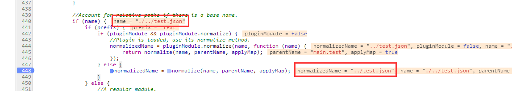
    
    makeModuleMap的结果<br/>
    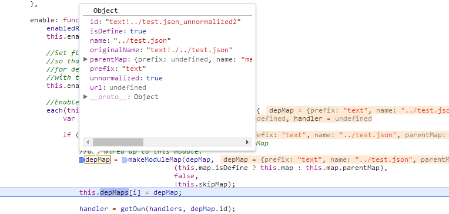 

- 1.2 监听模块 "text!../test.json_unnormalized2" 的defined事件
> 除了监听事件以外，如果该模块尚未完成定义的话，on还会调用getModule进行登记
```javascript
function on(depMap, name, fn) {
    var id = depMap.id,
        mod = getOwn(registry, id);

    if (hasProp(defined, id) && (!mod || mod.defineEmitComplete)) { // 如果 当前模块即depMap 已经完成了定义，那么同步执行defined回调
        if (name === 'defined') {
            fn(defined[id]);
        }
    } else {// 如果没有完成定义
        // 会将该模块注册 registry 变量中，表示当前已经登记过的模块 (上面已经排除了定义完成的可能性，这很重要)
        mod = getModule(depMap); 
        if (mod.error && name === 'error') {
            fn(mod.error);
        } else {
            mod.on(name, fn);
        }
    }
}
```

getModule
```javascript
function getModule(depMap) {
    var id = depMap.id,
        mod = getOwn(registry, id);

    if (!mod) { // 如果没有登记过，则登记，但是这里得注意:如果该模块已经完成了定义，就不应该走这里了
        mod = registry[id] = new context.Module(depMap);
    }

    return mod;
}
```
>getModule 主要出现在 context.enable、callGetModule 两个方法中<br/>
    1. 在执行context.enable之前，都是会先执行on方法，如果已经完成了的定义，则不会调用getModule<br/>
    2. callGetModule在调用getModule方法时也是会先判断是否已经完成了定义<br/>

- 1.3 调用context.enable 开始 "text!../test.json_unnormalized2" 模块的定义
    - context.enable的作用？如果该模块没有完成定义，则开始（或继续）定义 
    ```
    // context.enable
    enable: function (depMap) {
        var mod = getOwn(registry, depMap.id);
        if (mod) {
            getModule(depMap).enable();
        }
    },
    ``` 
    
2 开始 "text!../test.json_unnormalized2" 模块的定义
> 跳过中间步骤（enable -> check）直接来到 fetch() 

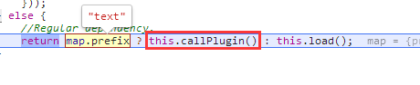  
- 2.1 callPlugin

```javascript
callPlugin: function () {
    this.depMaps.push(pluginMap); 
        on(pluginMap, 'defined', bind(this, function (plugin) { // pluginMap（在这里就是指text.js模块）defined回调
         //... pluginMap defined回调
        }
    }
    context.enable(pluginMap, this); // 加载pluginMap模块（被动加载）
    this.pluginMaps[pluginMap.id] = pluginMap; 
}
``` 

pluginMap defined回调
```javascript
function (plugin) {
    var load, normalizedMap, normalizedMod,
        bundleId = getOwn(bundlesMap, this.map.id),
        name = this.map.name,
        parentName = this.map.parentMap ? this.map.parentMap.name : null,
        localRequire = context.makeRequire(map.parentMap, {
            enableBuildCallback: true
        });
      
    if (this.map.unnormalized) { // 如果当前的moduleMap unnormalized
        if (plugin.normalize) {
            name = plugin.normalize(name, function (name) {
                return normalize(name, parentName, true);
            }) || '';
        }
        // 现在的情况是，依赖的plugin：text已经加载完成，因此 需要重新 makeModuleMap (unnormalized这次一定为false）
        normalizedMap = makeModuleMap(map.prefix + '!' + name, this.map.parentMap); // normalizedMap.id = text!../test.json
        on(normalizedMap, 'defined', bind(this, function (value) {  // 监听defined事件，即当 text!../test.json 模块完成定义的回调
            this.init([], function () { return value; }, null, {
                enabled: true,
                ignore: true
            });
        }));

        normalizedMod = getOwn(registry, normalizedMap.id);
        if (normalizedMod) {
            //Mark this as a dependency for this plugin, so it
            //can be traced for cycles.
            this.depMaps.push(normalizedMap);

            if (this.events.error) {
                normalizedMod.on('error', bind(this, function (err) {
                    this.emit('error', err);
                }));
            }
            normalizedMod.enable();
        }

        return; // 关键，没有继续向下执行了
    }
 
    if (bundleId) { 
        //...
    }

    load = bind(this, function (value) {
        this.init([], function () { return value; }, null, { // 这里会去完成 text!../test.json 模块的定义 ，并触发该模块完成定义的回调
            enabled: true
        });
    });

    load.error = bind(this, function (err) {  });

    load.fromText = bind(this, function (text, textAlt) {   });

    plugin.load(map.name, localRequire, load, config);  // 走插件的逻辑，如text.js通过ajax加载text.json文件，加载成功后调用这里传入的回调：load
} 
``` 

- 2.2 下面说下 "text!../test.json_unnormalized2" 模块的加载流程<br/>

pluginMap，this
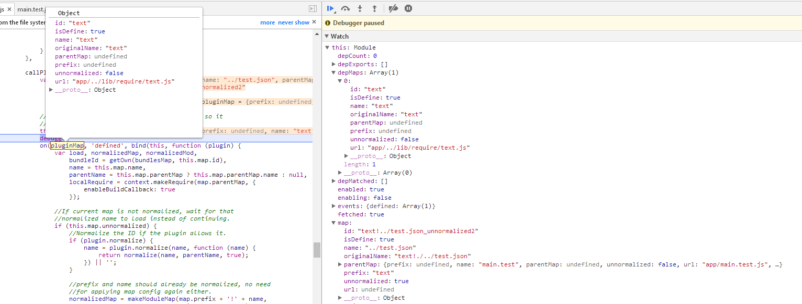

- 2.2.1 pluginMap 监听defined事件（即text.js完成定义后触发这里的回调） 
    - text.js加载完成后进入defined回调：plugin
    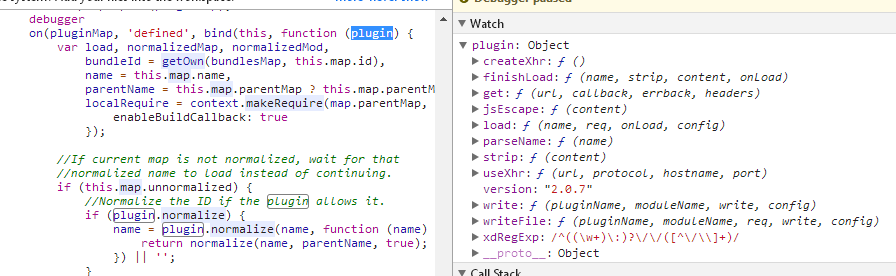 

    >回调有两种情况
    - 2.2.1.1 unnormalized 情况 走if(this.map.unnormalized)语句块
        >this.map.id = "text!../test.json_unnormalized2"
        
        normalizedMap："text!../test.json" （normalize，因此下一次回调走 2.2.1.2）
        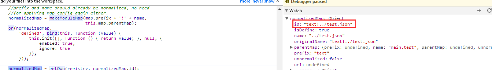
         
        - normalizedMap 监听defined事件 (即 "text!../test.json" 加载完成后 走这里的回调) 
        ```javascript
        // 注意下面回调中的this是指向哪个模块，下面的回调会使得`"text!../test.json_unnormalized2"`完成定义 
        on(normalizedMap, 'defined', bind(this, function (value) {  // 监听defined事件，即当 text!../test.json 模块完成定义的回调
            this.init([], function () { return value; }, null, {
                enabled: true,
                ignore: true
            });
        }));
        ```
        - normalizedMod.enable() 进行 "text!../test.json"模块的定义 
            -> callPlugin -> 2.2.1.2（由于 text.js 已经完成了定义，所以会同步执行defined回调）<br/> 
            -> context.enable(pluginMap, this) （由于 text.js 已经完成了定义，因此会从registry，enabledRegistry中移除） 
            >当一个模块已经完成了定义，如果再次context.enable时，则不会再次定义  
           
            ```javascript
            enable: function (depMap) {
                var mod = getOwn(registry, depMap.id); // 因为已经移除，所以 mod:false
                if (mod) {
                    getModule(depMap).enable();
                }
            },
            ```  
            
            
            
    - 2.2.1.2 normalized 情况
        >this.map.id = "text!../test.json" 
        ```javascript 
        callPlugin: function () {
            on(pluginMap, 'defined', bind(this, function (plugin) {
                //...
                load = bind(this, function (value) { // text.js 加载并解析test.json文件后的回调
                    //注意这里的this是谁，this.init() 会完成 "text!../test.json" 模块的定义，并触发该模块defined回调
                    this.init([], function () { return value; }, null, {
                        enabled: true
                    });
                });
                plugin.load(map.name, localRequire, load, config); // 在text.js中区加载test.json文件，然后将转换后的内容回调给load
            }))
        ```

- 2.2.2 context.enable(pluginMap, this)：因为这个模块尚未加载，因此直接enable，开始该模块的定义
>js模块是否加载完成的标志：inited，区别于fetched,fetched表示正在获取，但是资源尚未返回<br/>
当text.js加载完成后会走callGetModule -> init 会将 该模块的inited 置为 true 表示该模块所在的js文件已被加载


3 为什么上面的回调要根据 unnormalized 分为两种情况呢？
- makeModuleMap 中的 unnormalized
>If the id is a plugin id that cannot be determined if it needs normalization, stamp it with a unique ID so two matching relative ids that may conflict can be separate.<br/>
>如果id是一个插件ID，如果需要进行规范化则无法确定，请使用唯一ID标记它，以便可以将两个匹配的可能冲突的相对ID分开。<br/>
（其实我也没找到相应的案例，但可以肯定是这是用来处理某种特殊情况的，因此并不妨碍阅读，你甚至可以把makeModuleMap修改下，比如像下面这样）
```javascript
function makeModuleMap(name, parentModuleMap, isNormalized, applyMap) {
    //...
    return {
        prefix: prefix,
        name: normalizedName,
        parentMap: parentModuleMap,
        unnormalized: false, // !!suffiex 修改为false
        url: url,
        originalName: originalName,
        isDefine: isDefine,
        id: (prefix ?
            prefix + '!' + normalizedName :
            normalizedName) + suffix
    };
}
```
    
    
4 text.js加载并解析test.json文件流程
> 这里没啥好说的
             
5 总结：
- 控制台日志看该模块的加载流程
    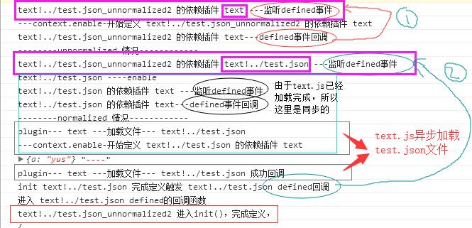    
    - 1. 首先"text!../test.json_unnormalized2"模块有两个依赖：text ，text/..test.json 两个模块
    - 2. normalize后的模块 "text/..test.json" 会去 通过text.js 加载test.json文件，然后"text/..test.json"该模块完成定义
    - 3. 当 "text/..test.json" 完成定义后 就会通知 "text!../test.json_unnormalized2" 去完成定义
- 显然 unnormalized 这个鬼玩意让这里变的复杂很多。
- 从思想来看，这里就是先加载 text.js 插件，然后把 text.json 文件的加载交给text.js（注意defined事件的使用，通过该事件的订阅与发布使得父模块得以完成定义）
 

#### 2.2.2.2  'durandal/indexTest'

1. 特殊在于 'durandal/indexTest' 其实代表的路径是：'../lib/durandal/js/indexTest.js' ，因为配置的paths时：durandal作为文件夹存在的
2. 因此在 makeModuleMap方法中 通过 nameToUrl() 转换此类路径为正确的文件路径即可 


#### 2.2.2.3  'bootstrap' 
```javascript
shim: {
    'bootstrap': {
        deps: ['jquery'],
        exports: 'jQuery'
    }
}

```
> 思路：生成一个‘require实例’：localRequire，通过它加载完依赖，然后在回调中加载bootstrap
```javascript
fetch: function () {
    //...
    if (this.shim) {
        context.makeRequire(this.map, {
            enableBuildCallback: true
        })(this.shim.deps || [], bind(this, function () {
            return map.prefix ? this.callPlugin() : this.load();
        }));
    } else {
       //...
    }
},
```  

### 2.2.3 Module[状态流转]看加载流程 
- Module.prototype
```javascript 
Module.prototype = {
    init: function (depMaps, factory, errback, options){ // 该方法执行的前提：模块（js文件）已经加载完成了 或者 框架‘内部模块’（因为内部模块压根不需要加载js文件）
        if (this.inited) {
            return;
        }
        //...
        this.inited = true;
        if (options.enabled || this.enabled) { 
            this.enable();
        } else {
            this.check();
        }
    },
    
    enable: function () { // enable方法用来标识：该模块开始进行定义；开始进行定义的前提：模块对应的js文件已经加载完成，但是js文件中定义的模块尚未开始进行定义（此时js中代码已经执行完毕） 或者 ‘内部模块’的初始化（因为内部模块没有对应的js文件）
        enabledRegistry[this.map.id] = this;
        this.enabled = true;
        this.enabling = true;
        
        each(this.depMaps, bind(this, function (depMap, i) {
            //...
            this.depCount += 1; （当前模块的依赖数）
                            
            // 监听依赖模块的defined事件，（每个模块完成后都会触发defined事件）
            on(depMap, 'defined', bind(this, function (depExports) { 
                this.defineDep(i, depExports); // 某个依赖模块完成后父模块的工作：缓存该模块，depCount--（依赖数）等
                this.check();
            }));
            
            if (!hasProp(handlers, id) && mod && !mod.enabled) {
                context.enable(depMap, this);
            }
        }) 
        
        this.enabling = false;
        this.check();
    },
    defineDep: function (i, depExports) { 
        if (!this.depMatched[i]) {
            this.depMatched[i] = true;
            this.depCount -= 1;
            this.depExports[i] = depExports; // this.depExports 将会作为父模块回调的参数：define(['a','b','c'],function(a,b,c){}); 回调函数的参数a,b,c就是通过depExports传递的
        }
    },
    check: function () {// 函数名已经表明了该方法的作用：检查，根据当前模块的状态检查下一步该做什么（代码中也可看出是各种if判断模块状态）、defiend/defining
        if (!this.enabled || this.enabling) { // 如果模块处于 enabled 的话，说明 模块（js文件） 还在加载中
            return;
        }
        
        if (!this.inited) { // inited 为 false 表明模块（js文件）尚未加载，因此需要通过this.fetch去加载该js文件
            this.fetch();
        } else if (this.error) {
            this.emit('error', this.error);
        } else if (!this.defining) {
            this.defining = true;
        
            if (this.depCount < 1 && !this.defined) { // 当所有的依赖模块定义完成以后，depCount=0，那么该模块可以完成定义了
            
            }
            
            if (this.defined && !this.defineEmitted) {
                this.defineEmitted = true;
                this.emit('defined', this.exports);
                this.defineEmitComplete = true;
            }
        }
    
    }

}
```
- Module实例的几种状态
    - inited：启动模块定义（表明模块所在js文件已经加载）
    - enabled：启动依赖模块的加载
    - defined：模块完成定义
    - fetched：构造script标签加载js文件
    - defining：正在完成定义
    
- 状态流转的两种情况
    - 1. inited -> enabled -> defining -> defined 
        1. 只有内部模块可以直接init；（并且fetched对该模块没有意义）
        2. 在主动加载章节中虽然显示req(cfg)去主动加载main.test模块，但是该模块仍然是作为内部模块的依赖模块，其初始状态也是enabled
    
    - 2. enabled -> fetched -> inited -> defining -> defined
    所有作为依赖的模块其状态都是先enabled，当其所在的js文件加载完成后，才会将将状态inited置为true表明js文件已经加载
    
    - 总结：从这个角度看，requirejs的模块有两种类型：内部模块，依赖模块；并且从这状态的流转大致可以看出整个模块的加载流程
     
     
# 3 补充   
## 3.1 fetch 构造script标签加载资源
```javascript
req.load = function (context, moduleName, url) {
    var config = (context && context.config) || {}, node;
    if (isBrowser) {
        node = req.createNode(config, moduleName, url); 
        node.setAttribute('data-requirecontext', context.contextName);
        node.setAttribute('data-requiremodule', moduleName);
        //兼容性处理（略）...
        node.addEventListener('load', context.onScriptLoad, false);
        node.addEventListener('error', context.onScriptError, false); 
        node.src = url; 
        head.appendChild(node);
        return node;
    }
    //...
}
```

## 3.2 checkLoaded的作用
- checkLoaded的执行时机
    1. localRequire中的context.nextTick 
    2. completeLoad 
    3. 自身的定时器
```javascript
// checkLoaded代码块
function checkLoaded() {
    var err, usingPathFallback,
        waitInterval = config.waitSeconds * 1000, 
        expired = waitInterval && (context.startTime + waitInterval) < new Date().getTime(),
        noLoads = [],
        reqCalls = [],
        stillLoading = false,
        needCycleCheck = true;
 
    if (inCheckLoaded) {
        return;
    }

    inCheckLoaded = true;
 
    eachProp(enabledRegistry, function (mod) {
        var map = mod.map, modId = map.id; 
        if (!mod.enabled) {
            return;
        }

        if (!map.isDefine) {
            reqCalls.push(mod);
        }

        if (!mod.error) {            
            if (!mod.inited && expired) {
                if (hasPathFallback(modId)) { 
                    usingPathFallback = true;
                    stillLoading = true;
                } else { 
                    noLoads.push(modId);
                    removeScript(modId);
                }
            } else if (!mod.inited && mod.fetched && map.isDefine) {
                stillLoading = true;
                if (!map.prefix) { 
                    return (needCycleCheck = false);
                }
            }
        }
    });

    if (expired && noLoads.length) {
        err = makeError('timeout', 'Load timeout for modules: ' + noLoads, null, noLoads);
        err.contextName = context.contextName;
        return onError(err);
    }
 
    if (needCycleCheck) {
        each(reqCalls, function (mod) {
            breakCycle(mod, {}, {});
        });
    }
 
    if ((!expired || usingPathFallback) && stillLoading) { 
        if ((isBrowser || isWebWorker) && !checkLoadedTimeoutId) {
            checkLoadedTimeoutId = setTimeout(function () {
                checkLoadedTimeoutId = 0;
                checkLoaded();
            }, 50);
        }
    }

    inCheckLoaded = false;
}

```

### 3.2.1 作用1：检查文件加载是否超时
```javascript
function checkLoaded(){
    //... 
    eachProp(enabledRegistry, function (mod) {
        //...
        // 首先一个模块走到这里，一定是尝试过this.fetch()，即已经尝试过加载对应的js文件
        // 如果时间过期并且mod.inited为false（说明js文件加载失败）
        if (!mod.inited && expired) { 
            if (hasPathFallback(modId)) { 
                usingPathFallback = true;
                stillLoading = true;
            } else { 
                noLoads.push(modId); // 将加载失败的模块保存下来
                removeScript(modId);
            }
        }
        //...
    }

    //...
    if (expired && noLoads.length) {
        err = makeError('timeout', 'Load timeout for modules: ' + noLoads, null, noLoads);
        err.contextName = context.contextName;
        return onError(err); // 如果过期则终止
    }    
    //...
}

```
- expired的判断    
    
### 3.2.2 作用2：可以给一个模块配置多个加载路径
      1. 如下面配置中给jQuery的js路径配置在了数组中，当数组中的第一个路径请求失败后，会使用数组中第二个路径其请求资源
      ```javascript
      //main.test.js
      paths: {
          'text': '../lib/require/text',
          'durandal': '../lib/durandal/js',
          'plugins': '../lib/durandal/js/plugins',
          'transitions': '../lib/durandal/js/transitions',
          'knockout': '../lib/knockout/knockout-3.4.0',
          'bootstrap': '../lib/bootstrap/js/bootstrap',
          'jquery': ['../lib/jquery/jquery-1.9.2','../lib/jquery/jquery-1.9.1'] 
      },
      ```
      
      2. '../lib/jquery/jquery-1.9.2'加载失败，看到jquery仍然被加载成功（打印出了jQuyer的版本号）  
      
      
      3. checkLoaded中会去调用hasPathFallback，换一种文件路径进行加载
      ```
      function hasPathFallback(id) {
          var pathConfig = getOwn(config.paths, id);
          if (pathConfig && isArray(pathConfig) && pathConfig.length > 1) { 
              pathConfig.shift();
              context.require.undef(id); // ***
              context.require([id]);
              return true;
          }
      }
      ```
      - localRequire.undef 的作用？ 

### 3.2.3 作用3：处理循环依赖
- 1. 案例代码：
```javascript
//main.test
define(['../lib/cycleA'], function (cycleA) {
    console.log(cycleA, '============================');
    return 'main.test_module'
});

// cycleA
define(['../lib/cycleB'], function (cycleB) {
    console.log(cycleB,'==========cycleA========');
    return {
        cycleA: cycleB
    }
})

//cycleB
define(['../lib/cycleA'], function (cycleA) {
    console.log(cycleA,'==========cycleB========');
    return {
        cycleB: cycleA
    }
})
```
- 2. 执行结果
看到main.test还是成功执行了
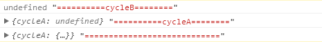

- 3. 循环依赖是如何处理的
    - checkLoaded:在这部分的作用
    1. 存储当前加载过程中所有内部模块
    2. 判断此次检查过程中是否需要进行循环依赖的处理，关键在于 needCycleCheck，只有该变量为true才会进行后面的循环依赖的处理 
        - 只有一种情况为false：在enabledRegistry中存在一个模块满足：1.inted:false 2.fetched:true 3.isDefiene:true 4.map.prefix不存在 
        - 这引出了一个问题：循环依赖检查的时机？ 
            1. 只要存在一个*非*内部模块并且该模块不是'plugin!resource.suffix'这种形式的处于正在加载过程中（即状态位于fetched阶段，参考2.2.3的状态流转）则不进行循环依赖检查
            2. 因为形如'plugin!resource.suffix'这样的模块是不存在循环依赖的，因此排除这种情况
            3. 只考虑非这种形式的模块，并且只有等待所有的模块加载完成之后再去检查循环依赖才有意义
    ```javascript
    function checkLoaded(){
        //...
        eachProp(enabledRegistry, function (mod) {
            //...   
            if (!map.isDefine) {
                reqCalls.push(mod);
            }
            //...
            
            if (!mod.error) { 
                if (!mod.inited && expired) { 
                    //...
                } else if (!mod.inited && mod.fetched && map.isDefine) { 
                    stillLoading = true;
                    if (!map.prefix) { // 只有这种情况为false
                        return (needCycleCheck = false); 
                    }
                }
            }
        }
        
        //... 
        
        if (needCycleCheck) { 
            each(reqCalls, function (mod) {
                breakCycle(mod, {}, {});
            });
        }
    }
    ```
    
    - breakCycle的作用
    1. 判断是否存在循环依赖的核心方法
    2. 思想是
        1. 首先将父模块traced标识为true，然后再递归遍历其依赖模块，当处理依赖模块的依赖模块时遇到当前链（processed:false）中的父模块traced标识为true，说明存在循环依赖
        2. processed为false用于控制在当前链中查找
    3. 模块链示意图
    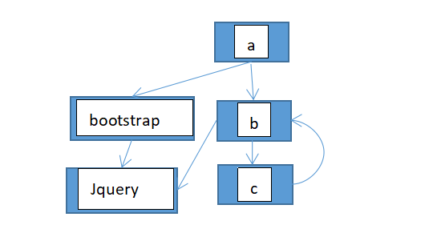
    > 为了形象的表达模块之间的数据结构上的关系，上面使用了模块链这样的说法来表达，其实用是多叉树表达更为严谨些
    
    ```javascript
    function breakCycle(mod, traced, processed) {
        var id = mod.map.id;
    
        if (mod.error) {
            mod.emit('error', mod.error);
        } else {
            traced[id] = true;
            each(mod.depMaps, function (depMap, i) {
                var depId = depMap.id, dep = getOwn(registry, depId); 
                if (dep && !mod.depMatched[i] && !processed[depId]) {
                    if (getOwn(traced, depId)) { // 存在循环依赖，以及 循环依赖的处理（关键）
                        mod.defineDep(i, defined[depId]);  
                        mod.check(); //pass false?
                    } else {
                        breakCycle(dep, traced, processed);
                    }
                }
            });
            processed[id] = true;
        }
    }
    ``` 
    - map.isDefine的定义和意义
        1. 该属性是在makeModuleMap方法中生成的，并且只要内部模块才为false
        2. 该属性可以用来区分是内部模块还是依赖模块，内部模块是requirejs自己生成的模块，而依赖都是我们（研发）自己定义的模块
        3. 内部模块一定是作为某次主动加载(require()的显示调用)过程中的的模块链的头，也就是说，我们可以通过内部模块找出这次主动加载过程中涉及的所有模块
        4. 源码中其实有很多地方都有用到，我就不一一说了
    
## 3.3 部分方法介绍
1. makeModuleMap
- Module 与 moduleMap的关系
    - on操作总是依赖于Module实例，Module实例总是依赖moduleMap，Module构造函数的参数就是moduleMap
    - moduleMap：当前模块的基本信息：name,id,prefix 
    - Module：用于管理 当前模块 定义过程中的相关属性，主要和其依赖模块的情况有关：比如记录依赖模块的加载情况，以及依赖模块的exports

2. nameToUrl：把模块名称转为文件路径
- 核心代码
    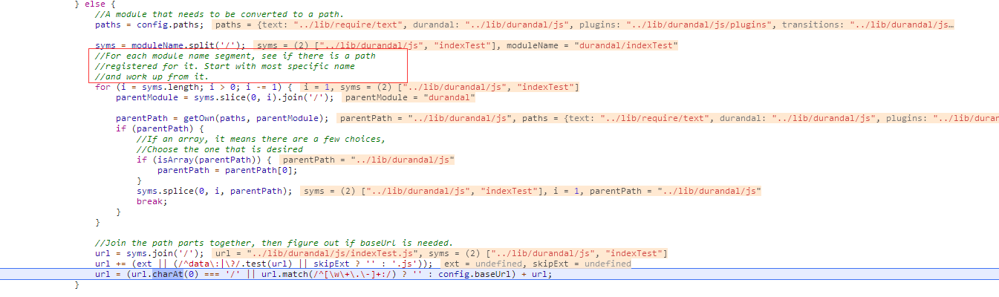
    
- 思想：以模块名称为 'a/b/c/d'为例
    1. abcd在config.paths中是否有匹配 => matchRes
    2. abc 在config.paths中是否有匹配 => matchRes + '/d'
    3. ab  在config.paths中是否有匹配 => matchRes + '/bd'
    4. a   在config.paths中是否有匹配 => matchRes + '/cbd'
    => url += '文件后缀名' 

3. normalize
将 ./ 路径 转化为基于 baseUrl的路径，为了可以基于config.paths映射路径

## 3.4 如何兼容cmd规范写法的模块？
注意这里是兼容，是说可以加载并执行cmd规范实现的模块，但是执行机制还是按照amd的执行机制处理即异步处理
> cmd规范和amd规范的区别在于：模块的执行而不是加载

下面说下是如何做到兼容？ 

1. 如果获取cmd模块的依赖模块呢？
>cmd规范实现的模块，其模块的引用是在回调中，只有执行具体的模块是才知道该模块有哪些依赖

当requirejs执行define时，会从define的回调中提取所有的依赖（其实正则变量cjsRequireRegExp已经暴露了一切）并保存
```javascript
cjsRequireRegExp = /[^.]\s*require\s*\(\s*["']([^'"\s]+)["']\s*\)/g, 

define = function (name, deps, callback) {
    //...
    if (!deps && isFunction(callback)) {
        deps = []; 
        if (callback.length) {// 函数的length属性指的是该函数的参数的长度
            callback
                .toString()
                .replace(commentRegExp, '') // 去除注释，方式注释中有相关的关键字
                .replace(cjsRequireRegExp, function (match, dep) {
                    deps.push(dep);
                });
 
            deps = (callback.length === 1 ? ['require'] : ['require', 'exports', 'module']).concat(deps);
        }
    }
    //...
}
``` 
 
 
2. require.js提供了cmd规范必要的几个变量对象['require','exports','module']
````javascript
handlers = {
    'require': function (mod) {
        if (mod.require) {
            return mod.require;
        } else {
            return (mod.require = context.makeRequire(mod.map));
        }
    },
    'exports': function (mod) {
        mod.usingExports = true;
        if (mod.map.isDefine) {
            if (mod.exports) {
                return (defined[mod.map.id] = mod.exports);
            } else {
                return (mod.exports = defined[mod.map.id] = {});
            }
        }
    },
    'module': function (mod) {
        if (mod.module) {
            return mod.module;
        } else {
            return (mod.module = {
                id: mod.map.id,
                uri: mod.map.url,
                config: function () {
                    return getOwn(config.config, mod.map.id) || {};
                },
                exports: mod.exports || (mod.exports = {})
            });
        }
    }
};
````
3. 在模块的加载过程中，如果遇到['require','exports','module']这几个变量，则直接替换，相关代码如下
使用Moduel.prototype.enable处理依赖模块时针对cmd规范的特殊处理
```javascript 
enable: function () {
    each(this.depMaps, bind(this, function (depMap, i) {
        //...
         handler = getOwn(handlers, depMap.id);
        
        if (handler) {
            this.depExports[i] = handler(this);
            return;
        }
        //...
    }
}
```
    
## 3.5 context.nextTick:setTimeout ，为什么要异步？
>保证同步的代码块中的define被执行
```javascript
req.nextTick = typeof setTimeout !== 'undefined' ? function (fn) {
    setTimeout(fn, 4);
} : function (fn) { fn(); };

// 改为 
req.nextTick = function (fn) { fn(); }
```

当加载下面nextTickTest.js时，则会报错
```javascript
require(['a1'], function (a) {
    console.log(a,'----')
});

define('a1', [], function () {
    return {
        a: 'yus'
    }
}) ;
```
- 执行结果
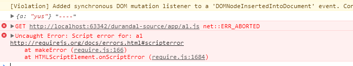

1. 报错的原因
    因为执行require语句的时候不知道还有一个模块叫'a1'，默认情况下则会请求将模块作为js文件处理，因此会去请求a1.js，为什么报错在后呢？因为通过script标签请求文件是异步的过程<br/>
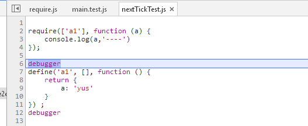
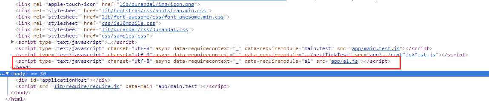

2. 执行成功的原因
    1. nextTickTest.js执行过程中调用了define('a1')
    2. 当nextTickTest.js执行完成后，会调用 context.onScriptLoad  -> callGetModule -> 完成在 nextTickTest.js 中进行定义的模块 'a1'，
    3. 当该模块完成定义后，其会触发一个 [defined]事件 ，这个事件的监听者就是依赖 a1 的模块，
    4. 在这里就是 require(['a1']) ，因此 require(['a1'],fn) 的回调也会成功执行
    5. 监听依赖项的defined事件(Module.prototype.check)<br/>
    

3. 如果异步处理，则会先执行后面的同步代码，那么require(['a1'])也就不会尝试加载a1.js文件了；
>我认为，这里应该是个优化的过程，并不是必须的。比如 nextTickTest.js 中的两句代码颠倒下顺序，也是可以顺利执行的；建议看requirejs源码时，把这里改为同步

 
## 3.6 requirejs的错误处理
1. 构造scrpt标签加载js资源时添加了给script标签添加error事件（参考3.1）,当脚本加载失败时，会调用该回调
```javascript
// context.onScriptError
onScriptError: function (evt) { 
    var data = getScriptData(evt);
    if (!hasPathFallback(data.id)) { // 参考3.2.2
        return onError(makeError('scripterror', 'Script error for: ' + data.id, evt, [data.id]));
    }
}
```

2. 模块执行时的错误捕获
```javascript
//Module.prototype.check
check: function () {
    //...
    try {
        exports = context.execCb(id, factory, depExports, exports);
    } catch (e) {
        err = e;
    }
    //...
    if (err) { // 保存执行异常的模块的信息
        err.requireMap = this.map;
        err.requireModules = this.map.isDefine ? [this.map.id] : null;
        err.requireType = this.map.isDefine ? 'define' : 'require'; 
        return onError((this.error = err));
    }
    //...
}
```

3. 主动加载的异常回调
require([...],fn,errback) 调用栈：localRequire -> init -> enable -> 监听依赖模块的error事件
```javascript 
// Module.prototype.enable 监听依赖模块的error事件
if (this.errback) {
    on(depMap, 'error', bind(this, this.errback));
}
```

```javascript 
function onError(err, errback) {
    var ids = err.requireModules,
    notified = false;
    //...
    each(ids, function (id) {
        var mod = getOwn(registry, id);
        //...
        notified = true;
        mod.emit('error', err);
    });
    
    if (!notified) { // 如果该模块没有被订阅
        req.onError(err);
    }
}
```
当依赖模块执行错误时（见第二点）会执行onError() => 触发error事件，如果父模块监听了该事件，则触发errback

4. requirejs提供了全局错误处理函数，你也可以自定义
- 默认值
```javascript 
req.onError = defaultOnError;

function defaultOnError(err) {
 throw err;
}
```
- 自定义
```javascript 
requirejs.onError = function (error) {
    console.log(error)
};
```

# 4 总结
一个流程图
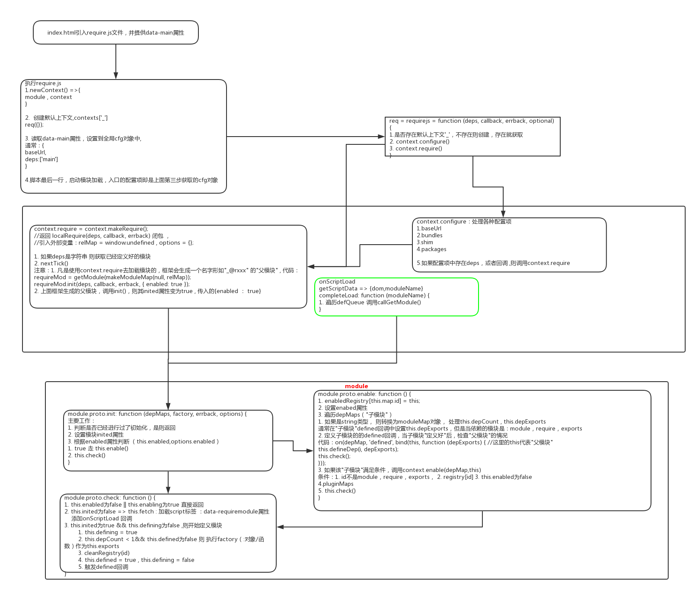
