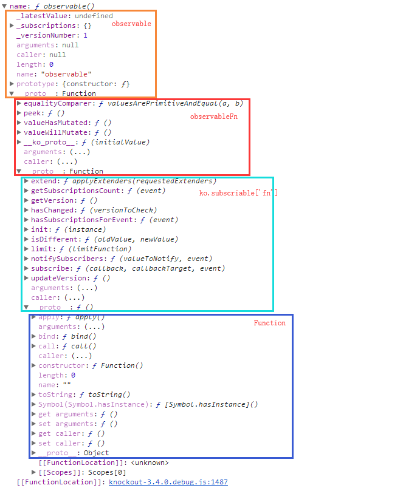
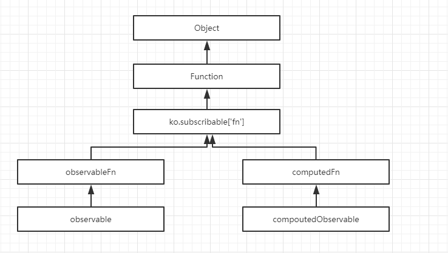

<!-- START doctoc generated TOC please keep comment here to allow auto update -->
<!-- DON'T EDIT THIS SECTION, INSTEAD RE-RUN doctoc TO UPDATE -->
**Table of Contents**  *generated with [DocToc](https://github.com/thlorenz/doctoc)*

- [1. observable对象](#1-observable%E5%AF%B9%E8%B1%A1)
  - [1.1 observalbe的继承结构](#11-observalbe%E7%9A%84%E7%BB%A7%E6%89%BF%E7%BB%93%E6%9E%84)
  - [1.2 observableFn](#12-observablefn)
  - [1.3 ko.subscribable['fn']](#13-kosubscribablefn)
- [2. computedObservable对象](#2-computedobservable%E5%AF%B9%E8%B1%A1)
  - [2.1 computedObservable的继承结构](#21-computedobservable%E7%9A%84%E7%BB%A7%E6%89%BF%E7%BB%93%E6%9E%84)
  - [2.2 computedFn](#22-computedfn)
- [3 总结](#3-%E6%80%BB%E7%BB%93)

<!-- END doctoc generated TOC please keep comment here to allow auto update -->

# 1. observable对象
**定义**：ko.observable 返回的对象称为observable对象

## 1.1 observalbe的继承结构
```javascript 
ko.observable = function (initialValue) {
    function observable() {
        // 读、写
    }
    //...
    ko.utils.setPrototypeOfOrExtend(observable, observableFn);// observable继承observableFn
    //...
    return observable;
}
```

示例代码
```javascript
var name = ko.observable()
```
继承结构见下图

 
 
## 1.2 observableFn

observableFn 继承 ko.subscribable['fn']
```javascript
ko.utils.setPrototypeOf(observableFn, ko.subscribable['fn']);
```

```javascript
var observableFn = {
    'equalityComparer': valuesArePrimitiveAndEqual,
    peek: function() { return this[observableLatestValue]; },
    valueHasMutated: function () { this['notifySubscribers'](this[observableLatestValue]); },
    valueWillMutate: function () { this['notifySubscribers'](this[observableLatestValue], 'beforeChange'); }
};
``` 

__ko_proto__：模拟 __proto__ 实现类型判断
```javascript
var protoProperty = ko.observable.protoProperty = '__ko_proto__';
observableFn[protoProperty] = ko.observable;

ko.hasPrototype = function (instance, prototype) {
    if ((instance === null) || (instance === undefined) || (instance[protoProperty] === undefined)) return false;
    if (instance[protoProperty] === prototype) return true;
    return ko.hasPrototype(instance[protoProperty], prototype); // Walk the prototype chain
};

ko.isObservable = function (instance) {
    return ko.hasPrototype(instance, ko.observable);
}
```

instanceof的实现原理
```javascript
function instanceof(L, R) {//L 表示左表达式，R 表示右表达式
 var O = R.prototype;
 L = L.__proto__;
 while (true) { 
   if (L === null) 
     return false; 
   if (O === L)  // 当 O 严格等于 L 时，返回 true 
     return true; 
   L = L.__proto__; 
 } 
}
```

## 1.3 ko.subscribable['fn'] 
该类实现了观察者模式

ko_subscribable_fn结构
```javascript
var ko_subscribable_fn = {
    init: function(instance) {},
    subscribe: function (callback, callbackTarget, event) {},// 关键方法
    notifySubscribers: function (valueToNotify, event) {}, // 关键方法
    getVersion: function () {},
    hasChanged: function (versionToCheck) {},
    updateVersion: function () {},
    limit: function(limitFunction) {},
    hasSubscriptionsForEvent: function(event) {},
    getSubscriptionsCount: function (event) {},
    isDifferent: function(oldValue, newValue) {},
    extend: applyExtenders
};

ko.subscribable['fn'] = ko_subscribable_fn;
```

ko_subscribable_fn 继承了 Function.prototype

```javascript
ko.utils.setPrototypeOf(ko_subscribable_fn, Function.prototype);
```
 
 
# 2. computedObservable对象
**定义**：ko.computed、ko.dependentObservable 返回的对象称为computedObservable对象
 
## 2.1 computedObservable的继承结构

示例代码
```javascript
var name = ko.observable();
var canSayHello = ko.computed(function () {
    return name() ? true : false;
});
```

继承结构见下图


computedFn继承ko.subscribable['fn'] 
```javascript
ko.utils.setPrototypeOf(computedFn, ko.subscribable['fn']);
```

computedObservable继承computedFn

 ```javascript 
 ko.computed = ko.dependentObservable = function (evaluatorFunctionOrOptions, evaluatorFunctionTarget, options) {
     ...
     function computedObservable() {
        //读、写
     }
     ...  
     ko.utils.setPrototypeOfOrExtend(computedObservable, computedFn);
     
     // 特殊情况下还会有他的继承
     if (options['pure']) {
         state.pure = true; 
         state.isSleeping = true;
         ko.utils.extend(computedObservable, pureComputedOverrides);
     } else if (options['deferEvaluation']) {
         ko.utils.extend(computedObservable, deferEvaluationOverrides);
     }
     //...
     return computedObservable;
 }
 ```
 
## 2.2 computedFn

 ```javascript
var computedFn = {
    equalityComparer: valuesArePrimitiveAndEqual,
    getDependenciesCount: function () {},
    addDependencyTracking: function (id, target, trackingObj) {},
    haveDependenciesChanged: function () {},
    markDirty: function () {},
    isActive: function () {},
    respondToChange: function () {},
    subscribeToDependency: function (target) {},
    evaluatePossiblyAsync: function () {},
    evaluateImmediate: function (notifyChange) {},
    evaluateImmediate_CallReadWithDependencyDetection: function (notifyChange) {},
    evaluateImmediate_CallReadThenEndDependencyDetection: function (state, dependencyDetectionContext) {},
    peek: function () {},
    limit: function (limitFunction) {},
    dispose: function () {}
};
```


__ko_proto__

```javascript
var protoProp = ko.observable.protoProperty; // == "__ko_proto__"
ko.computed[protoProp] = ko.observable;
computedFn[protoProp] = ko.computed;

ko.isComputed = function (instance) {
    return ko.hasPrototype(instance, ko.computed);
};

ko.isPureComputed = function (instance) {
    return ko.hasPrototype(instance, ko.computed)
        && instance[computedState] && instance[computedState].pure;
};
```

# 3 总结


1. observable对象和computdObservable都继承了二者ko.subscribable['fn']，使得二者均可以作为观察者模式中的Subject角色的
2. 对比对比observableFn和computedFn
    - observableFn的作用：通知；
    - computedFn的作用：添加订阅和依赖 => 这使得computedObservable对象可以作为观察者模式中的Observer角色
3. 那么，什么时候会发生**订阅**呢？什么时候会触发**通知**呢？
