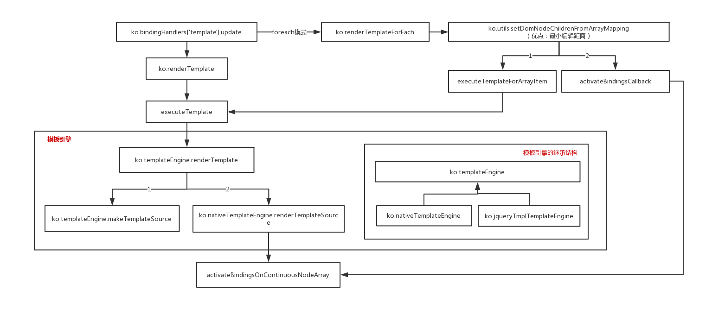

<!-- START doctoc generated TOC please keep comment here to allow auto update -->
<!-- DON'T EDIT THIS SECTION, INSTEAD RE-RUN doctoc TO UPDATE -->
**Table of Contents**  *generated with [DocToc](https://github.com/thlorenz/doctoc)*

- [1 ko.bindingHandlers['template'].init](#1-kobindinghandlerstemplateinit)
- [2 ko.bindingHandlers['template'].update](#2-kobindinghandlerstemplateupdate)
- [3 普通模式](#3-%E6%99%AE%E9%80%9A%E6%A8%A1%E5%BC%8F)
  - [3.1 创建子bindingContext](#31-%E5%88%9B%E5%BB%BA%E5%AD%90bindingcontext)
  - [3.2 ko.renderTemplate](#32-korendertemplate)
    - [3.2.1 模板渲染入口](#321-%E6%A8%A1%E6%9D%BF%E6%B8%B2%E6%9F%93%E5%85%A5%E5%8F%A3)
    - [3.2.2 记忆当前模板参数信息](#322-%E8%AE%B0%E5%BF%86%E5%BD%93%E5%89%8D%E6%A8%A1%E6%9D%BF%E5%8F%82%E6%95%B0%E4%BF%A1%E6%81%AF)
- [4 foreach模式](#4-foreach%E6%A8%A1%E5%BC%8F)
  - [4.1 executeTemplateForArrayItem](#41-executetemplateforarrayitem)
  - [4.2 activateBindingsCallback](#42-activatebindingscallback)
- [5 executeTemplate](#5-executetemplate)
  - [5.1 activateBindingsOnContinuousNodeArray](#51-activatebindingsoncontinuousnodearray)
- [6 setDomNodeChildrenFromArrayMapping](#6-setdomnodechildrenfromarraymapping)
  - [6.1 mapNodeAndRefreshWhenChanged](#61-mapnodeandrefreshwhenchanged)
- [7 模板引擎](#7-%E6%A8%A1%E6%9D%BF%E5%BC%95%E6%93%8E)
  - [7.1 ko.templateEngine](#71-kotemplateengine)
    - [7.1.1 renderTemplate](#711-rendertemplate)
    - [7.1.2 makeTemplateSource](#712-maketemplatesource)
  - [7.2 ko.nativeTemplateEngine](#72-konativetemplateengine)
    - [7.2.1 renderTemplateSource](#721-rendertemplatesource)
- [8 总结](#8-%E6%80%BB%E7%BB%93)

<!-- END doctoc generated TOC please keep comment here to allow auto update -->

 
# 1 ko.bindingHandlers['template'].init
```javascript
ko.bindingHandlers['template'] = {
    'init': function(element, valueAccessor) {
        //...
        var templateNodes = ko.virtualElements.childNodes(element),
            container = ko.utils.moveCleanedNodesToContainerElement(templateNodes);
        new ko.templateSources.anonymousTemplate(element)['nodes'](container);  
        //...
        return { 'controlsDescendantBindings': true };
    }
}
```
注意返回值，意味着不使用当前的bindingContext绑定孩子节点

# 2 ko.bindingHandlers['template'].update

```javascript
ko.bindingHandlers['template'] = {
    'update': function (element, valueAccessor, allBindings, viewModel, bindingContext) {
        var value = valueAccessor(),
            dataValue,
            options = ko.utils.unwrapObservable(value), 
            shouldDisplay = true,
            templateComputed = null,
            templateName;
    
        // 第一部分：参数准备:templateName、shouldDisplay、dataValue
        if (typeof options == "string") {
            templateName = value;
            options = {};
        } else {
            templateName = options['name'];
     
            if ('if' in options)
                shouldDisplay = ko.utils.unwrapObservable(options['if']);
            if (shouldDisplay && 'ifnot' in options)
                shouldDisplay = !ko.utils.unwrapObservable(options['ifnot']);
    
            dataValue = ko.utils.unwrapObservable(options['data']);
        }
    
        // 第二部分：模板渲染
        if ('foreach' in options) { 
            var dataArray = (shouldDisplay && options['foreach']) || [];
            templateComputed = ko.renderTemplateForEach(templateName || element, dataArray, options, element, bindingContext);
        } else if (!shouldDisplay) {
            ko.virtualElements.emptyNode(element);
        } else { 
            var innerBindingContext = ('data' in options) ?
                bindingContext['createChildContext'](dataValue, options['as']) :
                bindingContext;
            templateComputed = ko.renderTemplate(templateName || element, innerBindingContext, options, element);
        }
        
        // 第三部分：更新绑定上下文   
        disposeOldComputedAndStoreNewOne(element, templateComputed);
    }
}
```

关键在于第二部分：模板渲染分为两种情况
1. foreach模式 => ko.renderTemplateForEach 
2. 普通模式    => ko.renderTemplate 

disposeOldComputedAndStoreNewOne的作用：将绑定元素与其绑定上下文关联起来
```javascript
function disposeOldComputedAndStoreNewOne(element, newComputed) {
    var oldComputed = ko.utils.domData.get(element, templateComputedDomDataKey);
    if (oldComputed && (typeof(oldComputed.dispose) == 'function'))
        oldComputed.dispose();
    ko.utils.domData.set(element, templateComputedDomDataKey, (newComputed && newComputed.isActive()) ? newComputed : undefined);
}
```

    
# 3 普通模式
```javascript
ko.bindingHandlers['template'] = {
    'update': function (element, valueAccessor, allBindings, viewModel, bindingContext) {
        //...
         var innerBindingContext = ('data' in options) ?
            bindingContext['createChildContext'](dataValue, options['as']) :
            bindingContext;                                         
        templateComputed = ko.renderTemplate(templateName || element, innerBindingContext, options, element);
        //...
    }
}
```    
两点
1. 创建子绑定上下文（见3.1）
2. 模板渲染（见3.2）

## 3.1 创建子bindingContext

```javascript
ko.bindingContext.prototype['createChildContext'] = function (dataItemOrAccessor, dataItemAlias, extendCallback) {
    return new ko.bindingContext(dataItemOrAccessor, this, dataItemAlias, function(self, parentContext) { 
        self['$parentContext'] = parentContext;
        self['$parent'] = parentContext['$data'];
        self['$parents'] = (parentContext['$parents'] || []).slice(0);
        self['$parents'].unshift(self['$parent']);
        if (extendCallback)
            extendCallback(self);
    });
};
```
关键在于传递的扩展回调

## 3.2 ko.renderTemplate 

```javascript
ko.renderTemplate = function (template, dataOrBindingContext, options, targetNodeOrNodeArray, renderMode) {
    renderMode = renderMode || "replaceChildren";
    if (targetNodeOrNodeArray) {
        //...
    }else{
        //...
    }
}
```

参数说明 
1. template：模板（可能是模板名称，可能是nodes）
2. dataOrBindingContext：viewModel或其生成的bindingContext
3. options，来源于 ko.bindingHandlers['template].update -> ko.utils.unwrapObservable(valueAccessor())：即dom[data-bind]属性 
4. targetNodeOrNodeArray：被挂载的节点（模板总得挂载在某个节点后面吧，即作为某个节点的孩子节点）
5. renderMode：渲染模式；默认-"replaceChildren"
    
步骤
1. 获取渲染模式：renderMode
2. 根据 targetNodeOrNodeArray 是否存在
    - 存在：直接渲染（见3.2.1）
    - 不存在：‘记忆’（见3.2.2）
        
### 3.2.1 模板渲染入口

```javascript
ko.renderTemplate = function (template, dataOrBindingContext, options, targetNodeOrNodeArray, renderMode) { 
    if (targetNodeOrNodeArray) {
        var firstTargetNode = getFirstNodeFromPossibleArray(targetNodeOrNodeArray);

        var whenToDispose = function () { return (!firstTargetNode) || !ko.utils.domNodeIsAttachedToDocument(firstTargetNode); }; 
        var activelyDisposeWhenNodeIsRemoved = (firstTargetNode && renderMode == "replaceNode") ? firstTargetNode.parentNode : firstTargetNode;

        return ko.dependentObservable(
            function () {
                var bindingContext = (dataOrBindingContext && (dataOrBindingContext instanceof ko.bindingContext))
                    ? dataOrBindingContext
                    : new ko.bindingContext(ko.utils.unwrapObservable(dataOrBindingContext));

                var templateName = resolveTemplateName(template, bindingContext['$data'], bindingContext),
                    renderedNodesArray = executeTemplate(targetNodeOrNodeArray, renderMode, templateName, bindingContext, options);

                if (renderMode == "replaceNode") {
                    targetNodeOrNodeArray = renderedNodesArray;
                    firstTargetNode = getFirstNodeFromPossibleArray(targetNodeOrNodeArray);  //  更新firstTargetNode，看似没用，其实是被whenToDispose引用
                }
            },
            null,
            { disposeWhen: whenToDispose, disposeWhenNodeIsRemoved: activelyDisposeWhenNodeIsRemoved }
        );
    } else {
        //...
    }
};
```


1. 获取挂载节点
``` javascript
function getFirstNodeFromPossibleArray(nodeOrNodeArray) {
    return nodeOrNodeArray.nodeType ? nodeOrNodeArray
                                    : nodeOrNodeArray.length > 0 ? nodeOrNodeArray[0]
                                    : null;
}
```

2. disposeWhen、disposeWhenNodeIsRemoved（见补充部分关于这两个选项的作用） 
3. 模板渲染的过程放在了ko.dependentObservable()中，这样做使得模板可以随着依赖的变化而自动更新
    - 参数准备：bindingContext、templateName（这两个获取的过程都有可能注册依赖）
    - executeTemplate 执行模板渲染（见5）
    - 注意最后firstTargetNode的更新(whenToDispose：闭包，始终引用着它)    
        
### 3.2.2 记忆当前模板参数信息

```javascript
ko.renderTemplate = function (template, dataOrBindingContext, options, targetNodeOrNodeArray, renderMode) {
    if (targetNodeOrNodeArray) {
        //...
     } else {
        return ko.memoization.memoize(function (domNode) { 
            ko.renderTemplate(template, dataOrBindingContext, options, domNode, "replaceNode");
        });
    }
}
```

ko.memoization.memoize（见工具类章节）


# 4 foreach模式
```javascript
ko.renderTemplateForEach = function (template, arrayOrObservableArray, options, targetNode, parentBindingContext) { 
   var executeTemplateForArrayItem = function (arrayValue, index) {//...}

   var activateBindingsCallback = function(arrayValue, addedNodesArray, index) {//...};

   return ko.dependentObservable(function () {
       //...
       ko.dependencyDetection.ignore(ko.utils.setDomNodeChildrenFromArrayMapping, null, [targetNode, filteredArray, executeTemplateForArrayItem, options, activateBindingsCallback]);

   }, null, { disposeWhenNodeIsRemoved: targetNode });
};
```
renderTemplateForEach：ko.utils.setDomNodeChildrenFromArrayMapping（见6）

## 4.1 executeTemplateForArrayItem
```javascript
var executeTemplateForArrayItem = function (arrayValue, index) { 
    arrayItemContext = parentBindingContext['createChildContext'](arrayValue, options['as'], function(context) {
        context['$index'] = index;
    });

    var templateName = resolveTemplateName(template, arrayValue, arrayItemContext);
    return executeTemplate(null, "ignoreTargetNode", templateName, arrayItemContext, options); （见3.2.3）
}
```
注意：父bindingContext创建子bindingContext，扩展的 $index


## 4.2 activateBindingsCallback
ko绑定
```javascript
var activateBindingsCallback = function(arrayValue, addedNodesArray, index) {
    activateBindingsOnContinuousNodeArray(addedNodesArray, arrayItemContext);
    if (options['afterRender'])
        options['afterRender'](addedNodesArray, arrayValue);
 
    arrayItemContext = null;
};
``` 

# 5 executeTemplate
```javascript
function executeTemplate(targetNodeOrNodeArray, renderMode, template, bindingContext, options) {
    //...
    var templateEngineToUse = ...// 通常是默认模板引擎 见7
    var renderedNodesArray = templateEngineToUse['renderTemplate'](template, bindingContext, options, templateDocument);//见 7.1.1
    //... 根据renderMode替换节点     
    activateBindingsOnContinuousNodeArray(renderedNodesArray, bindingContext); // 最主要的作用：ko绑定
}
```

## 5.1 activateBindingsOnContinuousNodeArray 
刚方法的作用：
1. 执行 ko.bindingProvider['instance']['preprocessNode'] 函数（该函数由用户扩展） 
2. 执行ko绑定：ko.applyBindings （关键）
3. 保证经过 作用1，作用2 的处理过后 的节点是连续的：ko.utils.fixUpContinuousNodeArray 见 4.4.1 

有意思的处理
```javascript
function activateBindingsOnContinuousNodeArray(continuousNodeArray, bindingContext) { 
    //...
    continuousNodeArray.length = 0;
    //...
    continuousNodeArray.push(firstNode);
    //,,,
}
```

invokeForEachNodeInContinuousRange
作用：浅遍历节点（只遍历最外层的兄弟节点）并对每一个节点执行回调
 ```javascript
function invokeForEachNodeInContinuousRange(firstNode, lastNode, action) {
    var node, nextInQueue = firstNode, firstOutOfRangeNode = ko.virtualElements.nextSibling(lastNode);
    while (nextInQueue && ((node = nextInQueue) !== firstOutOfRangeNode)) {
        nextInQueue = ko.virtualElements.nextSibling(node);
        action(node, nextInQueue);
    }
}
```

# 6 setDomNodeChildrenFromArrayMapping
 
两处被调用
1. ko.bindingHandlers.options
2. renderTemplateForEach （ko.bindingHandlers['template'].update）
 
该方法的过程还是很清晰的
1. 通过ko.utils.compareArrays方法对新老数组进行比对，从而得到新老数组中所有元素的状态（deleted，retained，added）
2. 遍历返回结果，将这些状态分类（新增的，移动的，删除的，保留的）
    - itemsForMoveCallbacks：存放被移动的数据   -> options['beforeMove']  
    - nodesToDelete：存放删除的节点             -> options['beforeRemove']
    - itemsToProcess：存放被保留下来的数据      -> 关键（只处理新增的数据）-> 4.4.2.1 
    - itemsForBeforeRemoveCallbacks             -> options['beforeRemove']
    - itemsForMoveCallbacks：存放被移动的数据   -> options['afterMove']
    - itemsForAfterAddCallbacks：存放添加的数据 -> options['afterAdd'] 
 
**注意**
1. 如果你提供了 beforeRemove 选项
- itemsToProcess会包含被删除的节点
- 则该节点并不会被删除，只会清理该节点相关的缓存，框架把删除的逻辑交给了使用者，也就是说如果你不删除，则该节点不会被删除 
```javascript
 ko.utils.setDomNodeChildrenFromArrayMapping = function (domNode, array, mapping, options, callbackAfterAddingNodes) {
     //...
     for (var i = 0, editScriptItem, movedIndex; editScriptItem = editScript[i]; i++) {
         movedIndex = editScriptItem['moved'];
         switch (editScriptItem['status']) {
             case "deleted":
                 //...
                 if (options['beforeRemove']) { // 注意
                     itemsToProcess.push(mapData);  
                 }
                 //...
                 break;  
                 //...
         }
     }          
     //...
     ko.utils.arrayForEach(nodesToDelete, options['beforeRemove'] ? ko.cleanNode : ko.removeNode);
     //...
 }
```            
 
 
## 6.1 mapNodeAndRefreshWhenChanged
setDomNodeChildrenFromArrayMapping的核心代码
```javascript
ko.utils.setDomNodeChildrenFromArrayMapping = function (domNode, array, mapping, options, callbackAfterAddingNodes) {
    //优化逻辑，根据数组最小编辑路径来优化模板渲染的过程
    
    // 该方法的核心代码，模板渲染（mapNodeAndRefreshWhenChanged），ko绑定（callbackAfterAddingNodes）
    for (var i = 0, nextNode = ko.virtualElements.firstChild(domNode), lastNode, node; mapData = itemsToProcess[i]; i++) {
        // Get nodes for newly added items
        if (!mapData.mappedNodes)
            ko.utils.extend(mapData, mapNodeAndRefreshWhenChanged(domNode, mapping, mapData.arrayEntry, callbackAfterAddingNodes, mapData.indexObservable));
    
        // Put nodes in the right place if they aren't there already
        for (var j = 0; node = mapData.mappedNodes[j]; nextNode = node.nextSibling, lastNode = node, j++) {
            if (node !== nextNode)
                ko.virtualElements.insertAfter(domNode, node, lastNode);
        }
    
        // Run the callbacks for newly added nodes (for example, to apply bindings, etc.)
        if (!mapData.initialized && callbackAfterAddingNodes) {
            callbackAfterAddingNodes(mapData.arrayEntry, mapData.mappedNodes, mapData.indexObservable);
            mapData.initialized = true;
        }
    }
}
```

mapNodeAndRefreshWhenChanged
 ```javascript
 function mapNodeAndRefreshWhenChanged(containerNode, mapping, valueToMap, callbackAfterAddingNodes, index) { 
     var mappedNodes = [];
     var dependentObservable = ko.dependentObservable(function() {
         var newMappedNodes = mapping(valueToMap, index, ko.utils.fixUpContinuousNodeArray(mappedNodes, containerNode)) || [];

         if (mappedNodes.length > 0) {
             ko.utils.replaceDomNodes(mappedNodes, newMappedNodes);
             if (callbackAfterAddingNodes)
                 ko.dependencyDetection.ignore(callbackAfterAddingNodes, null, [valueToMap, newMappedNodes, index]);
         }

         mappedNodes.length = 0;
         ko.utils.arrayPushAll(mappedNodes, newMappedNodes);
     }, null, { disposeWhenNodeIsRemoved: containerNode, disposeWhen: function() { return !ko.utils.anyDomNodeIsAttachedToDocument(mappedNodes); } });
     return { mappedNodes : mappedNodes, dependentObservable : (dependentObservable.isActive() ? dependentObservable : undefined) };
 }
 ```
 
 注意mappedNodes的更新，被disposeWhen引用着
 
 参数解释
 1. mapping（函数）：将数据映射为dom节点：模板渲染（见4.1 -> executeTemplate）
 2. callbackAfterAddingNodes（函数）：新增节点的处理，比如：ko绑定（见4.2）
 
 
# 7 模板引擎
 jqueryTmplTemplateEngine.js ， nativeTemplateEngine.js 这两个模板引擎都是继承于 templateEngine.js
 
 - ko.nativeTemplateEngine
 ```
 ko.nativeTemplateEngine.prototype = new ko.templateEngine();
 ko.nativeTemplateEngine.prototype.constructor = ko.nativeTemplateEngine;
 ```
 - ko.jqueryTmplTemplateEngine
 ```
 ko.jqueryTmplTemplateEngine.prototype = new ko.templateEngine();
 ko.jqueryTmplTemplateEngine.prototype.constructor = ko.jqueryTmplTemplateEngine;
 
 ```
 
 - 设置默认的模板引擎
 ```
 ko.nativeTemplateEngine.instance = new ko.nativeTemplateEngine();
 ko.setTemplateEngine(ko.nativeTemplateEngine.instance);
 
 // 如果引用了jquery.tmpl
 if (jqueryTmplTemplateEngineInstance.jQueryTmplVersion > 0)
     ko.setTemplateEngine(jqueryTmplTemplateEngineInstance);
 ```
 
## 7.1 ko.templateEngine
 - 这是一个基类，看到所有的方法都在原型对象上，作用很明了
 ```javascript
 ko.templateEngine = function () {throw new Error("Override renderTemplateSource");}; // 如果你没重写，呵呵，直接给你报错
 ko.templateEngine.prototype['renderTemplateSource'] = function (templateSource, bindingContext, options, templateDocument) {};
 ko.templateEngine.prototype['createJavaScriptEvaluatorBlock'] = function (script) {};
 ko.templateEngine.prototype['makeTemplateSource'] = function (template, templateDocument) {};
 ko.templateEngine.prototype['renderTemplate'] = function (template, bindingContext, options, templateDocument) {};
 ko.templateEngine.prototype['isTemplateRewritten'] = function (template, templateDocument) {};
 ko.templateEngine.prototype['rewriteTemplate'] = function (template, rewriterCallback, templateDocument) {};
 ```
 
### 7.1.1 renderTemplate 
 ```javascript
 ko.templateEngine.prototype['renderTemplate'] = function (template, bindingContext, options, templateDocument) {
     var templateSource = this['makeTemplateSource'](template, templateDocument);
     return this['renderTemplateSource'](templateSource, bindingContext, options, templateDocument);
 };
 ```
 
### 7.1.2 makeTemplateSource
 ```javascript
 ko.templateEngine.prototype['makeTemplateSource'] = function(template, templateDocument) {
     // Named template
     if (typeof template == "string") {
         templateDocument = templateDocument || document;
         var elem = templateDocument.getElementById(template);
         if (!elem)
             throw new Error("Cannot find template with ID " + template);
         return new ko.templateSources.domElement(elem);
     } else if ((template.nodeType == 1) || (template.nodeType == 8)) {
         // Anonymous template
         return new ko.templateSources.anonymousTemplate(template);
     } else
         throw new Error("Unknown template type: " + template);
 };
 ```
 看到templateDocument的作用了吗？用于查找模板
 
## 7.2 ko.nativeTemplateEngine  
 - ko.nativeTemplateEngine 继承了 ko.templateEngine 
 
### 7.2.1 renderTemplateSource
```javascript
 ko.nativeTemplateEngine.prototype['renderTemplateSource'] = function (templateSource, bindingContext, options, templateDocument) {
     var useNodesIfAvailable = !(ko.utils.ieVersion < 9), // IE<9 cloneNode doesn't work properly
         templateNodesFunc = useNodesIfAvailable ? templateSource['nodes'] : null,
         templateNodes = templateNodesFunc ? templateSource['nodes']() : null;
 
     if (templateNodes) {
         return ko.utils.makeArray(templateNodes.cloneNode(true).childNodes);
     } else {
         var templateText = templateSource['text']();
         return ko.utils.parseHtmlFragment(templateText, templateDocument);
     }
 };
 ```

 # 8 总结
 
