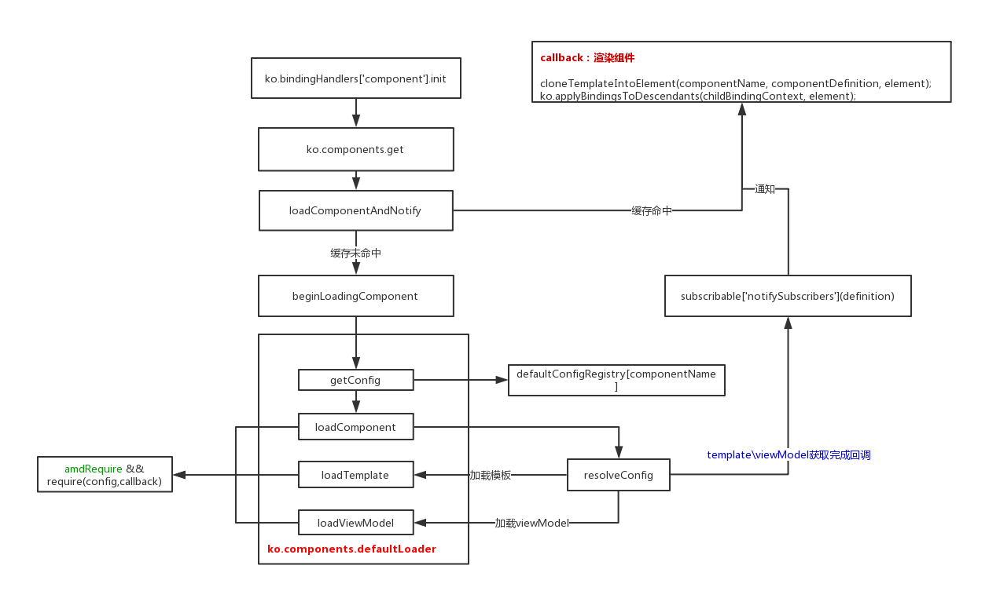

<!-- START doctoc generated TOC please keep comment here to allow auto update -->
<!-- DON'T EDIT THIS SECTION, INSTEAD RE-RUN doctoc TO UPDATE -->
**Table of Contents**  *generated with [DocToc](https://github.com/thlorenz/doctoc)*

- [1 component绑定处理器](#1-component%E7%BB%91%E5%AE%9A%E5%A4%84%E7%90%86%E5%99%A8)
- [2 ko.components.get](#2-kocomponentsget)
- [3 loadComponentAndNotify](#3-loadcomponentandnotify)
- [4 beginLoadingComponent](#4-beginloadingcomponent)
- [5 ko.components](#5-kocomponents)
  - [5.1 组件注册等相关方法](#51-%E7%BB%84%E4%BB%B6%E6%B3%A8%E5%86%8C%E7%AD%89%E7%9B%B8%E5%85%B3%E6%96%B9%E6%B3%95)
  - [5.2 ko.components.defaultLoader](#52-kocomponentsdefaultloader)
    - [5.2.1 loadComponent](#521-loadcomponent)
      - [resolveConfig](#resolveconfig)
      - [loadTemplate](#loadtemplate)
      - [loadViewModel](#loadviewmodel)
- [6 getFirstResultFromLoaders](#6-getfirstresultfromloaders)
- [7 possiblyGetConfigFromAmd](#7-possiblygetconfigfromamd)
- [8 总结](#8-%E6%80%BB%E7%BB%93)

<!-- END doctoc generated TOC please keep comment here to allow auto update -->

# 1 component绑定处理器

```javascript
ko.bindingHandlers['component'] = {
    'init': function(element, valueAccessor, ignored1, ignored2, bindingContext) {
        var currentViewModel , currentLoadingOperationId ,
            disposeAssociatedComponentViewModel = function () {};
            originalChildNodes = ko.utils.makeArray(ko.virtualElements.childNodes(element)); 
        ko.utils.domNodeDisposal.addDisposeCallback(element, disposeAssociatedComponentViewModel); // 添加dom销毁回调
        ko.computed(function () {
            // 加载组件
            ko.components.get(componentName, function(componentDefinition) {
                //...
                cloneTemplateIntoElement(componentName, componentDefinition, element);
                //...
                ko.applyBindingsToDescendants(childBindingContext, element);
            });
        }, null, { disposeWhenNodeIsRemoved: element });
        
        return { 'controlsDescendantBindings': true };
    }
}
```

**变量解释**
1. currentViewModel：当前组件的viewModel
2. currentLoadingOperationId：组件加载过程中的标识，作用是？？
3. originalChildNodes 保存组件容器原有的孩子节点

**disposeAssociatedComponentViewModel作用**
```javascript 
disposeAssociatedComponentViewModel = function () {
    var currentViewModelDispose = currentViewModel && currentViewModel['dispose'];
    if (typeof currentViewModelDispose === 'function') {
        currentViewModelDispose.call(currentViewModel);
    }
    currentViewModel = null; 
    currentLoadingOperationId = null;
},
```
1. 作用1. 更新组件容器关联的viewModel
2. 作用2. dipose回调，当组件容器dom从document移除后，销毁viewModel，避免内存泄漏
 
# 2 ko.components.get
ko.components结构
```javascript
ko.components = {
    get: function(componentName, callback) {},
    clearCachedDefinition: function(componentName) {},
    _getFirstResultFromLoaders: getFirstResultFromLoaders
};
```

调用入口
```javascript
ko.bindingHandlers['component'] = {
    'init': function(element, valueAccessor, ignored1, ignored2, bindingContext) {
        //...
        ko.computed(function () {
            //...
            ko.components.get(componentName, function(componentDefinition) { 
                if (currentLoadingOperationId !== loadingOperationId) {
                    return;
                }
         
                disposeAssociatedComponentViewModel();
         
                if (!componentDefinition) {
                    throw new Error('Unknown component \'' + componentName + '\'');
                }
                cloneTemplateIntoElement(componentName, componentDefinition, element);
                var componentViewModel = createViewModel(componentDefinition, element, originalChildNodes, componentParams),
                    childBindingContext = bindingContext['createChildContext'](componentViewModel, /* dataItemAlias */ undefined, function(ctx) {
                        ctx['$component'] = componentViewModel;
                        ctx['$componentTemplateNodes'] = originalChildNodes;
                    });
                currentViewModel = componentViewModel;
                ko.applyBindingsToDescendants(childBindingContext, element);
            }
        }
        //...
    }
}    
``` 

先说下ko.components.get的第二个参数（回调）调用的前提以及该回调做了哪些工作呢？
1. 前提：当viewModel,template准备好后走这里的回调
2. 做了哪些工作？当我傻啊，viewModel,template都准备好了当然是渲染组件啊，那么渲染组件需要哪些步骤呢？将template挂在到组件容器下；根据viewModel生成子bindingContext；ko绑定

ko.components.get的作用：准备好viewModel,template

**ko.components.get的逻辑**
```javascript
get: function(componentName, callback) {
    var cachedDefinition = getObjectOwnProperty(loadedDefinitionsCache, componentName);
    if (cachedDefinition) {
        if (cachedDefinition.isSynchronousComponent) {
            ko.dependencyDetection.ignore(function() { // See comment in loaderRegistryBehaviors.js for reasoning
                callback(cachedDefinition.definition);
            });
        } else {
            ko.tasks.schedule(function() { callback(cachedDefinition.definition); });
        }
    } else {
        // Join the loading process that is already underway, or start a new one.
        loadComponentAndNotify(componentName, callback);
    }
}
```
1. 缓存命中，则调用回调，值得注意的为了保证api的一致性，默认会异步加载组件的，但是可以通过配置使得同步加载组件
2. 缓存没有命中，加载组件所需资源（template/viewModel)，见 loadComponentAndNotify -> beginLoadingComponent

# 3 loadComponentAndNotify
```javascript
function loadComponentAndNotify(componentName, callback) {
    var subscribable = getObjectOwnProperty(loadingSubscribablesCache, componentName),
        completedAsync;
    if (!subscribable) {
        subscribable = loadingSubscribablesCache[componentName] = new ko.subscribable();
        subscribable.subscribe(callback); 
        beginLoadingComponent(componentName, function(definition, config) {...});
    }else{
        subscribable.subscribe(callback);
    }
}
```
该方法值得一说的地方是，观察者模式在这里的使用，由于template/viewModel等资源的获取是异步获取的（amd规范）

**这么做的好处？** 以下例说明 
```javascript
<div>
    <div id='compo-dom-1' data-bind="component:compo1"></div> //组件容器1
    <div id='compo-dom-2' data-bind="component:compo1"></div> //组件容器2
</div>
```

1. 解析到div[id='compo-dom-1']节点时，走if语句内；
2. 解析到div[id='compo-dom-2']节点时，走else语句内；
3. 因此这两个容器加载的是相同的组件，第二次加载同一组件时，合理做法应该是添加监听，当该组件的template/viewModel准备好后通知我，而不是再次去加载；
4. 注意下监听的回调，该回调是一直从ko.bindingHandlers['component'].update传递过来的

**loadComponentAndNotify 调用 beginLoadingComponent的第二个参数的作用？**
1. loadedDefinitionsCache：缓存组件的定义（viewModel/template)
2. loadingSubscribablesCache，删除‘订阅对象’缓存
3. 发布通知，触发订阅的回调函数（同步、异步的处理）：如果使用amd规范框架加载资源时不能保证api一致性（比如说对于已经加载完的资源会同步返回而不是异步的，比如require.js nextTick不是setTimeout的情况），
那么对于beginLoadingComponent的第二个参数的回调会同步执行，那么则会同步发布通知触发订阅的回调函数；但是呢，从api的一致性考虑这里应该是异步的（因为第一次在获取组件的相关资源是异步的）

# 4 beginLoadingComponent
首先说下 ko.components['loaders'] ,默认情况下：

``` 
ko.components['loaders'].push(ko.components.defaultLoader);
```

beginLoadingComponent

```javascript
function beginLoadingComponent(componentName, callback) {
    getFirstResultFromLoaders('getConfig', [componentName], function(config) {
        if (config) { 
            getFirstResultFromLoaders('loadComponent', [componentName, config], function(definition) {
                callback(definition, config);
            });
        } else { 
            callback(null, null);
        }
    });
}
```

1. 通过 ko.components.defaultLoader.getConfig 获取组件注册时的配置
2. ko.components.defaultLoader.loadComponent加载组件 

# 5 ko.components
## 5.1 组件注册等相关方法
```javascript 
var defaultConfigRegistry = {};

ko.components.register = function(componentName, config) {
    if (!config) {
        throw new Error('Invalid configuration for ' + componentName);
    }

    if (ko.components.isRegistered(componentName)) {
        throw new Error('Component ' + componentName + ' is already registered');
    }

    defaultConfigRegistry[componentName] = config;
};

ko.components.isRegistered = function(componentName) {
    return defaultConfigRegistry.hasOwnProperty(componentName);
};

ko.components.unregister = function(componentName) {
    delete defaultConfigRegistry[componentName];
    ko.components.clearCachedDefinition(componentName);
};
```

## 5.2 ko.components.defaultLoader 
默认的组件资源的加载器（加载viewModel.js，template.html）
```javascript
ko.components.defaultLoader = {
    'getConfig': function(componentName, callback) {
        var result = defaultConfigRegistry.hasOwnProperty(componentName)
            ? defaultConfigRegistry[componentName]
            : null;
        callback(result);
    },

    'loadComponent': function(componentName, config, callback) {
        var errorCallback = makeErrorCallback(componentName);
        possiblyGetConfigFromAmd(errorCallback, config, function(loadedConfig) {
            resolveConfig(componentName, errorCallback, loadedConfig, callback);
        });
    },

    'loadTemplate': function(componentName, templateConfig, callback) {
        resolveTemplate(makeErrorCallback(componentName), templateConfig, callback);
    },

    'loadViewModel': function(componentName, viewModelConfig, callback) {
        resolveViewModel(makeErrorCallback(componentName), viewModelConfig, callback);
    }
};
```

- getConfig：后去组件注册时的配置（ko.components.register 会将组件的信息缓存到defaultConfigRegistry变量中）
- loadComponent：获取viewModel/template -> loadViewModel、loadTemplate
- loadViewModel：加载viewModel
- loadTemplate：加载模板

### 5.2.1 loadComponent
```javascript
'loadComponent': function(componentName, config, callback) {
    var errorCallback = makeErrorCallback(componentName);
    possiblyGetConfigFromAmd(errorCallback, config, function(loadedConfig) {
        resolveConfig(componentName, errorCallback, loadedConfig, callback);
    });
}
```

流程
1. 尝试 require([config.require],fn)
```javascript
 ko.components.register(tabTmp.enName, {
    require: 'xxxxx.suffix', // 首先尝试加载这里的资源，该资源的结果会替代config
    viewModel: {require: tabTmp.component},
    template: {require: 'text!' + tabTmp.component + '.html'}
});
```
2. resolveConfig
    - loadTemplate：加载模板
    - loadViewModel：加载viewModel
        
#### resolveConfig
```javascript
var createViewModelKey = 'createViewModel';
function resolveConfig(componentName, errorCallback, config, callback) {
    var result = {},
        makeCallBackWhenZero = 2,
        tryIssueCallback = function() { 
            if (--makeCallBackWhenZero === 0) {
                callback(result);
            }
        },
        templateConfig = config['template'],
        viewModelConfig = config['viewModel'];

    if (templateConfig) {
        possiblyGetConfigFromAmd(errorCallback, templateConfig, function(loadedConfig) {
            ko.components._getFirstResultFromLoaders('loadTemplate', [componentName, loadedConfig], function(resolvedTemplate) {
                result['template'] = resolvedTemplate;
                tryIssueCallback();
            });
        });
    } else {
        tryIssueCallback();
    }

    if (viewModelConfig) {
        possiblyGetConfigFromAmd(errorCallback, viewModelConfig, function(loadedConfig) {
            ko.components._getFirstResultFromLoaders('loadViewModel', [componentName, loadedConfig], function(resolvedViewModel) {
                result[createViewModelKey] = resolvedViewModel;
                tryIssueCallback();
            });
        });
    } else {
        tryIssueCallback();
    }
}
```

- tryIssueCallback的作用：控制两个异步过程的结束（如果你知道$.when()的实现，可能会有较深的体会）
- result['template']
- result[createViewModelKey] = result['createViewModel']

**tryIssueCallback中的callback指向谁？**
loadComponentAndNotify方法中调用beginLoadingComponent时传递的第二个参数（callback）
 
#### loadTemplate
```javascript
'loadTemplate': function(componentName, templateConfig, callback) {
    resolveTemplate(makeErrorCallback(componentName), templateConfig, callback);
},
```

#### loadViewModel
```javascript
'loadViewModel': function(componentName, viewModelConfig, callback) {
    resolveViewModel(makeErrorCallback(componentName), viewModelConfig, callback);
}
```
- resolveViewModel 支持多种形式
````javascript
function resolveViewModel(errorCallback, viewModelConfig, callback) {
    if (typeof viewModelConfig === 'function') {
        callback(function (params /*, componentInfo */) {
            return new viewModelConfig(params);
        });
    } else if (typeof viewModelConfig[createViewModelKey] === 'function') {
        //...
    } else if ('instance' in viewModelConfig) {
        //...
    } else if ('viewModel' in viewModelConfig) {
        //...
    } else {
        //...
    }
}
````

# 6 getFirstResultFromLoaders
责任链模式
1. 这里有点责任链的感觉，只不过具体的处理者之间的关系是数组维护的，而不是通过next指针去维护。
2. 注意在方法的开头始终生成一份数组副本，因为该方法中存在两处的递归调用，需要保证这两处的candidateLoaders不被对方消耗（仅有自身消耗）

**流程**
获取currentCandidateLoader<br/>
    - 存在，则获取 methodInstance <br/>
        - 1.1.1 存在：调用该方法 <br/>
        - 不存在：递归（责任链中下一个处理者） <br/>
    - 不存在，调用回调 <br/>
    
**总结**<br/>
默认情况下调用 ko.components.defaultLoader 中的相应方法
        
# 7 possiblyGetConfigFromAmd
加载资源：require([xxx],fn)
 
 # 8 总结
 
