<!-- START doctoc generated TOC please keep comment here to allow auto update -->
<!-- DON'T EDIT THIS SECTION, INSTEAD RE-RUN doctoc TO UPDATE -->
**Table of Contents**  *generated with [DocToc](https://github.com/thlorenz/doctoc)*

- [1 ko.virtualElements](#1-kovirtualelements)
  - [1.1 hasBindingValue](#11-hasbindingvalue)
  - [1.2 normaliseVirtualElementDomStructure](#12-normalisevirtualelementdomstructure)
- [2 ko.bindingProvider['instance']](#2-kobindingproviderinstance)
  - [2.1 nodeHasBindings](#21-nodehasbindings)
  - [2.3 getBindingAccessors](#23-getbindingaccessors)
    - [2.3.1 getBindingsString 获取绑定字符串两种情况](#231-getbindingsstring-%E8%8E%B7%E5%8F%96%E7%BB%91%E5%AE%9A%E5%AD%97%E7%AC%A6%E4%B8%B2%E4%B8%A4%E7%A7%8D%E6%83%85%E5%86%B5)
    - [2.3.2 parseBindingsString](#232-parsebindingsstring)
- [3 ko.expressionRewriting](#3-koexpressionrewriting)
  - [3.1 parseObjectLiteral：解析绑定字符串](#31-parseobjectliteral%E8%A7%A3%E6%9E%90%E7%BB%91%E5%AE%9A%E5%AD%97%E7%AC%A6%E4%B8%B2)
  - [3.2 preProcessBindings](#32-preprocessbindings)
- [4 ko.utils](#4-koutils)
  - [4.1 fixUpContinuousNodeArray](#41-fixupcontinuousnodearray)
  - [4.2 compareArrays](#42-comparearrays)
    - [4.2.1 最小编辑距离](#421-%E6%9C%80%E5%B0%8F%E7%BC%96%E8%BE%91%E8%B7%9D%E7%A6%BB)
    - [4.2.2 compareSmallArrayToBigArray](#422-comparesmallarraytobigarray)
      - [compareArrays](#comparearrays)
      - [compareSmallArrayToBigArray](#comparesmallarraytobigarray)
        - [findMovesInArrayComparison](#findmovesinarraycomparison)
        - [总结：](#%E6%80%BB%E7%BB%93)
- [5 replaceDomNodes](#5-replacedomnodes)
- [6 ko.templateRewriting](#6-kotemplaterewriting)
  - [6.1 ensureTemplateIsRewritten](#61-ensuretemplateisrewritten)
- [7 ko.templateSources](#7-kotemplatesources)
- [8 ko.memoization](#8-komemoization)
  - [8.1 memoize](#81-memoize)
  - [8.2 unmemoize](#82-unmemoize)
  - [8.3 unmemoizeDomNodeAndDescendants](#83-unmemoizedomnodeanddescendants)
- [9 ko.tasks](#9-kotasks)

<!-- END doctoc generated TOC please keep comment here to allow auto update -->
 
# 1 ko.virtualElements
- 虚拟元素意义是什么？
1. The point of all this is to support containerless templates (e.g., <!-- ko foreach:someCollection -->blah<!-- /ko -->)
2. 作用类似于 React.Fragment
    
```javascript 
ko.virtualElements = {
    allowedBindings: {},
    childNodes: function(node) {},
    emptyNode: function(node) {},
    setDomNodeChildren: function(node, childNodes) {},
    prepend: function(containerNode, nodeToPrepend) {},
    insertAfter: function(containerNode, nodeToInsert, insertAfterNode) {},
    firstChild: function(node) {},
    nextSibling: function(node) {},
    hasBindingValue: isStartComment,
    virtualNodeBindingValue: function(node) {},
    normaliseVirtualElementDomStructure: function(elementVerified) {}
};
```

## 1.1 hasBindingValue
作用：用来判断注释节点是否具有绑定关键字
```javascript 
var commentNodesHaveTextProperty = document && document.createComment("test").text === "<!--test-->";
var startCommentRegex = commentNodesHaveTextProperty ? /^<!--\s*ko(?:\s+([\s\S]+))?\s*-->$/ : /^\s*ko(?:\s+([\s\S]+))?\s*$/;

function isStartComment(node) {
    return (node.nodeType == 8) && startCommentRegex.test(commentNodesHaveTextProperty ? node.text : node.nodeValue);
}
```
- commentNodesHaveTextProperty的作用：兼容ie9不能通过nodeValue获取注释节点的值

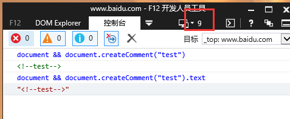

- 正向预查：(?:pattern) 和 (?=pattern)的异同点
    - 相同点：均不会获取匹配结果
    - 差异：是否消耗字符
        - (?:pattern) 消耗字符，下一字符匹配会从已匹配后的位置开始。 
        - (?=pattern) 不消耗字符，下一字符匹配会从预查之前的位置开始。 
这里其实没必要使用正向预查
  
  
## 1.2 normaliseVirtualElementDomStructure
>IE <= 8 or IE 9 quirks mode parses your HTML weirdly, treating closing </li> tags as if they don't exist <br/>
作用：在IE <= 8 或者 IE 9 怪异模式下，会忽略 </li>，因此需要做兼容处理即纠正dom树的结构 
- [案例参考](https://segmentfault.com/q/1010000004277806/a-1020000004279979)  
```html 
<ul id="ul1">
   <a href="#">li之前的a标签</a>
   <span>li之前的span标签</span>
   <li></li>
   <li></li>
   <span>li之前的span标签</span><!-- IE7下无法识别这个span标签，不知道为啥 -->
   <li></li>
   <span>li之后的span标签</span><!-- IE7下无法识别这个span标签，不知道为啥 -->
   <a href="#">li之后的a标签</a><!-- IE7下无法识别这个a标签，不知道为啥 -->
   2222
</ul>
```

- knockout-issue：https://github.com/knockout/knockout/issues/155
> IE7 will not allow anything but <li> as children of an <ul> 

# 2 ko.bindingProvider['instance']
// 单例模式
```javascript
(function() {
    var defaultBindingAttributeName = "data-bind";
    ko.bindingProvider = function() {};
    ko.utils.extend(ko.bindingProvider.prototype, {
        'nodeHasBindings': function(node) {},
        'getBindings': function(node, bindingContext) {},
        'getBindingAccessors': function(node, bindingContext) {},
        'getBindingsString': function(node, bindingContext) {},
        'parseBindingsString': function(bindingsString, bindingContext, node, options) {}
    });
    ko.bindingProvider['instance'] = new ko.bindingProvider(); 
    function createBindingsStringEvaluatorViaCache(bindingsString, cache, options) {}
    function createBindingsStringEvaluator(bindingsString, options) {}
})(); 
```
## 2.1 nodeHasBindings
作用：用来判断节点是否具有绑定关键字
```javascript 
function(node) {
    switch (node.nodeType) {
        case 1: // Element
            return node.getAttribute(defaultBindingAttributeName) != null || ko.components['getComponentNameForNode'](node);
        case 8: // Comment node
            return ko.virtualElements.hasBindingValue(node);
        default: return false;
    }
}
```
- dom节点：<div data-bind=''></div>
- 注释：<!-- ko foreach: xxx -->  
## 2.3 getBindingAccessors
> 获取绑定访问器

```javascript
'getBindingAccessors': function(node, bindingContext) {
    var bindingsString = this['getBindingsString'](node, bindingContext),
        parsedBindings = bindingsString ? this['parseBindingsString'](bindingsString, bindingContext, node, { 'valueAccessors': true }) : null;
    return ko.components.addBindingsForCustomElement(parsedBindings, node, bindingContext, /* valueAccessors */ true);
},
```
调用栈：
getBindingAccessors 
-> parseBindingsString （4.2.3.2）
-> createBindingsStringEvaluator （4.2.3.2）
-> ko.expressionRewriting.preProcessBindings （4.3.2 ）
-> ko.expressionRewriting.parseObjectLiteral（4.3.1 ）

### 2.3.1 getBindingsString 获取绑定字符串两种情况
    - dom[nodeType=1]
    - dom[nodeType=8]即注释
    
### 2.3.2 parseBindingsString
```javascript 
'parseBindingsString': function(bindingsString, bindingContext, node, options) {
    var bindingFunction = createBindingsStringEvaluatorViaCache(bindingsString, this.bindingCache, options);
    return bindingFunction(bindingContext, node);
    //...
}
``` 
 
- createBindingsStringEvaluatorViaCache -> createBindingsStringEvaluator -> createBindingsStringEvaluator
```javascript 
function createBindingsStringEvaluator(bindingsString, options) { 
    var rewrittenBindings = ko.expressionRewriting.preProcessBindings(bindingsString, options), //见3.3.1
        functionBody = "with($context){with($data||{}){return{" + rewrittenBindings + "}}}";
    var funInst = new Function("$context", "$element", functionBody);
    return funInst
    }
```


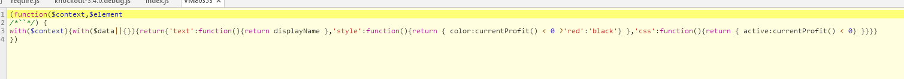 


# 3 ko.expressionRewriting
``` 
ko.expressionRewriting = (function () { 
    return {
        bindingRewriteValidators: [],
        twoWayBindings: twoWayBindings,
        parseObjectLiteral: parseObjectLiteral,
        preProcessBindings: preProcessBindings,
        keyValueArrayContainsKey: function(keyValueArray, key) {}, 
        writeValueToProperty: function(property, allBindings, key, value, checkIfDifferent) {}
    };
})();
```
## 3.1 parseObjectLiteral：解析绑定字符串
1. 代码编译的第一个阶段通常是通过词法，语法的分析来判断代码本身是否存在词法或者语法上的问题，parseObjectLiteral的作用有点类似于这个作用；
2. 方法名也暗示了该方法的作用：合法的装换为对象；这里是需要讲绑定字符串转换为对象


## 3.2 preProcessBindings

```javascript
"'text':function(){return displayName },'style':function(){return { color:currentProfit() < 0 ?'red':'black'} },'css':function(){return { active:currentProfit() < 0} }"
```

# 4 ko.utils

## 4.1 fixUpContinuousNodeArray

 
## 4.2 compareArrays
>Levenshtein 距离，又称编辑距离

作用：由一个转换成另一个所需的最少编辑操作次数，（替换，插入，删除），最终目的为了尽可能少的操作dom（ko是通过这些数据来绑定dom的）

案例
```javascript
ko.utils.compareArrays([1,2,3],[1,3,4,5,2],null)
```
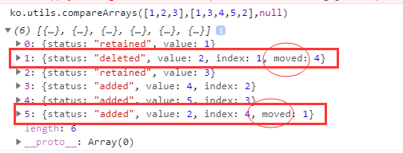


### 4.2.1 最小编辑距离
[leetcode:edit-distance](https://leetcode-cn.com/problems/edit-distance/)
>或 【左程云 - 程序员代码面试指南】第四章：最小编辑代价

【题目】
给定两个单词 word1 和 word2，计算出将 word1 转换成 word2 所使用的最少操作数 。<br/>
你可以对一个单词进行如下三种操作：<br/>
- 插入一个字符
- 删除一个字符
- 替换一个字符

案例：<br/>
```
//案例来自：左程云 - 程序员代码面试指南 ，对于leetcode的情况可以看出下例的特殊情况，即：ic = dc = rc = 1;
str1 = ‘abl2cd3’; str2 = ‘abcdf’
ic = 5;（插入操作）
dc = 3;（删除操作）
rc = 2;（替换操作）
```
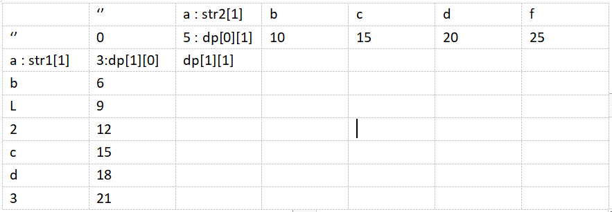

【解决方案：】动态规划<br/>
dp[i][j]的含义：str1[0...i] => str2[0...j]的最小编辑距离<br/>

【dp[i][j]求值的几种情况：】<br/>
初始值<br/>
    dp[0][0] = 0;<br/>
    dp[0][j] = j * ic;//第一行<br/>
    dp[i][0] = i * dc;//第一列<br/>

dp[i][j]计算<br/>

1.由dp[i][j-1]经过增加操作得到<br/>
- dp[i][j] = dp[i][j-1] + ic<br/>
- 如dp[1][1]：dp[1][0]通过增加str2[1]得到<br/>

2.由dp[i-1][j]经过删除操作得到<br/>
- dp[i][j] = dp[i][j-1] + dc
- 如dp[1][1]：dp[0][1]通过删除str1[1]得到

3.由dp[i-1][j-1]操作得到<br/>
- 如果str1[i] == str2[j] => dp[i][j] = dp[i-1][j-1]
- 如果str1[i] != str2[j] => dp[i][j] = dp[i-1][j-1] + rc

代码实现<br/>
```javascript
var minDistance = function (str1, str2) {
    let ic = 1, dc = 1, rc = 1
    if (str1 == null || str2 == null) {
        return 0;
    }
    let row = str1.length + 1;
    let col = str2.length + 1;

    let dp = [[0]];
    for (let i = 1; i < row; i++) {
        if(!dp[i]){
            dp[i] = [];
        }
        dp[i][0] = dc * i;
    }
    for (let j = 1; j < col; j++) {
        dp[0][j] = ic * j;
    }


    for (let i = 1; i < row; i++) {
        for (let j = 1; j < col; j++) {
            if (str1[i - 1] == str2[j - 1]) {
                dp[i][j] = dp[i - 1][j - 1];
            } else {
                dp[i][j] = dp[i - 1][j - 1] + rc;
            }
            dp[i][j] = Math.min(dp[i][j], dp[i][j - 1] + ic);
            dp[i][j] = Math.min(dp[i][j], dp[i - 1][j] + dc);
        }
    }
    return dp[row - 1][col - 1];
};
```

### 4.2.2 compareSmallArrayToBigArray
#### compareArrays
```javascript
ko.utils.compareArrays = (function () {
    var statusNotInOld = 'added', statusNotInNew = 'deleted'; 
    function compareArrays(oldArray, newArray, options) { 
        options = (typeof options === 'boolean') ? {'dontLimitMoves': options} : (options || {});
        oldArray = oldArray || [];
        newArray = newArray || [];

        if (oldArray.length < newArray.length)
            return compareSmallArrayToBigArray(oldArray, newArray, statusNotInOld, statusNotInNew, options);
        else
            return compareSmallArrayToBigArray(newArray, oldArray, statusNotInNew, statusNotInOld, options);
    }

    function compareSmallArrayToBigArray(smlArray, bigArray, statusNotInSml, statusNotInBig, options) {
         
    }

    return compareArrays;
})();
```

#### compareSmallArrayToBigArray
没有替换换操作，只有增加、删除两个个操作<br/>

案例代码<br/>
```javascript
ko.utils.compareArrays([1,2,3],[1,3,4,5,2],null)
```

compareSmallArrayToBigArray分为四个部分<br/>
```javascript 
function compareSmallArrayToBigArray(smlArray, bigArray, statusNotInSml, statusNotInBig, options) {
    //...变量声明 
    //...构造最短编辑距离矩阵 
    //...状态添加
    //...移动属性的处理
}
``` 

- 1.变量声明
```javascript
function compareSmallArrayToBigArray(smlArray, bigArray, statusNotInSml, statusNotInBig, options) {
    var myMin = Math.min,
        myMax = Math.max,
        editDistanceMatrix = [],
        smlIndex, 
        smlIndexMax = smlArray.length,
        bigIndex, 
        bigIndexMax = bigArray.length,
        compareRange = (bigIndexMax - smlIndexMax) || 1,
        maxDistance = smlIndexMax + bigIndexMax + 1,
        thisRow, 
        lastRow,
        bigIndexMaxForRow, 
        bigIndexMinForRow; 
}
```

- 2.构造最短编辑距离矩阵
思想参考4.2.1小节<br/>

```javascript
function compareSmallArrayToBigArray(smlArray, bigArray, statusNotInSml, statusNotInBig, options) { 
     // 构造 Levenshtein distance 矩阵
    for (smlIndex = 0; smlIndex <= smlIndexMax; smlIndex++) {
        lastRow = thisRow;
        editDistanceMatrix.push(thisRow = []);
        bigIndexMaxForRow = myMin(bigIndexMax, smlIndex + compareRange);
        bigIndexMinForRow = myMax(0, smlIndex - 1);
        for (bigIndex = bigIndexMinForRow; bigIndex <= bigIndexMaxForRow; bigIndex++) {
            if (!bigIndex) // 处理第一行和第二行 的第一个元素
                thisRow[bigIndex] = smlIndex + 1;
            else if (!smlIndex)  // 处理第一行
                thisRow[bigIndex] = bigIndex + 1;
            else if (smlArray[smlIndex - 1] === bigArray[bigIndex - 1])
                thisRow[bigIndex] = lastRow[bigIndex - 1];                  // copy value (no edit)
            else { 
                var northDistance = lastRow[bigIndex] || maxDistance;       // not in big (deletion)
                var westDistance = thisRow[bigIndex - 1] || maxDistance;    // not in small (addition)
                thisRow[bigIndex] = myMin(northDistance, westDistance) + 1;
            }
        }
    } 
}
```

算法关键点解析<br/>
1.很显然是逐行处理<br/>
2.每行处理的元素范围：bigIndexMinForRow - bigIndexMaxForRow，为什么是这个范围呢？ <br/>
    - 首先这是优化措施，完全可以整行全部计算，这里利用系数矩阵节省内存空间<br/>
    - 至于为什么是这个范围<br/>
    历史版本中（1.3）就有关，确定该范围的名字被称为maxEditsToConsider，从名字可以猜的出最大编辑范围的猜测，下面是v1.3版本的部分代码<br/>
    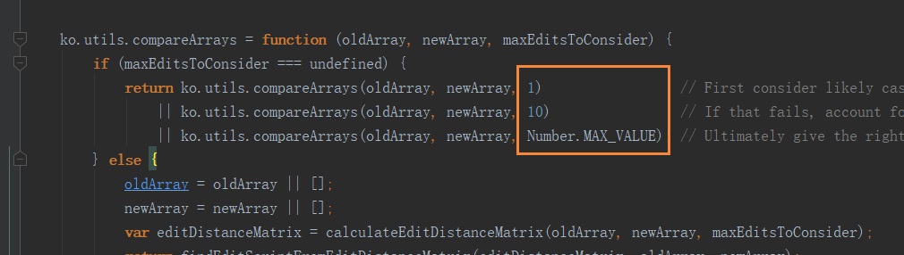<br/>
    至于为什么当前版本（v 3.2）采用compareRange作为maxEditsToConsider，尚不知为何？<br/>

变量editDistanceMatrix用来存储最小距离矩阵，案例中结果如下<br/>
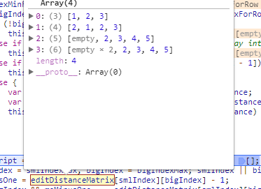<br/>
矩阵示意图<br/>
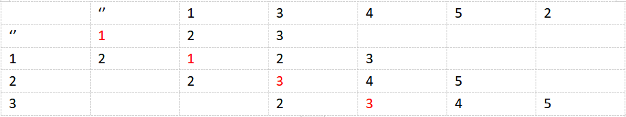<br/>

值得注意的地方<br/>
 1. 这里没有替换操作，因此当 smlArray[smlIndex - 1] 和 bigArray[bigIndex - 1]不相等时，后面的元素由于不能通过替换获取，因此只能来源于上方（lastRow[bigIndex]）喝左边（thisRow[bigIndex - 1]）两个方向处理得到
 2. 这里构造的矩阵是【稀疏矩阵】，4.2.1中生成dp数组并不是，在上面两张图中看到部分矩阵中的元素为empty
 
疑惑的地方<br/>
1. 为什么要构造为稀疏矩阵？
2. 第一行和第一列的值和4.2.1的计算方式有点区别？
    - 区别的根本在于dp[0][0] = 0，而这里的editDistanceMatrix[0][0]= 1; <br/>
    
    为此我修改了部分代码，更易于理解，核心的修改之处见下图（另外有些变量也需要调整，如maxDistance的计算）<br/>
    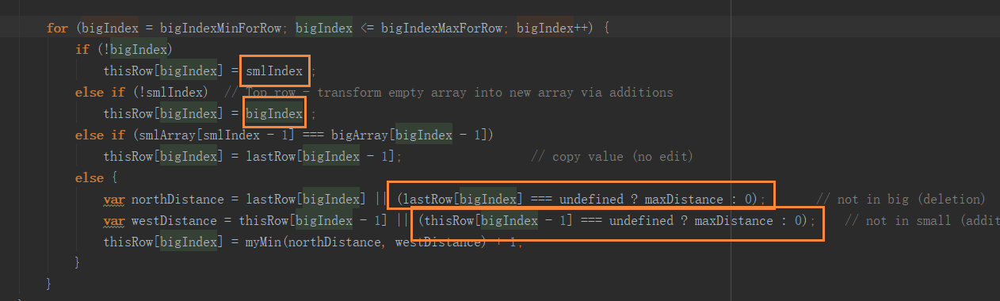<br/>
    editDistanceMatrix的执行结果如下：<br/>
    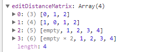<br/>
    最终返回的结果如下： editScript.reverse()<br/>
    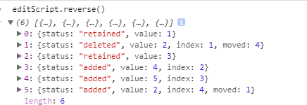<br/>
    和为修改之前的结果是完全一致的（见4.2节开始部分）<br/>
    
    - 这里得到的结果是，为了优化下面代码中else语句块，否则就得按照我上面的写法（稍显冗长）<br/>
    ```
    for (bigIndex = bigIndexMinForRow; bigIndex <= bigIndexMaxForRow; bigIndex++) {
        if (!bigIndex)
            thisRow[bigIndex] = smlIndex + 1; // 如果这里直接赋值smlIndex，那么lastRow[bigIndex]则可能为0，那么else语句块中的写法就会有问题（因为0会被认为false）
        else if (!smlIndex)  // Top row - transform empty array into new array via additions
            thisRow[bigIndex] = bigIndex + 1;
        else if (smlArray[smlIndex - 1] === bigArray[bigIndex - 1])
            thisRow[bigIndex] = lastRow[bigIndex - 1];                  // copy value (no edit)
        else {
            var northDistance = lastRow[bigIndex] || maxDistance;       // not in big (deletion)
            var westDistance = thisRow[bigIndex - 1] || maxDistance;    // not in small (addition)
            thisRow[bigIndex] = myMin(northDistance, westDistance) + 1;
        }
    }
    ```
    
- 3.状态添加，生成编辑脚本：editScript<br/>
```javascript 
function compareSmallArrayToBigArray(smlArray, bigArray, statusNotInSml, statusNotInBig, options) { 
    //状态添加
    var editScript = [], meMinusOne, notInSml = [], notInBig = [];
    for (smlIndex = smlIndexMax, bigIndex = bigIndexMax; smlIndex || bigIndex;) {
       meMinusOne = editDistanceMatrix[smlIndex][bigIndex] - 1;
       if (bigIndex && meMinusOne === editDistanceMatrix[smlIndex][bigIndex - 1]) { 
           notInSml.push(editScript[editScript.length] = {     // added
               'status': statusNotInSml,
               'value': bigArray[--bigIndex],
               'index': bigIndex
           });
       } else if (smlIndex && meMinusOne === editDistanceMatrix[smlIndex - 1][bigIndex]) { 
           notInBig.push(editScript[editScript.length] = {     // deleted
               'status': statusNotInBig,
               'value': smlArray[--smlIndex],
               'index': smlIndex
           });
       } else {
           --bigIndex;
           --smlIndex;
           if (!options['sparse']) {
               editScript.push({
                   'status': "retained",
                   'value': bigArray[bigIndex]
               });
           }
       }
   } 
    
}
```
参考4.2.1小节关于 dp[i][j]计算 部分，清楚的说明这里的逻辑（什么时候添加、什么时候删除，保留）<br/>

下面简单说下<br/>
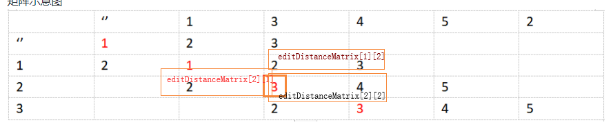<br/>
editDistanceMatrix[i][j]这里的含义同4.2.1中dp[i][j]的含义，这里不再赘述。<br/>
三种情况：<br/>
1.smlArray[i-1]=bigArray[j-1]；【retained】<br/>
    editDistanceMatrix[i][j] = editDistanceMatrix[i - 1][j - 1];<br/>
2.editDistanceMatrix[i][j]经过editDistanceMatrix[i - 1][j]smlArray[i]可以得到；【added】<br/>
3.editDistanceMatrix[i][j]经过editDistanceMatrix[i][j - 1]bigArray[j]可以得到；【deleted】<br/>

- 移动属性的处理
```javascript 
function compareSmallArrayToBigArray(smlArray, bigArray, statusNotInSml, statusNotInBig, options) { 
    //...
     ko.utils.findMovesInArrayComparison(notInBig, notInSml, !options['dontLimitMoves'] && smlIndexMax * 10);
    
     return editScript.reverse();
    //...
}
``` 


##### findMovesInArrayComparison
这部分的作用也是出于优化的目的，如果部分数据已经存在只是移动的位置，通过moved状态标识，那么在操作dom时便多了一份信息去优化dom操作的步骤。<br/>
```javascript
ko.utils.findMovesInArrayComparison = function (left, right, limitFailedCompares) {
    //...
}
```
参数 limitFailedCompares 的理解：移动dom也会浪费一定的性能，这里使用该参数控制移动的最大次数。从代码中来看当有过于繁dom的位置移动，不去移动dom，而是删除、创建。<br/>

react的diff算法有三种假设：<br/>
- Web UI 中 DOM 节点跨层级的移动操作特别少，可以忽略不计。
- 拥有相同类的两个组件将会生成相似的树形结构，拥有不同类的两个组件将会生成不同的树形结构。
- 对于同一层级的一组子节点，它们可以通过唯一 id 进行区分。

我的感觉<br/>
这里的limitFailedCompares的目的可能是为了判断两个数据差异到什么样的程度被认为是（不同的树形结构），超出这个范围则直接删除，新增。在该范围以内的还是通过移动达到相应的结构

##### 总结：
通过最小编辑距离来优化dom的操作。

# 5 replaceDomNodes


# 6 ko.templateRewriting
## 6.1 ensureTemplateIsRewritten


# 7 ko.templateSources

# 8 ko.memoization
``` 
ko.memoization = (function () { 
    return {
        memoize: function (callback) {},
        unmemoize: function (memoId, callbackParams) {},
        unmemoizeDomNodeAndDescendants: function (domNode, extraCallbackParamsArray) {},
        parseMemoText: function (memoText) {}
    };
})();
```
## 8.1 memoize
``` 
memoize: function (callback) {
    if (typeof callback != "function")
        throw new Error("You can only pass a function to ko.memoization.memoize()");
    var memoId = generateRandomId();
    memos[memoId] = callback;
    return "<!--[ko_memo:" + memoId + "]-->";
}
```
作用：通过生成一个注释元素，记录函数（显然该函数作为一个闭包存在）

## 8.2 unmemoize

## 8.3 unmemoizeDomNodeAndDescendants


# 9 ko.tasks 
