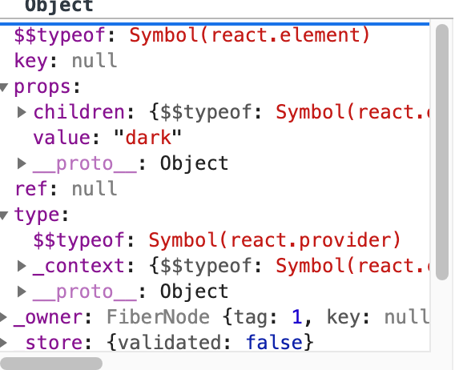
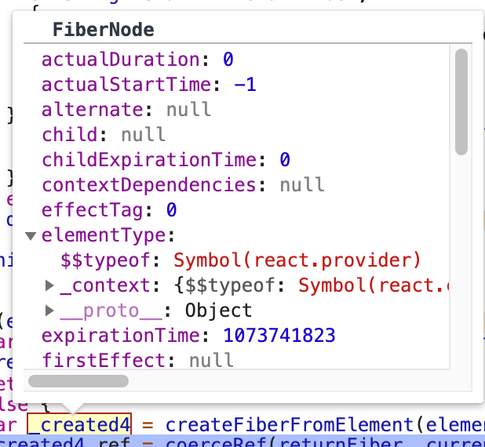
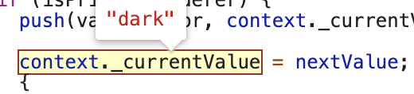

<!-- START doctoc generated TOC please keep comment here to allow auto update -->
<!-- DON'T EDIT THIS SECTION, INSTEAD RE-RUN doctoc TO UPDATE -->
**Table of Contents**  *generated with [DocToc](https://github.com/thlorenz/doctoc)*

- [案例1](#%E6%A1%88%E4%BE%8B1)
- [分析](#%E5%88%86%E6%9E%90)
  - [第一步 创建ThemeContext](#%E7%AC%AC%E4%B8%80%E6%AD%A5-%E5%88%9B%E5%BB%BAthemecontext)
  - [createContext代码](#createcontext%E4%BB%A3%E7%A0%81)
  - [第二步 mount阶段](#%E7%AC%AC%E4%BA%8C%E6%AD%A5-mount%E9%98%B6%E6%AE%B5)
    - [简要描述](#%E7%AE%80%E8%A6%81%E6%8F%8F%E8%BF%B0)
    - [具体描述](#%E5%85%B7%E4%BD%93%E6%8F%8F%E8%BF%B0)
  - [updateContextProvider](#updatecontextprovider)
    - [主要流程](#%E4%B8%BB%E8%A6%81%E6%B5%81%E7%A8%8B)
  - [updateClassComponent（和context相关的逻辑](#updateclasscomponent%E5%92%8Ccontext%E7%9B%B8%E5%85%B3%E7%9A%84%E9%80%BB%E8%BE%91)
    - [主要流程](#%E4%B8%BB%E8%A6%81%E6%B5%81%E7%A8%8B-1)
      - [挂载阶段](#%E6%8C%82%E8%BD%BD%E9%98%B6%E6%AE%B5)
      - [更新阶段](#%E6%9B%B4%E6%96%B0%E9%98%B6%E6%AE%B5)
    - [constructClassInstance](#constructclassinstance)
    - [mountClassInstance](#mountclassinstance)
    - [updateClassInstance](#updateclassinstance)
    - [readContext](#readcontext)
      - [主要流程](#%E4%B8%BB%E8%A6%81%E6%B5%81%E7%A8%8B-2)
- [案例2](#%E6%A1%88%E4%BE%8B2)
- [总结](#%E6%80%BB%E7%BB%93)

<!-- END doctoc generated TOC please keep comment here to allow auto update -->

 
[参考](https://zhuanlan.zhihu.com/p/42654080) 


--------------------------------------------------------------------------------
新式用法：

const context = React.createContext('defaultValue')
static contextType = context （区别于  contextTypes
ConsumerClass.contextType 这种方式只能拿到距离最近的context


--------------------------------------------------------------------------------

# 案例1
ConsumerClass.contextType => 就近获取context （疑问，如何实现就近取？？如何引起更新？？
```javascript
const ThemeContext = React.createContext('light');

export class NewContext extends React.Component {
  render(){
    return (
      <ThemeContext.Provider value="dark">
        <ThemedButton/>
      </ThemeContext.Provider>
    );
  }
}

class ThemedButton extends React.Component {
  static contextType = ThemeContext;

  render(){
    return <div>{this.context}</div>;
  }
}

ReactDOM.render(<NewContext/>, window.document.getElementById('app'));
```

# 分析
## 第一步 创建ThemeContext
第一步当，下面这行代码所在的js文件被浏览器加载执行后，这行代码会被执行
```javascript
const ThemeContext = React.createContext('light');
```

## createContext代码
逻辑很简单，就是返回了一个对象，包含了几个重要的属性（有多个组件引用这个对象时，该对象是共享的
```
// context的关键属性
Provider
Consumer
$$typeof
_currentValue
```

```javascript
export function createContext<T>(
  defaultValue: T,
  calculateChangedBits: ?(a: T, b: T) => number,
): ReactContext<T> {
  if (calculateChangedBits === undefined) {
    calculateChangedBits = null;
  }  

  const context: ReactContext<T> = {
    $$typeof: REACT_CONTEXT_TYPE,
    _calculateChangedBits: calculateChangedBits, 
    _currentValue: defaultValue,
    _currentValue2: defaultValue, 
    _threadCount: 0, 
    Provider: (null: any),
    Consumer: (null: any),
  };

  context.Provider = {
    $$typeof: REACT_PROVIDER_TYPE,
    _context: context,
  };

  context.Consumer = context;
 
  return context;
}
```

## 第二步 mount阶段
ReactDom.render执行，这里的执行逻辑已经在另一篇文章进行了介绍，下面描述主要的过程

### 简要描述
1. workLoop(root_fiber)
2. workLoop(NewContext_fiber) => updateClassComponent
3. workLoop(ThemeContext.Provider_fiber) => updateContextProvider
4. workLoop(ThemedButton_fiber) => updateClassComponent => 
    挂载时：mountClassInstance => instance.context = readContext(contextType);
    更新时：updateClassInstance => instance.context = nextContext;


### 具体描述
挂载时节点的创建顺序（深度优先遍历）
1. 首先是root，初始时就会创建关联的fiberRoot
2. 然后到NewContext组件 ： workLoop( NewContext_fiber )
    - 在finishClassComponent调用render，通过React.createElement返回render的内容，如下（这是react element 并非fiber）
     

    - 然后到 reconcileChildren => reconcileChildFibers => placeSingleChild
    - 在 placeSingleChild 中会通过上面的react element 去创建对应的fiber节点 => createFiberFromFragment，如下图
    

3. 回到 workLoop => beginWork，此时 nextUnitOfWork 就是上面最后返回的fiber节点对应 <ThemeContext.Provider />
    - beiginWork 中通过fiber.tag类型判断进入 updateContextProvider 
        - 调用pushProvider
        
        - 调用reconcileChildren: 会创建第一个孩子节点的fiber对象，即 ThemedButton 类组件的fiber对象 : ThemedButton_fiber，nextUnitOfWork就是此对象
    - beginWork(ThemedButton_fiber) => 进入 updateClassComponent 

## updateContextProvider
下面看下updateContextProvider

### 主要流程
1. pushProvider 设置 context._currentValue = newValue，
    - newValue是当前fiber的pendingProps的value属性（如下
```jsx harmony
<Context.Provider value="">xxx</Context.Provider>
```

2. 如果是更新阶段，即oldProps存在 【TODO】
    - calculateChangedBits 校验 是否变化了
        - 否 -> bailoutOnAlreadyFinishedWork
        - 是 -> propagateContextChange，主要工作如下，循环遍历孩子节点
            - 中间组件shoulUpdate=false，Consumer组件一样会更新 【TODO】demo测试
            - 对于匹配到的 Consumer 节点，将不再遍历它的子孙节点，而是向上回溯遍历它自身或祖先的兄弟节点，Consumer 的子孙节点将会在 Consumer update 时被遍历，继续向下传播 context 变更，这是为了时间分片而考虑

3. reconcileChildren
```javascript
function updateContextProvider(
  current: Fiber | null,
  workInProgress: Fiber,
  renderExpirationTime: ExpirationTime,
) {
  const providerType: ReactProviderType<any> = workInProgress.type;
  const context: ReactContext<any> = providerType._context;

  const newProps = workInProgress.pendingProps;
  const oldProps = workInProgress.memoizedProps;

  const newValue = newProps.value; 

  pushProvider(workInProgress, newValue);

  if (oldProps !== null) {
    const oldValue = oldProps.value;
    const changedBits = calculateChangedBits(context, newValue, oldValue);
    if (changedBits === 0) {
      // No change. Bailout early if children are the same.
      if (
        oldProps.children === newProps.children &&
        !hasLegacyContextChanged()
      ) {
        return bailoutOnAlreadyFinishedWork(
          current,
          workInProgress,
          renderExpirationTime,
        );
      }
    } else {
      // The context value changed. Search for matching consumers and schedule
      // them to update.
      propagateContextChange(
        workInProgress,
        context,
        changedBits,
        renderExpirationTime,
      );
    }
  }

  const newChildren = newProps.children;
  reconcileChildren(current, workInProgress, newChildren, renderExpirationTime);
  return workInProgress.child;
}
```

pushProvider
```javascript
export function pushProvider<T>(providerFiber: Fiber, nextValue: T): void {
  const context: ReactContext<T> = providerFiber.type._context;
  push(valueCursor, context._currentValue, providerFiber);
  context._currentValue = nextValue; // 关键
}
```


## updateClassComponent（和context相关的逻辑
### 主要流程
1. 判断是不是老式用法的provider
    - 是
    - 不是 hasContext = false
2. prepareToReadContext 【TODO】
    - 有效赋值：readContext

#### 挂载阶段
3. constructClassInstance
    - contextType 是否存在（新式 api 的consumer
        - 则readContext(contextType)
            - 读取context数据，
            - 设置fiber的context依赖：contextDependencies
    - isLegacyContextConsumer 为真时（表示是老式用法context，cacheContext 
4. mountClassInstance
    - 新式用法consumer吗（contextType存在？
        - 是的，则给组件实例设置context属性，这解释了为什么在组件内部可以拿到该属性
        ```javascript
        instance.context = readContext(contextType);
        ```     
        - 否呢

#### 更新阶段
updateClassInstance，关于context这块逻辑基本同mountClassInstance
```javascript
function updateClassComponent(current$$1, workInProgress, Component, nextProps, renderExpirationTime) { 
  var hasContext = void 0;
  if (isContextProvider(Component)) {
    hasContext = true;
    pushContextProvider(workInProgress);
  } else {
    hasContext = false;
  }
  prepareToReadContext(workInProgress, renderExpirationTime);

  var instance = workInProgress.stateNode;
  var shouldUpdate = void 0;
  if (instance === null) {
    if (current$$1 !== null) {
      // ...
    } 
    constructClassInstance(workInProgress, Component, nextProps, renderExpirationTime);
    mountClassInstance(workInProgress, Component, nextProps, renderExpirationTime);
    shouldUpdate = true;
  } else if (current$$1 === null) {
    // ... 暂不考虑
  } else {
    shouldUpdate = updateClassInstance(current$$1, workInProgress, Component, nextProps, renderExpirationTime);
  }
  var nextUnitOfWork = finishClassComponent(current$$1, workInProgress, Component, shouldUpdate, hasContext, renderExpirationTime); 
  return nextUnitOfWork;
}
```


### constructClassInstance
```javascript
function constructClassInstance(
  workInProgress: Fiber,
  ctor: any,
  props: any,
  renderExpirationTime: ExpirationTime,
): any {
  let isLegacyContextConsumer = false;
  let unmaskedContext = emptyContextObject;
  let context = null;
  const contextType = ctor.contextType;

  if (typeof contextType === 'object' && contextType !== null) {
    context = readContext((contextType: any));
  } else {
    unmaskedContext = getUnmaskedContext(workInProgress, ctor, true);
    const contextTypes = ctor.contextTypes;
    isLegacyContextConsumer =
      contextTypes !== null && contextTypes !== undefined;
    context = isLegacyContextConsumer
      ? getMaskedContext(workInProgress, unmaskedContext)
      : emptyContextObject;
  }
  
  // ... 构造组件实例等操作

  if (isLegacyContextConsumer) {
    cacheContext(workInProgress, unmaskedContext, context);
  }

  return instance;
}
```


### mountClassInstance
```
function mountClassInstance(
  workInProgress: Fiber,
  ctor: any,
  newProps: any,
  renderExpirationTime: ExpirationTime,
): void { 
  
  // ... instance props state等赋值操作
  
  const contextType = ctor.contextType;
  if (typeof contextType === 'object' && contextType !== null) {
    instance.context = readContext(contextType);
  } else {
    const unmaskedContext = getUnmaskedContext(workInProgress, ctor, true);
    instance.context = getMaskedContext(workInProgress, unmaskedContext);
  }
 
  // ... state更新 生命周期调用等逻辑
}
```

### updateClassInstance
```
function updateClassInstance(
  current: Fiber,
  workInProgress: Fiber,
  ctor: any,
  newProps: any,
  renderExpirationTime: ExpirationTime,
): boolean {

  // ...

  const oldContext = instance.context;
  const contextType = ctor.contextType;
  let nextContext;
  if (typeof contextType === 'object' && contextType !== null) {
    nextContext = readContext(contextType);
  } else {
    const nextUnmaskedContext = getUnmaskedContext(workInProgress, ctor, true);
    nextContext = getMaskedContext(workInProgress, nextUnmaskedContext);
  }

  // ... 生命周期等执行

  instance.context = nextContext;

  return shouldUpdate;
}
```

### readContext 
#### 主要流程
给当前fiber设置contextDependencies属性，指向一个链表

```javascript
export function readContext<T>(
  context: ReactContext<T>,
  observedBits: void | number | boolean,
): T { 

  if (lastContextWithAllBitsObserved === context) {
    // Nothing to do. We already observe everything in this context.
  } else if (observedBits === false || observedBits === 0) {
    // Do not observe any updates.
  } else {
    let resolvedObservedBits; // Avoid deopting on observable arguments or heterogeneous types.
    if (
      typeof observedBits !== 'number' ||
      observedBits === MAX_SIGNED_31_BIT_INT
    ) {
      // Observe all updates.
      lastContextWithAllBitsObserved = ((context: any): ReactContext<mixed>);
      resolvedObservedBits = MAX_SIGNED_31_BIT_INT;
    } else {
      resolvedObservedBits = observedBits;
    }

    let contextItem = {
      context: ((context: any): ReactContext<mixed>),
      observedBits: resolvedObservedBits,
      next: null,
    };

    if (lastContextDependency === null) {
      // This is the first dependency for this component. Create a new list.
      lastContextDependency = contextItem;
      currentlyRenderingFiber.contextDependencies = {
        first: contextItem,
        expirationTime: NoWork,
      };
    } else {
      // Append a new context item.
      lastContextDependency = lastContextDependency.next = contextItem;
    }
  }
  return isPrimaryRenderer ? context._currentValue : context._currentValue2;
}
```

 

# 案例2 
子组件使用Consumer 而不是 static contextType 

为什么引用的同一个Context，但是又能够各自维护

```jsx harmony
const Context = React.createContext();

<Context.Provice value = {a:'a'}>
    <Child></Child>
</Context.Provider>


class Child extends{
    constructor(props){
      super(props); 
      this.state = { a: 'a' };
    }
    
    // 触发更新，看一下更新时 Context.Provider组件 是如何更新的，子组件是如何获取值的
    handleClick = () => {
      this.setState({
        a: 'a1',
      });
    };
    
    render(){
        return <div></div>
    }
}

Child.contextType = Context;
```

1. completeUnitOfWork  // 挂载阶段 这里pop了
    - popProvider 
2. 更新阶段时 // 更细阶段又push了
    - Context.Provider组件，该组件本身不更新
        - 在beginWork中满足 updateExpirationTime < renderExpirationTime
    ```javascript         
    didReceiveUpdate = false; 
    
    switch case:provider
        var newValue = workInProgress.memoizedProps.value;
        pushProvider(workInProgress, newValue);
    
    bailoutOnAlreadyFinishedWork
    ```

# 总结
针对这个情况，举个例子说下执行流程
 【TODO】画个流程图  
1. 首先 通过React.createContext创建来实例是，是全局共享的对象
我之前的疑惑是，既然是共享的对象，那么该context.provider组件是不是只能调用一次，如果调用第二次_currentValue是不是被覆盖呢？？？下面揭开面纱
2. 遇到Provider组件(实例)，就pushProvider(设置context._currentValue的值，那么在该Provider组件的孩子组件中，都可以通过拿到context._currentValue的值，当该Provider组件render完成即调用completeUnitOfWork，会再popProvider，将context._currentValue重置为undefined
3. 再次遇到Provider组件(又一实例，不同的fiber对象而已），有重复步骤二的流程
因此 虽然context对象是共享的，但在渲染组件树时，每次渲染到Provider组件时，会设置当前实例环境下去 设置_currentValue，由于workLoop这里的遍历是深度优先遍历，因此，后面会去渲染Provider组件的孩子节点，那么它的孩子节点就可以拿到这个环境的值了


