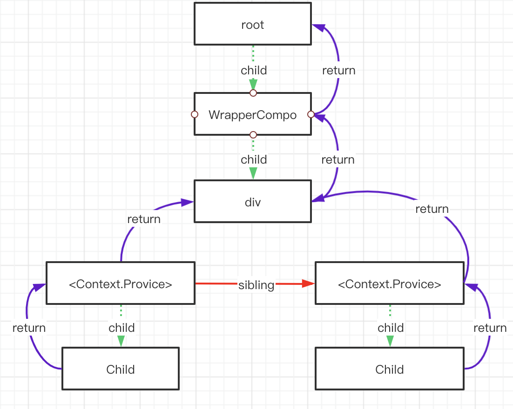
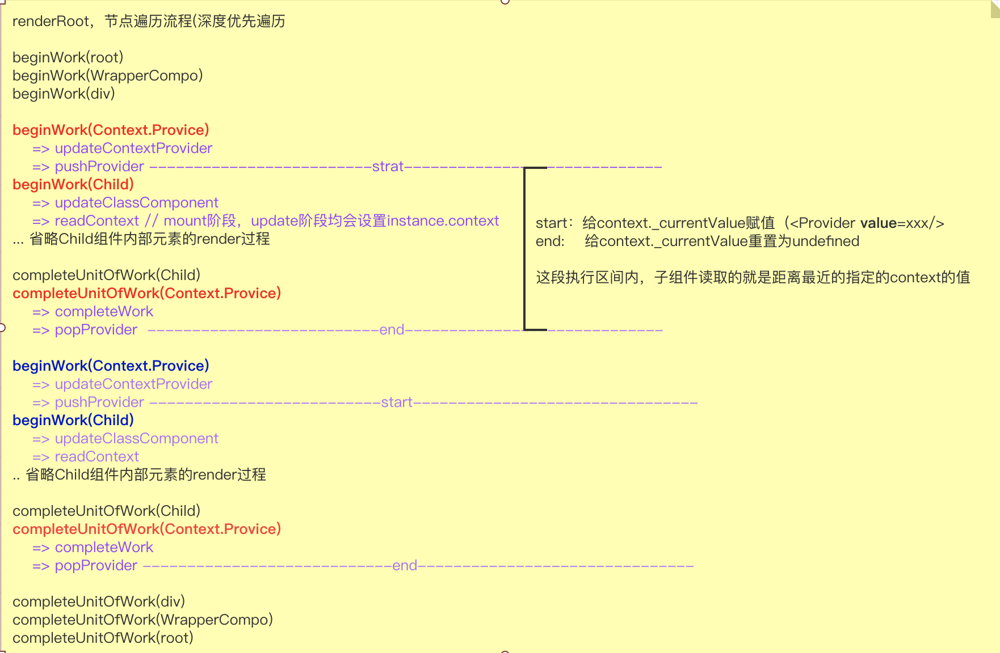
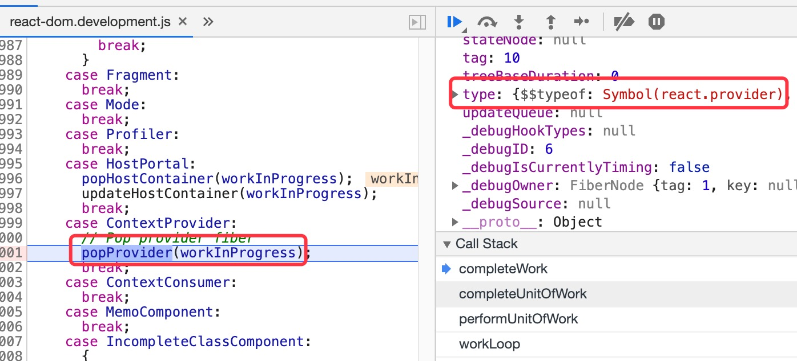
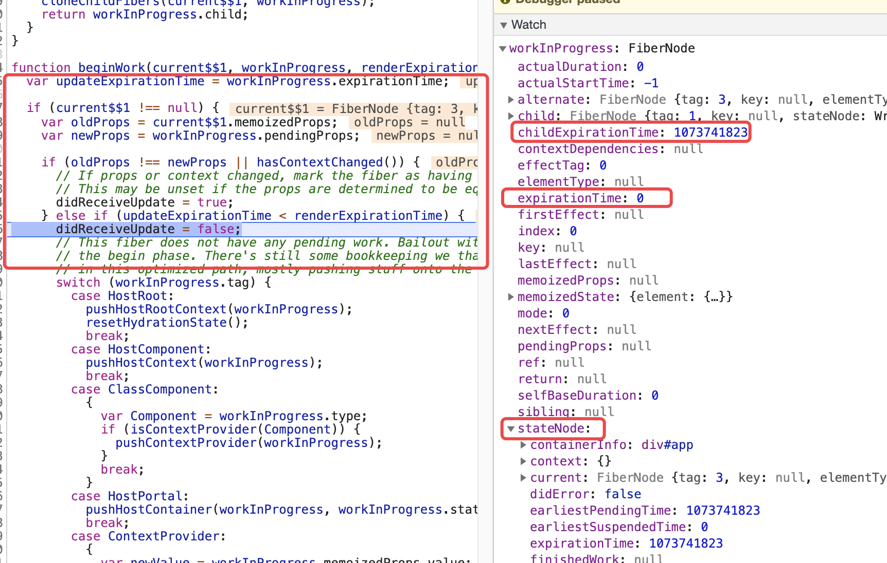
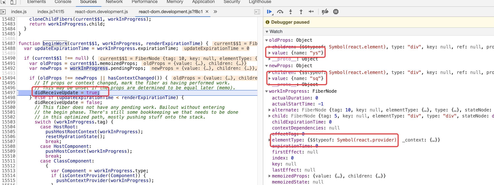
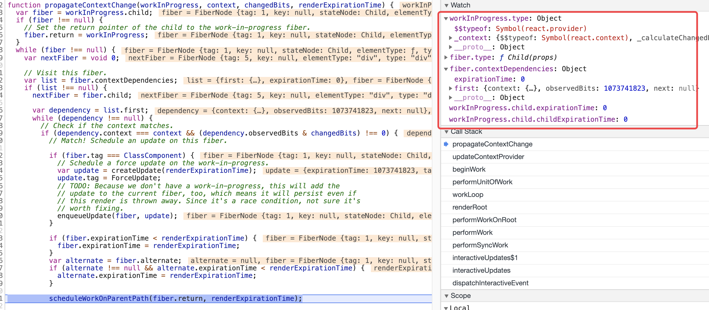
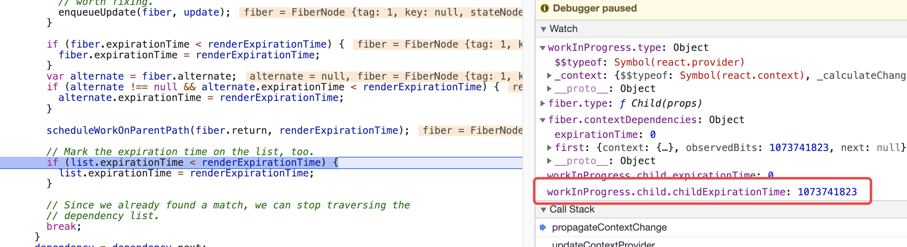

<!-- START doctoc generated TOC please keep comment here to allow auto update -->
<!-- DON'T EDIT THIS SECTION, INSTEAD RE-RUN doctoc TO UPDATE -->
**Table of Contents**  *generated with [DocToc](https://github.com/thlorenz/doctoc)*

- [demo1 挂载阶段：子组件通过static contextType = Context;方式获取conext](#demo1-%E6%8C%82%E8%BD%BD%E9%98%B6%E6%AE%B5%E5%AD%90%E7%BB%84%E4%BB%B6%E9%80%9A%E8%BF%87static-contexttype--context%E6%96%B9%E5%BC%8F%E8%8E%B7%E5%8F%96conext)
  - [mount阶段](#mount%E9%98%B6%E6%AE%B5)
  - [总结](#%E6%80%BB%E7%BB%93)
  - [demo2](#demo2)
- [demo3 更新阶段：consumer组件更新 & 顺便讲点时间](#demo3-%E6%9B%B4%E6%96%B0%E9%98%B6%E6%AE%B5consumer%E7%BB%84%E4%BB%B6%E6%9B%B4%E6%96%B0--%E9%A1%BA%E4%BE%BF%E8%AE%B2%E7%82%B9%E6%97%B6%E9%97%B4)
  - [scheduleWork](#schedulework)
    - [scheduleWorkToRoot](#scheduleworktoroot)
      - [主要流程](#%E4%B8%BB%E8%A6%81%E6%B5%81%E7%A8%8B)
      - [代码](#%E4%BB%A3%E7%A0%81)
  - [beginWork](#beginwork)
    - [无需更新的父节点，但是需要设置一些环境](#%E6%97%A0%E9%9C%80%E6%9B%B4%E6%96%B0%E7%9A%84%E7%88%B6%E8%8A%82%E7%82%B9%E4%BD%86%E6%98%AF%E9%9C%80%E8%A6%81%E8%AE%BE%E7%BD%AE%E4%B8%80%E4%BA%9B%E7%8E%AF%E5%A2%83)
- [demo4 Context.Consumer](#demo4-contextconsumer)
  - [updateContextConsumer](#updatecontextconsumer)
    - [主要流程](#%E4%B8%BB%E8%A6%81%E6%B5%81%E7%A8%8B-1)
  - [readContext](#readcontext)
    - [主要流程](#%E4%B8%BB%E8%A6%81%E6%B5%81%E7%A8%8B-2)
- [demo5 如果Context.Provider 值发生变化，如何通知到订阅了该 context的子组件](#demo5-%E5%A6%82%E6%9E%9Ccontextprovider-%E5%80%BC%E5%8F%91%E7%94%9F%E5%8F%98%E5%8C%96%E5%A6%82%E4%BD%95%E9%80%9A%E7%9F%A5%E5%88%B0%E8%AE%A2%E9%98%85%E4%BA%86%E8%AF%A5-context%E7%9A%84%E5%AD%90%E7%BB%84%E4%BB%B6)
  - [propagateContextChange](#propagatecontextchange)
    - [主要流程](#%E4%B8%BB%E8%A6%81%E6%B5%81%E7%A8%8B-3)
    - [代码](#%E4%BB%A3%E7%A0%81-1)

<!-- END doctoc generated TOC please keep comment here to allow auto update -->


# demo1 挂载阶段：子组件通过static contextType = Context;方式获取conext
```jsx harmony
const Context = React.createContext();

export class Child extends React.Component {
  // 关键
  static contextType = Context;

  constructor(props){
    super(props);
    this.state = { count: 1 };
  }

  // 仅仅为了触发更新
  handleClick = () => {
    this.setState({
      count: 2,
    });
  };

  render(){
    return <div onClick={this.handleClick.bind(this)}>{this.context.name}</div>;
  }
}


export class WrapperCompo extends React.Component {
  render(){
    return <div>
      <Context.Provider value={{ name: 'a' }}>
        <Child></Child>
      </Context.Provider>
      <Context.Provider value={{ name: 'b' }}>
        <Child></Child>
      </Context.Provider>
    </div>;
  }
}

ReactDOM.render(<WrapperCompo/>, window.document.getElementById('app'));
```

 

## mount阶段


## 总结
>深度优先遍历fiber树，本质是个递归操作（递归可以理解为在栈上执行，react内部用while循环实现）performUnitOfWork像是入栈操作，completeUnitOfWork像是出栈操作
所以这里context的操作也是这种感觉，push/pop，push的操作发生performUnitOfWork -> beginWork -> updateContextProvider，pop的操作发生在completeUnitOfWork（即该Provider组件关联的fiber节点render完成 （这里的render不是指在页面上渲染完成，而是render阶段，对应着commit阶段
 
- beginWork(Context.Provicer) -> updateContextProvider -> pushProvider：保存上一次的context的值 & 设置当前context的值<br/>
    pushProvider
    ```javascript
    function pushProvider(providerFiber, nextValue) {
        //...
        // 保存上一次的context的值 
        push(valueCursor, context._currentValue, providerFiber);
        // 设置当前context的值，因此其子组件访问的context的值就是在这里设置的
        context._currentValue = nextValue;
        //...
    }
    ```
- beginWork(Child) -> updateClassComponent -> constructClassInstance/mountClassInstance/updateClassInstance -> readContext<br/>
    readContext
    - 读取context的值 & 并且将该context作为依赖添加到fiber.contextDependencies属性中，表明该fiber依赖该context
    - contextDependencies作用体现在，比如当<Context.provider>设置了新的context值，即值发生了变化，从递归遍历其孩子节点，读取该孩子节点的contextDependencies属性是否包含自身（即发生变化的context），如果包含，则添加依赖，那么设置该节点(fiber).expirationTime
表明有更新。
    ```javascript
    function readContext(context, observedBits) {
        //...
        var contextItem = {
          context: context,
          observedBits: resolvedObservedBits,
          next: null
        }; 
        //...
        lastContextDependency = contextItem;
        currentlyRenderingFiber.contextDependencies = {
            first: contextItem,
            expirationTime: NoWork
        };
    }
    ```
- completeUnitOfWork(Child)
- completeUnitOfWork(Context.Provider) -> completeWork -> popProvider
    


## demo2 
通过入栈出栈（pushProvider/popProvider）去修改共享的context对象
```jsx harmony
const Context1 = React.createContext();
const Context2 = React.createContext();

<Context1.Provider value={'A'}>                 // push 1 
  <Child1>                                      // 读取最近的context: 1
    <Context1.Provider value={'B'}>             // push 2
      <Child2>                                  // 读取最近的context: 2
      <Context2.Provider value={'C'}>           // push 3
        <div>
          <div>
            <Child3></Child3>                  // 读取最近的context: 3
          </div>
        </div>
      </Context2.Provider>                    // pop 3
      </Child2>
    </Context1.Provider>                     // pop 2
  </Child1>  
</Context1.Provider>                         // pop 1
```

# demo3 更新阶段：consumer组件更新 & 顺便讲点时间
demo1 基础上看下更新的情况，点击Child组件

在未点击之前由于没有工作在进行，那么fiber树中各节点的expirationTime 应为 NoWork ，每个fiber节点在 真正开始work的时候，会重置expirationTime为NoWork
```javascript
beginWork(){
    ...
    workInProgress.expirationTime = NoWork;
    ..
}
```

```javascript
  enqueueSetState: function (inst, payload, callback) {
    var fiber = get(inst);
    var currentTime = requestCurrentTime();
    var expirationTime = computeExpirationForFiber(currentTime, fiber);

    var update = createUpdate(expirationTime);
    update.payload = payload;
    if (callback !== undefined && callback !== null) { 
      update.callback = callback;
    }

    flushPassiveEffects();
    enqueueUpdate(fiber, update);
    scheduleWork(fiber, expirationTime);
  },
```

点击事件，更新
```
function interactiveUpdates$1(fn, a, b) {
  // If there are any pending interactive updates, synchronously flush them.
  // This needs to happen before we read any handlers, because the effect of
  // the previous event may influence which handlers are called during
  // this event.
  if (!isBatchingUpdates && !isRendering && lowestPriorityPendingInteractiveExpirationTime !== NoWork) {
    // Synchronously flush pending interactive updates.
    performWork(lowestPriorityPendingInteractiveExpirationTime, false);
    lowestPriorityPendingInteractiveExpirationTime = NoWork;
  }
  var previousIsBatchingUpdates = isBatchingUpdates;
  isBatchingUpdates = true;
  try {
    return scheduler.unstable_runWithPriority(scheduler.unstable_UserBlockingPriority, function () {
      return fn(a, b);
    });
  } finally {
    isBatchingUpdates = previousIsBatchingUpdates;
    if (!isBatchingUpdates && !isRendering) {
      performSyncWork();
    }
  }
}
```

## scheduleWork
1. markPendingPriorityLevel(root, expirationTime);
2. findNextExpirationTimeToWorkOn
     - 设置 root.nextExpirationTimeToWorkOn/expirationTime

### scheduleWorkToRoot
#### 主要流程 
1. 当前work的优先级更高时（即expirationTime更大时），需要更新fiber.expirationTime 
2. 自该节点向上遍历，更新childExpirationTime
    - 如当前fiber有任务需要更新，那么需要遍历其父节点，通过设置parent.childExpirationTime，这样子在遍历父元素时就可以通过这个指标来判断是否有子元素需要更新
```html
<A>
    <B></B> 
</A>

// 如果现在B进行了setState,那么B的expirationTime就不是NoWork，然后A的expirationTime仍然为0，只是A.childExpirationTime不为0
// 这样就能够说明，A自身没有更新，但是其孩子有要更新的节点，因此需要继续往下遍历，直到某个节点的childExpirationTime为NoWork 【猜测】
```

#### 代码
```javascript
function scheduleWorkToRoot(fiber, expirationTime) {  
  // Update the source fiber's expiration time
  if (fiber.expirationTime < expirationTime) {
    fiber.expirationTime = expirationTime;
  }
  var alternate = fiber.alternate;
  if (alternate !== null && alternate.expirationTime < expirationTime) {
    alternate.expirationTime = expirationTime;
  }
  // Walk the parent path to the root and update the child expiration time.
  var node = fiber.return;
  var root = null;
  if (node === null && fiber.tag === HostRoot) {
    root = fiber.stateNode;
  } else {
    while (node !== null) {
      alternate = node.alternate;
      if (node.childExpirationTime < expirationTime) {
        node.childExpirationTime = expirationTime;
        if (alternate !== null && alternate.childExpirationTime < expirationTime) {
          alternate.childExpirationTime = expirationTime;
        }
      } else if (alternate !== null && alternate.childExpirationTime < expirationTime) {
        alternate.childExpirationTime = expirationTime;
      }
      if (node.return === null && node.tag === HostRoot) {
        root = node.stateNode;
        break;
      }
      node = node.return;
    }
  } 
  return root;
}
```

## beginWork
1. 还是之前挂载阶段的遍历顺序，
    - 只是由于Child节点之前的那部分节点不需要更新，因此会在beginWork的前半部分执行环境设置 以及 bailout退出，而不是继续执行节点更新(因为无需更新
    - Child节点由于执行了setState所以需要更新 会走 updateClassComponent

### 无需更新的父节点，但是需要设置一些环境
本案例中：root节点 -> Child的父元素，这些节点都是没有更新的，走到下面的beginWork else if 分支



在reactdom.render章节说了该函数的后半部分，主要是因为该函数的前半部分是针对更新阶段的处理逻辑，mount阶段会跳过这部分
现在，详细说下这前半部分的逻辑
```javascript
if (current$$1 !== null) {
  var oldProps = current$$1.memoizedProps;
  var newProps = workInProgress.pendingProps;

  if (oldProps !== newProps || hasContextChanged()) { .
    didReceiveUpdate = true;
  } else if (updateExpirationTime < renderExpirationTime) {
    didReceiveUpdate = false;
    switch(tag){...}
   bailoutOnAlreadyFinishedWork()
  }
}else{
    didReceiveUpdate = false;
}
```

1. 显示判断 props 以及 context 是否发生了变化 hasContextChanged，如何得知context的变化的
    - 首先这二者变化，需要进行更新组件更新 => 设置 didReceiveUpdate 为true 
2. 如果props没有更新 && context也没有发生变化 && workInProgress.expirationTime < nextRenderExpirationTime
    - 说明当前节点不需要更新，这种情况会有哪些操作呢？
        - didReceiveUpdate = false // 作用？updateFunctionComponent updateForwardRef 代码中搜索下，目前这两个类型节点的更新会用到这个标识
        - didReceiveUpdate 从变量名称可以猜测出，变量是用来表明当前节点有接收属性（props变化，conext变化）发生变化而引起的更新
    - 针对不同类型的节点类型，做相应的处理
    ```javascript
    switch(workInProgress.tag){
        // 1. ClassComponent：判断类组件是不是ContextProvider（老式context用法）,如果是的话，则 pushContextProvider
        // 2. ContextProvider：pushProvider（即使Provider组件本身不需要更新，但是需要去设置子组件需要用到的context数据
        // 3. HostRoot：pushHostRootContext 
        // 4. pushHostContext：pushHostContext 
        // 5. HostPortal：pushHostContainer
        // 6. SuspenseComponent ... 
    }
    ```

    - bailoutOnAlreadyFinishedWork 主要工作 ： 根据childExpirationTime判断是否孩子节点需要更新
        - 如果没有，返回null，开始往上回溯
        - 如果有 ，克隆孩子节点(fiber对象)，返回作为nextUnitOfWork

需要更新的节点：点击事件后，Child组件setState而引起的组件更新，并且没有来自接收属性的变化的更新（beginWork的） => updateClassComponent => 更新该节点

# demo4 Context.Consumer
```jsx harmony
class Child extends React.Component {
  render(){
    return <ThemeContext.Consumer>
      {
        (value) => <div>{value}</div> // render函数

      }
    </ThemeContext.Consumer>;
  }
}
```

## updateContextConsumer
注意 Context.Consumer的孩子是个函数
```jsx harmony
class Child extends React.Component {
  render(){
    return <ThemeContext.Consumer>
      {
        (value) => <div>{value}</div>

      }
    </ThemeContext.Consumer>;
  }
}
```

### 主要流程
1. 调用readContext
2. 调用render函数，获取子节点
3. 调和
```javascript
function updateContextConsumer(current$$1, workInProgress, renderExpirationTime) {
  var newProps = workInProgress.pendingProps;
  var render = newProps.children; // 函数
  prepareToReadContext(workInProgress, renderExpirationTime);
  var newValue = readContext(context, newProps.unstable_observedBits);
  var newChildren = render(newValue); 
  reconcileChildren(current$$1, workInProgress, newChildren, renderExpirationTime);
  return workInProgress.child;
}
```

## readContext
### 主要流程
1. 将context作为依赖添加到fiber.contextDependencies中，这样的话，当某个context发生了变化，就会通知到该fiber去更新数据，见propagateContextChange是如何通知的
2. 读取context的值
```javascript
function readContext(context, observedBits) {  
    //... 省略部分非核心逻辑
    var contextItem = {
      context: context,
      observedBits: resolvedObservedBits,
      next: null
    };

    if (lastContextDependency === null) { 
      lastContextDependency = contextItem;
      currentlyRenderingFiber.contextDependencies = {
        first: contextItem,
        expirationTime: NoWork
      };
    } else { 
      lastContextDependency = lastContextDependency.next = contextItem;
    } 
  return isPrimaryRenderer ? context._currentValue : context._currentValue2;
}
```

# demo5 如果Context.Provider 值发生变化，如何通知到订阅了该 context的子组件
关注更新阶段 updateContextProvider => propagateContextChange
```jsx harmony
const Context = React.createContext();

class Child extends React.Component {
  static contextType = Context;

  constructor(props){
    super(props);
  }

  render(){
    return <div>{this.context.name}</div>;
  }
}


function MiddleCompo(){
  return <Child/>;
}

export class WrapperCompo extends React.Component {
  constructor(props){
    super(props);
    this.state = {
      name: 'ys',
    };
  }

  // 仅仅为了触发更新
  handleClick = () => {
    this.setState({
      name: 'sq',
    });
  };

  render(){
    return <Context.Provider value={{ name: this.state.name }}>
      <div onClick={this.handleClick.bind(this)}>
        <div>
          <MiddleCompo></MiddleCompo>
        </div>
      </div>
    </Context.Provider>;
  }
}

ReactDOM.render(<WrapperCompo/>, window.document.getElementById('app'));
```

上面demo2中有说到在更新阶段，如果Provider组件的值没有发生变化，不会继续对该fiber进行更新，而是在beginWork的前半部分中，return bailoutOnAlreadyFinishedWork返回下一个需要更新的fiber

如果此时Provider组件的值发生了变化，那么情况如何呢？点击wrappercompo组件
1. 首先由于props发生了变化，会去设置didReceiveUpdate变量
>【划重点】：WrapperCompo 发生了this.setState，在该组件的updateClassInstance过程中会重新调用instance.render，此时会调用React.createElement重新生成元素，因此
即使context值看起来并未发生改变，但他们也是不同的对象，因此在这里对比时也会进入if语句内。
【注意我上面 赋值属性的写法 value={{name:'xxx'}}，如果是value={this.state.obj} 情况可能又会不同
之所以前面的case中进入了 else if 根本原因是因为Provider所在WrapperCompo组件没有重新渲染，所以props没变化



2. 其次进入 updateContextProvider 开始处理Provider组件的更新逻辑
    - 这里主要说下和挂载阶段这里处理的差异（见下面代码
    ```javascript
    if (oldProps !== null) {
      var oldValue = oldProps.value;
      var changedBits = calculateChangedBits(context, newValue, oldValue);
      if (changedBits === 0) {
        // No change. Bailout early if children are the same.
        if (oldProps.children === newProps.children && !hasContextChanged()) {
          return bailoutOnAlreadyFinishedWork(current$$1, workInProgress, renderExpirationTime);
        }
      } else {
        // The context value changed. Search for matching consumers and schedule
        // them to update.
        propagateContextChange(workInProgress, context, changedBits, renderExpirationTime);
      }
    }
   ```

    - 先是调用 calculateChangedBits 方法来判断context的新值和老值是否发生了变化
        - React.createContext提供了第二个参数，可以让我们自己比较context的值是否发生变化，有点类似于shouldComponentUpdate的感觉
    - 如果没有发生变化 则 调用 bailoutOnAlreadyFinishedWork，通beginWork中的思路一样
    - 如果发生了变化，走 propagateContextChange


## propagateContextChange
### 主要流程
深度优先遍历workInProgress（是个Provider)，遍历的第一个节点是Provider.child<br/>
是否存在这个链表<br/>

- 存在的话，存在循环遍历context依赖链表，看看是否能找到当前context，即如果当前fiber依赖这个workInProgress组件关联的context，并且 dependency.observedBits & changedBits , 唯一设置observedBits 的地方 readContext，observedBits是给hooks用的（useContext readContext)  测试案例<br/>
    - 这里主要是给当前的fiber创建一个更新对象放入fiber.updateQueue中（前面这部分逻辑是针对类组件的），然后更新该fiber.expirationTime ，另外通过scheduleWorkOnParentPath方法更新所有祖先元素的childExpirationTime，用来表明存在子元素需要更新，当workInProgress完成更新后，会返回workInProgress.child作为nextUnitOfWork节点<br/>
        - 如果这个nextUnitOfWork节点依赖了context，那么会在刚才的操作中，更新expirationTIme，此时beginWork时候，由于有更新任务，会继续更新该节点<br/>
        - 如果nextUnitOfWork自身并没有更新任务，但是其孩子节点有依赖这个context的，那么nextUnitOfWork.childExpirationTime则表明有孩子需要更新，因此workLoop会一直往下循环，直到某个没有更新的节点<br/>
        >比如demo5的案例中 MiddleCompo 组件就没有依赖context，但是Child组件是有的，看下Context.Provider 组件走进这里的数据<br/>

下图是更新到Context.Provider组件时，在propagateContextChange中去寻找有依赖的组件，找到了Child组件，Child组件的contextDependencies是在updateClasssComponent中添加上的。<br/>
主要关注下 wordInProgress.child.childExpirationTime = 0


当走完 scheduleWorkOnParentPath方法后，发现 wordInProgress.child.childExpirationTime 更新了，这样在遍历workInProgress.child时，虽然workInProgress.child自身没有更新，当进入beginWork后会走bailoutOnAlreadyFinishedWork 然后通过childExpirationTime发现有孩子节点需要更新，继续往下遍历（否则直接返回null）。


- 不存在的话 并且 这个fiber是个Provider
- 否则 设置 nextFiber = fiber.child;
- 后面部分代码为了实现深度优先遍历


### 代码
```javascript
function propagateContextChange(workInProgress, context, changedBits, renderExpirationTime) {
  var fiber = workInProgress.child;
  if (fiber !== null) {
    // Set the return pointer of the child to the work-in-progress fiber.
    fiber.return = workInProgress;
  }
  while (fiber !== null) {
    var nextFiber = void 0;

    // Visit this fiber.
    var list = fiber.contextDependencies;
    if (list !== null) {
      nextFiber = fiber.child;

      var dependency = list.first;
      while (dependency !== null) {
        // Check if the context matches.
        if (dependency.context === context && (dependency.observedBits & changedBits) !== 0) {
          // Match! Schedule an update on this fiber.

          if (fiber.tag === ClassComponent) {
            // Schedule a force update on the work-in-progress.
            var update = createUpdate(renderExpirationTime);
            update.tag = ForceUpdate;
            // TODO: Because we don't have a work-in-progress, this will add the
            // update to the current fiber, too, which means it will persist even if
            // this render is thrown away. Since it's a race condition, not sure it's
            // worth fixing.
            enqueueUpdate(fiber, update);
          }

          if (fiber.expirationTime < renderExpirationTime) {
            fiber.expirationTime = renderExpirationTime;
          }
          var alternate = fiber.alternate;
          if (alternate !== null && alternate.expirationTime < renderExpirationTime) {
            alternate.expirationTime = renderExpirationTime;
          }

          scheduleWorkOnParentPath(fiber.return, renderExpirationTime);

          // Mark the expiration time on the list, too.
          if (list.expirationTime < renderExpirationTime) {
            list.expirationTime = renderExpirationTime;
          }

          // Since we already found a match, we can stop traversing the
          // dependency list.
          break;
        }
        dependency = dependency.next;
      }
    } else if (fiber.tag === ContextProvider) {
      // Don't scan deeper if this is a matching provider
      nextFiber = fiber.type === workInProgress.type ? null : fiber.child;
    } else if (enableSuspenseServerRenderer && fiber.tag === DehydratedSuspenseComponent) {
     // ...
    } else {
      // Traverse down.
      nextFiber = fiber.child;
    }

    if (nextFiber !== null) {
      // Set the return pointer of the child to the work-in-progress fiber.
      nextFiber.return = fiber;
    } else {
      // No child. Traverse to next sibling.
      nextFiber = fiber;
      while (nextFiber !== null) {
        if (nextFiber === workInProgress) {
          // We're back to the root of this subtree. Exit.
          nextFiber = null;
          break;
        }
        var sibling = nextFiber.sibling;
        if (sibling !== null) {
          // Set the return pointer of the sibling to the work-in-progress fiber.
          sibling.return = nextFiber.return;
          nextFiber = sibling;
          break;
        }
        // No more siblings. Traverse up.
        nextFiber = nextFiber.return;
      }
    }
    fiber = nextFiber;
  }
}
```
