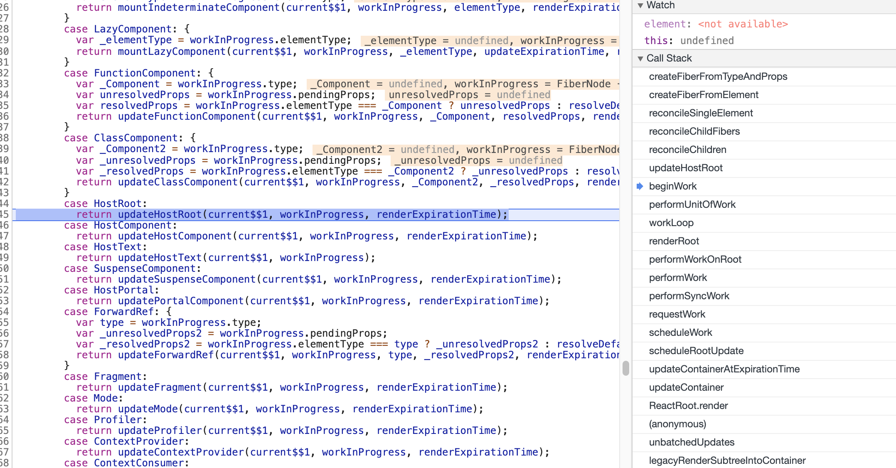
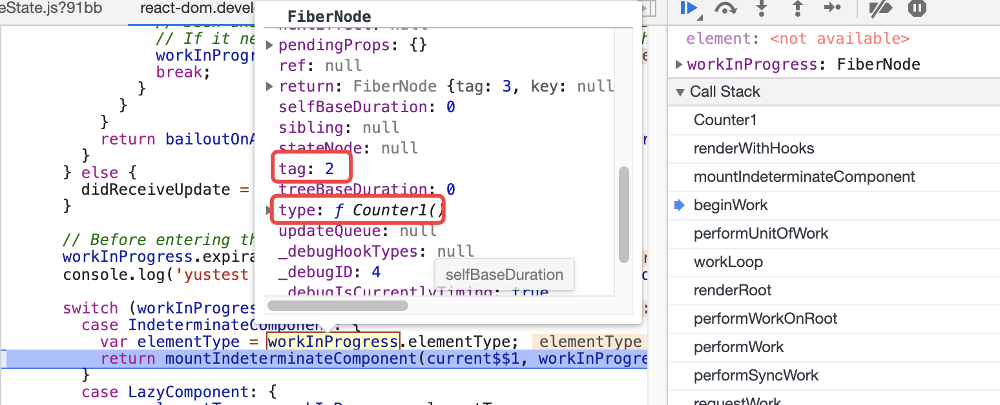
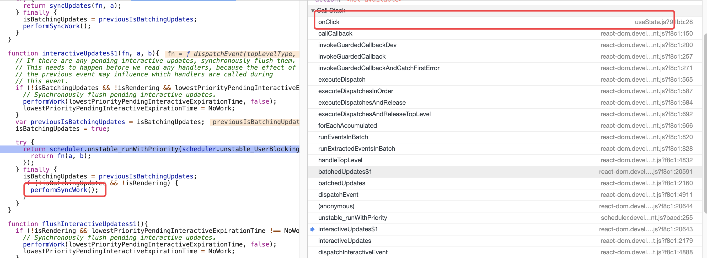
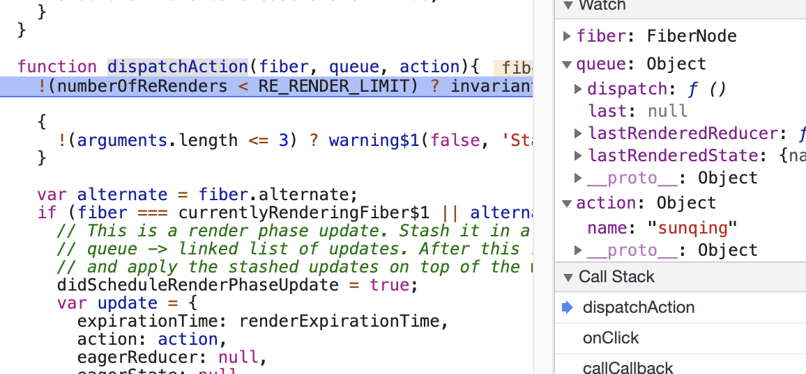
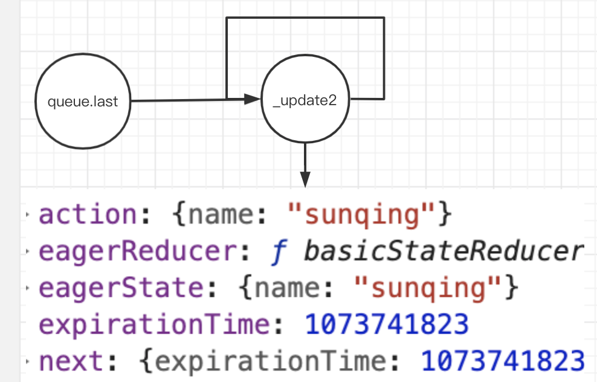
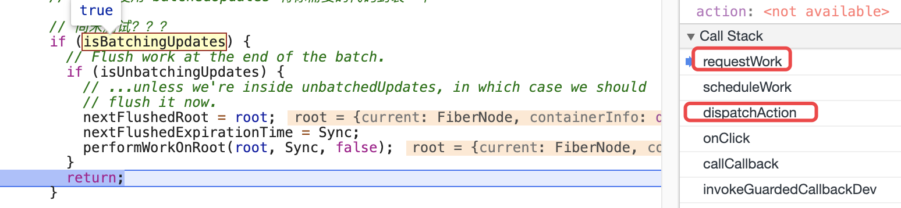
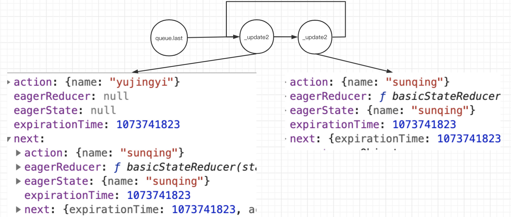
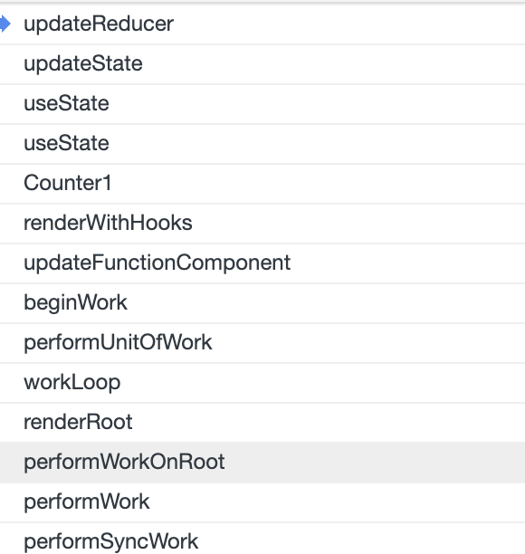
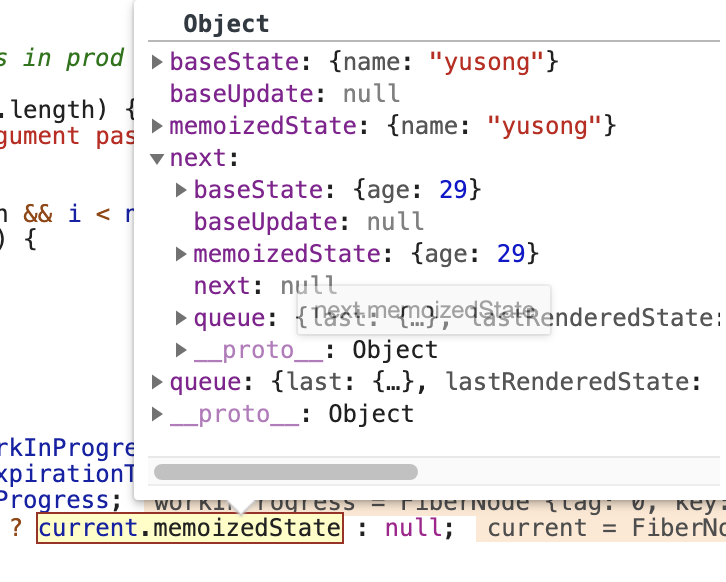

<!-- START doctoc generated TOC please keep comment here to allow auto update -->
<!-- DON'T EDIT THIS SECTION, INSTEAD RE-RUN doctoc TO UPDATE -->
**Table of Contents**  *generated with [DocToc](https://github.com/thlorenz/doctoc)*

- [示例demo](#%E7%A4%BA%E4%BE%8Bdemo)
- [前奏](#%E5%89%8D%E5%A5%8F)
- [1. 挂载阶段：执行hook](#1-%E6%8C%82%E8%BD%BD%E9%98%B6%E6%AE%B5%E6%89%A7%E8%A1%8Chook)
  - [renderWithHooks](#renderwithhooks)
- [2. 调用setState更改状态](#2-%E8%B0%83%E7%94%A8setstate%E6%9B%B4%E6%94%B9%E7%8A%B6%E6%80%81)
  - [dispatchAction.if](#dispatchactionif)
  - [dispatchAction.else](#dispatchactionelse)
    - [1. setName({ name: 'sunqing' });](#1-setname-name-sunqing-)
    - [2. setAge({ age: '26' });](#2-setage-age-26-)
    - [3. setName({ name: 'yujingyi' });](#3-setname-name-yujingyi-)
- [3. 执行setState后的更新](#3-%E6%89%A7%E8%A1%8Csetstate%E5%90%8E%E7%9A%84%E6%9B%B4%E6%96%B0)
  - [前奏](#%E5%89%8D%E5%A5%8F-1)
  - [updateFunctionComponent](#updatefunctioncomponent)
  - [updateReducer](#updatereducer)
    - [主要流程](#%E4%B8%BB%E8%A6%81%E6%B5%81%E7%A8%8B)
- [附](#%E9%99%84)
  - [如何记住顺序](#%E5%A6%82%E4%BD%95%E8%AE%B0%E4%BD%8F%E9%A1%BA%E5%BA%8F)

<!-- END doctoc generated TOC please keep comment here to allow auto update -->

 

# 示例demo
```javascript
export function UseStateTest(){
  const nameState = { name: 'yusong' };
  const ageState = { age: 29 };
  let [name, setName] = useState(nameState);
  let [age, setAge] = useState(ageState);

  return (
    <>
      <p>{name.name} {age.age}</p>
      <button onClick={() => {
        debugger
        setName({ name: 'sunqing' });
        setAge({ age: '26' });
        setName({ name: 'yujingyi' });
      }}>mod name
      </button>
    </>
  );
}
```

# 前奏
1. workLoop中的第一个节点是从root节点开始的，current$$1表示根节点对应的fiber节点，在ReactDom.render初始阶段会去创建，其类型是HostRoot，见函数createHostRootFiber


2. 每个节点都会经历调和(调和是针对当前节点的新老孩子节点进行对比），根节点也不例外
    - 组件挂载过程中，孩子节点是不存在的，来到函数reconcileSingleElement，此时第二个参数currentFirstChild（表示父节点的第一个孩子节点）为空，当前示例中会走到createFiberFromTypeAndProps，默认情况下 tag 是 IndeterminateComponent （表示函数组件）,示例中的第一个孩子节点是函数组件，type构造函数，然后会给该节点创建对应的fiber节点，该节点会被返回给workLoop作为nextUnitOfWork
3. 接着走workLoop，来到beginWork，到mountIndeterminateComponent
    - 设置 workInProgress.tag = FunctionComponent;
    

# 1. 挂载阶段：执行hook
```javascript
function mountIndeterminateComponent(_current, workInProgress, Component, renderExpirationTime){
    ...
    value = renderWithHooks(null, workInProgress, Component, props, context, renderExpirationTime);
    ...
}
```

## renderWithHooks 
1. 设置ReactCurrentDispatcher$1.current
    - mount阶段设置为 HooksDispatcherOnMountInDEV / HooksDispatcherOnMount
    - update阶段设置为  HooksDispatcherOnUpdateInDEV / HooksDispatcherOnUpdate
```javascript
// production环境下应该是以下代码
ReactCurrentDispatcher.current = nextCurrentHook === null ? HooksDispatcherOnMount : HooksDispatcherOnUpdate;

// dev环境下 分别是 HooksDispatcherOnUpdateInDEV HooksDispatcherOnMountInDEV

// 二类的区别在于，后者多处理写dev环境下相关的逻辑（可忽略 => 最终调用都会归于一处
// mount阶段下 比如 useState => mountState
```

2. 执行函数组件
```javascript
let children = Component(props, refOrContext);
```

3. 函数组件中直接使用的hooks api 是从react.js导出 而非 react-dom.js；不过实质还是在react-dom中实现，react.js只是暴露接口而已，函数组件调用的 useState => mountState
```javascript
function mountState(initialState){
  // 创建当前执行的hook，将该hook放到链表的尾部
  // 该链表是一个双端链表，firstWorkInProgressHook（头） workInProgressHook（尾，同时也表示正在进行中的hook，函数名字可以看得出）
  var hook = mountWorkInProgressHook();
   
  if (typeof initialState === 'function') {
    initialState = initialState();
  }
  // 保存state到hook中
  hook.memoizedState = hook.baseState = initialState;
  
 // 给当前hook创建一个队列，作用后面在分析 【TODO】
  var queue = hook.queue = {
    last: null,
    dispatch: null,
    lastRenderedReducer: basicStateReducer,
    lastRenderedState: initialState,
  };
  
  // currentlyRenderingFiber$1 变量是在renderWithHooks中设置的，指向当前正在render的fiber
  // 返回的dispatch保存了关联的fiber，以及queue，每个useState都有对应的queue
  // 注意queue持有dispatch引用
  var dispatch = queue.dispatch = dispatchAction.bind(null,
    // Flow doesn't know this is non-null, but we do.
    currentlyRenderingFiber$1, queue);
    
    // 返回
  return [hook.memoizedState, dispatch];
}

function mountWorkInProgressHook(){
  var hook = {
    memoizedState: null,

    baseState: null,
    queue: null,
    baseUpdate: null,

    next: null, // 链表
  };

  if (workInProgressHook === null) {
    firstWorkInProgressHook = workInProgressHook = hook; 
  } else {
    workInProgressHook = workInProgressHook.next = hook;
  }
  return workInProgressHook;
}

function basicStateReducer(state, action) {
  return typeof action === 'function' ? action(state) : action;
}
```

4. 当前fiber的部分属性设置，尤其是memoizedState
    - renderedWork.memoizedState = firstWorkInProgressHook;使得该组件关联的fiber持有了hooks链表的第一个节点，这样便可以在后续更新的过程中去找到之前的状态

# 2. 调用setState更改状态
这里的setState是useState返回结果的第二个参数

点击按钮触发setState，点击后进入事件回调
```html
<button onClick={() => {
    setName({ name: 'sunqing' });
    setAge({ age: '26' });
    setName({ name: 'yujingyi' });
}}>mod name</button>
```

在下面的入口处，发现有设置isBatchingUpdates = true;没？我们在事件回调中多次setState会被合并为一次，就是通过这个变量去处理的，当在事件回调中执行setState时会走到requestWork去，由于该变量在这里被设置为true，因此不会进行后面的渲染等阶段（performSyncWork），而是在这里的finally中的performSyncWork合并处理（注意finally中恢复了isBatchingUpdates变量的值）。 下面看下和hooks相关的逻辑。


useState返回的第二个参数可以看做是类组件中的setState，在上面小结说到setState实际执行dispatchAction。首先dispatchAction是第一次调用useState的时候注入的，dispatchAction的前两个参数是也是在那个时候通过bind绑定的，action才是此时调用setName传入进来的，这个action可以是个函数，后面分析的时候会看到


该函数主流程可以看成两部分，通过if.else分割开了，if内部的逻辑可以想象成在useEffect去setState了，针对这种情况react会进行优化处理。案例中的点击事件回调中执行，会走else中的逻辑


## dispatchAction.if
renderWithHooks过程中(设置currentlyRenderingFiber$1)，调用了setState即dispatchAction则会走到这里，【TODO 细究这个case】
```html
// This is a render phase update. Stash it in a lazily-created map of
// queue -> linked list of updates. After this render pass, we'll restart
// and apply the stashed updates on top of the work-in-progress hook.useTransition
```

## dispatchAction.else
>事实上这里的逻辑和类组件的setState几乎完全一致，参考classComponentUpdater.enqueueSetState方法

该过程分为三步: 1. 处理queue 2. if条件语句 保存/执行新的state 3. scheduleWork 
### 1. setName({ name: 'sunqing' });
1. 处理queue
    - queue.last指向了一个循环链表
    - 该循环链表的添加的第一个节点是特殊的，因为计算了eagerState，eagerReducer
    


2. fiber.expirationTime === NoWork && (alternate === null || alternate.expirationTime === NoWork)：满足这个条件说明什么：该节点之前未有更新工作
    - 计算setState内容，并和上一个状态进行对比，判断是否需要更新组件
    ```javascript
   if (is(_eagerState, currentState)) {
     return; // 不继续后面的scheduleWork，则不会引起组件的更新
   }
    ``` 
    
3. scheduleWork
    - scheduleWork => scheduleWorkToRoot -> requestWork -> addRootToSchedule 被添加到schedule链表中等待更新
        - 设置 fiber.expirationTime
    - 走到requestWork，由于设置了isBatchingUpdates为true，会被返回，不会进行后面的performSyncWork
    

### 2. setAge({ age: '26' });
1. 仅仅处理queue
    - 这里的queue和之前的queue不是同一个，分别属于不同的hook，
2. 相对于第一次setName，不过跳过了中间的if条件语句（因为第一次scheduleWork过程中设置了fiber.expirationTime
3. scheduleWork -> requestWork-> return (不进行performSyncWork

### 3. setName({ name: 'yujingyi' });
1. 处理queue，
     - 和第一次setName是同一个queue，因为同一个hook对应的queue是相同的
    - queue.last总是指向最新的state
    - 这一次的state没有进行计算，只是保存传递进来的action，没有进入if去计算eagerState,eagerReducer，这么做的目的是啥？？ 
    


2. 跳过if
3. scheduleWork -> requestWokr-> return (不进行performSyncWork

# 3. 执行setState后的更新
## 前奏
由于这里的demo的setState发生在事件回调中，会在事件执行完成后统一performSyncWork。上面小结已经提到过，现在开始分析performSyncWork。


performWorkOnRoot包含了两个阶段
1. render阶段，包含了整个数节点的调和
    - 在该阶段，会重新执行一次函数组件，将之前setState保存下来的_update执行后获取最新的state，然后根据最新的state，返回树结构
    - 调和
2. commit阶段，所有的差异统一提交

renderRoot -> workLoop（遍历整棵树
```javascript
while (nextUnitOfWork !== null) {
  nextUnitOfWork = performUnitOfWork(nextUnitOfWork);
}
```


root节点
1. 首先一定是root节点，没有更新 => bailoutOnAlreadyFinishedWork
    - 当前节点没有更新(props没有变化，context没有变化) 或者 低优先级 => 跳过：bailoutOnAlreadyFinishedWork
2. 返回root.child 

现在看下当前更新的节点UseStateTest组件<br/>
beginWork通过tag标识(函数组件) => updateFunctionComponent()

## updateFunctionComponent
```javascript
function updateFunctionComponent(current$$1, workInProgress, Component, nextProps, renderExpirationTime){
    ...
    nextChildren = renderWithHooks(current$$1, workInProgress, Component, nextProps, context, renderExpirationTime);
    ...
    reconcileChildren()
}
```

renderWithHooks流程前面已经说过
1. 设置nextCurrentHook
```javascript
nextCurrentHook = current !== null ? current.memoizedState : null;
```
2. 设置 ReactCurrentDispatcher$1.current = HooksDispatcherOnUpdateInDEV(dev环境下) / HooksDispatcherOnUpdate（production环境下
3. 执行函数组件
```html
// renderWithHooks => 执行函数组件
// 1. 执行hook：会执行setState阶段的_update以获取最新的state ， 见下面的updateReducer
// 2. 返回新的ReactElement结构(用最新的state渲染)
let children = Component(props, refOrContext);
```
4. 执行hook, 如示例中的 useState => updateState => updateReducer

## updateReducer
目的：执行hook.queue （类似fiber.updateQueue) 获取最新的state

### 主要流程
1. 调用 updateWorkInProgressHook ，获取一个工作状态的hook
    - 可以理解为克隆一个hook（第一个hook的初始化在renderWithHooks中，给nextCurrentHook赋值执行第一个hook对象
    - 另外一个重要的工作，将下一个hook赋值给 nextCurrentHook，这样在函数组件中执行第二个hook的时候就会拿到属于自己的hook；这也解释了hooks的顺序性
    ```javascript
    nextCurrentHook = currentHook.next;
   ```
2. numberOfReRenders > 0 【TODO】
3. 中间一大串的逻辑是取出hook.queue并执行获取最新的state
4. 保存执行后的结果到新的hook对象上，返回结果
>有个小点值得关注下，返回的数据的第二个元素dispatch是从queue取出的，这是在useState -> mountState 是赋值的；如果示例中返回的setName在挂载以及更新阶段，这个对象始终指向同一个。另外示例中setName和setAge并不是同一个对象，在mountState中进行了bind的操作。

# 附
## 如何记住顺序
1. fiber.memoizedState的结构，在renderWithHooks的尾部有设置这个属性，执行一个hook链表
    - 该hook链表中的每个节点是个hook对象，这个hook对象上的queue指向一个更新列表（等价于类组件fiber.updateQueue）
        - useState在更新阶段会执行udpateReducer函数，updateReducer会去执行这个queue，以获取该hook最终的state
    - hook.queue.last指向一个循环链表（该循环链表的节点是一个update对象，见dispatchAction方法中有该对象的结构），last指向的第一个节点是最近更新的state

