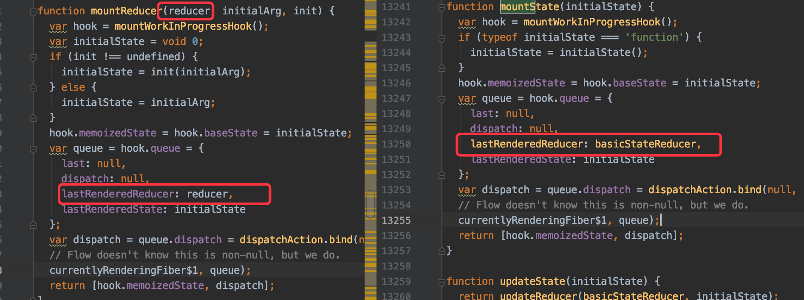
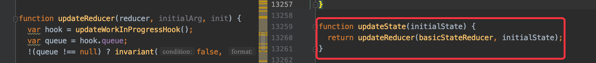

<!-- START doctoc generated TOC please keep comment here to allow auto update -->
<!-- DON'T EDIT THIS SECTION, INSTEAD RE-RUN doctoc TO UPDATE -->
**Table of Contents**  *generated with [DocToc](https://github.com/thlorenz/doctoc)*

- [示例demo](#%E7%A4%BA%E4%BE%8Bdemo)

<!-- END doctoc generated TOC please keep comment here to allow auto update -->

[参考](https://reactjs.org/docs/hooks-reference.html#usereducer)

# 示例demo
```jsx harmony
const initialState = {count: 0};

function reducer(state, action) {
  switch (action.type) {
    case 'increment':
      return {count: state.count + 1};
    case 'decrement':
      return {count: state.count - 1};
    default:
      throw new Error();
  }
}

function Counter() {
  const [state, dispatch] = useReducer(reducer, initialState);
  return (
    <>
      Count: {state.count}
      <button onClick={() => dispatch({type: 'decrement'})}>-</button>
      <button onClick={() => dispatch({type: 'increment'})}>+</button>
    </>
  );
}
```

原理和useState基本一致，唯一的区别在计算state的函数不一样

useState计算状态的函数使用内部提供的basicStateReducer

useReducer计算状态的函数则交给用户自定义的函数reducer

mountState与mountReducer的区别


updateState 直接调用的udpateReducer，支持传入内置的reducer而已

