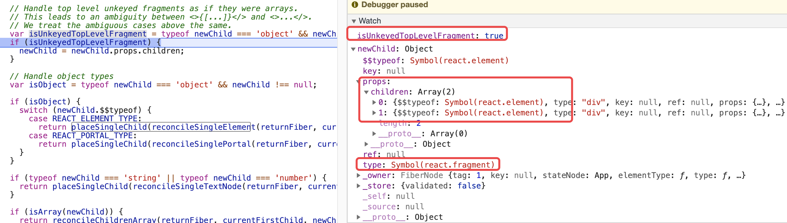
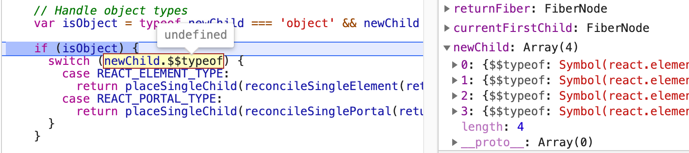
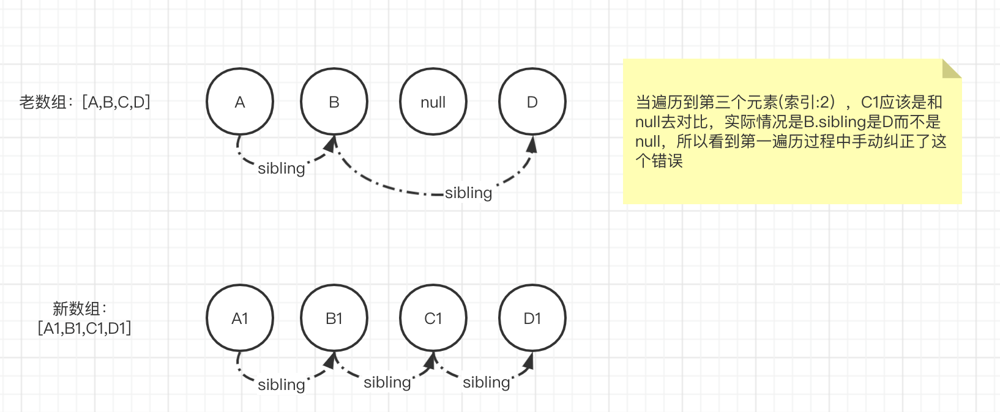

<!-- START doctoc generated TOC please keep comment here to allow auto update -->
<!-- DON'T EDIT THIS SECTION, INSTEAD RE-RUN doctoc TO UPDATE -->
**Table of Contents**  *generated with [DocToc](https://github.com/thlorenz/doctoc)*

- [reconcileChildren](#reconcilechildren)
- [reconcileChildFibers](#reconcilechildfibers)
  - [主要流程](#%E4%B8%BB%E8%A6%81%E6%B5%81%E7%A8%8B)
- [单个元素](#%E5%8D%95%E4%B8%AA%E5%85%83%E7%B4%A0)
  - [reconcileSingleElement](#reconcilesingleelement)
    - [参数含义](#%E5%8F%82%E6%95%B0%E5%90%AB%E4%B9%89)
    - [主要流程](#%E4%B8%BB%E8%A6%81%E6%B5%81%E7%A8%8B-1)
  - [placeSingleChild](#placesinglechild)
- [数组 reconcileChildrenArray](#%E6%95%B0%E7%BB%84-reconcilechildrenarray)
  - [demo](#demo)
  - [概念](#%E6%A6%82%E5%BF%B5)
  - [主要流程](#%E4%B8%BB%E8%A6%81%E6%B5%81%E7%A8%8B-2)
  - [代码](#%E4%BB%A3%E7%A0%81)
- [placeChild](#placechild)
  - [代码](#%E4%BB%A3%E7%A0%81-1)
- [附](#%E9%99%84)
  - [调和案例](#%E8%B0%83%E5%92%8C%E6%A1%88%E4%BE%8B)
    - [什么样的情况会进入第一次遍历的第一个if条件内？？](#%E4%BB%80%E4%B9%88%E6%A0%B7%E7%9A%84%E6%83%85%E5%86%B5%E4%BC%9A%E8%BF%9B%E5%85%A5%E7%AC%AC%E4%B8%80%E6%AC%A1%E9%81%8D%E5%8E%86%E7%9A%84%E7%AC%AC%E4%B8%80%E4%B8%AAif%E6%9D%A1%E4%BB%B6%E5%86%85)
  - [differ具体案例](#differ%E5%85%B7%E4%BD%93%E6%A1%88%E4%BE%8B)
    - [思想](#%E6%80%9D%E6%83%B3)

<!-- END doctoc generated TOC please keep comment here to allow auto update -->

除了调和 ，这部分另外一个最重要的功能是创建fiber，除了根节点的fiber是在初始的时候创建的意外，整颗树的所有子孙节点的fiber对象都是在这里创建的
```javascript
createFiberFromTypeAndProps
createFiberFromSuspense
createFiberFromElement
createFiberFromFragment
createFiberFromProfiler
....
```

除上述创建fiber之外，还有另一个地方 bailoutOnAlreadyFinishedWork -> cloneChildFibers。当我们要跳过某个节点的更新，但是要更新他的子孙节点，此时该节点不会进入调和的过程，因此需要克隆下他的直接孩子节点（代替了在调和阶段创建nextUnitOfWork的过程


# reconcileChildren
```javascript
function reconcileChildren(current$$1, workInProgress, nextChildren, renderExpirationTime) {
  if (current$$1 === null) {
      // 挂载阶段
    workInProgress.child = mountChildFibers(workInProgress, null, nextChildren, renderExpirationTime);
  } else { 
      // 更新阶段
    workInProgress.child = reconcileChildFibers(workInProgress, current$$1.child, nextChildren, renderExpirationTime);
  }
}
```

```javascript
var reconcileChildFibers = ChildReconciler(true);
var mountChildFibers = ChildReconciler(false);
```

shouldTrackSideEffects的作用？
1. 区分是mount阶段还是update阶段
2. 根据阶段做一些优化的操作【TODO】

# reconcileChildFibers
## 主要流程
1. 如果newChild是没有key的Fragment类型的节点，把该元素的孩子节点(数组)用来覆盖newChild，见下面案例
```jsx harmony
// <>{[...]}</> and <>...</> 

class App extends React.Component { 
  render(){
    return <>
      <div></div>
      <div></div>
      </>
  }
}
```



2. 如果newChild是对象，并且newChild.$$typeof 是REACT_ELEMENT_TYPE
```javascript
return placeSingleChild(reconcileSingleElement(returnFiber, currentFirstChild, newChild, expirationTime));
```

- reconcileSingleElement：是否可以找到键值相同的节点，达到复用之目的
    - 如果有则调用createWorkInProgress基于旧fiber创建一个替换版本（尽量复用旧fiber.alternate，达到对象复用节约内存之功效
    - 如果没有则调用 createFiberFromElement/createFiberFromFragment 创建一个全新的fiber
- placeSingleChild ：在更新阶段并且参数newChild不存在替换版本，则设置Placement标识（插入，在commit阶段会去将真正的dom插入到文档中【TODO】猜测）
    - 不存在替换版本，说明该节点是首次出现并需要挂载。比如在reconcileSingleElement没有找到可以复用的节点，则会完全重新创建一个fiber，这个fiber就需要设置Placement标识以便在commit提交，如果该新创建的节点是HostComponent/HostText会在completeWork中去创建真实dom，然后在commit阶段插入到文档中
    - 那如果存在替换版本，即针对该节点要做的更新，而不是替换操作，在哪设置标识并被处理呢？如果是HostComponent/HostText会在completeWork中去判断节点是否需要更新(属性是否发生变化)，如果需要则会设置Update标志

3. 如果newChild是对象，并且newChild.$$typeof 是REACT_PORTAL_TYPE 【TODO】穿梭门案例
```javascript
return placeSingleChild(reconcileSinglePortal(returnFiber, currentFirstChild, newChild, expirationTime));
```

4. 如果newChild是字符串或者是数字，则
```javascript
return placeSingleChild(reconcileSingleTextNode(returnFiber, currentFirstChild, '' + newChild, expirationTime));
```
5. 如果newChild是数组，则
```javascript
return reconcileChildrenArray(returnFiber, currentFirstChild, newChild, expirationTime);
```
- 使用无key的Fragment(：<>xxx</>)、array.map(：{a.map(()=>{return xxx})})、以及直接返回一个数组(：return [xxx,yyy])的节点都会走到这里，reconcileChildrenArray 主要逻辑就是虚拟dom的differ算法

6. 如果newChild是迭代器，则
```javascript
return reconcileChildrenIterator(returnFiber, currentFirstChild, newChild, expirationTime);
```

7. 否则
```javascript
return deleteRemainingChildren(returnFiber, currentFirstChild);
```


# 单个元素
## reconcileSingleElement
当新的结构newChild是单个ReactElement元素（非数组，非迭代，非文本，非数字等类型）
### 参数含义
1. returnFiber：workInProgress
2. currentFirstChild：current$$1.child 即真实结构对应的fiber对象（旧fiber
3. element：newChild 即更新后新的结构的fiber对象（新fiber

### 主要流程
1. 首先保存新fiber的key
2. 调和是针对同一层级的节点进行对比，如newChild是更新后的B元素，该元素的对应旧结构中的平级元素可能会存在若干个，因此这里使用while循环
```html
// 下面案例的元素不是通过array.map生成
<div>
  <div key='A'>A</div>
  <div key='B'>B</div>
  <div key='C'>C</div>
  <div key='D'>D</div>
</div>

现在变成了
<div>
  <div key='B'>B</div>
  <div key='C'>C</div>
</div>
```

- 遍历旧结构中的平级元素，从这些旧元素中尝试找到能够复用的元素（即key值相同），旧结构中的其余元素均添加删除标记
- 如果找到了能够复用的元素，以该元素为模板创建一个替换元素，返回该替换元素（该替换元素就是下一个nextUnitOfWork
    - 复用的方法useFiber + coerceRef；【TODO】coerceRef 的作用实现字符串ref的功能
    ```
    function coerceRef(returnFiber, current$$1, element) {
      var mixedRef = element.ref;
      // 看这个条件 为字符串而生
      if (mixedRef !== null && typeof mixedRef !== 'function' && typeof mixedRef !== 'object') {
          ...
          ref = function(){}
          return ref;
      }
      return ref;
    ```

3. 如果上面循环过程中，没有找到能够复用的元素在，则常见一个新的fiber对象
    1. REACT_FRAGMENT_TYPE类型 调用 createFiberFromFragment
    2. 其他 则调用createFiberFromElement

## placeSingleChild
在更新阶段，如果newFiber不是复用已有的fiber而是重新创建的一个新的fiber对象（newFiber.alternate === null），则添加 Placement（标识插入一个新的节点）标志到effectTag
如果是复用已有fiber（保留已有节点），在这里则不添加任何标识
```javascript
function placeSingleChild(newFiber) {
  if (shouldTrackSideEffects && newFiber.alternate === null) {
    newFiber.effectTag = Placement;
  }
  return newFiber;
}
```


# 数组 reconcileChildrenArray
## demo
```html
<div onClick={this.click.bind(this)}>{
  this.state.data.map((value, index) => {
    return <div>{value}</div>;
  })
}</div>
```



所以map的这种写法会走 reconcileChildrenArray

## 概念
1. 匹配：是指在旧fiber中是否能够找到key值相同的节点 
    - updateSlot 的流程（内部调用的updateXxx方法会优先判断是否可以复用旧fiber...
        - 如newChild是文本节点或者是数组或者是迭代器，
            - 老key如果存在，则return null
            - 老key不存在 则调用updateTextNode，updateFragment创建fiber
        - 如果newChild.$$typeof 存在，则判断新旧key是否相同
            - 不相同 return null
            - 相同 ，根据类型调用不同的方法（updateFragment，updateElement，updatePortal）创建fiber
2. 复用：是指新老fiber相互作为替换版本，即各自的alternate指向对方
3. 能够匹配不一定可以复用，复用则一定是可以匹配的

## 主要流程
1. 第一次遍历：遍历newChildren，对每个newChild尝试匹配旧Fiber
>注意newChildren通过索引newIndx往后走，旧Fiber是通过sibling往后走，newChild是ReactElement而不是Fiber类型
- 调用 updateSlot 尝试是否可以匹配到旧的fiber
- 没有可匹配的旧fiber，则跳出此次循环 return
- 有匹配的旧fiber，但如果旧fiber没有进行复用，那么在更新阶段将旧fiber添加Deletion标识
- 调用 placeChild （placeChild共三个分支：移动，保留，新增
    - 如果复用了旧fiber，说明旧fiber可以直接保留下来，此时会将旧fiber的index赋值给 lastPlacedIndex；lastPlacedIndex 表示上一次保留旧fiber的索引
    - 如果没有复用旧fiber，则进入新增分支，并添加Placement标识

2. 第一次遍历完成后 如果newChildren已经遍历完成，则给剩余的老元素添加Deletion标识，return
3. 第二次遍历，如果第一次遍历完成后，旧fiber已经遍历完了，但是newChildren还没有遍历完，需要针对新数组中剩余元素去创建一个新的fiber, return
    - 调用createChild 创建fiber
    - 调用placeChild，进入新增分支，添加Placement标识
4. 第三次遍历，如果新老数组均没有遍历完，则
    - 先将剩余的老元素使用map将key和元素映射关系保存起来：existingChildren
    - 然后遍历剩余的新元素数组
        - _newFiber2 =  updateFromMap(), 尝试通过key找到旧fiber进行复用，如果复用不了，会创建一个新的fiber 
        - 如果 _newFiber2 在existingChildren中找到了可复用的旧fiber，在更新阶段将该旧fiber从existingChildren中移除（既然已经被复用，就不会被再次复用
        - 调用placeChild
5. 更新阶段时，给existingChildren剩余的元素添加Deletion标识

## 代码
```javascript
function reconcileChildrenArray(returnFiber, currentFirstChild, newChildren, expirationTime) { 
  // 表示下一个nextUnitOfWork的节点，newChildren的第一个元素对应的fiber对象 
  var resultingFirstChild = null;
  // 保存上一次遍历的newFiber
  var previousNewFiber = null;
  // 保存当前遍历的oldFiber
  var oldFiber = currentFirstChild;
  // 保存上一次替换元素在老数组中的位置
  var lastPlacedIndex = 0;
  // 遍历的索引指针，遍历newChildren
  var newIdx = 0;
  // 用于保存下一个oldFiber
  var nextOldFiber = null;
  
  // 第一次遍历，oldFiber使用sibling指针向后遍历，而newChildren是一个元素类型ReactElement的数组
  for (; oldFiber !== null && newIdx < newChildren.length; newIdx++) {
    // 见附录中的有趣案例，即老数组中有一个元素生成了一个空的对象，即没有生成真实的dom，也就没有一个fibre与之对应
    // 比如案例中的元素D的索引4（: oldFiber.index），但是世界上按照fiber.sibling的顺序去遍历的话，对应的索引却是3（: newIndx)
    // 通常情况下我们的nextOldFiber就是oldFiber.sibling，但是由于现在中间丢失了一个元素，现在的oldFiber就是nextOldFiber
    //（如当遍历到newIndx=3时，元素D就是nextOldFiber, 而不是元素D的sibling)；
    if (oldFiber.index > newIdx) {
      // 由于前面有‘丢失的’元素，所以当前oldFiber其实是后面的元素
      // 应当将当前元素作为下一个元素，而实际当前的oldFiber应该置为null（因为老数组该索引位置上对应的fiber不存在，没有生成实际的dom元素) 
      nextOldFiber = oldFiber;
      oldFiber = null;
    } else {
      nextOldFiber = oldFiber.sibling;
    }
    
    // updateSlot 尝试去【匹配】老元素
    // 匹配：单纯从key的角度来看(注意，如果新老元素的key均为null，也算作是匹配成功)
    var newFiber = updateSlot(returnFiber, oldFiber, newChildren[newIdx], expirationTime);
    // 如果返回空对象，说明没有匹配到，终止此次循环，第一次循环的目的就是找到第一个不能复用的元素
    if (newFiber === null) {
      // 如果发生了有趣案例的这个情况的话  
      if (oldFiber === null) {
        oldFiber = nextOldFiber;
      }
      break;
    }
    
    // 走到这里说明匹配老节点成功
    // shouldTrackSideEffects为true表示为更新阶段
    if (shouldTrackSideEffects) {
      // updateSlot -> updateTextNode，如果newChildren[newIdx]是个文本类型的节点，并且
      // 并且老节点没有key 并且 (老节点是null || 老节点非文本节点)，则会创建一个新的fiber，则newFiber.alternate为null，，所以需要添加对老节点添加删除标记
      // 案例：<div>oldFiber</div>  => 'newFiber is HostText type'
      
      // newFiber.alternate === null 表示【复用】失败，则对老节点添加删除标记
      // 【复用】表示新老节点是否可以相互作为替换版本
      if (oldFiber && newFiber.alternate === null) {
        // We matched the slot, but we didn't reuse the existing fiber, so we
        // need to delete the existing child.
        deleteChild(returnFiber, oldFiber);
      }
    }
    
    // 主要目的是添加Placement标识到fiber.effectTag
    // 移动和插入都需要设置该标志，保持不动(元素不做位置上的表动)则更新下lastPlacedIndex即可
    // lastPlacedIndex 表示保持不动的最右侧元素的索引
    lastPlacedIndex = placeChild(newFiber, lastPlacedIndex, newIdx);
    if (previousNewFiber === null) {
      // 作为nextUnitOfWork 返回给workLoop继续  
      resultingFirstChild = newFiber;
    } else {
      previousNewFiber.sibling = newFiber;
    }
    previousNewFiber = newFiber;
    oldFiber = nextOldFiber;
  }

  // 如果newChildren已经遍历完成，则删除剩余的老节点
  if (newIdx === newChildren.length) {
    deleteRemainingChildren(returnFiber, oldFiber);
    return resultingFirstChild;
  }

  // 如果老数组已经遍历完成了，则对newChildren剩下的元素创建新的fiber
  if (oldFiber === null) {
    for (; newIdx < newChildren.length; newIdx++) {
      // 根据类型创建新的fiber对象  
      var _newFiber = createChild(returnFiber, newChildren[newIdx], expirationTime);
      if (!_newFiber) {
        continue;
      }
      // 这里的元素都是插入的，需要添加Placement标识到effectTag
      lastPlacedIndex = placeChild(_newFiber, lastPlacedIndex, newIdx);
      if (previousNewFiber === null) {
        resultingFirstChild = _newFiber;
      } else {
        previousNewFiber.sibling = _newFiber;
      }
      previousNewFiber = _newFiber;
    }
    return resultingFirstChild;
  }

   // 走到这里，说明老数组和新数组都没有遍历完成
  // 将剩余的老节点和key作为映射关系保存到map中 
  var existingChildren = mapRemainingChildren(returnFiber, oldFiber);

  // 遍历剩下的newChildren
  for (; newIdx < newChildren.length; newIdx++) {
    var _newFiber2 = updateFromMap(existingChildren, returnFiber, newIdx, newChildren[newIdx], expirationTime);
    if (_newFiber2) {
      if (shouldTrackSideEffects) {
         // 满足下面if说明_newFiber2找到了可以复用的老节点，因此需要从map中删除这个老节点(已经复用过，就不会再被复用了)  
        if (_newFiber2.alternate !== null) {
          existingChildren.delete(_newFiber2.key === null ? newIdx : _newFiber2.key);
        }
      }
      // 在effectTag上添加操作标识
      lastPlacedIndex = placeChild(_newFiber2, lastPlacedIndex, newIdx);
      if (previousNewFiber === null) {
        resultingFirstChild = _newFiber2;
      } else {
        previousNewFiber.sibling = _newFiber2;
      }
      previousNewFiber = _newFiber2;
    }
  }

  // 更新阶段，给剩余的老节点添加Deletion标识
  if (shouldTrackSideEffects) {
    existingChildren.forEach(function (child) {
      return deleteChild(returnFiber, child);
    });
  }

  return resultingFirstChild;
}
```

# placeChild
目的：给newFiber添加副作用标识

## 代码
```javascript
function placeChild(newFiber, lastPlacedIndex, newIndex) {
  newFiber.index = newIndex;
  if (!shouldTrackSideEffects) {
    // Noop.
    return lastPlacedIndex;
  }
  // 通过alternate判断是否可以复用老fiber
  // 如果不能复用 就是新增
  // 如果可以复用 要么移动 要么保留
  var current$$1 = newFiber.alternate;
  if (current$$1 !== null) {
    var oldIndex = current$$1.index;
    if (oldIndex < lastPlacedIndex) {
      // 移动
      newFiber.effectTag = Placement;
      return lastPlacedIndex;
    } else {
      // 保留
      return oldIndex;
    }
  } else {
    // 新增
    newFiber.effectTag = Placement;
    return lastPlacedIndex;
  }
}
```

# 附
## 调和案例
### 什么样的情况会进入第一次遍历的第一个if条件内？？
会走进第一个遍历的第一个if条件语句内（通常不会发生这种情况，当老的数组中存在某个元素没有去渲染，就会导致数组的元素大于实际渲染的元素，比如案例中首次渲染完成后，页面中第3个元素D实际对应的数组第4个元素，之所以会发生这种情况的另一原因是对于新数组通过索引获取，但是对于老数组是通过fiber.sibling去拿



```jsx harmony
class App extends React.Component {
  constructor(props){
    super(props);
    this.state = {
      flag: true,
      data: ['A', 'B', 'C', 'D'],
    };
  }

  click(){
    console.log('click');
    this.setState({
      flag: false,
      data: ['A', 'B', 'D', 'E'],
    });
  }

  render(){
    return <div onClick={this.click.bind(this)}>
      {this.state.flag ? this.state.data.map((value) => {
        if (value === 'B') {
          return null;
        }
        return value;
      }) : this.state.data.map((value) => {
        return value;
      })}
    </div>;
  }
}
```

## differ具体案例
这里共四种操作：删除 移动 插入 保留
### 思想
lastPlacedIndex的作用/思想

画张图吧 注意下 **F**
老 0:A 1:B 2:C 3:D 4:E 5:F 6:G 7:H
新 0:A 1:C 2:G 3:F 4:B 5:D 6:E 
