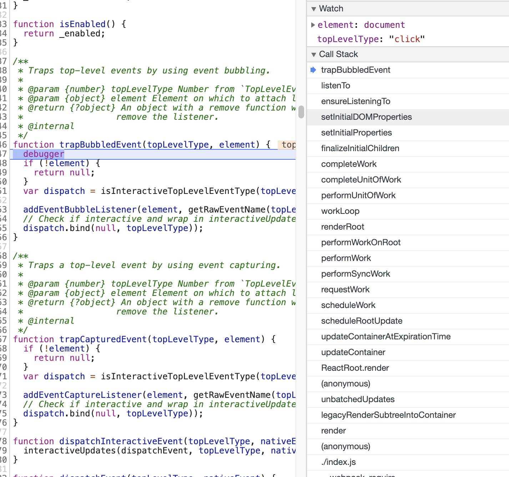

<!-- START doctoc generated TOC please keep comment here to allow auto update -->
<!-- DON'T EDIT THIS SECTION, INSTEAD RE-RUN doctoc TO UPDATE -->
**Table of Contents**  *generated with [DocToc](https://github.com/thlorenz/doctoc)*

- [背景](#%E8%83%8C%E6%99%AF)
- [代码](#%E4%BB%A3%E7%A0%81)
  - [listenTo](#listento)
- [trapBubbledEvent](#trapbubbledevent)

<!-- END doctoc generated TOC please keep comment here to allow auto update -->

# 背景
一个HostComponent类型的节点，在render阶段的completeUnitOfWork -> completeWork 会去进行真实dom的创建和组装（指的是将该dom元素的孩子节点append到该元素上）并设置该dom的属性等信息

调用栈如下


# 代码
```javascript
function performUnitOfWork(workInProgress) {
    ...
    next = beginWork(current$$1, workInProgress, nextRenderExpirationTime);
    ...
    if (next === null) {
      next = completeUnitOfWork(workInProgress);
    }
    ...
   return next;
}
```

```javascript
function completeUnitOfWork(workInProgress) {
  while (true) {
      ...
      nextUnitOfWork = completeWork(current$$1, workInProgress, nextRenderExpirationTime);
      ...
  }
  ...
}
```

```javascript
function completeWork(current, workInProgress, renderExpirationTime) {
  var newProps = workInProgress.pendingProps;

  switch (workInProgress.tag) {
      ...
      case HostComponent:
          ...
          var instance = createInstance(type, newProps, rootContainerInstance, currentHostContext, workInProgress);
          ...
          if (finalizeInitialChildren(instance, type, newProps, rootContainerInstance, currentHostContext)) {
              markUpdate(workInProgress);
          }
          ...
     ...     
  }
  ...
}
```


```javascript
function createInstance(type, props, rootContainerInstance, hostContext, internalInstanceHandle) {
  var parentNamespace = void 0;
  var domElement = createElement(type, props, rootContainerInstance, parentNamespace); 
  // 关联dom元素与fiber节点， 事件派发过程 getClosestInstanceFromNode 会用到
  precacheFiberNode(internalInstanceHandle, domElement);
  // 保存属性到该dom元素中，比如在事件处理过程中就会用到保存的属性，从而获取到事件回调函数
  updateFiberProps(domElement, props);
  return domElement;
}
```

```javascript
function finalizeInitialChildren(domElement, type, props, rootContainerInstance, hostContext) {
  setInitialProperties(domElement, type, props, rootContainerInstance);
  ...
}
```

setInitialDOMProperties设置真实dom的相关属性，包含样式，文本节点等待
```javascript
function setInitialDOMProperties(tag, domElement, rootContainerElement, nextProps, isCustomComponentTag) {
    ...
    else if (registrationNameModules.hasOwnProperty(propKey)) {
        if (nextProp != null) { 
            ensureListeningTo(rootContainerElement, propKey);
        }
    }
    ...
}
```

```javascript
function ensureListeningTo(rootContainerElement, registrationName) {
  var isDocumentOrFragment = rootContainerElement.nodeType === DOCUMENT_NODE || rootContainerElement.nodeType === DOCUMENT_FRAGMENT_NODE;
  var doc = isDocumentOrFragment ? rootContainerElement : rootContainerElement.ownerDocument;
  listenTo(registrationName, doc);
}
```

## listenTo
- isListening 作用，如果有多个dom元素注册click事件，由于事件是委托给document，实际上只需要注册一次，react会在事件分发的时候去将监听click事件的dom都找出来，然后触发事件回调。
- switch-case的情况，为什么要做这些区分？？为什么有些事件注册在捕获阶段，有些事件注册冒泡阶段？？【TODO】
```javascript
function listenTo(registrationName, mountAt) {
  var isListening = getListeningForDocument(mountAt);
  var dependencies = registrationNameDependencies[registrationName];

  for (var i = 0; i < dependencies.length; i++) {
    var dependency = dependencies[i];
    if (!(isListening.hasOwnProperty(dependency) && isListening[dependency])) {
      switch (dependency) {
        case TOP_SCROLL:
          trapCapturedEvent(TOP_SCROLL, mountAt);
          break;
        case TOP_FOCUS:
        case TOP_BLUR:
          trapCapturedEvent(TOP_FOCUS, mountAt);
          trapCapturedEvent(TOP_BLUR, mountAt);
          // We set the flag for a single dependency later in this function,
          // but this ensures we mark both as attached rather than just one.
          isListening[TOP_BLUR] = true;
          isListening[TOP_FOCUS] = true;
          break;
        case TOP_CANCEL:
        case TOP_CLOSE:
          if (isEventSupported(getRawEventName(dependency))) {
            trapCapturedEvent(dependency, mountAt);
          }
          break;
        case TOP_INVALID:
        case TOP_SUBMIT:
        case TOP_RESET:
          // We listen to them on the target DOM elements.
          // Some of them bubble so we don't want them to fire twice.
          break;
        default:
          // By default, listen on the top level to all non-media events.
          // Media events don't bubble so adding the listener wouldn't do anything.
          var isMediaEvent = mediaEventTypes.indexOf(dependency) !== -1;
          if (!isMediaEvent) {
            trapBubbledEvent(dependency, mountAt);
          }
          break;
      }
      isListening[dependency] = true;
    }
  }
}
```

# trapBubbledEvent
- 调用原生注册事件的方式，注册事件
- 为什么要区分交互和非交互事件呢，二者区别在哪？【TODO】
```javascript
function trapBubbledEvent(topLevelType, element) {
  if (!element) {
    return null;
  }
  var dispatch = isInteractiveTopLevelEventType(topLevelType) ? dispatchInteractiveEvent : dispatchEvent;

  addEventBubbleListener(element, getRawEventName(topLevelType), dispatch.bind(null, topLevelType));
}
```

