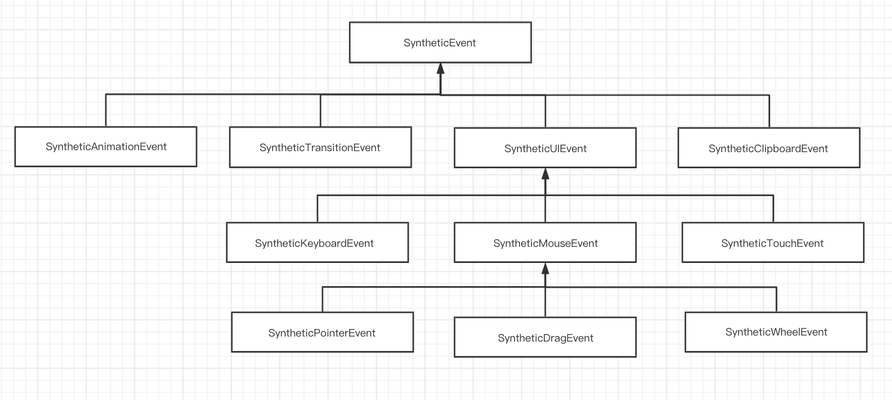
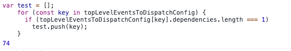
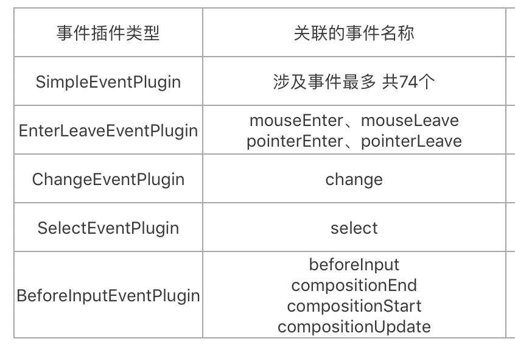
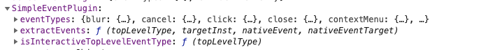
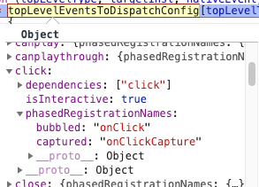
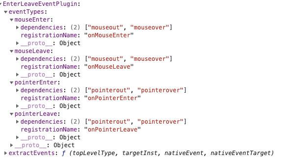
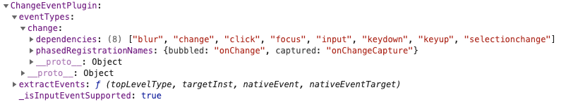
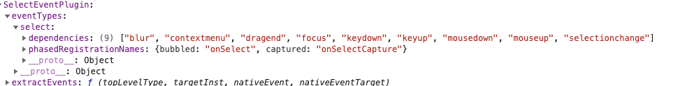
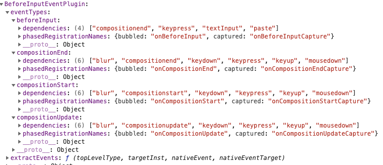

<!-- START doctoc generated TOC please keep comment here to allow auto update -->
<!-- DON'T EDIT THIS SECTION, INSTEAD RE-RUN doctoc TO UPDATE -->
**Table of Contents**  *generated with [DocToc](https://github.com/thlorenz/doctoc)*

- [registrationNameModules](#registrationnamemodules)
- [事件类型的继承关系](#%E4%BA%8B%E4%BB%B6%E7%B1%BB%E5%9E%8B%E7%9A%84%E7%BB%A7%E6%89%BF%E5%85%B3%E7%B3%BB)
- [五类事件插件](#%E4%BA%94%E7%B1%BB%E4%BA%8B%E4%BB%B6%E6%8F%92%E4%BB%B6)
  - [SimpleEventPlugin](#simpleeventplugin)
  - [EnterLeaveEventPlugin](#enterleaveeventplugin)
  - [ChangeEventPlugin](#changeeventplugin)
  - [SelectEventPlugin](#selecteventplugin)
  - [BeforeInputEventPlugin](#beforeinputeventplugin)
- [事件类型与事件插件的关系](#%E4%BA%8B%E4%BB%B6%E7%B1%BB%E5%9E%8B%E4%B8%8E%E4%BA%8B%E4%BB%B6%E6%8F%92%E4%BB%B6%E7%9A%84%E5%85%B3%E7%B3%BB)

<!-- END doctoc generated TOC please keep comment here to allow auto update -->

# registrationNameModules
【TODO】补充


# 事件类型的继承关系
每一类事件类型都定义各自的事件属性，所谓的合成事件，也都是找到对应的事件类型，每一个事件类型都是一个构造函数，调用事件类型构造函数生成事件对象（事件对象的属性在定义事件类型是已经确定了）



# 五类事件插件
为什么五类事件插件存在顺序【TODO】
```javascript
var DOMEventPluginOrder = ['ResponderEventPlugin', 'SimpleEventPlugin', 'EnterLeaveEventPlugin', 'ChangeEventPlugin', 'SelectEventPlugin', 'BeforeInputEventPlugin'];
injection.injectEventPluginOrder(DOMEventPluginOrder);
```

- 除了SImpleEventPlugin关联的事件名称的dependencies都是一个名称，也就是其自身。topLevelEventsToDispatchConfig 包含了这74个事件


- 其余四个插件的事件的dependencies都关联若干个事件名称



## SimpleEventPlugin




交互和非交互事件是分别添加的
```javascript
interactiveEventTypeNames.forEach(function (eventTuple) {
  addEventTypeNameToConfig(eventTuple, true);
});
nonInteractiveEventTypeNames.forEach(function (eventTuple) {
  addEventTypeNameToConfig(eventTuple, false);
});
```

可交互的事件 34
```html
"blur", "cancel", "click", "close", "contextmenu", "copy", "cut",
 "auxclick", "dblclick", "dragend", "dragstart", "drop", "focus", 
 "input", "invalid", "keydown", "keypress", "keyup", "mousedown", 
 "mouseup", "paste", "pause", "play", "pointercancel", "pointerdown",
  "pointerup", "ratechange", "reset", "seeked", "submit", 
"touchcancel", "touchend", "touchstart", "volumechange"
```

不可交互的事件 40
```html
"abort", "animationend", "animationiteration", "animationstart", 
"canplay", "canplaythrough", "drag", "dragenter", "dragexit", 
"dragleave", "dragover", "durationchange", "emptied", "encrypted", 
"ended", "error", "gotpointercapture", "load", "loadeddata", 
"loadedmetadata", "loadstart", "lostpointercapture", "mousemove", 
"mouseout", "mouseover", "playing", "pointermove", "pointerout", 
"pointerover", "progress", "scroll", "seeking", "stalled", "suspend", 
"timeupdate", "toggle", "touchmove", "transitionend", "waiting", "wheel"
```

## EnterLeaveEventPlugin


## ChangeEventPlugin


## SelectEventPlugin


## BeforeInputEventPlugin


# 事件类型与事件插件的关系
构造合成事件时，会依次遍历五个事件插件，每个插件都有自己关心的事件类型，并且每个插件也都自定义提取合成事件的方法，也就是说这五类插件提取合成事件的流程是有差异的，因此才需要进行分类。

构造合成事件的入口
```javascript
function extractEvents(topLevelType, targetInst, nativeEvent, nativeEventTarget) {
  var events = null;
  for (var i = 0; i < plugins.length; i++) {
    // Not every plugin in the ordering may be loaded at runtime.
    var possiblePlugin = plugins[i];
    if (possiblePlugin) {
      var extractedEvents = possiblePlugin.extractEvents(topLevelType, targetInst, nativeEvent, nativeEventTarget);
      if (extractedEvents) {
        events = accumulateInto(events, extractedEvents);
      }
    }
  }
  return events;
}
```
