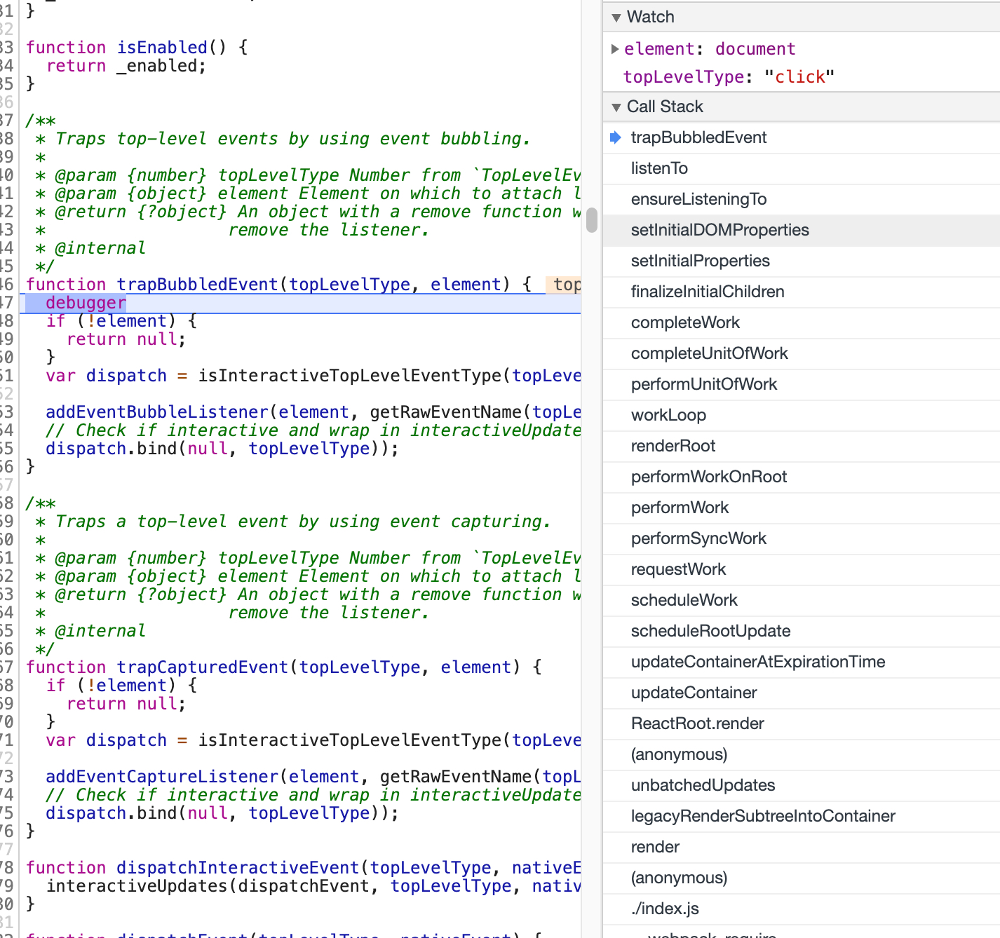
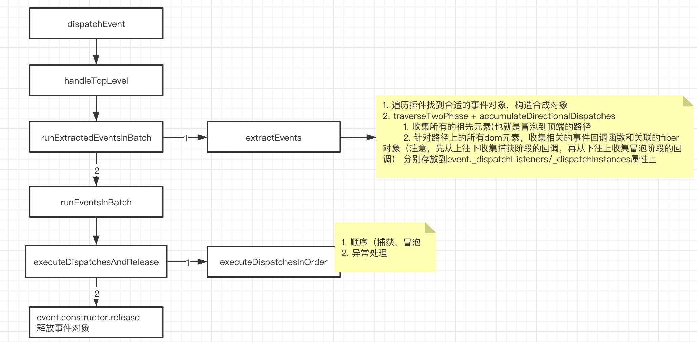

<!-- START doctoc generated TOC please keep comment here to allow auto update -->
<!-- DON'T EDIT THIS SECTION, INSTEAD RE-RUN doctoc TO UPDATE -->
**Table of Contents**  *generated with [DocToc](https://github.com/thlorenz/doctoc)*

- [整体流程图](#%E6%95%B4%E4%BD%93%E6%B5%81%E7%A8%8B%E5%9B%BE)
  - [事件注册](#%E4%BA%8B%E4%BB%B6%E6%B3%A8%E5%86%8C)
  - [事件派发](#%E4%BA%8B%E4%BB%B6%E6%B4%BE%E5%8F%91)

<!-- END doctoc generated TOC please keep comment here to allow auto update -->

特点 优缺点 
1. React事件使用了【事件委托】的机制
2. 一般事件委托的作用都是为了减少页面的注册事件数量，减少内存开销，优化浏览器性能，另外可以更好的【管理事件】，
3. 实际上，React中所有的事件最后都是被委托到了 document这个顶级DOM上
4. React中就存在了自己的 合成事件(SyntheticEvent)，
5. 合成事件由对应的 EventPlugin负责合成，不同类型的事件由不同的 plugin合成，例如 SimpleEvent Plugin、TapEvent Plugin等
6. 为了进一步提升事件的性能，使用了 EventPluginHub这个东西来负责合成事件对象的创建和销毁

# 整体流程图
## 事件注册
注意 completeWork 走 HostComponent分支时，挂载阶段会去创建真实dom，createInstance，该方法会给dom设置两个属性用来关联fiber和

## 事件派发

