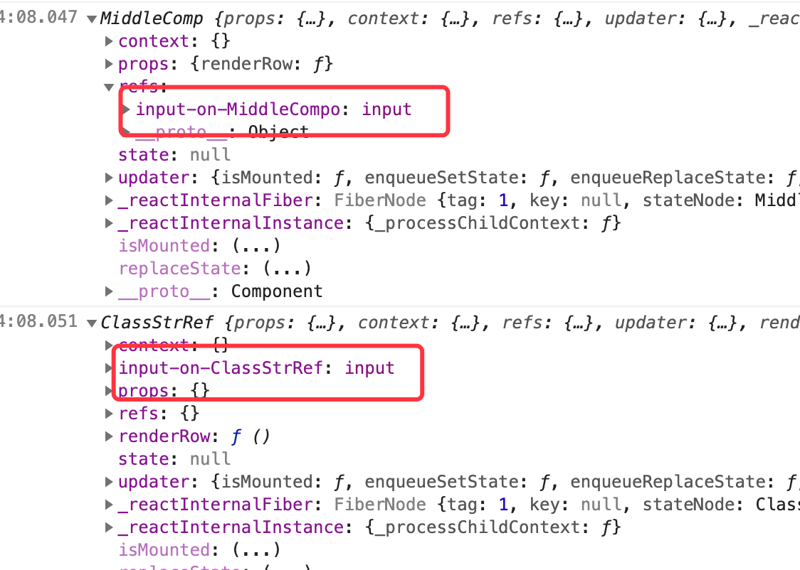
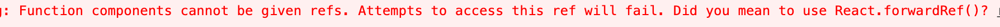

<!-- START doctoc generated TOC please keep comment here to allow auto update -->
<!-- DON'T EDIT THIS SECTION, INSTEAD RE-RUN doctoc TO UPDATE -->
**Table of Contents**  *generated with [DocToc](https://github.com/thlorenz/doctoc)*

- [ref的实现过程](#ref%E7%9A%84%E5%AE%9E%E7%8E%B0%E8%BF%87%E7%A8%8B)
  - [render阶段：添加Ref标识到effectTag](#render%E9%98%B6%E6%AE%B5%E6%B7%BB%E5%8A%A0ref%E6%A0%87%E8%AF%86%E5%88%B0effecttag)
  - [commit阶段：赋值给ref](#commit%E9%98%B6%E6%AE%B5%E8%B5%8B%E5%80%BC%E7%BB%99ref)
- [stringRef demo & 原理](#stringref-demo--%E5%8E%9F%E7%90%86)
  - [demo](#demo)
  - [原理](#%E5%8E%9F%E7%90%86)
  - [坑点 render callback](#%E5%9D%91%E7%82%B9-render-callback)
    - [demo](#demo-1)
    - [结果及原因分析](#%E7%BB%93%E6%9E%9C%E5%8F%8A%E5%8E%9F%E5%9B%A0%E5%88%86%E6%9E%90)
- [createRef demo & 原理](#createref-demo--%E5%8E%9F%E7%90%86)
  - [原理](#%E5%8E%9F%E7%90%86-1)
  - [demo](#demo-2)
- [forwardRef](#forwardref)
  - [demo](#demo-3)
  - [原理](#%E5%8E%9F%E7%90%86-2)
- [总结](#%E6%80%BB%E7%BB%93)
  - [stringRef缺点](#stringref%E7%BC%BA%E7%82%B9)
  - [函数组件：两个不能](#%E5%87%BD%E6%95%B0%E7%BB%84%E4%BB%B6%E4%B8%A4%E4%B8%AA%E4%B8%8D%E8%83%BD)

<!-- END doctoc generated TOC please keep comment here to allow auto update -->

react ref：stringRef callBackRef createRef forwardRef 

[React ref 的前世今生](https://zhuanlan.zhihu.com/p/40462264)
[React.forwardRef的应用场景及源码解析](https://juejin.im/post/6844904070453395469)
[官网 forwardRef](https://reactjs.org/docs/react-api.html#reactforwardref)


# ref的实现过程
## render阶段：添加Ref标识到effectTag
添加Ref标识到fiber.effectTag上<br/>
beginWork -> <br/>
case1（在普通dom元素上使用ref）: -> updateHostComponent -> markRef(current$$1, workInProgress);<br/>  
case2（在类组件元素上使用ref）: -> updateClassComponen -> finishClassComponent -> markRef(current$$1, workInProgress);<br/>
```javascript
function markRef(current$$1, workInProgress) {
  var ref = workInProgress.ref;
  if (current$$1 === null && ref !== null || current$$1 !== null && current$$1.ref !== ref) {
    // Schedule a Ref effect
    workInProgress.effectTag |= Ref;
  }
}
```

函数式组件render阶段并不会在fiber对象上添加Ref标识，如果在函数组件元素中添加ref属性会报错（见总结中中的demo），应该使用React.forwardRef方式

## commit阶段：赋值给ref
- commitAllHostEffects -> commitDetachRef(current$$1); 先置空
```javascript
function commitDetachRef(current$$1) {
  var currentRef = current$$1.ref;
  if (currentRef !== null) {
    if (typeof currentRef === 'function') {
      currentRef(null);
    } else {
      currentRef.current = null;
    }
  }
}
```

- commitAllLifeCycles -> commitAttachRef(nextEffect);
    - 看到callback ref 与 React.createRef的区别，前者将dom元素传递给callback，而createRef返回的是一个对象，这里将dom赋值给这个对象的current属性，
```javascript
function commitAttachRef(finishedWork) {
  var ref = finishedWork.ref;
  if (ref !== null) {
    var instance = finishedWork.stateNode;
    var instanceToUse = void 0;
    switch (finishedWork.tag) {
      case HostComponent:
        instanceToUse = getPublicInstance(instance);
        break;
      default:
        instanceToUse = instance;
    }
    if (typeof ref === 'function') {
      ref(instanceToUse);
    } else {
      {
        if (!ref.hasOwnProperty('current')) {
          // warning ...
        }
      }

      ref.current = instanceToUse;
    }
  }
}
```


# stringRef demo & 原理
1. reconcileChildren 调和过程中，会去创建或者复用fiber，然后会调用一个coerceRef （调和的过程见调和章节)
2. 通过this.refs[stringRefName]访问

## demo
```jsx harmony
export class StringRef extends React.Component {
  componentDidMount() {
    this.refs.myRef.focus();
  }
  render() {
    return <input ref="myRef" />;
  }
}
ReactDOM.render(<StringRef/>, document.getElementById('app'));
```

## 原理 
coerceRef 的作用就是改下fiber.ref属性，指向一个函数（闭包，持有组件实例的引用
1. 判断  element.ref 是不是字符串，不是的话，直接返回
2. 获取 element._owner（判断是不是在类组件中）
>补充，有必要说下这个_owner属性在哪设置的，以stringRefdemo 为例简单说下
```javascript
// react.developemnt.js 
var React = {
    ...
    __SECRET_INTERNALS_DO_NOT_USE_OR_YOU_WILL_BE_FIRED: ReactSharedInternals
}

// react-deom.development.js
var ReactSharedInternals = React.__SECRET_INTERNALS_DO_NOT_USE_OR_YOU_WILL_BE_FIRED;
var ReactCurrentOwner$3 = ReactSharedInternals.ReactCurrentOwner; 

--------------------------------------render阶段----------------------------------------------------------
// 第一步创建 <StringRef/>节点，
// 如当前渲染节点是类组件：beginWork -> updateClassComponent -> finishClassComponent 
// 1. 设置owner全局变量
ReactCurrentOwner$3.current = workInProgress;
// 2. 执行StringRef类的render方法，返回子节点
nextChildren = instance.render(); 
// 3. 调用 react.createElementWithValidation -> react.createElement -> 
return ReactElement(type, key, ref, self, source, ReactCurrentOwner.current, props); // 在这里去设置子节点的owner属性
```

3. 返回一个闭包函数，持有类组件实例的引用
```javascript
var ref = function (value) {
  var refs = inst.refs;
  if (refs === emptyRefsObject) {
    // This is a lazy pooled frozen object, so we need to initialize.
    refs = inst.refs = {};
  }
  if (value === null) {
    delete refs[stringRef];
  } else {
    refs[stringRef] = value;
  }
};
```

调用完 该方法之后，覆盖fiber的ref属性 （从形式上看，和callbackRef 是一样的，ref都指向一个函数
```javascript
created.ref = coerceRef(returnFiber, current$$1, element); // element: ReactElementl类型
```

## 坑点 render callback
### demo
```jsx harmony
 class ClassStrRef extends React.Component {
  renderRow = () => {
    return <div>
      <input ref={'input-on-MiddleCompo'}/> 
      <input ref={ input => { this['input-on-ClassStrRef'] = input; } }/>
    </div>
  };

  componentDidMount(){
    console.log(this);
  }

  render(){
    return <MiddleComp renderRow={this.renderRow}/>;
  }
}

class MiddleComp extends React.Component {
  componentDidMount(){
    console.log(this);
  }

  render(){
    return <div>{
      this.props.renderRow()
    }</div>;
  }
}
```

### 结果及原因分析


1. 子组件调用父组件的回调函数来生成内容时，stringRef挂载到了子组件的实例上了
2. 是因为使用stringRef时，会在coerceRef通过闭包的形式去绑定到类实例，但是这个类实例是MiddleCompo的实例，看下这里渲染的过程
    1. 先渲染<ClassStrRef/>会去设置一次ReactCurrentOwner.current = workInprogress_ClassStrRef（ClassStrRef元素关联的fiber
    2. 然后渲染<MiddleComp/>也会去设置一次ReactCurrentOwner.current = workInprogress_MiddleComp （MiddleComp元素关联的fiber
    3. 再调用renderRow，此时使用的owner是workInprogress_MiddleComp，下面stringRef保存的组件实例是MiddleComp的
    4. 所以会出现这里的stringRef挂载到MiddleComp实例中
3. 而通过callbackRef的形式去拿是因为使用箭头函数绑定了this给ClassStrRef实例


# createRef demo & 原理
## 原理
原理很简单，通过createRef创建一个对象，作为类组件实例的一个属性，其实完全可以自己模拟这个过程
```javascript
function createRef() {
  var refObject = {
    current: null
  }; 
  return refObject;
}
```

## demo
```jsx harmony
class MyComponent extends React.Component {
  constructor(props) {
    super(props);
    this.inputRef = React.createRef();  
  }

  render() {  return <input type="text" ref={this.inputRef} />;  }

  componentDidMount() {  this.inputRef.current.focus();  }
}
```

# forwardRef
## demo
```jsx harmony
const FancyButton = React.forwardRef((props, ref) => (
  <button ref={ref} className="FancyButton">
    {props.children}
  </button>
));

const ref = React.createRef();
ReactDOM.render(<FancyButton ref={ref}>Click me!</FancyButton>, document.getElementById('app'));
```

## 原理
React.forwardRef
```javascript
function forwardRef(render) {
  return {
    $$typeof: REACT_FORWARD_REF_TYPE,
    render: render
  };
}
```

beginWork -> updateForwardRef
```javascript
function updateForwardRef(current$$1, workInProgress, Component, nextProps, renderExpirationTime) {
    ...
    var render = Component.render;
    var ref = workInProgress.ref;  
    ...
    nextChildren = renderWithHooks(current$$1, workInProgress, render, nextProps, ref, renderExpirationTime);
    ...
}

function renderWithHooks(current, workInProgress, Component, props, refOrContext, nextRenderExpirationTime) {
    ...
    var children = Component(props, refOrContext);
    ...
}
```

原理很简单，通过forward组件将ref显示的传递给render函数 (React.forwardRef(render))

本质上来看和下面写法并无差异，仅仅是ref一个是通过props传递，一个是通过forward将ref通过第二个参数显示的传递。
```jsx harmony
const testRef = { // React.createRef的本质，返回一个对象，只是在commit阶段，框架判断ref是对象的话，就把引用赋值给这个对象
  current : undefined,
};

const FancyButton = function(props){
  useEffect(() => {
    console.log(testRef);
  });

  return <button ref={props.testRef} className="FancyButton">
    {props.children}
  </button>;
};

ReactDOM.render(<FancyButton testRef={testRef}>Click me!</FancyButton>, document.getElementById('app'));
```

# 总结
## stringRef缺点
1. 由于需要在coerceRef生成的闭包需要绑定的owner元素，因此stringRef不能绑定在根元素上
```jsx harmony
ReactDOM.render(<App ref="app" />, document.getElementById('main')); 
```
2. render callback的问题


## 函数组件：两个不能
- 函数组件元素本身不能应用ref属性
>Function components cannot be given refs. Attempts to access this ref will fail. Did you mean to use React.forwardRef()



```jsx harmony
export class CallbackRef extends React.Component {
  constructor(props){
    super(props);
    this.getRef = function(ele){
      console.log(ele)
    };
  }

  render(){
    return <div>
      <FunCallbackRef ref={this.getRef}/> // 函数组件
    </div>;
  }
}

export function FunCallbackRef(){ 
  return <div></div>;
}
```

- stringRef不能作用在函数组件中
>Function components cannot have refs. Did you mean to use React.forwardRef()


```jsx harmony
export function FunStrRef(){
  return <input ref="myRef"/>;
}
```

- callbackRef/createRef可以作用在函数组件中

```jsx harmony
export function FunCallbackRef(){
  function getRef(ele){
    console.log(ele)
  }

  return <div ref={getRef}></div>;
}

export function FunCreateRef(){
  const a = React.createRef();

  return <div ref={a}></div>;
}
```
