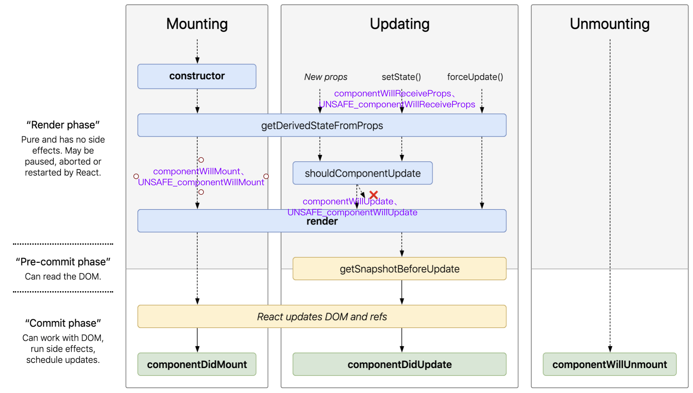

<!-- START doctoc generated TOC please keep comment here to allow auto update -->
<!-- DON'T EDIT THIS SECTION, INSTEAD RE-RUN doctoc TO UPDATE -->
**Table of Contents**  *generated with [DocToc](https://github.com/thlorenz/doctoc)*

- [挂载阶段](#%E6%8C%82%E8%BD%BD%E9%98%B6%E6%AE%B5)
- [更新阶段](#%E6%9B%B4%E6%96%B0%E9%98%B6%E6%AE%B5)
- [卸载阶段](#%E5%8D%B8%E8%BD%BD%E9%98%B6%E6%AE%B5)
- [总结](#%E6%80%BB%E7%BB%93)

<!-- END doctoc generated TOC please keep comment here to allow auto update -->

 
 
[参考1](https://juejin.im/post/5b6f1800f265da282d45a79a#heading-7)
[参考2](https://projects.wojtekmaj.pl/react-lifecycle-methods-diagram/)



getDerivedStateFromProps 和 getSnapshotBeforeUpdate 属于新增加的生命周期函数，如果实现了这两个，则以下生命周期函数不会被调用
1. componentWillMount、UNSAFE_componentWillMount
2. componentWillReceiveProps、UNSAFE_componentWillReceiveProps
3. componentWillUpdate、UNSAFE_componentWillUpdate

# 挂载阶段
- constructor
- getDerivedStateFromProps
- componentWillMount UNSAFE_componentWillMount
- render
- componentDidMount

```
renderRoot => beginWork => updateClassComponent 
    => constructClassInstance => var instance = new ctor(props, context);
    => mountClassInstance
        applyDerivedStateFromProps => getDerivedStateFromProps
        callComponentWillMount => componentWillMount 
    => finishClassComponent =>  instance.render

commitRoot => commitLifeCycles => commitLifeCycles => instance.componentDidMount
```

- 类组件调和的入口
```javascript
function updateClassComponent(current$$1, workInProgress, Component, nextProps, renderExpirationTime){
    ...
  var instance = workInProgress.stateNode;
  var shouldUpdate = void 0;
  if (instance === null) {
    if (current$$1 !== null) {
    constructClassInstance(workInProgress, Component, nextProps, renderExpirationTime); //new ctor构造组件实例
    mountClassInstance(workInProgress, Component, nextProps, renderExpirationTime); // getDerivedStateFromProps
    shouldUpdate = true;
  } else if (current$$1 === null) {
      ...
  } else {
      ...
  } 
  var nextUnitOfWork = finishClassComponent(current$$1, workInProgress, Component, shouldUpdate, hasContext, renderExpirationTime); // instance.render
  ...
}
```


- 构造组件实例
```javascript
function constructClassInstance(workInProgress, ctor, props, renderExpirationTime){
    ...
    var instance = new ctor(props, context);
    ...
}
```

- getDerivedStateFromProps 以及 componentWillMount UNSAFE_componentWillMount 的调用
```javascript
function mountClassInstance(workInProgress, ctor, newProps, renderExpirationTime){
    ...
    var getDerivedStateFromProps = ctor.getDerivedStateFromProps;
    if (typeof getDerivedStateFromProps === 'function') {
        applyDerivedStateFromProps(workInProgress, ctor, getDerivedStateFromProps, newProps);
        instance.state = workInProgress.memoizedState;
    }
    ...
    // Unsafe lifecycles should not be invoked for components using the new APIs.
    if (typeof ctor.getDerivedStateFromProps !== 'function' && 
        typeof instance.getSnapshotBeforeUpdate !== 'function' && 
        (typeof instance.UNSAFE_componentWillMount === 'function' || typeof instance.componentWillMount === 'function')) {
        callComponentWillMount(workInProgress, instance);
    }
    ...
}
```

```javascript
function applyDerivedStateFromProps(workInProgress, ctor, getDerivedStateFromProps, nextProps){
    ...
    var partialState = getDerivedStateFromProps(nextProps, prevState);
    var memoizedState = partialState === null || partialState === undefined ? prevState : _assign({}, prevState, partialState);
    workInProgress.memoizedState = memoizedState;
    ...
}
```

```javascript
function callComponentWillMount(workInProgress, instance){
    ...
    if (typeof instance.componentWillMount === 'function') {
        instance.componentWillMount();
    }
    if (typeof instance.UNSAFE_componentWillMount === 'function') {
        instance.UNSAFE_componentWillMount();
    }
    ...
}
```

- render调用
```javascript
function finishClassComponent(current$$1, workInProgress, Component, shouldUpdate, hasContext, renderExpirationTime){
    ...
    nextChildren = instance.render();
    ...
}
```


# 更新阶段
- componentWillReceiveProps UNSAFE_componentWillReceiveProps
- getDerivedStateFromProps
- shouldComponentUpdate
- render
- getSnapshotBeforeUpdate
- componentDidUpdate 

```
renderRoot => beginWork => updateClassComponent 
    => updateClassInstance 
        callComponentWillReceiveProps => componentWillReceiveProps、UNSAFE_componentWillReceiveProps
        applyDerivedStateFromProps => getDerivedStateFromProps
        checkShouldComponentUpdate => shouldComponentUpdate
        componentWillUpdate、UNSAFE_componentWillUpdate
    => finishClassComponent =>  instance.render 

commitRoot 
    => commitBeforeMutationLifeCycles => instance.getSnapshotBeforeUpdate
    => commitLifeCycles => commitLifeCycles =>instance.componentDidUpdate 
```

```javascript
function updateClassInstance(current, workInProgress, ctor, newProps, renderExpirationTime){
    ...
    var hasNewLifecycles = typeof getDerivedStateFromProps === 'function' || typeof instance.getSnapshotBeforeUpdate === 'function';
    ...
    if (!hasNewLifecycles && (typeof instance.UNSAFE_componentWillReceiveProps === 'function' || typeof instance.componentWillReceiveProps === 'function')) {
        if (oldProps !== newProps || oldContext !== nextContext) {
          callComponentWillReceiveProps(workInProgress, instance, newProps, nextContext);
        }
    }
    ...
    if (typeof getDerivedStateFromProps === 'function') {
        applyDerivedStateFromProps(workInProgress, ctor, getDerivedStateFromProps, newProps);
        newState = workInProgress.memoizedState;
    }
    var shouldUpdate = checkHasForceUpdateAfterProcessing() || checkShouldComponentUpdate(workInProgress, ctor, oldProps, newProps, oldState, newState, nextContext);
    ...
    if (shouldUpdate) {
        ...
        if (!hasNewLifecycles && (typeof instance.UNSAFE_componentWillUpdate === 'function' || typeof instance.componentWillUpdate === 'function')) {
            if (typeof instance.componentWillUpdate === 'function') {
                instance.componentWillUpdate(newProps, newState, nextContext);
            }
            if (typeof instance.UNSAFE_componentWillUpdate === 'function') {
                instance.UNSAFE_componentWillUpdate(newProps, newState, nextContext);
            }
        }
        ...
    }else{
        ...
    }
}
```

```javascript
function callComponentWillReceiveProps(workInProgress, instance, newProps, nextContext){
    ...
    if (typeof instance.componentWillReceiveProps === 'function') {
        instance.componentWillReceiveProps(newProps, nextContext);
    }
    if (typeof instance.UNSAFE_componentWillReceiveProps === 'function') {
        instance.UNSAFE_componentWillReceiveProps(newProps, nextContext);
    }
    ...
}
```

```javascript
function checkShouldComponentUpdate(workInProgress, ctor, oldProps, newProps, oldState, newState, nextContext){
    var instance = workInProgress.stateNode;
    if (typeof instance.shouldComponentUpdate === 'function') {
      var shouldUpdate = instance.shouldComponentUpdate(newProps, newState, nextContext); 
      return shouldUpdate;
    }
    
    // PureComponent的情况，默认浅比较
    if (ctor.prototype && ctor.prototype.isPureReactComponent) {
      // props和state有一个浅比较不相等 就返回true
      return !shallowEqual(oldProps, newProps) || !shallowEqual(oldState, newState);
    }

    return true;
}
```

# 卸载阶段
commitRoot => commitAllHostEffects => commitDeletion => unmountHostComponents => commitUnmount => safelyCallComponentWillUnmount(current, instance) => callComponentWillUnmountWithTimer => instance.componentWillUnmount


# 总结
首先生命周期是针对类组件的，伪代码看下生命周期的执行顺序

render阶段
```javascript
renderRoot(){
    if(mount阶段){
        constructClassInstance() // constructor
        mountClassInstance() // getDerivedStateFromProps、willMount
    }
    
    if(update阶段){
        updateClassInstance() // willReceivesProps、getDerivedStateFromProps、shouldComponentDidUpdate、willUpdate
    }
    
    finishClassComponent() // render
}
```


commit阶段
```javascript
commitRoot(){
    commitBeforeMutationLifeCycles() // getSnapshotBeforeUpdate
    commitAllHostEffects() // => Deletion => willUnMount
    commitLifeCycles() // didMount、didUpdate
}
```


