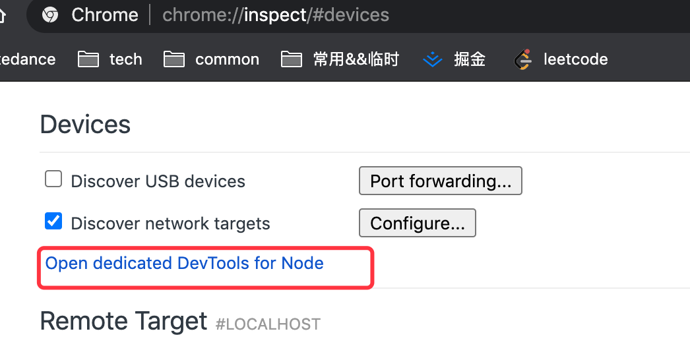
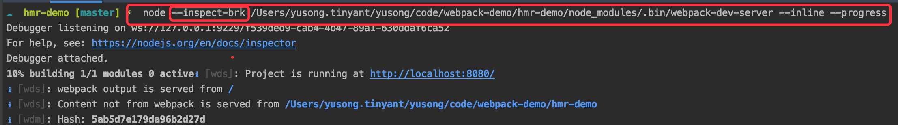

1. 参考
    - [devServer配置: 官方](https://webpack.js.org/configuration/dev-server/)
    - [-webpack-dev-server 配置](https://webpack.js.org/guides/development/#using-webpack-dev-server)
    - [webpack-dev-middleware 源码解读](https://www.zoo.team/article/webpack-dev-middleware)

2. 两张原理图


# 准备
如何调试webpack \ webpack-dev-server，[参考](https://zhuanlan.zhihu.com/p/47408456)

hmr-demo，调试webpack-dev-server 步骤
1. 打开Chrome浏览器，地址栏里输入chrome://inspect/#devices：
2. 点击 [Open dedicated DevTools for Node]
 
3. 执行以下node命令


# 初始化
## 服务端
### 1. startDevServer
>执行node webpack-dev-server命令，进入 /webpack-demo/hmr-demo/node_modules/.bin/webpack-dev-server（等价于 /webpack-demo/base-demo/node_modules/webpack-dev-server/bin/webpack-dev-server.js<br/>

调用 startDevServer 启动服务，主要做了三件事：
- 创建webpack实例：compiler 
- 创建webpack-dev-server的服务实例
- 创建socket-server服务实例

```javascript
function startDevServer(config, options) {  
  try {
    compiler = webpack(config);
  } catch (err) {
      
  }

  try {
    server = new Server(compiler, options, log);
    serverData.server = server;
  } catch (err) {
      
  }

  server.listen(options.port, options.host, (err) => {
     if (err) {
       throw err;
     }
  });
 
}
```

### 2. 构造Server实例
1. updateCompiler 用来更新webpack实例compiler的配置项，比如增加entry。由于hmr是基于socket进行通信，因此这里把socket-client相关代码一起打包到线上，这样当浏览器访问服务时，就会创建socket连接从而可以服务端进行通信
    - 新增入口：webpack-dev-server/client & webpack/hot/dev-server
    - 通过 ProvidePlugin 添加全局变量：\_\_webpack_dev_server_client__(作用是啥？,[providePlugin的使用](https://webpack.js.org/plugins/provide-plugin/#root)
```javascript
function updateCompiler(compiler, options) {
    //...
    addEntries(webpackConfig, options);
    //...
    // 通过监听webpack的生命周期的相关事件完成entry的天机，通过ProvidePlugin方式提供
    compilers.forEach((compiler) => {
      const config = compiler.options;
      compiler.hooks.entryOption.call(config.context, config.entry);

      const providePlugin = new webpack.ProvidePlugin({
        __webpack_dev_server_client__: getSocketClientPath(options),
      });
      providePlugin.apply(compiler);
    });
}

function addEntries(config, options, server) {
    //...
    hotEntry = require.resolve('webpack/hot/dev-server');
    // 添加一个新的入口：webpack-dev-server/client/index.js
    const clientEntry = `${require.resolve(
          '../../client/'
        )}?${domain}${sockHost}${sockPath}${sockPort}`;
    //...
    // 添加HMR插件  
    config.plugins.push(new webpack.HotModuleReplacementPlugin());
}
```

2. 创建express实例
3. 想webpack实例compiler中添加一些事件：比如构建完成事件：done
4. 创建webpack-dev-middleware
    - 添加监听done，作用？
    - 设置compiler的文件系统，默认情况下，编译后的文件是写入本地磁盘的；在dev-server模式下，修改为保存到内存中，目的：快
5. 给express实例添加中间件
6. 创建httpServer实例

#### webpack-dev-server相关代码
```javascript
// webpack-dev-server/lib/Server.js
class Server {
  constructor(compiler, options = {}, _log) {
    //...
    updateCompiler(this.compiler, this.options); 
    //...
    this.setupApp();
    this.setupHooks();
    //...
    this.setupDevMiddleware();
    //...
    this.setupFeatures();
    this.createServer();
  }

  setupFeatures(){
    // 调用 this.setupMiddleware 
  }   

  setupMiddleware() {
     this.app.use(this.middleware);
  }  

  setupApp(){
    this.app = new express();
  }
  
  setupHooks() {
    // ...

    const addHooks = (compiler) => {
      const { compile, invalid, done } = compiler.hooks;
      // ...
      done.tap('webpack-dev-server', (stats) => {
        this._sendStats(this.sockets, this.getStats(stats));
        this._stats = stats;
      });
    };
    
    // ...
    addHooks(this.compiler);
  }

  setupDevMiddleware() {
    // middleware for serving webpack bundle
    this.middleware = webpackDevMiddleware(
      this.compiler,
      Object.assign({}, this.options, { logLevel: this.log.options.level })
    );
  }
  
  // webpack-dev-server的http服务
  createServer(){
    //... 省略https的情况
    this.listeningApp = http.createServer(this.app);
  }
  
  // 用于创建socket server
  listen(port, hostname, fn) {
    this.hostname = hostname;

    return this.listeningApp.listen(port, hostname, (err) => {
      this.createSocketServer();

      if (this.options.bonjour) {
        runBonjour(this.options);
      }

      this.showStatus();

      if (fn) {
        fn.call(this.listeningApp, err);
      }

      if (typeof this.options.onListening === 'function') {
        this.options.onListening(this);
      }
    });
  }

  createSocketServer() {
      const SocketServerImplementation = this.socketServerImplementation;
      this.socketServer = new SocketServerImplementation(this);
  
      this.socketServer.onConnection((connection, headers) => {
        //...
 
        this.sockets.push(connection);
  
        //...
  
        if (this.hot) {
          this.sockWrite([connection], 'hot');
        }
  
        // TODO: change condition at major version
        if (this.options.liveReload !== false) {
          this.sockWrite([connection], 'liveReload', this.options.liveReload);
        }
  
        //...

        this._sendStats([connection], this.getStats(this._stats), true);
      });
    }
}
```

#### webpac-dev-middleware 相关代码 
```javascript
// base-demo/node_modules/webpack-dev-middleware/index.js
module.exports = function wdm(compiler, opts) {
    //...
    const context = createContext(compiler, options);
    //...
}

// base-demo/node_modules/webpack-dev-middleware/context.js
module.exports = function ctx(compiler, options) {
    //...
    context.compiler.hooks.done.tap('WebpackDevMiddleware', done);
    //...
    setFs() // 更改文件写入的策略：写入磁盘 => 写入内存
}
```
    
## 客户端
dev环境下通过webpack-dev-server启动服务时，会将 webpack-dev-server/client/index.js 相关代码进行打包带到线上
1. 创建socket-client的过程
```javascript
// webpack-dev-server/client/index.js
onSocketMessage = {
  //...
  hash: function hash(_hash) {
    status.currentHash = _hash;
  },
  ok: function ok() {
    sendMessage('Ok');

    if (options.useWarningOverlay || options.useErrorOverlay) {
      overlay.clear();
    }

    if (options.initial) {
      return options.initial = false;
    } // eslint-disable-line no-return-assign

    reloadApp(options, status); // 主要工作 =>  hotEmitter.emit('webpackHotUpdate', currentHash); 或 location.reload()
  },
}

socket(socketUrl, onSocketMessage);

// webpack-dev-server/client/socket.js
var socket = function initSocket(url, handlers) {
    client = new Client(url);
    //...  
    client.onMessage(function (data) {
        var msg = JSON.parse(data);
    
        if (handlers[msg.type]) {
          handlers[msg.type](msg.data);
        }
      });
}
```
2. 服务端会将连接保存起来，见Server.js -> createSocketServer this.socketServer.onConnection

# 文件变化后的逻辑

触发 webpack-dev-server/lib/Server.js 添加的done事件 => this._sendStats：推动消息
- type: hash 时，socket-clinet会保存这里的hash值
- ok: 时，socket-client发送一个事件: webpackHotUpdate

```javascript
  _sendStats(sockets, stats, force) {
    const shouldEmit =
      !force &&
      stats &&
      (!stats.errors || stats.errors.length === 0) &&
      stats.assets &&
      stats.assets.every((asset) => !asset.emitted);

    if (shouldEmit) {
      return this.sockWrite(sockets, 'still-ok');
    }

    this.sockWrite(sockets, 'hash', stats.hash); // 关键

    if (stats.errors.length > 0) {
      this.sockWrite(sockets, 'errors', stats.errors);
    } else if (stats.warnings.length > 0) {
      this.sockWrite(sockets, 'warnings', stats.warnings);
    } else {
      this.sockWrite(sockets, 'ok'); // 关键
    }
  }
```

## dev-server
上面提到过 webpack/hot/dev-server.js 文件也会作为入口被添加，会被浏览器加载执行
```javascript
// webpack/hot/dev-server

hotEmitter.on("webpackHotUpdate", function(currentHash) {
    lastHash = currentHash;
    if (!upToDate() && module.hot.status() === "idle") {
        log("info", "[HMR] Checking for updates on the server...");
        check();
    }
});

var check = function check() {
		module.hot
			.check(true)
			.then(function(updatedModules) {
				if (!updatedModules) {
					window.location.reload();
					return;
				}

				if (!upToDate()) {
					check();
				}

				require("./log-apply-result")(updatedModules, updatedModules);
 
			})
			.catch(function(err) {
				var status = module.hot.status();
				if (["abort", "fail"].indexOf(status) >= 0) { 
					window.location.reload();
				} 
			});
	};
```

- module.hot.check方法从哪来的，来自 webpack/lib/HotModuleReplacement.runtime.js 

## HMR runtime 
核心的两个方法：1. hotCheck & 2. hotApply

```javascript
// JsonpMainTemplate.runtime
window["webpackHotUpdate"] = // eslint-disable-next-line no-unused-vars
function webpackHotUpdateCallback(chunkId, moreModules) {
    hotAddUpdateChunk(chunkId, moreModules);
    if (parentHotUpdateCallback) parentHotUpdateCallback(chunkId, moreModules); // 冒泡：检查父模块
} ;
```

### hotCheck 热更新检查
调用 JsonpMainTemplate.runtime 提供了两个方法 hotDownloadManifest & hotDownloadUpdateChunk

1. hotDownloadManifest 用 AJAX 向服务端请求是否有更新的文件，如果有将发更新的文件列表返回浏览器端，
2. 而hotDownloadUpdateChunk是通过 jsonp 请求最新的模块代码，然后将代码返回给 HMR runtime，HMR runtime 会根据返回的新模块代码做进一步处理，可能是刷新页面，也可能是对模块进行热更新

### hotApply 执行热跟新
当更新的文件加载完成后，执行全局方法：webpackHotUpdate => hotAddUpdateChunk => hotUpdateDownloaded => hotApply => hotApplyInternal

app.2c85b3e0430256ddd5b6.hot-update.js文件的内容，调用全局方法 webpackHotUpdate
```javascript
webpackHotUpdate("app",{

/***/ "./hello.js":
/*!******************!*\
  !*** ./hello.js ***!
  \******************/
/*! exports provided: default */
/***/ (function(module, __webpack_exports__, __webpack_require__) {

"use strict";
__webpack_require__.r(__webpack_exports__);
const hello = () => 'dcc dd   d'

/* harmony default export */ __webpack_exports__["default"] = (hello);


/***/ })

})
```

# 业务代码
当业务代码包括下述代码片段，则实现热更新，更新后的代码，还是得靠业务代码去针对模块做热更新，否则框架怎么知道代码更新后需要做哪些操作
```javascript
if(module.hot) {
    module.hot.accept('./hello.js', function() {
        div.innerHTML = hello()
    })
}

```

可以看下style-loader的源码实现，实现了module.hot.accept，就知道为什么修改样式可以直接生效了

# 总结
看完上述代码简要，再回头看看原理图,...
