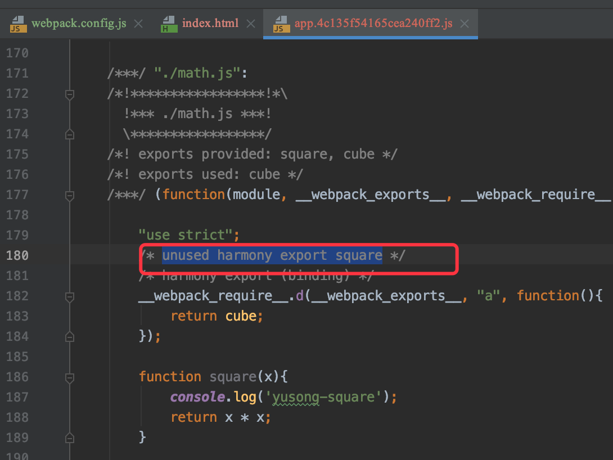
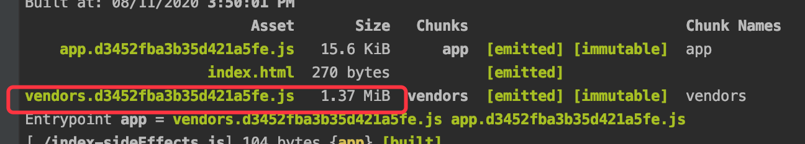
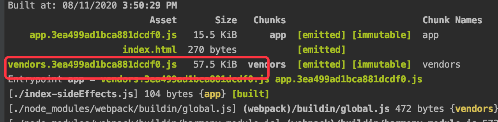

实现tree-shaking有两种途径,tree-shaking基于es module（编译加载使得静态分析成为可能


# 方案1:  usedExports
development模式下

 
1. production模式下，默认会使用terser-webpack-plugin压缩，此时会去删除这些dead code;
2. 注意，production，如果配置了optimization.minizer，则会修改默认的压缩策略
```javascript
// 如果不配 terser-webpack-plugin 则不会去除无效代码，甚至不会压缩
minimizer: [new TerserPlugin(), new OptimizeCSSAssetsPlugin({}) ],
```

# 方案2:  sideEffects
1. 对比 lodash与lodash-es的package.json，发现后者提供了sideEffects:false 显示声明模块没有副租用，这样webpack就可以根据这个来进行tree-shaking，否则由于不确定是否有副作用，不能随便进行tree-shaking

2. 引入lodash的结果: 没有tree-shaking


3. 引入lodash-es的结果: 有tree-shaking

